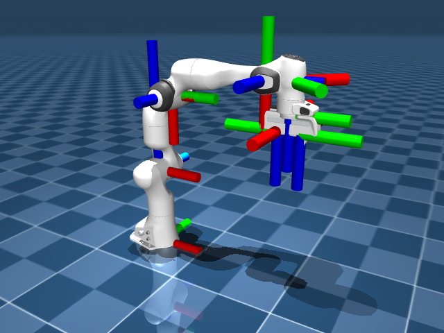

# 坐标系与朝向

假设脚本里 `data.site_xpos[i]` 返回了 `[0.52, -0.11, 0.35]`，这三个数，哪个是前、哪个是上？是世界坐标，还是相对机器人的？想看懂这样一串数字，得先弄清楚 MuJoCo 是怎么定义坐标系和朝向的。捋顺之后，再读位置和朝向就心里有数了。

## 本节目标

本节就顺着这个问题往下捋：

1. MuJoCo 里有哪几种坐标系（World / Body / Local），它们分别相对什么？
2. xyz 三个轴怎么摆，和 viewer 里红绿蓝箭头怎么对应？
3. 表示朝向的四元数，MuJoCo 用的是 wxyz 还是 xyzw？和 ROS 之间互传要当心什么？
4. 从 `data` 里读位置和朝向，`xpos` / `xquat` / `site_xpos` 各给的是哪种坐标系下的值？

## 三类坐标系：World / Body / Local

MuJoCo 里讨论位置和朝向时，涉及三种范围不同的坐标系：

<figure class="doc-figure" aria-label="MuJoCo 坐标系层次">
  <p class="doc-figure-title">MuJoCo 的三层坐标系</p>
  <table>
    <tr><th>坐标系</th><th>相对什么</th><th>常见字段</th><th>典型用途</th></tr>
    <tr><td><strong>World</strong>（世界）</td><td>全局原点，不变</td><td><code>data.body("hand").xpos</code></td><td>判断末端是否到达目标位置</td></tr>
    <tr><td><strong>Body</strong>（物体局部）</td><td>某个 body 自身的原点</td><td>MJCF 里的 <code>pos</code> 属性</td><td>描述子 body、geom、site 在父 body 上的安装位置</td></tr>
    <tr><td><strong>Local</strong>（元素局部）</td><td>geom / site / camera 自身的朝向</td><td>geom 的 <code>fromto</code>、camera 的朝向</td><td>描述某个元素自身的方向</td></tr>
  </table>
</figure>

从 World 到 Body 到 Local，是一层一层往下的关系。**写 MJCF 时用的几乎全都是局部坐标**（相对于父 body）；**读数据时经常需要世界坐标**（比如末端位置）。`xpos` 返回的就是世界坐标，`xquat` 返回的是世界朝向。

一个具体例子：Panda 的 hand 在 link7 末端，link7 又绕着 joint7 旋转。`data.body("hand").xpos` 返回的就是 hand 在世界坐标系里的绝对位置，这个值已经把 joint1 到 joint7 的所有旋转都算进去了（通过正向运动学）。

## xyz 轴向与 RGB 约定

MuJoCo 的坐标系约定如下：

- **Z 轴朝上**（这是和很多 CAD 软件不一样的地方，CAD 里常常 Y 轴朝上）。
- X 轴朝右，Y 轴朝前（Z 轴朝上时，右手定则确定 X/Y）。

在 MuJoCo 的交互式 viewer 里，轴的颜色有固定对应：

| 轴 | 方向 | 颜色 |
|---|---|---|
| X | 右 | 红 (Red) |
| Y | 前 | 绿 (Green) |
| Z | 上 | 蓝 (Blue) |

这个 RGB ↔ XYZ 的对应很方便记忆。当在 viewer 里看到地板上有一个红色箭头指着右边，绿色箭头指着前方，蓝色箭头指着上方，这就是 World 坐标系的三个轴。

下面给 Panda 的每个 body 都画出了局部坐标系（红=X、绿=Y、蓝=Z），可以看到每节连杆自己的朝向：



**重力默认沿 Z 轴向下**，数值是 `(0, 0, -9.81)`。所以如果把机器人放在世界原点 (`pos="0 0 0"`)，它站在 Z=0 的平面上，重力指向 -Z。

## 四元数：wxyz 顺序与常见陷阱

MuJoCo 用**四元数（quaternion）**表示朝向。四元数有 4 个分量，MuJoCo 里的顺序是 **(w, x, y, z)**，即实部在前，虚部在后。

这个顺序和很多其他库不一样：

| 库 / 格式 | 四元数顺序 |
|---|---|
| MuJoCo | **(w, x, y, z)** |
| ROS / Eigen | (x, y, z, w) |
| PyBullet | (x, y, z, w) |
| SciPy (`scipy.spatial.transform`) | (x, y, z, w) |

如果在 MuJoCo 和 ROS 之间传递四元数，记得调整一下顺序。不转换直接塞进去，朝向往往会出错，这是跨平台集成里比较常见的一个坑。

转换方式很简单：

```python
import numpy as np

# MuJoCo → ROS: wxyz → xyzw
q_mujoco = data.body("hand").xquat  # [w, x, y, z]
q_ros = np.array([q_mujoco[1], q_mujoco[2], q_mujoco[3], q_mujoco[0]])  # [x, y, z, w]

# ROS → MuJoCo: xyzw → wxyz（设 x, y, z, w 是来自 ROS 侧的四个分量）
q_ros = np.array([x, y, z, w])
q_mujoco = np.array([q_ros[3], q_ros[0], q_ros[1], q_ros[2]])  # [w, x, y, z]
```

默认朝向（没有旋转）的四元数是 `(1, 0, 0, 0)`，这和数学上单位四元数的定义一致。

## xpos / xquat / xmat / site_xpos 对照表

下面这张表整理了从 `mjData` 读取位置和朝向时最常用的字段：

| 字段 | 含义 | 形状 | 坐标系 | 备注 |
|---|---|---|---|---|
| `data.qpos` | 所有关节位置 | (nq,) | 关节空间 | 广义坐标，含 hinge/slide 的标量 + ball/free 的四元数 |
| `data.qvel` | 所有关节速度 | (nv,) | 关节空间 | 广义速度，全部是标量 |
| `data.body("X").xpos` | body X 的位置 | (3,) | World | body 原点在世界中的 xyz |
| `data.body("X").xquat` | body X 的朝向 | (4,) | World | wxyz 顺序的四元数 |
| `data.body("X").xmat` | body X 的朝向 | (9,) | World | 展平的旋转矩阵，`reshape(3,3)` 当 3×3 用，有时比四元数更方便 |
| `data.geom("X").xpos` | geom X 的位置 | (3,) | World | geom 原点在世界中的 xyz |
| `data.site("X").xpos` | site X 的位置 | (3,) | World | site 原点在世界中的 xyz |
| `data.cam("X").xpos` | camera X 的位置 | (3,) | World | 相机在世界中的 xyz |

另外，`data.site_xpos` 是一个 `(nsite, 3)` 的大数组，包含了所有 site 的位置。可以用下标 `data.site_xpos[i]` 访问，但用名字 `data.site("name").xpos` 更安全、更可读。

## 读位置时的常见陷阱

| 现象 | 可能原因 | 处理 |
|---|---|---|
| 坐标数值看起来"对"但朝向反了 | 四元数顺序混淆（wxyz vs xyzw） | 检查四元数的实部位置：MuJoCo 实部在第一个 |
| `xpos[2]` 读出来是 0，但明明机器人不在地面 | 混淆了 body 局部坐标和世界坐标 | 确认用 `.xpos`（世界坐标），不是 MJCF 里的 `pos` 属性（局部坐标） |
| body 位置和预期差了很多 | 父 body 被移动了，子 body 跟着变了 | 检查父 body 的 `xpos`，body 的 `xpos` 是累积了所有祖先的位置的 |
| free joint 的 `qpos[3:7]` 不直接等于朝向 | 那是四元数，不是欧拉角 | 用 `data.body("...").xquat` 或自己转成欧拉角 |

## 小结

- MuJoCo 的 Z 轴朝上，X=红、Y=绿、Z=蓝。重力默认 (0, 0, -9.81)。
- 写 MJCF 时用局部坐标（相对父 body），读数据时常用世界坐标（`.xpos`、`.xquat`）。
- 四元数顺序是 **(w, x, y, z)**，和 ROS/Eigen 的 (x, y, z, w) 不同，跨平台传递时记得转换。
- 用好 `data.body("name").xpos` 按名字读位置，比按下标读 `data.xpos[i]` 更不容易出错。

## 动手练习

按上面 wxyz ↔ xyzw 的换法写两个函数 `mujoco_to_ros_quat(q)` 和 `ros_to_mujoco_quat(q)`，并验证往返一致：`ros_to_mujoco_quat(mujoco_to_ros_quat(q))` 应当还原成 `q` 本身。验证时要用一个**非平凡**的四元数，比如绕 Z 轴转 90° 的 `(0.7071, 0, 0, 0.7071)`（MuJoCo 的 wxyz 顺序）。别只用 `(1,0,0,0)` 测，它太对称，顺序写错了也照样能“通过”。

## 参考资料

- [MuJoCo Documentation: Computation](https://mujoco.readthedocs.io/en/stable/computation/index.html)
- [MuJoCo Documentation: XML Reference](https://mujoco.readthedocs.io/en/stable/XMLreference.html)

## 导航

- 上一节：[body 树与关节](02-body-and-joint.md)
- 返回上级：[建模](../02-modeling.md)
- 下一节：[几何与资产](04-geom-and-asset.md)
