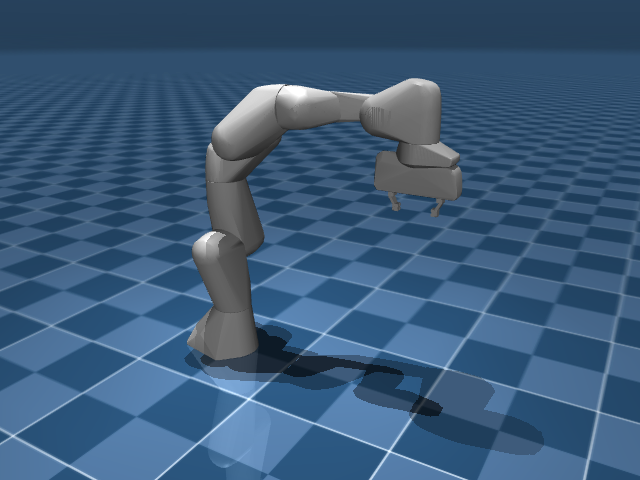

# 几何与资产

机器人“看起来什么样”和“物理上怎么碰”，在 MuJoCo 里是两件分开的事：外观交给一套精细的几何（visual），碰撞交给另一套简化的几何（collision）。这个区分常被忽略，却很关键：抓取时，真正决定“夹不夹得住”的是那套看不见的 collision 几何，而不是好看的外观。

## 本节目标

本节围绕几何与资产，弄清这几件事：

1. MuJoCo 有哪些常见的 geom 类型，各自的 `size` 怎么写？
2. visual 和 collision 这两套几何为什么要分开？各自该用什么形状？
3. 复杂形状用 mesh 怎么引入？为什么 collision mesh 会被取凸包？
4. material、texture 各管什么，能把仿真画面提升到什么程度？

## geom 的基本类型与属性

MuJoCo 支持以下常见的几何类型：

| 类型 | 含义 | size 参数 | 适合场景 |
|---|---|---|---|
| `plane` | 无限大平面 | `size="x y g"`，x/y 是平面在两个方向的半边长（写 0 表示无限延伸），g 是渲染网格的间隔 | 地面、桌面 |
| `box` | 长方体 | `size="x y z"`，半边长 | 方块、简化碰撞体 |
| `sphere` | 球体 | `size="r"`，半径 | 球状物体 |
| `capsule` | 胶囊体（圆柱+两端半球） | `size="r"` 加 `fromto` 或 `size="r l"` | 连杆、手指 |
| `cylinder` | 圆柱体 | `size="r h"`，半径和半高 | 轮子、柱子 |
| `ellipsoid` | 椭球体 | `size="rx ry rz"` | 类球状接触面 |
| `mesh` | 三角网格 | 引用 `<mesh>` 资产 | 复杂形状 |
| `hfield` | 高度场（地形） | 引用 `<hfield>` 资产 | 地形图 |

每种 geom 都可以设置 `rgba`（颜色+透明度）、`friction`（摩擦系数）、`solref`/`solimp`（接触求解器参数）等属性。

以 Panda 为例，它用 box 做指尖的精确碰撞几何，用 mesh 做外观渲染。之所以指尖用 box 而不是 mesh，是因为碰撞检测对凸包要求较严，简单的 box 比复杂的 mesh 更稳定、更快。

## visual 与 collision：为什么要分开

在 Panda 的 MJCF 里会看到这样两种 geom：

```xml
<geom mesh="link0_0"  material="off_white" class="visual"/>
<geom mesh="link0_c"                    class="collision"/>
```

它们挂在同一个 body 上，但任务完全不同：

- **visual geom**（`class="visual"`）：给人和相机看的，用精细的 mesh 网格，追求外观。通常设置 `contype="0" conaffinity="0"` 让它完全不参与碰撞。
- **collision geom**（`class="collision"`）：给物理引擎算接触用的，通常更简单（甚至用 box/capsule 近似）。Panda 的 collision 网格通常比 visual 网格更简化。

这种分离的原因是：**碰撞检测和渲染的目标不同。** 渲染要好看，可以用几千个三角面的精细网格；碰撞检测要快且稳定，用简单的凸形状往往更合适。如果把 visual 网格直接当碰撞体用，可能让仿真变慢，也可能让接触计算不太稳定。

<figure class="doc-figure" aria-label="visual vs collision">
  <p class="doc-figure-title">visual 和 collision 的分离</p>
  <table>
    <tr><th>属性</th><th>visual geom</th><th>collision geom</th></tr>
    <tr><td>用途</td><td>渲染显示</td><td>碰撞检测与接触力计算</td></tr>
    <tr><td>几何精度</td><td>高（精细 mesh）</td><td>低（简化 mesh 或 box、capsule 等基元）</td></tr>
    <tr><td>碰撞参与</td><td>不参与（contype=0, conaffinity=0）</td><td>参与</td></tr>
    <tr><td>质量推算</td><td>可选参与</td><td>可选参与</td></tr>
    <tr><td>group</td><td>通常 group=2</td><td>通常 group=3</td></tr>
  </table>
</figure>

同一台 Panda，只显示 visual geom（左，精细 mesh）和只显示 collision geom（右，简化的胶囊/box 近似）的对比：




具体到抓取，collision 几何里有两个细节最关键：形状（决定接触点落在哪）和摩擦参数（决定夹得稳不稳）。后面真正做抓取时，要调的也主要是这两处。

## mesh：复杂形状的网格资产

当 box / capsule 这些基元不够用时，就需要用 mesh 来载入复杂形状。mesh 在 `<asset>` 节里声明：

```xml
<asset>
  <mesh name="link0_0" file="visual/link0_0.stl"/>
  <mesh name="link0_c" file="collision/link0_c.stl"/>
</asset>
```

MuJoCo 支持从 OBJ 文件和二进制 STL 文件加载三角网格。文件路径相对于 MJCF 文件所在目录（或 `<compiler meshdir="...">` 指定的目录）。

网格在编译时会被处理：visual mesh 保留全部三角面用于渲染；collision mesh 会被取**凸包（convex hull）**，MuJoCo 的碰撞检测只支持凸几何。如果 collision 网格本身是凹的，MuJoCo 会把它换成它的凸包，这可能和预期的碰撞轮廓不一样。

除了外部文件，网格也可以直接嵌入 XML 中（用自定义二进制格式），但外部文件是更常见的做法。

## material 与 texture：让仿真好看一点

默认情况下 geom 的渲染颜色由 `rgba` 属性控制。如果想更精细地控制外观，可以用 `<material>` 和 `<texture>`：

```xml
<asset>
  <texture name="metal_tex" type="2d" file="metal.png"/>
  <material name="metal" texture="metal_tex" shininess="0.8" specular="1 1 1"/>
</asset>
```

然后在 geom 里引用：

```xml
<geom type="box" size="0.1 0.1 0.1" material="metal"/>
```

`material` 可以设置的属性包括：`rgba`（颜色）、`specular`（高光反射颜色）、`shininess`（光泽度）、`emission`（自发光）、`reflectance`（反射率）。注意：如果同时指定了 material 和局部的 `rgba`，局部的定义优先。

`texture` 支持 2D 纹理（贴到平面和高度场上）和天空盒（skybox，作为环境背景）。纹理从 PNG 文件加载，也可以由编译器按程序化参数自动生成。

相比 Isaac Sim 这类平台，MuJoCo 的渲染能力大致算是基础的。如果想生成用于训练视觉模型的照片级合成数据，它可能不是最顺手的选择。但对于调试、记录实验结果、可视化控制效果这些日常需求，它的渲染质量通常已经够用。

## 小结

- geom 有 8 种类型，从简单的 plane/box/sphere 到复杂的 mesh/hfield。
- visual 和 collision 几何是两套分开的体系：前者为了好看，后者为了物理正确。抓取任务里，真正影响结果的是 collision 几何。
- mesh 从 OBJ/STL 文件加载，collision mesh 会被取凸包。
- material 和 texture 让渲染更丰富，但 MuJoCo 的渲染不以高保真见长。

## 动手练习

加载一个只有 box geom 的最简场景，渲染一帧。然后把 `rgba` 从 `"0 .9 0 1"` 改成 `"0 0 .9 1"`，再渲染一帧，颜色变化是否符合预期？

## 参考资料

- [MuJoCo Documentation: XML Reference](https://mujoco.readthedocs.io/en/stable/XMLreference.html)
- [MuJoCo Documentation: Modeling](https://mujoco.readthedocs.io/en/stable/modeling.html)

## 导航

- 上一节：[坐标系与朝向](03-coordinate-frames.md)
- 返回上级：[建模](../02-modeling.md)
- 下一节：[default 继承](05-default-inheritance.md)
