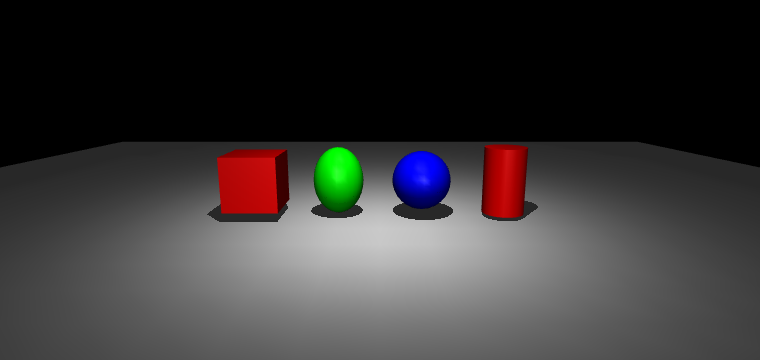

# default 继承

MJCF 文件常常比想象的短，一个重要原因就是 `<default>` 机制。它很像写网页用的 CSS：公共属性在一处声明好，下面的元素自动套用，不必逐个重写。这套“写一处、用多处”的便利背后，是一套继承和覆盖的规则，这一页就把它讲清楚。

## 本节目标

本节围绕 `<default>` 弄清几个问题：

1. `<default>` 到底怎么用，为什么说它像 CSS、能让 MJCF 短一大截？
2. default 嵌套起来时，一个属性的值最终按什么顺序确定？
3. `class` 和 `childclass` 有什么区别，同时出现时谁说了算？

## default 类比 CSS：写一处用多处

先说最直观的例子。假设我们有三个 joint，要它们共享相同的阻尼（`damping=1`）和电枢惯量（`armature=0.1`）。不写 default 的话，每个 joint 都要重复写一遍。用 `<default>` 就可以把公共值提出来：

```xml
<mujoco>
  <default>
    <joint damping="1" armature="0.1"/>
  </default>

  <worldbody>
    <body>
      <joint name="j1" type="hinge" axis="0 0 1"/>
      <body>
        <joint name="j2" type="hinge" axis="0 1 0"/>
        <body>
          <joint name="j3" type="slide" axis="1 0 0"/>
        </body>
      </body>
    </body>
  </worldbody>
</mujoco>
```

`j1`、`j2`、`j3` 都会自动继承 `damping="1"` 和 `armature="0.1"`。如果想让 `j2` 的阻尼不同，直接在 `j2` 上写 `damping="0.5"` 即可覆盖，这和 CSS 的级联规则很像。

这个机制让 MJCF 文件比 URDF 短得多：Panda 的 `panda.xml` 有几百行，但如果把 default 展开，把每个元素的所有属性都显式写出来，会膨胀到几千行。

## 嵌套 default 与继承顺序

`<default>` 可以嵌套，子类自动继承父类的所有属性值，然后按需覆盖。先看一个改写自官方文档的例子（和官方原例一样，这个片段省略了 `size` 等必填属性、**不能直接编译**，只用来看 rgba 的继承关系；下面的渲染图是补上 size 之后跑出来的）：

```xml
<default class="main">
  <geom rgba="1 0 0 1"/>
  <default class="sub">
    <geom rgba="0 1 0 1"/>
  </default>
</default>

<worldbody>
  <geom type="box"/>                          <!-- 红色：继承 main -->
  <body childclass="sub">
    <geom type="ellipsoid"/>                  <!-- 绿色：childclass 设为 sub -->
    <geom type="sphere" rgba="0 0 1 1"/>      <!-- 蓝色：局部覆盖 -->
    <geom type="cylinder" class="main"/>       <!-- 红色：显式指定 main -->
  </body>
</worldbody>
```

四个 geom 的最终颜色分别是：

- **box**：红色（1 0 0 1），没有显式指定，自动使用顶级类 `main`。
- **ellipsoid**：绿色（0 1 0 1），因为它的父 body 指定了 `childclass="sub"`。
- **sphere**：蓝色（0 0 1 1），局部 `rgba` 覆盖了 default。
- **cylinder**：红色（1 0 0 1），显式指定了 `class="main"`。

把这四个 geom 渲染出来对照看：



继承规则概括如下：

<figure class="doc-figure" aria-label="default 继承优先级">
  <p class="doc-figure-title">default 继承的优先级（从高到低）</p>
  <ol>
    <li><strong>局部显式属性</strong>：元素自身写了的属性，最高优先级。</li>
    <li><strong>显式 class</strong>：元素用 <code>class="X"</code> 指定的 default 类。</li>
    <li><strong>childclass</strong>：最近的祖先 body 上指定的 <code>childclass</code>。</li>
    <li><strong>顶级类</strong>：最外层的 <code>&lt;default&gt;</code>（通常叫 "main"）。</li>
    <li><strong>硬编码默认值</strong>：MuJoCo 的内置默认值（文档和 XML 参考里列出的默认值）。</li>
  </ol>
</figure>

## class 与 childclass

- `class="X"`：**显式指定**。写在元素自身，告诉 MuJoCo"让这个元素使用名为 X 的 default 类"。
- `childclass="X"`：**隐式继承**。写在 body 上，让该 body 的所有子 body（及其子 body 的子 body……）自动使用名为 X 的 default 类，除非它们自己显式指定了 `class`。

如果两者同时存在，**显式优先**：元素自己写的 `class` 会盖过父级的 `childclass`。上面的例子已经展示了这一点：cylinder 虽然在一个 `childclass="sub"` 的 body 下面，但它自己写明了 `class="main"`，所以它用的是 `main` 的红色。

`childclass` 的一个典型应用场景是：整个机器人共享一套 default（比如所有 hinge joint 都有相同的 damping），但手指部分需要不同的 default（比如 slide joint 的范围不同）。这时可以在 `hand` 这个 body 上设 `childclass="finger"`，让所有手指自动继承手指的 default，而不影响手臂部分。

## Panda 的 default 节读一遍

来看 Panda 的 `<default>` 节（简化）：

```xml
<default>
  <default class="panda">
    <joint armature="0.1" damping="1" axis="0 0 1" range="-2.8973 2.8973"/>
    <general dyntype="none" biastype="affine" ctrlrange="-2.8973 2.8973" forcerange="-87 87"/>
    <default class="finger">
      <joint axis="0 1 0" type="slide" range="0 0.04"/>
    </default>
    <default class="visual">
      <geom type="mesh" contype="0" conaffinity="0" group="2"/>
    </default>
    <default class="collision">
      <geom type="mesh" group="3"/>
    </default>
  </default>
</default>
```

逐条理解：

- `panda` 是主体类，为所有 joint 设了 `armature=0.1`（电枢惯量）、`damping=1`（阻尼）、默认轴 `axis="0 0 1"` 和默认范围。
- `finger` 继承自 `panda`，但覆盖了 `axis`（手指沿 Y 轴滑动）、`type`（slide 而不是 hinge）、`range`（0 到 0.04 米）。
- `visual` 和 `collision` 各自为 geom 设了 `type="mesh"`，但 visual 额外设了 `contype=0 conaffinity=0` 让它不参与碰撞。

如果在 Panda 的 XML 里看到一个 body 上有 `class="panda"`，但没有显式写 joint 的范围，回头看看这个 default 里写了什么，值往往就在那里。养成这种"溯源"的习惯，能少踩不少坑。

## 小结

- `<default>` 类似 CSS：顶层定义默认值，低层按需覆盖。这使 MJCF 文件比实际属性展开后短很多。
- 嵌套 default 形成继承链：子类继承父类，可覆盖任意属性。
- 优先级：局部属性 > 显式 `class` > `childclass` > 顶级类 > 硬编码默认值。
- 读不熟的 MJCF 时，遇到没显式写的属性，回头查 `<default>` 节，往往就在那里。

## 动手练习

打开 Panda 的 `panda.xml`，找到 `<default>` 节，回答：arm 部分的 joint 默认阻尼是多少？finger 部分的 joint 类型是什么？visual geom 的 `contype` 是多少？

## 参考资料

- [MuJoCo Documentation: Modeling](https://mujoco.readthedocs.io/en/stable/modeling.html)
- [MuJoCo Documentation: XML Reference](https://mujoco.readthedocs.io/en/stable/XMLreference.html)
- [MuJoCo Menagerie: Franka Emika Panda](https://github.com/google-deepmind/mujoco_menagerie/tree/main/franka_emika_panda)

## 导航

- 上一节：[几何与资产](04-geom-and-asset.md)
- 返回上级：[建模](../02-modeling.md)
- 下一节：[mjModel vs mjData](06-mjmodel-vs-mjdata.md)
