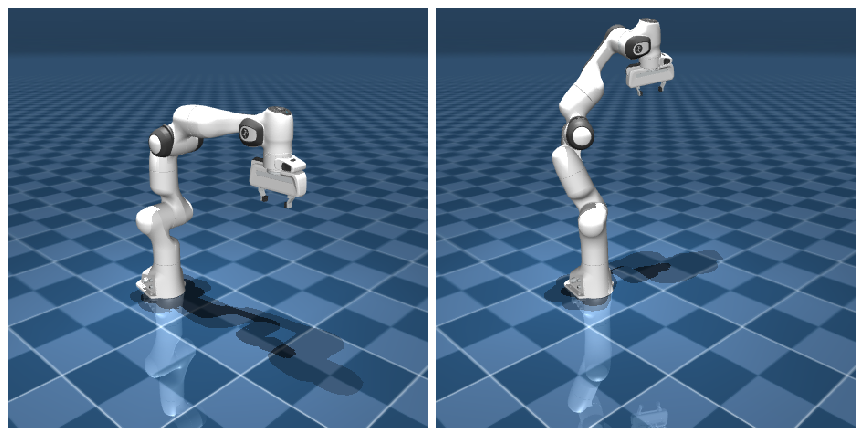

# mjModel vs mjData

一份 MJCF 文件加载进 MuJoCo 之后，内存里其实摆着两样东西：一样记录“这台机器人是什么”，整场仿真基本不变；另一样记录“此刻它是什么状态”，每一步都在更新。前者是 `mjModel`，后者是 `mjData`。分清这条“静态 vs 动态”的界线，是用好 MuJoCo 的一个关键，分不清就容易在读状态、改参数时出错。这一页就连同它们的来历（编译）一起讲细。

## 本节目标

本节围绕 `mjModel` 和 `mjData` 弄清几个问题：

1. 调用 `from_xml_path` 时，编译这一步把 XML 变成了什么？
2. 这两个对象各装哪些常用字段，分别什么时候会变？
3. 在运行时改 `model`（比如调重力、换质量），哪些改了立刻生效、哪些得重新编译？
4. MuJoCo 为什么要把模型和数据拆成两个对象？

## 编译：从 XML 到 mjModel

前面写好的 MJCF 终究只是一份 XML 文本，MuJoCo 并不会直接拿文本去算物理，得先把它变成内存里那份紧凑、好查的 `mjModel`。负责这件事的，就是加载模型最常见的那一行 `mujoco.MjModel.from_xml_path("scene.xml")`：它看着只是“读个文件”，背后 MuJoCo 其实大致做了三步：

1. **解析**：读取 XML，检查语法对不对。
2. **转成中间结构**：把解析结果转成一个与 MJCF 一一对应、能在代码里增删改的结构，叫 `mjSpec`。
3. **编译**：把 `mjSpec` 编译成紧凑的 `mjModel`，过程中做大量交叉索引和预计算，让之后每一步仿真都能直接查表，不用再回头解析 XML。

从这一步之后，`mjModel` 就独立于原始 XML 文件了，可以删掉 XML，仿真照样跑。`mjModel` 也可以保存为二进制 MJB 文件（体积更小、加载更快），但 MJB 是版本绑定的且不能反编译，所以源模型一般还是以 MJCF/URDF 形式维护更稳妥。

`mjModel` **可以修改**（比如在运行时调整 `model.opt.timestep`），不过它存的大多是“有多少关节、每段多重”这类结构属性，一次仿真里通常不变。这些字段大多改了下一步就生效，只有少数编译时预计算的派生量需要重新加载模型才完全更新，下面细说。

## mjModel：静态结构

`mjModel` 里存的是描述机器人"是什么"的信息。常用字段包括：

| 字段 | 含义 | 示例值 (Panda) |
|---|---|---|
| `model.nq` | 位置坐标维度 | 9 |
| `model.nv` | 速度坐标维度 | 9 |
| `model.nu` | actuator（驱动）数量 | 8 |
| `model.nbody` | body 数量（含 worldbody） | 12 |
| `model.njnt` | joint 数量 | 9 |
| `model.ngeom` | geom 数量 | 82（含地面；机器人本身 81） |
| `model.nsensor` | sensor 数量 | 0 |
| `model.opt.timestep` | 仿真步长（秒） | 0.002 |
| `model.opt.gravity` | 重力加速度 | (0, 0, -9.81) |
| `model.body_mass` | 各 body 的质量 | 数组，长度 nbody |
| `model.jnt_range` | 各关节的限位 | (njnt, 2) 数组 |

这些字段在编译时确定，仿真过程中一般不改变。但 `model.opt` 里的参数（timestep、gravity、solver 设置等）可以在运行时修改，它们是 MuJoCo 特意设计成"允许在每步之前修改"的。

## mjData：动态状态

`mjData` 里存的是"此刻机器人是什么状态"。常用字段包括：

| 字段 | 含义 | 什么时候更新 |
|---|---|---|
| `data.qpos` | 所有关节位置 | 每次 `mj_step` |
| `data.qvel` | 所有关节速度 | 每次 `mj_step` |
| `data.ctrl` | 用户写的控制信号 | 由用户在 `mj_step` 前写入 |
| `data.sensordata` | 传感器读数 | 每次 `mj_step` |
| `data.time` | 当前仿真时间 | 每次 `mj_step` |
| `data.contact` | 当前接触信息 | 每次 `mj_step` |
| `data.act` | 某些特殊 actuator 的内部激活值（少见，先跳过也行） | 每次 `mj_step` |

需要注意的是，`data.ctrl` 是**持久化**的，写入的值会保留到下次重新写入之前。这意味着如果只在第一步写了 `ctrl`，后面没有再写，它会一直沿用旧值。如果这就是想要的效果（比如恒定的力），没问题；但如果想每步都重新算控制量，就需要每步都写。

## 运行时能不能改 model

`mjModel` 的大多数字段都可以在运行时直接改，下一次 `mj_step` / `mj_forward` 就会反映出来。按要改的东西分三类看：

- **仿真参数**（如 `model.opt.timestep`、`model.opt.gravity`）：直接改 `model.opt.*`，下一步生效。
- **可视参数**（如 `model.geom_rgba`）：直接改，渲染时即刻反映。
- **结构参数**（如 `body_mass`）：也会立刻参与计算，比如改了某个 body 的质量，下一步算动力学时用的就是新质量。

真正要小心的是少数在编译时就预先算好的派生量：运行时改了对应的源字段，它们不会自动重算。所以要可靠地改动模型结构，最稳妥的做法不是重建 `mjData`（那并不解决问题），而是改回 MJCF 再重新加载、重新编译。

另一个常见的困惑是："我在 `mj_step` 之前读了 `data.sensordata`，结果全是 0。"这是因为传感器的值是在 `mj_step`**内部**流水线中更新的，需要在 `mj_step`**之后**读。

## 为什么要分开

下面这张图就是这条分界线最直观的样子：同一份 `mjModel`，配上两份不同的 `mjData`，模型不变，状态各异。



这种分离不是 MuJoCo 独有的设计，但 MuJoCo 把它做得很彻底。好处至少有三个：

1. **多线程采样**：多个线程各持一份 `mjData`，共享同一份 `mjModel`，互不干扰。这在收集 RL 训练数据时极为有用，一个线程跑一个环境、各采各的数据。
2. **重置代价低**：重置仿真时只需要重新初始化 `mjData`（或调用 `mj_resetData`），不需要重新编译 `mjModel`。
3. **内存效率**：`mjModel` 里的信息只存一份，所有 `mjData` 实例共享引用。这在 GPU 并行（第 7 章 MJX）场景里尤其重要，几千个并行环境共享同一份模型。

## 小结

- `mjModel` 存静态结构，`mjData` 存动态状态。两者的区分贯穿了 MuJoCo 的大部分设计。
- 运行时改 `model`：仿真参数和多数结构字段下一步就生效，少数编译时预计算的派生量得重新加载模型。
- 传感器和接触信息在 `mj_step` 之后更新，不要在 `mj_step` 之前读。
- 模型/数据分离使多线程采样、GPU 并行变得自然。

## 动手练习

运行时改 `model` 会立刻生效吗？跑下面这段看看：先让一个方块在重力下自由下落，中途把重力清零，看 `qvel` 还会不会继续变快。

```python
import mujoco

xml = """
<mujoco>
  <worldbody>
    <body pos="0 0 1"><freejoint/><geom type="box" size="0.1 0.1 0.1"/></body>
  </worldbody>
</mujoco>
"""
model = mujoco.MjModel.from_xml_string(xml)
data = mujoco.MjData(model)

for _ in range(50):
    mujoco.mj_step(model, data)
print("重力下 50 步：qvel_z =", round(float(data.qvel[2]), 3))   # 约 -0.98，加速下落

model.opt.gravity[:] = 0          # 运行时直接改 model，不重新编译
for _ in range(50):
    mujoco.mj_step(model, data)
print("清零重力再 50 步：qvel_z =", round(float(data.qvel[2]), 3))  # 仍约 -0.98，不再变快
```

预期：前 50 步方块加速下落，`qvel_z ≈ -0.98`；把 `model.opt.gravity` 清零后再跑 50 步，`qvel_z` 还是约 `-0.98`、不再增大，说明对 `model.opt` 的改动下一步 `mj_step` 就生效了，正印证本页说的“仿真参数直接改、下一步即生效”。

## 参考资料

- [MuJoCo Documentation: Computation](https://mujoco.readthedocs.io/en/stable/computation/index.html)
- [MuJoCo Documentation: Programming](https://mujoco.readthedocs.io/en/stable/programming/index.html)
- [MuJoCo Documentation: Python Bindings](https://mujoco.readthedocs.io/en/stable/python.html)

## 导航

- 上一节：[default 继承](05-default-inheritance.md)
- 返回上级：[建模](../02-modeling.md)
- 下一节：[常用字段速查](07-common-fields.md)
