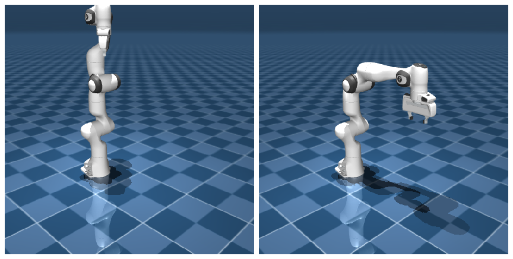

# keyframe 与命名访问

写脚本时有两个小动作会反复出现：把机器人摆回一个合理的初始姿态（而不是手敲一长串关节角），以及按名字去拿某个 body 或 joint（而不是数下标）。MuJoCo 各给了一件趁手的工具来做这两件事，这一页就把它们讲清楚。

## 本节目标

本节看两件几乎每个脚本都会用到的小事：

1. 怎么用 `<keyframe>` 把仿真一键重置到一个合理的初始姿态，而不是从全零开始？
2. 怎么用名字（而不是下标）访问 body / joint / site，比下标好在哪？

## keyframe：预设姿态

`<keyframe>` 是模型作者预存的姿态快照。它包含关节位置（`qpos`）、关节速度（`qvel`）、控制量（`ctrl`）等，可以一键重置到那个状态。

Panda 的 `panda.xml` 里定义了一个 `home` 关键帧：

```xml
<keyframe>
  <key name="home"
       qpos="0 0 0 -1.57079 0 1.57079 -0.7853 0.04 0.04"
       ctrl="0 0 0 -1.57079 0 1.57079 -0.7853 255"/>
</keyframe>
```

这里 `qpos` 的 9 个数依次对应 7 个臂关节 + 2 个手指开度，`ctrl` 的 8 个数对应 8 个 actuator。`home` 把手臂摆成了一个大致的"准备位姿"。也可以定义多个 keyframe，比如 `home`、`ready`、`grasp`，每个对应一个不同的姿态。

## mj_resetDataKeyframe 的用法

用一行代码就能从任意状态回到预设姿态：

```python
mujoco.mj_resetDataKeyframe(model, data, 0)  # 0 = 第一个 keyframe（home）
mujoco.mj_forward(model, data)               # 刷新派生量
```

`mj_resetDataKeyframe` 会同时重置 `qpos`、`qvel`、`ctrl`、`act` 和 `time`，比手动一个一个写 `data.qpos[:] = ...` 更完整、更不容易遗漏。重置完后通常紧跟着调一次 `mj_forward`，把 body 位置、传感器等派生量刷新到和新姿态一致。

如果不确定模型里有几个 keyframe，可以查 `model.nkey`：

```python
print(f"共有 {model.nkey} 个 keyframe")
for i in range(model.nkey):
    print(f"  keyframe {i}: {model.key(i).name}")
```

重置到 `home` 关键帧前后的姿态对比：



## 用名字访问对象

模型里的 body、joint、geom、site 等，既可以用整数 ID（下标）访问，也可以用名字访问。名字往往更可读，也不太容易因为下标偏移而搞错对象。

```python
# 方式 1：下标访问，顺序容易记混
hand_pos = data.xpos[hand_id]

# 方式 2：用名字访问，多数情况下更省心
hand_pos = data.body("hand").xpos
```

用名字访问时，返回的是一个"包装对象"，通过它可以读取该对象的常用字段：

```python
body = data.body("hand")
print(f"position: {body.xpos}")    # 世界坐标 (3,)
print(f"orientation: {body.xquat}") # 世界朝向四元数 (4,)
print(f"rotation matrix: {body.xmat}") # 旋转矩阵，展平 (9,)，reshape(3,3) 当矩阵用

joint = data.joint("joint1")
print(f"qpos: {joint.qpos}")       # 该 joint 的当前位置
print(f"qvel: {joint.qvel}")       # 该 joint 的当前速度

# 假设模型里定义了名为 tcp 的 site（Panda 原版没有，可参考 body 树一节自己加）
site = data.site("tcp")
print(f"site position: {site.xpos}")
```

## mj_name2id 与 data.body("...")

底层有两套按名字查找的 API：

- `mujoco.mj_name2id(model, mjOBJ_BODY, "hand")` — 返回 body 的整数 ID。
- `data.body("hand")` — 返回一个包装对象，可以从上面直接读字段。

两者的关系是：`data.body("name")` 内部也是先查出 ID 再包装的。区别在于：

| | `mj_name2id` | `data.body("name")` |
|---|---|---|
| 返回 | 整数 ID | 包装对象 |
| 找不到时 | 返回 -1 | 抛出 `KeyError` |
| 适合场景 | 需要 ID 做批量操作、循环遍历 | 读单个对象的字段 |
| 典型用法 | `for i in range(nbody): name = mj_id2name(...)` | `hand_pos = data.body("hand").xpos` |

实际写脚本时，大多用 `data.body("name")` 这种写法：它简洁、可读，能直接拿到字段值。

## 名字找不到的排错

调用 `data.body("nonexistent")` 时会抛出异常。常见原因：

| 现象 | 可能原因 | 处理 |
|---|---|---|
| `KeyError` 或 `mj_name2id` 返回 -1 | 拼写错误 | 检查大小写（MJCF 里名字区分大小写） |
| 明明 MJCF 里有这个名字 | 名字在不同文件里，`<include>` 没生效 | 确认 include 路径正确，加载的是 scene.xml 而不是子文件 |
| 名字对但 `mj_name2id` 返回 -1 | 类型参数不对 | 检查是不是把 body 的名字用 `mjOBJ_GEOM` 去查了 |

一个小技巧：如果想快速看一个模型里有哪些名字，用 `mjcf_inspect.py` 可以打印全部 body / joint / geom 的名字列表。

## 小结

- `<keyframe>` 提供了预设姿态，用 `mj_resetDataKeyframe` 一键重置，通常比手动设 `qpos` 更完整。
- 用名字访问（`data.body("name")`、`data.joint("name")`）一般比用下标更可读，也不太容易搞错对象。
- `mj_name2id` 返回整数 ID（找不到返回 -1），`data.body("name")` 返回包装对象（找不到抛异常）。
- 名字查不到时，先检查拼写和大小写，再确认类型参数是否正确。

## 动手练习

加载 Panda，用 `mj_resetDataKeyframe` 重置到 `home` 位姿，打印 `data.qpos`。然后手动把 `data.qpos[0]` 改成 1.0，调一次 `mj_forward`，再执行一次 `mj_resetDataKeyframe`，`qpos[0]` 被恢复了吗？

## 参考资料

- [MuJoCo Documentation: XML Reference](https://mujoco.readthedocs.io/en/stable/XMLreference.html)
- [MuJoCo Documentation: Python Bindings](https://mujoco.readthedocs.io/en/stable/python.html)

## 导航

- 上一节：[常用字段速查](07-common-fields.md)
- 返回上级：[建模](../02-modeling.md)
- 下一节：[URDF ↔ MJCF](09-urdf-to-mjcf.md)
