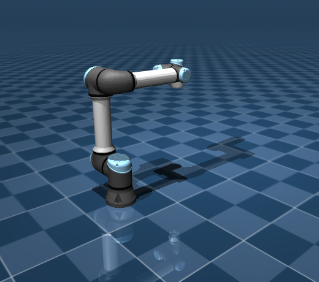

# 动手：改一个模型

光把模型读懂还不够，亲手改几次，那些概念才真正变成自己的。这一页用三个难度递增的小练习给建模这章收尾，把 MJCF、mjModel/mjData、default 这些都过一遍手；每个练习都给一个最小起点和一个验收标准，方便对照着确认改对了没有。

## 本节目标

做完这三个练习，应该能够：

1. 切换不同机器人模型，看懂它们规模（`nq`/`nv`/`nu`）的差异。
2. 说清楚 free joint 为什么让 `nq` 和 `nv` 不相等。
3. 通过改 `friction` 等参数，观察并解释仿真行为的变化。

## 练习 1：把 Panda 换成 UR5e，跑 mjcf_inspect

**目标**：学会切换模型，并比较不同机器人的规模。

**起点**：menagerie 里同时有 Panda 和 UR5e 的 MJCF。UR5e 的路径是 `reference/mujoco_menagerie/universal_robots_ur5e/scene.xml`。

**步骤**：

1. 把 `mjcf_inspect.py` 里的模型路径从 Panda 改为 UR5e。
2. 运行，看输出的 `nq / nv / nu`。
3. 对比：UR5e 和 Panda 各有多少个自由度？为什么不一样？

**验收信号**：

- 输出里 `nq=6`（UR5e 是 6 轴臂，没有夹爪）。
- joint 列表里看到 6 个 hinge joint，没有 slide joint（因为没有手指）。

**参考输出**：

```text
model: scene.xml
  nq=6  nv=6  nu=6  na=0
  nbody=8  njnt=6  ngeom=...
```

UR5e 是 6 轴臂、没有夹爪，渲染出来比 Panda 简单一截：



和 Panda 的 nq=9 对比，少掉的 3 个自由度中，1 个来自 Panda 多 1 个臂关节（Panda 是 7 轴），2 个来自夹爪手指。

## 练习 2：加一个 free joint 方块，观察 nq 与 nv 的差异

**目标**：理解 free joint 如何导致 `nq ≠ nv`。

**起点**：用 [MJCF 骨架](01-mjcf-skeleton.md) 一节里那份最简 MJCF（场景里只有一个 plane 和一个 free 方块）。

**步骤**：

1. 加载这份 MJCF，打印 `nq` 和 `nv`。应该看到 `nq=7, nv=6`。
2. 现在把 free joint 改成 hinge joint（`<joint type="hinge" axis="0 0 1"/>`），再加载，打印 `nq` 和 `nv`。这次它们应该相等（都是 1）。
3. 解释：为什么 hinge 的 nq=nv，free 的 nq>nv？

**验收信号**：

- 能准确说出来 free joint 的 qpos 有 7 个数（3 平移 + 4 四元数），qvel 有 6 个数（3 线速度 + 3 角速度）。
- 知道 ball joint 也是 `nq > nv`（4 vs 3）。

## 练习 3：改 friction，看斜坡上的滑动

**目标**：理解 default 继承和摩擦参数对行为的影响。

**起点**：一个方块落在 20° 斜坡上的场景。`<default>` 给所有 geom 设了较低的摩擦，方块会顺着坡往下滑：

```xml
<mujoco>
  <compiler angle="degree"/>
  <default>
    <geom friction="0.1 0.005 0.0001"/>
  </default>
  <worldbody>
    <light diffuse=".5 .5 .5" pos="0 0 3" dir="0 0 -1"/>
    <geom type="plane" size="5 5 0.1" euler="0 20 0" rgba=".9 0 0 1"/>
    <body pos="0 0 0.3">
      <joint type="free"/>
      <geom type="box" size=".05 .05 .05" rgba="0 .9 0 1"/>
    </body>
  </worldbody>
</mujoco>
```

**步骤**：

1. 跑约 2000 步，记录方块最终的 `data.qpos[0]`（沿坡方向的位移）。低摩擦下它会滑出很远。
2. 把 `<default>` 里 `friction` 的第一个数改成 `1`（高摩擦），重新跑。这次方块基本停在原地。
3. 对比两次的 `data.qpos[0]`：低摩擦能滑出几米，高摩擦几乎不动。这是因为摩擦系数大于 `tan(20°)≈0.36` 时，静摩擦就拉得住方块。

**验收信号**：

- 低摩擦（0.1）方块顺坡滑下，`qpos[0]` 变化很大；高摩擦（1）方块几乎不动。
- 理解 `friction` 的三个数分别代表什么：切向（滑动）摩擦、扭转摩擦、滚动摩擦。（详见第 3 章）

## 验收清单

| 练习 | 验收标准 |
|---|---|
| 练习 1 | 成功加载 UR5e，打印出 nq=6, nu=6；能说出和 Panda 的差别 |
| 练习 2 | 能解释 free joint vs hinge joint 的 nq/nv 差异；知道 ball joint 也类似 |
| 练习 3 | 能通过改 friction 参数看到可视化或数值上的行为差异 |

## 参考资料

- [MuJoCo Menagerie（GitHub）](https://github.com/google-deepmind/mujoco_menagerie)
- [MuJoCo Documentation: Computation](https://mujoco.readthedocs.io/en/stable/computation/index.html)

## 导航

- 上一节：[URDF ↔ MJCF](09-urdf-to-mjcf.md)
- 返回上级：[建模](../02-modeling.md)
- 下一节：[控制与物理](../03-control-and-physics.md)
