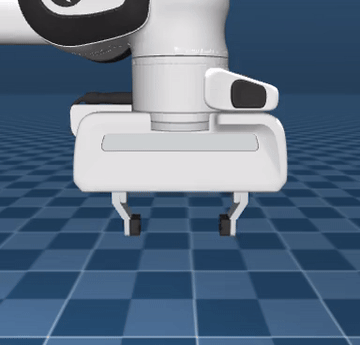

# tendon 与 equality

“Panda 有 9 个自由度，却只有 8 个 actuator”，这一页就来解释为什么。答案藏在 tendon（肌腱）和 equality（等式约束）这类“把多个关节绑在一起动”的机制里。

## 本节目标

本节看怎么把关节“绑在一起”动：

1. `<tendon>` 怎么把多个关节耦合成一条“虚拟绳”，让 1 个 actuator 管多个关节？
2. `<equality>` 有哪几种常见的等式约束（焊接、关节相等、连接）？

## tendon：把关节耦合成一条线

可以把 tendon（肌腱）想成一根穿过若干关节的“虚拟绳”：它有一个“长度”，这个长度是它跨越的那些关节位置的加权和（所以本质是一个**标量**）。用一个 actuator 去拉这根“绳”，力就会按比例分到各个关节上。

Panda 的夹爪就是这样做的。两根手指各有自己的 slide joint（`finger_joint1` 和 `finger_joint2`），但它们只用了**1 个** actuator（`actuator8`）来控制：

```xml
<tendon>
  <fixed name="split">
    <joint joint="finger_joint1" coef="0.5"/>
    <joint joint="finger_joint2" coef="0.5"/>
  </fixed>
</tendon>
```

`fixed` 类型表示这条 tendon 的长度是各关节位置的线性组合：`length = 0.5 * finger_joint1 + 0.5 * finger_joint2`。`coef` 决定了每个关节对 tendon 长度的贡献比例。

然后 actuator 驱动这条 tendon 而不是直接驱动关节：

```xml
<general name="actuator8" tendon="split" ctrlrange="0 255"
         gainprm="0.01568627451 0 0" biasprm="0 -100 -10"/>
```

这样夹爪从控制角度看就只有一个量（`actuator8` 的 `ctrl`），而不是两个。这在真实机器人里很常见，两根手指通常由一个电机联动驱动。

tendon 还有 `spatial` 类型，它通过空间中一系列 site（或缠绕几何体）的最短路径来定义长度，适合模拟跨越多个关节的“虚拟绳”或肌肉-肌腱单元。

Panda 夹爪正是这样：1 个 actuator 通过 tendon 驱动两根手指联动开合。



## equality：等式约束

`<equality>` 用来表达“某些量之间应该保持相等关系”。MJCF 里支持的等式约束类型有好几种，以下是三个常用的：

```xml
<!-- 焊接：把两个 body 固定在一起 -->
<weld name="weld1" body1="bodyA" body2="bodyB"/>

<!-- 关节位置耦合：两个 joint 的位置始终相等 -->
<joint joint1="j1" joint2="j2"/>

<!-- 连接：两个 body 上各指定一个点，这两点重合（形成球关节） -->
<connect name="conn1" body1="bodyA" body2="bodyB" anchor="0 0 0.1"/>
```

Panda 里也用了 joint equality 来进一步约束两根手指：

```xml
<equality>
  <joint joint1="finger_joint1" joint2="finger_joint2"/>
</equality>
```

这让两根手指的 slide 位移始终保持相等，即它们对称开合，一根手指移动多少，另一根也移动多少。

## 顺带一提：mocap body

还有一种和 equality 配合的常见用法叫 **mocap body**：它被物理引擎当成“静态”的（不受重力和接触力影响），位姿完全由我们每步手动写 `data.mocap_pos` / `data.mocap_quat`。配上一个 equality 约束，就能让机器人末端“跟着这个虚拟目标走”，常用于遥操作和 IK 目标跟踪。这里先知道有这么个机制即可，真正用到时（如遥操作、抓取里设定目标）再展开。

## 三种机制怎么选

| 机制 | 作用 | 适合场景 |
|---|---|---|
| tendon | 把多个关节的位移线性组合成一条“绳”的长度 | 夹爪手指联动、肌肉-肌腱模型、滑轮系统 |
| equality | 施加等式约束（焊接、关节位置等、连接） | 闭环机构、对称运动、mocap 追踪 |
| mocap | 用户指定一个 body 的位姿作为静态参照 | 遥操作、IK 目标、人手拖动 |

## 小结

- tendon 把多个关节的位移组合成一个标量长度，一个 actuator 就能驱动多个关节联动。Panda 夹爪正是这样用 1 个 actuator 控制 2 根手指。
- equality 施加等式约束，最常见的三种类型是 weld（焊接）、joint（关节位置相等）、connect（点对点连接）。
- mocap body 是用户可移动的“静态参照物”，常配合 equality 实现末端追踪。

## 动手练习

下面这段复制即可运行：两根连杆各有一个 hinge，用 `<equality>` 约束它们的转角相等。先把两个角设成不一样，看约束怎么把它们拉拢（关掉重力，只看约束本身的作用）。

```python
import mujoco
import numpy as np

xml = """
<mujoco>
  <option gravity="0 0 0"/>
  <worldbody>
    <body>
      <joint name="j1" type="hinge" axis="0 0 1"/>
      <geom type="capsule" size="0.02" fromto="0 0 0 0.2 0 0"/>
    </body>
    <body pos="0 0.3 0">
      <joint name="j2" type="hinge" axis="0 0 1"/>
      <geom type="capsule" size="0.02" fromto="0 0 0 0.2 0 0"/>
    </body>
  </worldbody>
  <equality>
    <joint joint1="j1" joint2="j2"/>   <!-- 约束：j1 的角度 == j2 的角度 -->
  </equality>
</mujoco>
"""

model = mujoco.MjModel.from_xml_string(xml)
data = mujoco.MjData(model)

data.qpos[:] = [0.5, -0.5]             # 故意设成不相等
mujoco.mj_forward(model, data)
print("只 mj_forward:", np.round(data.qpos, 3))   # 仍是 [0.5 -0.5]，没被拉相等

for i in range(201):
    if i % 50 == 0:
        print(f"step {i:3d}: j1={data.qpos[0]:+.3f}  j2={data.qpos[1]:+.3f}")
    mujoco.mj_step(model, data)
```

预期：只调 `mj_forward` 时两个角还停在 `[0.5, -0.5]`，没动；一旦开始 `mj_step`，等式约束的约束力就一步步把它们拉拢，约 100 步内收敛到相等（本例左右对称，两边各自趋向中点 0）。这说明 `<equality>` 不是“瞬间锁死”，而是像一根有刚度的弹簧、在每个 `mj_step` 里逐步生效。改改 `qpos` 初值，或把 `<equality>` 整段删掉再跑一次，对比一下就更清楚。

## 参考资料

- [MuJoCo Documentation: XML Reference（tendon / equality）](https://mujoco.readthedocs.io/en/stable/XMLreference.html)
- [MuJoCo Menagerie: Franka Emika Panda](https://github.com/google-deepmind/mujoco_menagerie/tree/main/franka_emika_panda)

## 导航

- 上一节：[step 与流水线](02-step-and-pipeline.md)
- 返回上级：[控制与物理](../03-control-and-physics.md)
- 下一节：[接触模型](04-contact-model.md)
