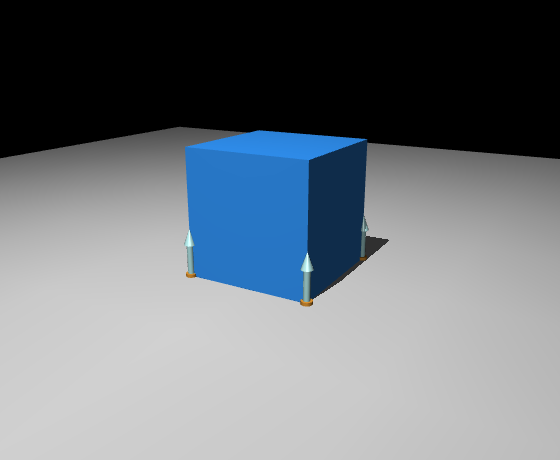

# 接触模型

MuJoCo 的全称是 Multi-Joint dynamics with Contact，接触从一开始就是它的核心关注点。和不少游戏物理引擎不同，它用的是基于凸优化的接触公式，这往往让它在抓取、操作、双足这类接触密集的任务里更稳定。这一页就把接触这件事讲透。

## 本节目标

本节把接触从"看不见的黑盒"变成"能读、能看见的数据"，回答几个问题：

1. 两个几何体（geom）之间要不要算接触，由 `contype` / `conaffinity` 这对属性决定，它们具体怎么工作？
2. MuJoCo 的接触力大致怎么算（“凸接触”“柔性接触”是什么意思）？
3. 怎么从 `data.contact` 读出当前帧的接触，并在 viewer 里把它画出来？

## 接触检测：contype 与 conaffinity

MuJoCo 通过两个属性来控制哪些 geom 之间可以发生接触：

- **contype**（contact type）：这个 geom **是**什么类型的接触对象。
- **conaffinity**（contact affinity）：这个 geom **愿意和**什么类型的对象接触。

两者都是位掩码（bitmask，把一个整数当成一排开关来用）。当两个 geom 满足 `(contype_A & conaffinity_B) != 0` **且** `(contype_B & conaffinity_A) != 0` 时，它们之间才会产生接触。这条位运算看着绕，记不住也没关系，抓住下面那句默认行为就够了。

默认值都是 `1`，所以默认情况下任意两个 geom 之间都会检测接触，除非显式地把其中一方设为 0。

这也是为什么 visual geom 通常设 `contype="0" conaffinity="0"`：把两个位掩码都清空，让 visual geom 不参与接触检测。

除此之外，还有几个自动排除规则：
- 同一个 body 上的 geom 之间不检测。
- 父子 body 上的 geom 之间不检测。
- 可以通过 `<contact>` 节的 `<exclude>` 手动排除特定 body 对。

## MuJoCo 的凸接触模型（直觉版）

MuJoCo 的接触模型在数学上是个**凸优化问题**（一类有唯一最优解、且求解器容易快速收敛的优化问题），这带来两个好处：
- 解通常是唯一的，没有"多解"的歧义。
- 求解器往往很快收敛，牛顿法常常 2-3 次迭代就到位。

不深入数学细节的话，可以这样理解：MuJoCo 把接触看作"柔性的"，允许极微小的穿透（通常在亚毫米级），穿透量越大、排斥力越大。接触力用 `solref`（弹性参数）和 `solimp`（阻抗参数）来控制"柔性程度"。

这种"柔性接触"和真实世界也比较接近：现实中的接触一般也不是绝对刚性的，总有一点点变形。MuJoCo 用数学上处理方便的柔性模型来近似这个变形过程。

一个实际结果是：**物体在 MuJoCo 里往往不会绝对静止**。在重力作用下，放在地上的方块可能有极微小的位置漂移。这不是 bug，而是柔性接触模型的固有特性。通常这种漂移小到可以忽略；如果确实需要更接近静止的效果，可以参考下一页的参数调优建议。

## 读运行时接触：data.contact

当前帧的接触信息存在 `data.contact` 里。它是一个数组，每个元素代表一对 geom 之间的一个接触点：

```python
for i in range(data.ncon):
    contact = data.contact[i]
    print(f"contact {i}: geom1={contact.geom1}, geom2={contact.geom2}")
    print(f"  position: {contact.pos}")       # 接触点世界坐标
    print(f"  frame: {contact.frame}")         # 接触坐标系，展平的 3×3，形状 (9,)
    print(f"  distance: {contact.dist:.6f}")   # 穿透深度（负值=穿透）
```

常用字段一览：

| 字段 | 含义 |
|---|---|
| `contact.geom1` | 第一个参与几何的 ID |
| `contact.geom2` | 第二个参与几何的 ID |
| `contact.pos` | 接触点的世界坐标 (3,) |
| `contact.frame` | 接触坐标系，展平为 (9,) 的 3×3，第一行是接触法线方向 |
| `contact.dist` | 接触距离（正值=分离，负值=穿透，0=刚好接触） |

注意 `data.contact` 只在 `mj_step` 之后更新。在 `mj_step` 之前读取看到的是上一帧的接触状态（如果是第一步，则全是 0）。

## 接触可视化

在交互式 viewer 里可以开启接触可视化来调试。按 F1 看帮助，或在代码里设置：

```python
# 在 viewer 中显示接触点和接触力
viewer.opt.flags[mujoco.mjtVisFlag.mjVIS_CONTACTPOINT] = 1
viewer.opt.flags[mujoco.mjtVisFlag.mjVIS_CONTACTFORCE] = 1
```

开启后，每个接触点会显示为一个彩色点，法线方向会画出接触力箭头。这在排查"为什么物体没被夹起来""为什么接触没发生"时很有用，能直接看到哪里产生了接触、力多大、力朝哪个方向。

下面就是开启接触可视化后的样子：方块落地，底面四角各有一个接触点和接触力箭头。



## 小结

- 接触由 contype/conaffinity 位掩码控制，visual geom 一般设 0 来排除碰撞。
- MuJoCo 的凸接触模型通常给出唯一的稳定解，以"柔性接触"为数学基础。
- `data.contact` 提供当前帧的接触信息（位置、法线、穿透深度），在 `mj_step` 之后更新。
- 接触可视化（contact point / force）是排查抓取、碰撞问题的直观工具。

## 动手练习

用下面这个最简场景（一个方块落到地面），落地后打印 `data.ncon` 和每个接触点的 `dist`：

```python
import mujoco

xml = """
<mujoco>
  <worldbody>
    <geom type="plane" size="1 1 0.1"/>
    <body pos="0 0 0.3"><freejoint/><geom type="box" size="0.05 0.05 0.05"/></body>
  </worldbody>
</mujoco>
"""
model = mujoco.MjModel.from_xml_string(xml)
data = mujoco.MjData(model)
for _ in range(500):
    mujoco.mj_step(model, data)

print("ncon =", data.ncon)
for i in range(data.ncon):
    print(f"  dist = {data.contact[i].dist:.6f}")
```

预期：方块平躺在地面上，底面四角各产生一个接触点，`ncon = 4`；每个 `dist` 都是一个很小的负数（本例约 `-1e-4`），负号表示有极微小的穿透，正好印证前面说的“柔性接触允许亚毫米级穿透”。

## 参考资料

- [MuJoCo Documentation: Computation（contact / constraint solver）](https://mujoco.readthedocs.io/en/stable/computation/index.html)
- [MuJoCo Documentation: XML Reference（contact / contype / conaffinity）](https://mujoco.readthedocs.io/en/stable/XMLreference.html)

## 导航

- 上一节：[tendon 与 equality](03-tendon-and-equality.md)
- 返回上级：[控制与物理](../03-control-and-physics.md)
- 下一节：[摩擦与求解器参数](05-friction-and-solver.md)
