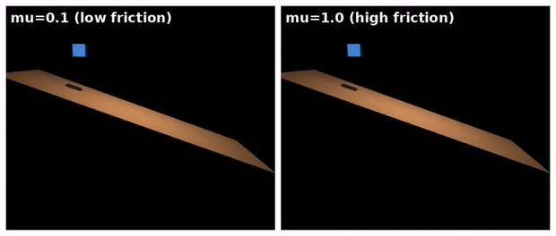

# 摩擦与求解器参数

想让仿真稳定地抓住物体，关键往往不在控制器，而在 `friction` / `solref` / `solimp` 这三组参数。它们语义不太直观，但只要建立起"现象 → 哪一组参数"的大致映射，调起来就不那么像黑盒了。

## 本节目标

本节把这三组参数连同求解器讲清楚：

1. `friction` 的三个分量各对应哪种摩擦，哪个最关键？
2. `solref` / `solimp` 怎么影响接触的“软硬”？
3. CG / Newton / PGS 几种求解器有什么差别，默认用哪个？
4. 抓取任务里，这些参数一组合理的参考取值大概是多少？

## friction：滑动、扭转、滚动

每个 geom 可以设置 `friction` 属性，它有三个分量：

```xml
<geom friction="1.0 0.005 0.0001"/>
```

| 分量 | 含义 | 默认值 | 说明 |
|---|---|---|---|
| 第 1 个 | 切向（滑动）摩擦系数 | 1.0 | 影响"滑不滑"最主要的因素，值越大越难滑动 |
| 第 2 个 | 扭转摩擦系数 | 0.005 | 阻碍绕接触法线旋转 |
| 第 3 个 | 滚动摩擦系数 | 0.0001 | 阻碍在接触面上滚动 |

在实际调参中，**第一个分量（滑动摩擦）通常最关键**。如果夹爪夹不住物体（物体会滑落），往往第一个值得尝试的改动就是增大它。

需要注意的是，两个接触 geom 之间的实际摩擦取的是**两者的较大值**（不是乘积、也不是平均）。

同一个 20° 斜坡，只改滑动摩擦就是两种结果：



一些粗略的经验参考值。要强调的是，摩擦系数不是材料的固定常数，它会随表面粗糙度、润滑、污染、载荷而明显变化，下面只给个量级，精确值要以实测为准：
- 橡胶-橡胶：`1.0 ~ 2.0`
- 金属-橡胶（如夹爪指尖垫）：`0.8 ~ 1.5`
- 金属-金属（干燥洁净）：`0.4 ~ 0.8`（铝等较软金属更高；一旦上润滑会降到 `0.1` 上下）
- 很滑的表面（冰、PTFE、润滑面）：`0.05 ~ 0.1`

## solref：约束的"弹性"

`solref` 控制接触约束的**弹性响应**，有两个值：

```xml
<geom solref="0.02 1"/>
```

| 分量 | 含义 | 默认值 |
|---|---|---|
| 第 1 个 (`timeconst`) | 时间常数（秒），值越小约束越"硬" | 0.02 |
| 第 2 个 (`dampratio`) | 阻尼比，1 为临界阻尼 | 1 |

直觉上：
- `timeconst` **越小，接触越“硬”**，物体碰到地板后反弹更少，穿透更小。但太小会导致数值不稳定（振荡或发散）。如果看到物体在接触面上"抖动"或"弹跳"，试试增大 `timeconst`。
- `dampratio` 控制在临界阻尼附近的行为：`1` = 临界阻尼（最快收敛不振荡），`< 1` = 欠阻尼（振荡），`> 1` = 过阻尼（收敛更慢但不振荡）。

## solimp：约束的强度曲线（默认够用，细节可跳读）

`solimp` 有 5 个值，控制约束阻抗如何随穿透深度变化：

```xml
<geom solimp="0.9 0.95 0.001 0.5 2"/>
```

| 位置 | 含义 | 默认值 |
|---|---|---|
| `solimp[0]` (dmin) | 零穿透时的阻抗（0=完全不约束，接近 1=最大约束） | 0.9 |
| `solimp[1]` (dmax) | 满穿透时的阻抗 | 0.95 |
| `solimp[2]` (width) | 从 dmin 到 dmax 之间过渡的穿透范围（米） | 0.001 |
| `solimp[3]` (midpoint) | S 型曲线拐点位置 (0~1) | 0.5 |
| `solimp[4]` (power) | S 型曲线形状 (>1) | 2 |

对大多数任务来说，默认值一般就够用了。通常只有在下面这些情况才需要动它：
- 需要更"硬"的接触（减小 `width`，增大 `dmin`/`dmax`）。
- 接触力看起来"突然变大"（增大 `width` 让约束过渡更平滑）。
- 为导数计算（如系统辨识）需要完全平滑的动力学（设 `dmin=0`）。

## 求解器选择：CG / Newton / PGS

MuJoCo 提供了三种约束求解器：

| 求解器 | 选项值 | 速度 | 收敛 | 适合场景 |
|---|---|---|---|---|
| CG（共轭梯度） | `mjSOL_CG` | 中等 | 需要较多迭代 | 较旧的选项，新项目一般不必首选 |
| Newton（牛顿法） | `mjSOL_NEWTON` | 快 | 2-3 次迭代即可收敛 | 默认值，多数情况推荐 |
| PGS（投影高斯-赛德尔） | `mjSOL_PGS` | 慢 | 收敛慢但可中断 | 需要精确控制在多少迭代后停止时 |

```python
model.opt.solver = mujoco.mjtSolver.mjSOL_NEWTON  # 默认
model.opt.iterations = 100  # 最大迭代次数（Newton 通常用不到这么多）
```

Newton 是当前默认、多数情况下也比较合适：收敛很快（往往 2-3 次迭代就够），精度也高。PGS 在一些特定场景（比如需要限制迭代次数来控制确定性）有它的用处，日常用 Newton 通常就够了。

## 抓取里的真实参数示例

一个能让 Panda 夹爪比较稳定地夹住方块（边长约 5 cm，质量约 0.1 kg）的参数组合：

```xml
<!-- 指尖 collision geom -->
<geom type="box" size="0.01 0.01 0.02"
      friction="1.5 0.01 0.001"
      solref="0.01 1"
      solimp="0.95 0.99 0.001 0.5 2"/>
```

| 参数 | 这样设的原因 |
|---|---|
| `friction[0]=1.5` | 类橡胶指尖垫，较高的滑动摩擦防止物体滑落 |
| `solref timeconst=0.01` | 稍硬的接触（默认是 0.02），让夹持更紧密 |
| `solimp dmin=0.95, dmax=0.99` | 即使轻微穿透也提供强约束力 |

注意这只是参考值，实际效果还会受物体质量、形状、夹爪控制策略等多方面影响。在后面的抓取实战章节里，我们会拿不同参数组合做实际的调参对比。

## 小结

- `friction[0]` 控制滑动摩擦，通常是"物体滑不滑"最主要的参数。
- `solref` 控制接触弹性（时间常数小 = 硬），`solimp` 控制约束强度曲线（多数情况下用默认值即可）。
- 默认的 Newton 求解器收敛很快，一般是不错的选择。
- 调参顺序可以这样：先确保 collision 几何正确 → 再调 friction → 最后才动 solref/solimp。

## 参考资料

- [MuJoCo Documentation: Computation（friction / solref / solimp / solver）](https://mujoco.readthedocs.io/en/stable/computation/index.html)
- [MuJoCo Documentation: XML Reference（geom friction / solref / solimp）](https://mujoco.readthedocs.io/en/stable/XMLreference.html)

## 导航

- 上一节：[接触模型](04-contact-model.md)
- 返回上级：[控制与物理](../03-control-and-physics.md)
- 下一节：[调参与排错](06-tuning-and-debug.md)
