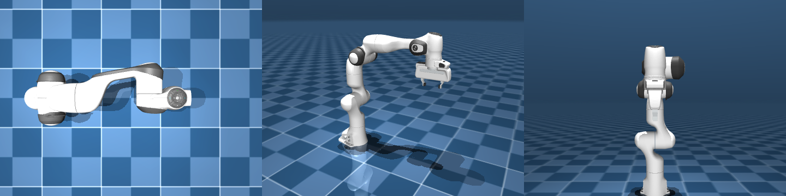

# 相机与多视角

机器人“看见”什么，取决于场景里定义了哪些相机。MJCF 里的 `<camera>` 是个独立元素：挂在 body 上就跟着机器人走（机载相机），挂在 worldbody 上就是固定的第三人称视角。

## 本节目标

本节把相机这件事讲清楚：

1. 怎么在 MJCF 里声明相机，`fovy` / `pos` / `xyaxes` 各管什么？
2. 机载相机和第三人称相机怎么写，相机有哪几种 `mode`？
3. 怎么在一帧里同时渲染多个视角？
4. 渲染图像对应的相机内参，怎么和真机对齐？

## camera 在 MJCF 里的声明

一个最基本的相机定义如下：

```xml
<worldbody>
  <camera name="top_down"
          pos="0 0 2"
          xyaxes="1 0 0 0 1 0"
          fovy="60"/>
</worldbody>
```

这段定义表示：在 `pos="0 0 2"`（世界坐标系中 Z=2 的位置）放一个相机，朝下看（xyaxes 指向世界 X/Y 轴），垂直视场角 60 度。

相机也可以挂在某个 body 上，放在该 body 的局部位置里、实时跟随它运动——这就是“机载相机”，具体写法见下面“机载相机”一小节。

## fovy / pos / xyaxes 各管什么

| 参数 | 含义 | 典型值 |
|---|---|---|
| `pos` | 相机在世界（或父 body 局部）坐标系中的位置 | `"0 0 2"` |
| `xyaxes` | 6 个数：前 3 个是相机 X 轴方向、后 3 个是 Y 轴方向（Z 由叉积定）；相机沿自己的 -Z 轴看出去 | `"1 0 0 0 1 0"`（朝下俯视） |
| `fovy` | 垂直视场角（度） | 真实相机通常 40-90°，人眼约 60° 左右 |
| `ipd` | 瞳距，立体渲染用 | 通常 0.06-0.07 米 |
| `resolution` | 渲染分辨率 | `"640 480"`（在 `<visual>` 里设） |

先把一点说清：三维空间里**一个方向确实就是 3 个数**，它是一个三维向量，3 个数分别表示沿世界 X、世界 Y、世界 Z 各走多少。所以 `1 0 0` 指向世界 +X（右）、`0 1 0` 指向世界 +Y（前）、`0 0 1` 指向世界 +Z（上）。

但 `xyaxes` 要确定的不是“一个方向”，而是“整台相机在空间里怎么摆”（它的姿态），这是两回事。相机带着三根互相垂直的轴：右（X）、上（Y）、看出去的方向。**只给一根轴的方向，锁不住整台相机**：比如只规定“右（X 轴）指向世界 +X”，相机仍然能绕着这根 X 轴整体翻转，“上”可以朝天、朝前、斜着、甚至整台倒过来，还剩一个“绕 X 轴旋转”的自由度没定死。要把这点也锁住，就得再给第二根轴。所以 `xyaxes` 给两根：**前 3 个数定 X 轴（画面里的“右”）指向哪，后 3 个数定 Y 轴（画面里的“上”）指向哪**；第三根 Z 轴和它俩垂直，由叉积自动算出。这就是为什么要 6 个数（2 根轴 × 每根 3 个），而不是 3 个。向量长度不重要（MuJoCo 会自动归一化），X、Y 两根通常互相垂直。

最后一个关键约定：**相机是沿自己的 -Z 轴方向看出去的**。所以只要把“右”和“上”这两根轴指好，相机朝哪看、画面怎么摆就全定了。结合上面“Z 轴朝上、Y 轴朝前”的世界约定，看两个例子：

```xml
xyaxes="1 0 0  0 1 0"   <!-- X=世界X、Y=世界Y，于是 Z=世界Z，相机沿 -Z 朝下俯视 -->
xyaxes="1 0 0  0 0 1"   <!-- X=世界X、Y=世界Z（朝上），相机沿 -Z 看向世界 +Y，即正前方 -->
```

## 机载相机：跟着机器人走

MuJoCo 的相机有几种模式（在 MJCF 里通过 `mode` 属性指定），常用的是下面三种（另有 `trackcom`、`targetbodycom` 等跟踪子树质心的变体）：

| mode | 行为 |
|---|---|
| `fixed`（默认） | 固定在所属 body 的局部坐标里，跟着 body 一起平移、旋转 |
| `track` | 跟着所属 body 平移，但朝向保持世界固定（不随 body 转） |
| `targetbody` | 自己位置不动，但始终转向“注视”指定的目标 body |

对于"装在机器人手腕上的相机"，一个简单的做法是把 `<camera>` 放在 hand body 内，使用默认的 `fixed` 模式，它就会跟着 hand 一起移动和旋转。

```xml
<body name="hand">
  <camera name="wrist_rgb"
          pos="0 -0.05 0.02"     <!-- 在 hand 局部坐标中 -->
          xyaxes="1 0 0 0 0 1"   <!-- 朝前看 -->
          fovy="70"/>
</body>
```

## 多视角同步渲染

要在同一帧里渲染多个相机，做法是：每次 `mj_step` 之后，对每个相机分别调用 `update_scene` 和 `render`：

```python
with mujoco.Renderer(model, height=240, width=320) as renderer:
    for step in range(100):
        mujoco.mj_step(model, data)

        frames = {}
        for cam_name in ["top_down", "wrist_rgb", "side_view"]:
            renderer.update_scene(data, camera=cam_name)
            frames[cam_name] = renderer.render()
```

`update_scene` 的 `camera` 参数指定用哪个已定义的相机。如果不指定，则用默认相机（交互式 viewer 里用户自由移动的那个）。

大规模数据收集里常这么做：一次 `mj_step`，多机位同时拍摄，所有画面对齐同一时刻。下图是同一时刻的三个机位（左：俯视　中：自由相机　右：侧面）；其中自由相机要在渲染时不传 `camera`（或传 `-1`），具名机位才用 `camera="名字"`：



## 内参与畸变对齐真机

渲染出来的图像对应的是针孔相机模型，内参矩阵可以从 `fovy` 和图像尺寸换算：

```python
import numpy as np

def fovy_to_intrinsics(fovy_deg, width, height):
    """从垂直视场角和分辨率推算相机内参矩阵"""
    fovy = np.radians(fovy_deg)
    fy = height / (2.0 * np.tan(fovy / 2.0))
    fx = fy  # 假设正方形像素
    cx, cy = width / 2.0, height / 2.0
    return np.array([[fx, 0, cx],
                     [0, fy, cy],
                     [0,  0,  1]])
```

MuJoCo 的渲染器**不模拟镜头畸变**，所以如果要把仿真图像和真实相机图像对齐（比如做 sim2real 训练），需要在仿真渲染之后再手动加畸变变换（或反过来，把真实图像去畸变）。

## 小结

- `<camera>` 可以挂在 worldbody 上（固定视角）或某个 body 内（机载视角）。
- `pos` 控制位置、`xyaxes` 控制朝向、`fovy` 控制视野宽窄。
- `update_scene(data, camera="name")` 切换相机，一帧内可以多次调用实现多视角拍摄。
- 内参可以从 fovy 和分辨率换算，MuJoCo 不模拟畸变。

## 动手练习

改变手腕相机的 `fovy`：分别设 40、70、100，对比渲染出来的画面范围差异。

## 参考资料

- [MuJoCo Documentation: XML Reference（camera / fovy / mode）](https://mujoco.readthedocs.io/en/stable/XMLreference.html)
- [MuJoCo Documentation: Programming（rendering / 相机内参）](https://mujoco.readthedocs.io/en/stable/programming/index.html)

## 导航

- 上一节：[sensor 与 sensordata](02-sensors.md)
- 返回上级：[观测与渲染](../04-observation-and-rendering.md)
- 下一节：[离屏渲染](04-offscreen-renderer.md)
