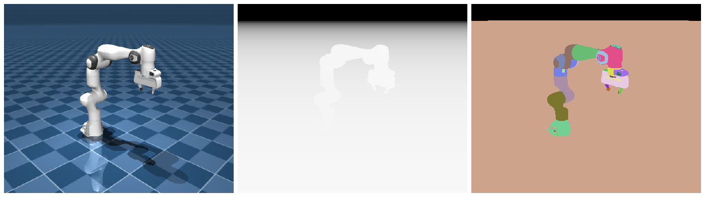
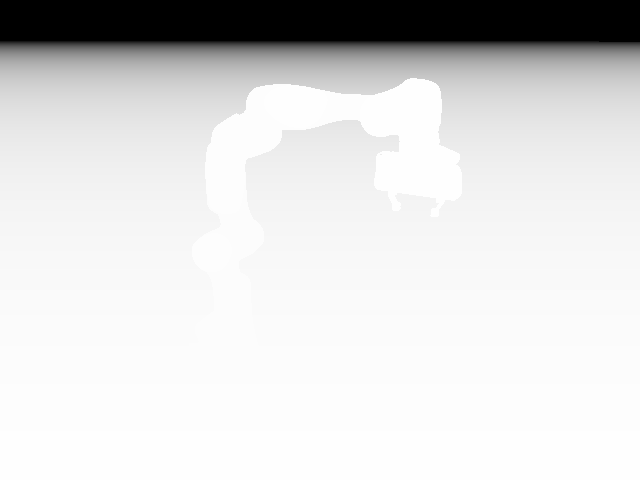
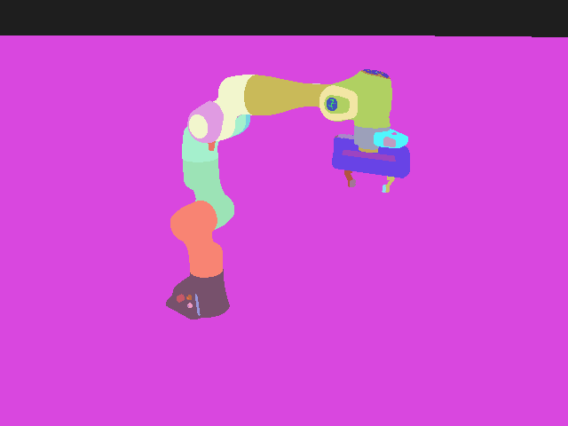

# 离屏渲染

要拿到图像、深度、分割数据，又不想弹出窗口，`mujoco.Renderer` 正是为这个场景设计的：离屏渲染，不依赖显示器。

## 本节目标

本节围绕 `mujoco.Renderer` 展开：

1. 它的最小用法是什么，为什么必须先 `update_scene` 再 `render`？
2. 深度图、分割图怎么拿（它们是“模式”，不是构造参数）？
3. 多帧怎么拼成视频？
4. 长循环里怎么避免 GPU 资源泄漏？

离屏渲染能从同一帧拿到 RGB、深度、分割三种输出：



## Renderer 的最小用法

最精简的离屏渲染大致是这样：创建 Renderer、同步状态、渲染一帧、拿到像素。

```python
import mujoco
import numpy as np

model = mujoco.MjModel.from_xml_path("scene.xml")
data = mujoco.MjData(model)
mujoco.mj_forward(model, data)

with mujoco.Renderer(model, height=480, width=640) as renderer:
    renderer.update_scene(data)
    pixels = renderer.render()
    print(f"rendered shape: {pixels.shape}")  # (480, 640, 3) RGB
```

这里用 `with` 是有讲究的：`Renderer` 实现了上下文管理器，退出 `with` 块时会自动释放 GPU 资源。如果不加 `with`，就需要手动调 `renderer.close()`，否则可能有资源泄漏：连续跑几千帧之后，内存或 GPU 显存往往会逐渐耗尽。

## update_scene 与 render 的顺序

这一步容易出问题。一般的顺序是：先 `update_scene`，再 `render`。

```python
# 正确顺序
renderer.update_scene(data)   # 把当前 data 的状态同步到渲染场景
pixels = renderer.render()    # 渲染当前场景

# 错误顺序：渲染出的还是上一帧画面！
pixels = renderer.render()    # 渲染的还是旧场景
renderer.update_scene(data)   # 太晚了，已经渲染完了
```

每次修改 `data` 之后（比如调了 `mj_step`、改了 `qpos`），都要重新调用 `update_scene` 让 Renderer 感知到变化。一个常见的 bug 是：在循环里调了 `mj_step`，却忘了在 `render` 之前调 `update_scene`，结果渲染出来的始终是初始状态。

```python
with mujoco.Renderer(model, height=240, width=320) as renderer:
    for _ in range(100):
        mujoco.mj_step(model, data)
        renderer.update_scene(data)  # 每步都要！
        frame = renderer.render()
```

## 深度图

深度图不是构造参数，而是渲染器的一个**模式**。`mujoco.Renderer` 的构造函数只接受 `model, height, width, max_geom, font_scale`，**没有** `depth=` 参数。要拿深度，先正常建 Renderer，再调 `enable_depth_rendering()` 切到深度模式，此时 `render()` 返回的就是 `(H, W)` 的深度图（`float32`，单位米），不再是 RGB：

```python
with mujoco.Renderer(model, height=480, width=640) as renderer:
    # 普通 RGB
    renderer.update_scene(data)
    rgb = renderer.render()              # (H, W, 3) uint8

    # 切到深度模式后，render() 返回的是深度而非 RGB
    renderer.enable_depth_rendering()
    renderer.update_scene(data)          # 切模式后要重新 update_scene
    depth = renderer.render()            # (H, W) float32，单位米
    renderer.disable_depth_rendering()   # 切回 RGB 模式
```

深度图每个像素的值，是该点沿相机光轴方向到相机的**垂直距离**（常称 z-depth，单位米），而不是到相机的欧氏直线距离。一个直观的判据：正对相机的一面平墙，整幅深度图是同一个常数（四角不会比中心更远）。场景中没有物体的像素会是很大的值（接近远裁剪面）。RGB 和深度共用同一套坐标，所以 `rgb[i, j]` 和 `depth[i, j]` 对应同一个世界位置。不过因为深度是单独渲染的一帧，RGB 和深度都想要时，就得像上面那样渲染两次（中间切换模式）。



## 分割图

分割图同样是一个模式，用 `enable_segmentation_rendering()` 开启，`render()` 返回 `(H, W, 2)` 的 `int32` 数组：

```python
with mujoco.Renderer(model, height=480, width=640) as renderer:
    renderer.enable_segmentation_rendering()
    renderer.update_scene(data)
    seg = renderer.render()                  # (H, W, 2) int32
    renderer.disable_segmentation_rendering()
```

两个通道的含义是：`seg[:, :, 0]` 是**对象 ID**（对一个 geom 来说就是它的 geom id），`seg[:, :, 1]` 是**对象类型**（`mjtObj` 枚举，geom 对应 `mjOBJ_GEOM`，值为 5）。背景（没有物体的像素）两个通道都是 **-1**。

这里要留意：第二个通道是"类型"，对所有 geom 都是同一个常数，用它区分不了不同的 geom。想区分各个 geom（比如把机器人每个连杆涂不同颜色），得用第 0 个通道。

```python
# 找出某个 geom 的像素（用 geom id，不是 body id）
geom_id = mujoco.mj_name2id(model, mujoco.mjtObj.mjOBJ_GEOM, "block_geom")
mask = seg[:, :, 0] == geom_id
# 想按 body 聚合，可以用 model.geom_bodyid 把 geom id 映射回 body id
```

把每个 geom id 映射成一种颜色，就能得到下面这样的分割可视化：Panda 的每个连杆、地面各自一色，背景（id 为 -1）涂黑：



## 多帧拼成视频

将多帧渲染结果拼成视频，可以用 imageio（最轻量）或 OpenCV：

```python
import imageio

frames = []
with mujoco.Renderer(model, height=480, width=640) as renderer:
    for _ in range(200):
        mujoco.mj_step(model, data)
        renderer.update_scene(data)
        frames.append(renderer.render())

imageio.mimsave("output.mp4", frames, fps=30)
```

三种常用工具对比：

| 工具 | 安装 | 优点 | 缺点 |
|---|---|---|---|
| `imageio` | `pip install imageio imageio-ffmpeg` | 最轻量，一行写视频 | 大视频可能慢 |
| `cv2` (OpenCV) | `pip install opencv-python` | 快，功能全 | 安装包比较大 |
| `ffmpeg` 命令行 | 系统安装 | 最快，可流式处理，不占内存 | 需要系统级安装，API 不友好 |

日常使用 `imageio` 通常够方便；遇到长时间录制或高分辨率视频，用 `ffmpeg` 管道输出往往更稳妥。

## 小结

- `mujoco.Renderer` 提供离屏渲染，不依赖显示器。
- 正确的渲染顺序是：`mj_step` → `update_scene` → `render`。
- 深度图、分割图是渲染器的**模式**，用 `enable_depth_rendering()` / `enable_segmentation_rendering()` 切换，不是构造参数；切模式后要重新 `update_scene`。
- 用 `with` 语句包裹 Renderer 可自动管理 GPU 资源。
- 视频拼接推荐 `imageio.mimsave`（简单场景）或 `ffmpeg`（高负载场景）。

## 动手练习

分别渲染一帧深度图和一帧分割图（注意要切换模式、各 `update_scene` 一次），检查深度图的数值范围，以及分割图里某个 geom（用 `seg[:, :, 0]`）的像素数。

## 参考资料

- [MuJoCo Documentation: Python Bindings（Renderer / enable_depth_rendering / segmentation）](https://mujoco.readthedocs.io/en/stable/python.html)
- [MuJoCo Documentation: Programming（rendering）](https://mujoco.readthedocs.io/en/stable/programming/index.html)

## 导航

- 上一节：[相机与多视角](03-camera-and-multiview.md)
- 返回上级：[观测与渲染](../04-observation-and-rendering.md)
- 下一节：[交互式 viewer](05-interactive-viewer.md)
