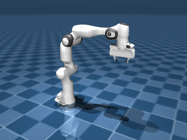
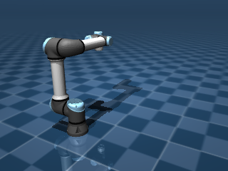
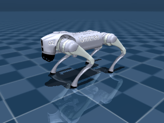
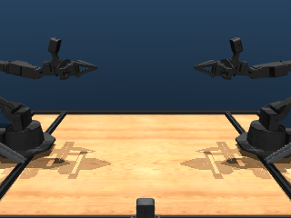

# mujoco_menagerie

`mujoco_menagerie` 是 DeepMind 维护的官方机器人模型库，收录了几十台校准好的 MJCF 模型，涵盖机械臂、四足、人形、灵巧手。需要某台常见机器人时，往往可以先来这里看看有没有现成的，省去从零搭模型的工夫。

## 本节目标

本节围绕 menagerie 回答几个问题：

1. 它大致收了哪些机器人？
2. 怎么加载其中一个模型，`scene.xml` 和机器人本体是什么关系？
3. 怎么用 `nq / nu / nbody` 几个数字比较不同机器人的复杂度？

## menagerie 是什么

`mujoco_menagerie` 是托管在 GitHub 上的公开仓库（`google-deepmind/mujoco_menagerie`）。它不是 pip 包，使用方式是直接 git clone 或作为 submodule 引入项目。克隆下来后，每个机器人是一个顶层子目录（如 `franka_emika_panda/`），里面是该机器人的 MJCF 文件。

本节示例中，menagerie 已克隆到 `reference/mujoco_menagerie/` 目录下。

## 加载一个 menagerie 模型

每个机器人目录下通常有两个关键文件：`<robot>.xml`（机器人本体定义）和 `scene.xml`（场景，include 了机器人 + 添加地面/灯光）。我们一般加载 `scene.xml`：

```python
import mujoco

# 加载 Panda 的场景
model = mujoco.MjModel.from_xml_path(
    "reference/mujoco_menagerie/franka_emika_panda/scene.xml"
)
data = mujoco.MjData(model)

print(f"nq={model.nq}  nv={model.nv}  nu={model.nu}  nbody={model.nbody}")
```

## 模型对比表

用 `labs/04-simulation/menagerie_tour.py` 可以批量扫描 menagerie 里的所有机器人（输出见 `runs/04-simulation/menagerie_tour.txt`）。以下是部分代表性模型的规模对比：

| 机器人 | 类型 | nq | nu | nbody | 特点 |
|---|---|---|---|---|---|
| franka_emika_panda | 7 轴臂 + 夹爪 | 9 | 8 | 12 | 最常见的机械臂之一 |
| universal_robots_ur5e | 6 轴臂 | 6 | 6 | 8 | UR 系列，无夹爪 |
| kuka_iiwa_14 | 7 轴臂 | 7 | 7 | 9 | KUKA 轻量臂 |
| unitree_go2 | 四足 | 19 | 12 | 14 | 每条腿 3 个自由度 + 基座 |
| aloha | 双臂 + 夹爪 | 16 | 14 | 21 | 双臂操作平台 |
| robotis_op3 | 人形 | 27 | 20 | 22 | 小型人形机器人 |

不同机器人的自由度差异很大：从 6 轴臂的 6，到人形的 27。加载后先打印 `nq/nu`，通常是了解一个模型"有多复杂"比较直接的一种方式。

下面是 menagerie 中部分机器人的渲染图，自上而下依次是 Franka Emika Panda、Universal Robots UR5e、Unitree Go2、ALOHA：






## 使用建议

使用 menagerie 模型时，一个稳妥的做法是"先小后大"：

1. 先单独加载机器人，打印 `nq/nu/nbody`。
2. 渲染一帧确认模型外观正常。
3. 跑几步被动仿真（不加控制），看机器人是否正常响应重力。
4. 再放进任务场景里。

这样一旦出问题，更容易判断是模型本身的问题还是任务逻辑的问题。

另外，menagerie 里有些目录有 `mjx_` 开头的 XML 文件，这些是面向 MJX（GPU 后端）的变体。如果用常规 MuJoCo（CPU），加载普通的 `scene.xml` 或 `<robot>.xml` 即可。

## 小结

- `mujoco_menagerie` 收录了数十台校准好的 MJCF 模型，覆盖机械臂、四足、人形、灵巧手等类别。
- 加载后先打印 `nq/nu/nbody` 了解模型规模。
- 使用前先单独加载验证，再放进任务场景。
- 注意区分普通 XML 和 `mjx_` 开头的 GPU 版本。

## 参考资料

- [MuJoCo Menagerie（GitHub）](https://github.com/google-deepmind/mujoco_menagerie)
- [MuJoCo Menagerie: Franka Emika Panda](https://github.com/google-deepmind/mujoco_menagerie/tree/main/franka_emika_panda)

## 导航

- 上一节：[Python API 巡览](01-python-api-tour.md)
- 返回上级：[接口与生态](../05-interfaces-and-ecosystem.md)
- 下一节：[dm_control suite](03-dm-control-suite.md)
