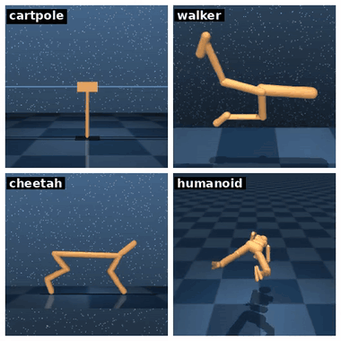

# dm_control suite

`dm_control` 是 DeepMind 在 MuJoCo 之上封装的库，提供了"任务"这一抽象层，奖励、回合、标准的 step/reset 接口。它的 `suite` 子模块里收录了一批经典控制任务（cartpole、humanoid、walker、cheetah 等），是评测算法的标准平台。

## 本节目标

本节围绕 dm_control suite 回答几个问题：

1. dm_control 在原生 MuJoCo 之上多包了哪些东西？
2. suite 里大致有哪些经典任务？
3. 它的 `TimeStep` 返回值和 Gymnasium 风格差在哪？
4. 怎么从 dm_control env 拿回底层的 mjModel / mjData？

## dm_control 的角色

原生 MuJoCo 提供的是物理引擎。dm_control 在原生的基础上加了三个关键东西：

1. **任务抽象**：每个任务有明确的奖励函数、回合终止条件、预设的动作空间和观测空间。
2. **标准接口**：`env.reset()` 和 `env.step(action)` 返回结构化的 `TimeStep` 对象。
3. **预定义任务库**：`suite` 收录了 cartpole、humanoid、walker、cheetah、quadruped 等几十个经典任务（分布在近 20 个 domain 下）。

可以这样理解：如果把 MuJoCo 比作"物理计算后端"，dm_control 大致相当于一张"实验台"，把"怎么定义奖励""什么时候算完成"这些事先安排好，让我们能更多地把精力放在策略设计上。

## suite 里有什么

```python
from dm_control import suite

# 加载 cartpole 的 swingup 任务
env = suite.load("cartpole", "swingup")

# 看看有哪些任务可用
for domain_name, task_name in suite.ALL_TASKS:
    print(f"{domain_name}:{task_name}")
```

主要任务一览：

| domain | 典型 task | 观测维度 | 动作维度 | 考什么能力 |
|---|---|---|---|---|
| cartpole | swingup, balance | ~5 | 1 | 基础连续控制 |
| humanoid | stand, walk, run | ~67 | 21 | 高维运动控制 |
| walker | stand, walk, run | ~24 | 6 | 双足平衡与步态 |
| cheetah | run | ~17 | 6 | 高速 locomotion |
| quadruped | walk, run | ~78 | 12 | 四足步态 |
| finger | turn_hard | ~12 | 2 | 灵巧操作 |
| fish | swim | ~24 | 5 | 流体环境运动 |

suite 里几个经典任务长这样（下面只给小幅动作让机体动起来、看清各任务的形态，真正学会任务要靠训练策略）：



## env.step / env.reset 接口

dm_control 的 `step(action)` 返回的是一个 `TimeStep` 对象，不是简单的元组：

```python
from dm_control import suite
import numpy as np

env = suite.load("cartpole", "swingup")
time_step = env.reset()

total_reward = 0
for i in range(100):
    action = np.random.uniform(-1, 1, size=env.action_spec().shape)
    time_step = env.step(action)
    total_reward += time_step.reward

    if time_step.last():
        print(f"episode ended at step {i}")
        break

print(f"total reward: {total_reward:.3f}")
```

swingup 任务的目标，是把杆子从下垂甩到竖直、再稳稳立住。下面是随机策略跑出来的样子：小车被随机地左右推，杆子只在下方小幅晃、始终甩不上去（随机动作几乎不可能完成 swingup，这正是任务的难点）：

<video src="../assets/mujoco-dm-cartpole.mp4" controls muted loop playsinline style="max-width:100%;height:auto;display:block;margin:0.75em 0"></video>

`TimeStep` 的关键字段：

| 字段 | 含义 |
|---|---|
| `step_type` | `FIRST`（首帧）/ `MID`（中间帧）/ `LAST`（末帧） |
| `observation` | 观测字典，如 `{'position': ..., 'velocity': ...}` |
| `reward` | 标量奖励值 |
| `discount` | 折扣因子；到达真正终止态时为 0，因时间上限结束（如 cartpole swingup）时仍为 1.0 |

## 和 Gymnasium 风格的差异

| | dm_control | Gymnasium |
|---|---|---|
| 返回值 | `TimeStep` 对象 | 元组 `(obs, reward, term, trunc, info)` |
| 观测格式 | 字典（`{'position': ..., 'velocity': ...}`） | 可以是 dict 或 Box 数组 |
| 动作/观测规范 | `env.action_spec()` / `env.observation_spec()` | `env.action_space` / `env.observation_space` |
| episode 结束 | `time_step.last()` | `terminated or truncated` |

日常使用中两者可以互相转换：Farama 维护的 Shimmy 提供现成的兼容层，把 dm_control env 包成 Gymnasium 风格（链接见页末参考资料）；反方向也有类似做法，但不如这个方向常用。

## 从 dm_control 拿到 mjModel / mjData

dm_control 底层仍然是 MuJoCo，可以通过 `env.physics` 访问：

```python
env = suite.load("cartpole", "swingup")
env.reset()

# 拿到底层的 MuJoCo 对象
physics = env.physics
model = physics.model     # mjModel
data = physics.data       # mjData

print(f"qpos = {data.qpos}")
print(f"nq = {model.nq}")
```

这意味着即便在 dm_control 的框架下，仍然可以直接操作 `data.ctrl`、读取 `data.qpos`；需要重新前向计算时用 `physics.forward()`（底层等价于 `mujoco.mj_forward`），前面几节讲过的能力大多照样用得上。

顺带一提，用它打印时会发现观测和 `qpos` 维度对不上，这是正常的：cartpole 把杆的角度编码成了 `cos`/`sin`，所以 `observation['position']` 比 `qpos` 多一维，只有 `velocity` 与 `qvel` 直接对应。

## 小结

- dm_control 在 MuJoCo 之上提供了任务抽象、标准接口和预定义任务库。
- `suite.load(domain, task)` 加载任务，`env.step(action)` 返回 `TimeStep` 对象。
- dm_control 和 Gymnasium 的返回值格式不同，但有 wrapper 可互相转换。
- 通过 `env.physics.model` / `env.physics.data` 可以直接访问底层 MuJoCo 对象。

## 参考资料

- [dm_control（GitHub）](https://github.com/google-deepmind/dm_control)
- [Shimmy: DM Control compatibility（dm_control ↔ Gymnasium 兼容层）](https://shimmy.farama.org/environments/dm_control/)
- [Tassa et al., "dm_control: Software and Tasks for Continuous Control", 2020](https://arxiv.org/abs/2006.12983)

## 导航

- 上一节：[mujoco_menagerie](02-menagerie.md)
- 返回上级：[接口与生态](../05-interfaces-and-ecosystem.md)
- 下一节：[dm_control composer](04-dm-control-composer.md)
