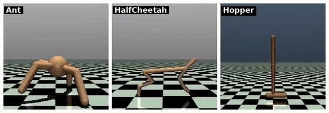

# Gymnasium 风格包装

多数 RL 训练框架（Stable-Baselines3、RLlib、CleanRL）认的是 Gymnasium 接口：`obs, reward, terminated, truncated, info = env.step(action)`。但 MuJoCo 本身不是 gym env，中间得加一层包装。

## 本节目标

本节围绕“把 MuJoCo 接到 Gymnasium”回答几个问题：

1. gymnasium 内置了哪些现成的 MuJoCo 环境？
2. 怎么把自己的 MJCF + 控制逻辑包成一个 `gym.Env`？
3. VectorEnv 和 MJX 两种并行有什么区别？

## gymnasium 简介

`gymnasium` 是 OpenAI Gym 的后继项目，由 Farama Foundation 维护。主要变化是 `step` 的返回值从 `(obs, reward, done, info)` 变成了 `(obs, reward, terminated, truncated, info)`，把"正常结束"和"被截断"区分开。

```bash
pip install gymnasium
```

gymnasium 内置的 MuJoCo 环境包括 Ant、HalfCheetah、Hopper、Humanoid、Walker2d、Swimmer 等经典 locomotion 任务：

```python
import gymnasium as gym

env = gym.make("Ant-v5")
obs, info = env.reset()
for _ in range(1000):
    action = env.action_space.sample()
    obs, reward, terminated, truncated, info = env.step(action)
    if terminated or truncated:
        obs, info = env.reset()
```

gymnasium 内置的这些 MuJoCo 环境长这样（用小幅动作让它们动起来）：



这些内置环境都是 locomotion（运动控制）任务。如果想要 Fetch 机械臂、Shadow Hand 灵巧手这类操作任务，可以装 Farama 的扩展包 gymnasium-robotics（`pip install gymnasium-robotics`），它在同样的接口下又补了一批基于 MuJoCo 的操作环境。

## 包装 MuJoCo 成 gym env：最小骨架

如果有自己的 MJCF 模型和自定义任务逻辑，可以写一个 `gym.Env` 子类来包装：

```python
import gymnasium as gym
import numpy as np
import mujoco

class MyRobotEnv(gym.Env):
    def __init__(self, mjcf_path="scene.xml"):
        super().__init__()
        self.model = mujoco.MjModel.from_xml_path(mjcf_path)
        self.data = mujoco.MjData(self.model)

        # 定义动作和观测空间
        self.action_space = gym.spaces.Box(
            low=-1, high=1, shape=(self.model.nu,), dtype=np.float32)
        self.observation_space = gym.spaces.Box(
            low=-np.inf, high=np.inf, shape=(self.model.nq + self.model.nv,),
            dtype=np.float32)

    def reset(self, seed=None, options=None):
        super().reset(seed=seed)
        # 回到第 0 个 keyframe（模型需定义 keyframe；没有就改用 mj_resetData）
        mujoco.mj_resetDataKeyframe(self.model, self.data, 0)
        mujoco.mj_forward(self.model, self.data)
        obs = np.concatenate([self.data.qpos, self.data.qvel])
        return obs.astype(np.float32), {}

    def step(self, action):
        self.data.ctrl[:] = action
        mujoco.mj_step(self.model, self.data)
        obs = np.concatenate([self.data.qpos, self.data.qvel])
        reward = self._compute_reward()
        terminated = self._is_done()
        return obs.astype(np.float32), reward, terminated, False, {}

    def _compute_reward(self):
        # 自定义奖励逻辑
        return 0.0

    def _is_done(self):
        # 自定义终止条件
        return self.data.time > 10.0
```

这个骨架把"仿真推进"（MuJoCo 负责）和"任务逻辑"（奖励函数 / done 函数负责）分开了。实际使用时往往还会加上渲染、更多状态读取等，但大体结构一般就是这样。

## observation_space / action_space 设计

动作空间通常直接对应 `model.nu`（actuator 数量），每个维度的范围参考 MJCF 里的 `ctrlrange`。

观测空间则更灵活，可以只给关节角 + 速度（最简单），也可以加上末端位置、传感器读数、目标信息等。一个常见的考虑是空间不宜太大：观测越大，策略往往需要越多的学习样本。

## VectorEnv 并行

gymnasium 提供了两种向量化环境：`AsyncVectorEnv` 用多进程**真并行**，`SyncVectorEnv` 在同一进程里**串行**依次跑（写法和 Async 一样，但不会加速）。要真正并行用 Async：

```python
from gymnasium.vector import AsyncVectorEnv

def make_env():
    return MyRobotEnv()

envs = AsyncVectorEnv([make_env for _ in range(4)])
obs, info = envs.reset()
actions = envs.action_space.sample()   # 批量动作，形状 (4, nu)
obs, reward, terminated, truncated, info = envs.step(actions)
```

每个进程有自己的 `mjModel` 和 `mjData` 副本，互不干扰。这一般适合 4-16 个并行环境的规模。

## VectorEnv vs MJX：两种并行的本质差异

| | VectorEnv (CPU) | MJX (GPU) |
|---|---|---|
| 并行数量 | 4-16 | 几千到几万 |
| 每环境独立 | 完全独立（独立进程） | 共享 JAX 设备上的批量数据 |
| 代码修改 | 包装 env 即可 | 需要适配 JAX API |
| 适合场景 | 小规模并行训练、调试 | 大规模 on-policy RL 训练 |

一个大致的顺序是：实验先跑通的阶段用 VectorEnv，需要大规模吞吐时再迁移到 MJX。

## 小结

- gymnasium 是 OpenAI Gym 的后继，内置了 Ant、HalfCheetah 等 MuJoCo 环境。
- 自定义 MJCF 模型可以通过继承 `gym.Env`、实现 `step/reset/render` 来包装。
- `AsyncVectorEnv` 提供 CPU 多进程并行（`SyncVectorEnv` 是同进程串行版），适合 4-16 环境的小规模训练。
- 大规模并行（数千环境以上）时建议用 MJX。

## 参考资料

- [Gymnasium Documentation](https://gymnasium.farama.org/)
- [Gymnasium-Robotics（Fetch / Shadow Hand 等额外 MuJoCo 操作环境，需 `pip install gymnasium-robotics`）](https://robotics.farama.org/)
- [MuJoCo Documentation: MJX](https://mujoco.readthedocs.io/en/stable/mjx.html)

## 导航

- 上一节：[dm_control composer](04-dm-control-composer.md)
- 返回上级：[接口与生态](../05-interfaces-and-ecosystem.md)
- 下一节：[接口选择](06-when-to-use-what.md)
