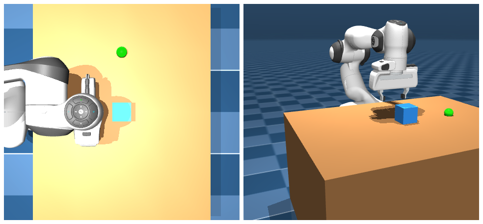

# 搭场景

抓取实验通常都从搭场景开始。这一页给一份可复用的桌面 scene.xml，后面几页都从这个起点改造。

## 本节目标

围绕这份桌面场景，本节回答几个问题：

1. 一个最小的抓取场景需要哪些元素？
2. 桌子、方块的尺寸和质量怎么定，为什么这样定？
3. 相机机位和光源各自怎么摆？

## 桌面场景的最小构成

一个可用的抓取场景至少需要这些元素：地面（plane）、桌子（box）、被操作物体（box）、Panda 机器人（include）、光源、相机。各自的关键参数如下：

<figure class="doc-figure" aria-label="抓取场景元素表">
  <p class="doc-figure-title">抓取场景元素一览</p>
  <table>
    <tr><th>元素</th><th>类型</th><th>关键参数</th><th>为什么这样设</th></tr>
    <tr><td>地面</td><td>plane geom</td><td>来自 include 的 scene.xml</td><td>给整个场景一个基准平面，本文件不必再加</td></tr>
    <tr><td>桌子</td><td>box geom + fixed body</td><td>size="0.3 0.4 0.02"，body pos.z=0.395 → 顶面 Z≈0.415</td><td>半高 0.02 加 pos 0.395，桌面顶面落在约 0.415m，给方块一个落脚处</td></tr>
    <tr><td>方块</td><td>box geom + free body</td><td>size="0.03 0.03 0.03"，mass=0.05</td><td>边长 6cm（MuJoCo 的 box size 是半边长，0.03 即半边）、质量 50g；落到桌面后中心约在 Z≈0.445，finger 夹得住</td></tr>
    <tr><td>目标位</td><td>site（绿色小球）</td><td>pos="0.4 0.2 0.44"</td><td>放置目标的可视标记；Z=0.44 对齐方块落桌后的中心高度（上一行的 ≈0.445），不是贴在桌面顶面</td></tr>
    <tr><td>Panda</td><td>include</td><td>file="scene.xml"（它内部再 include panda.xml）</td><td>复用 menagerie 的现成模型，连地面、基础光一起带进来</td></tr>
    <tr><td>光源</td><td>headlight + 方向光</td><td>scene.xml 自带；本文件再加一盏 top_light（pos 0.4 0 2）</td><td>scene.xml 已给基础照明，top_light 从桌子正上方补一束、压暗部</td></tr>
  </table>
</figure>

## 桌子与方块

桌子和方块都要考虑 collision 几何的合理性。桌子用简单的 box collision（和 visual 一致即可），方块也用 box：

```xml
<!-- 桌子：固定在空间中的 body（无 joint → 焊死在 world） -->
<body name="table" pos="0.4 0 0.395">
  <geom name="table_top" type="box" size="0.3 0.4 0.02"
        rgba="0.6 0.4 0.2 1" friction="0.8 0.01 0.001"/>
</body>

<!-- 方块：free joint 让它可被移动 -->
<body name="block" pos="0.4 0 0.48">
  <joint type="free"/>
  <geom name="block_geom" type="box" size="0.03 0.03 0.03"
        mass="0.05" rgba="0.2 0.6 1 1"
        friction="1.0 0.01 0.001"/>
</body>
```

方块质量的取值理由：太轻（< 0.01 kg）会被夹爪一碰就弹飞，太重（> 0.5 kg）则 Panda 的手指力矩可能夹不住。0.05 kg（约 50 克）是一个比较容易处理的起点。

## 目标位标记

目标位通常用 `<site>` 来标记：它不参与碰撞、不会被当作物体，只是一个可视的小标记，比用 visual geom 更省心：

```xml
<site name="target_site" pos="0.4 0.2 0.44"
      type="sphere" size="0.01" rgba="0 1 0 0.5"/>
```

## 相机布置

调试抓取常用三个机位，但它们加的位置不同：前两个是第三人称相机，直接放进本场景文件的 `<worldbody>`；第三个是机载相机，要放进 panda.xml 的 `<body name="hand">` 内部（本文件用 `<include>` 引入 panda，改不到它内部，所以机载相机得单独在 panda.xml 里加，做法见[动手：录像管线](../04-observation-and-rendering/07-hands-on-observation.md)）。

| 相机名 | 加在哪 | 用途 |
|---|---|---|
| `top_down` | 本场景 `<worldbody>` | 看方块和目标的平面位置关系 |
| `side_view` | 本场景 `<worldbody>` | 看末端高度和夹爪开合 |
| `wrist_rgb` | panda.xml 的 hand body | 第一人称看指尖和方块的接触 |

两个第三人称相机直接放进本场景的 `<worldbody>`：

```xml
<camera name="top_down" pos="0.4 0 1.0" xyaxes="1 0 0 0 1 0" fovy="60"/>
<camera name="side_view" pos="0.4 -0.5 0.5" xyaxes="1 0 0 0 0.7 0.7" fovy="60"/>
```

## 光源与渲染观感

menagerie 的 scene.xml 本身已经带了一盏 headlight 和一盏方向光，基础照明是现成的，不加 top_light 也能看清。本场景再加的 top_light 只是从桌子正上方多补一束方向光，让俯视图更均匀、暗部更少。下表是几种光照组合的大致观感：

<figure class="doc-figure" aria-label="光源配置对照">
  <p class="doc-figure-title">光源配置对照</p>
  <table>
    <tr><th>配置</th><th>效果</th><th>适用场景</th></tr>
    <tr><td>仅头灯</td><td>均匀但扁平，缺乏立体感</td><td>快速调试</td></tr>
    <tr><td>头灯 + 方向光</td><td>有阴影和立体感</td><td>出图、录制视频</td></tr>
    <tr><td>头灯 + 方向光 + 辅灯</td><td>暗部细节可见</td><td>高质量渲染</td></tr>
  </table>
</figure>

## 完整 scene.xml

把这份场景放对位置，比文件内容本身更容易出错。panda.xml 里有一句 `<compiler meshdir="assets"/>`，意思是"网格文件去 assets/ 子目录找"。MuJoCo 解析这个相对路径时，是相对**顶层 XML 文件所在的目录**来找的。所以最省事、也最不容易踩坑的做法，和[动手：录像管线](../04-observation-and-rendering/07-hands-on-observation.md)里一样：把 menagerie 的 `franka_emika_panda/` 整个目录复制到工作目录（要带上 `assets/`），把下面的 `grasping_scene.xml` 也建在这个目录里，和 `panda.xml`、`scene.xml`、`assets/` 做邻居。这样 `<include file="scene.xml"/>` 和 `meshdir="assets"` 都能就近解析到。

```xml
<mujoco model="grasping_scene">
  <include file="scene.xml"/>

  <worldbody>
    <!-- 光源 -->
    <light name="top_light" pos="0.4 0 2" dir="0 0 -1" directional="true"
           diffuse="0.8 0.8 0.8" specular="0.2 0.2 0.2"/>

    <!-- 桌子 -->
    <body name="table" pos="0.4 0 0.395">
      <geom name="table_top" type="box" size="0.3 0.4 0.02"
            rgba="0.6 0.4 0.2 1" friction="0.8 0.01 0.001"/>
    </body>

    <!-- 方块（可抓取物体） -->
    <body name="block" pos="0.4 0 0.48">
      <joint type="free"/>
      <geom name="block_geom" type="box" size="0.03 0.03 0.03"
            mass="0.05" rgba="0.2 0.6 1 1"
            friction="1.0 0.01 0.001"/>
    </body>

    <!-- 目标位标记 -->
    <site name="target_site" pos="0.4 0.2 0.44"
          type="sphere" size="0.01" rgba="0 1 0 0.5"/>

    <!-- 相机 -->
    <camera name="top_down" pos="0.4 0 1.0" xyaxes="1 0 0 0 1 0" fovy="60"/>
    <camera name="side_view" pos="0.4 -0.5 0.5" xyaxes="1 0 0 0 0.7 0.7" fovy="60"/>
  </worldbody>
</mujoco>
```

反过来，如果把 grasping_scene.xml 放在别处、用 `<include file="reference/mujoco_menagerie/franka_emika_panda/scene.xml"/>` 这种长相对路径，mesh 多半会加载失败：`meshdir` 和 include 的相对目录会叠在一起，最后去找 `assets/reference/.../link0.stl` 这种并不存在的路径，报 `Error opening file ... link0.stl`。把场景文件放进 `franka_emika_panda/` 目录就能避开。

这份场景渲染出来，俯视和侧面各看一眼（建议照做一遍：加载后用 `top_down` 渲一帧，确认桌子、方块、目标位都在画面里）：



## 小结

- 抓取场景大致需要这些元素：地面、桌子、方块、机器人、光源、相机。
- 方块参数（size 半边长 0.03m，即 6cm 见方；质量 0.05kg）是一个比较好处理的起点，后续可以按需要调整。
- 三个机位（俯视、侧面、机载）大致覆盖调试常用的视角；前两个放本场景，机载相机加在 panda.xml 的 hand body 内。
- collision 几何和 friction 参数往往在搭场景阶段就一并设好，省得抓取失败时再回头排查。

## 常见失败案例

| 失败现象 | 可能原因 | 处理 |
|---|---|---|
| 方块加载后就弹飞 | 方块初始位置和桌子或其他 geom 重叠 | 调方块 `pos` 的 Z 值，确保 gap > 0 |
| 方块穿透桌子掉下去 | timestep 太大，或 collision geom 没配对 | 减小 timestep，检查桌子 geom 有 contype≠0 |
| 渲染出来很黑 | 光源不足或位置不对 | 加一个方向光从上方照射 |

## 参考资料

- [MuJoCo Documentation: XML Reference（worldbody / light / camera）](https://mujoco.readthedocs.io/en/stable/XMLreference.html)
- [MuJoCo Menagerie: Franka Emika Panda](https://github.com/google-deepmind/mujoco_menagerie/tree/main/franka_emika_panda)

## 导航

- 上一节：[抓取实战](../06-grasping-walkthrough.md)
- 返回上级：[抓取实战](../06-grasping-walkthrough.md)
- 下一节：[末端控制](02-end-effector-control.md)
