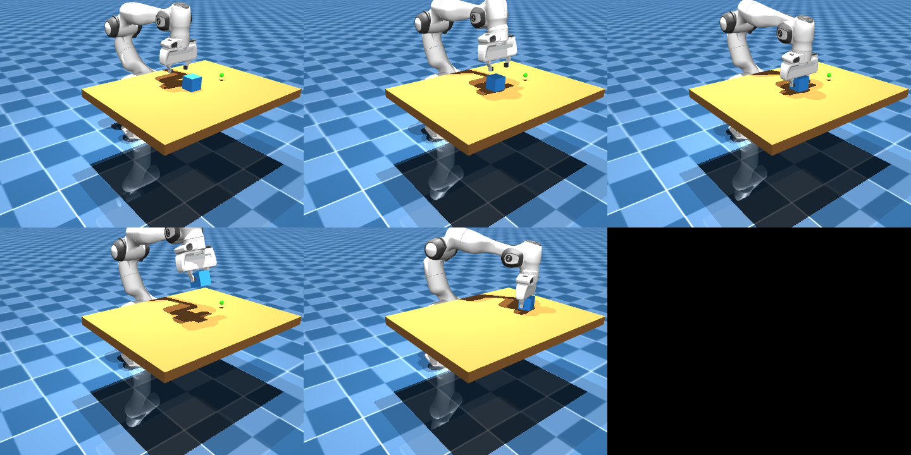

# 完整抓取流程

单看 reach、grasp、lift 每一步都不算难，难的是把它们稳稳接起来：手臂不能把方块扫飞，夹爪要在对的时机闭合，抬起时不能松手。这一页用一个状态机把 **reach → grasp → lift → place** 串成一条能跑通的 pick-and-place。

## 本节目标

本节把前三页的搭场景、末端控制、夹爪控制拼成一个能直接跑的 pick-and-place 脚本：用状态机组织四个阶段，列出每个阶段该用什么标准判断成功/失败，并交代清楚跑通后大致能看到什么。

## 状态机：四个阶段的切换

<figure class="doc-figure figure-pipeline" aria-label="抓取状态机">
  <p class="doc-figure-title">抓取状态机：四个阶段</p>
  <div class="figure-pipeline">
    <div class="figure-node tone-green">
      <strong>REACH</strong>
      <span>末端移到方块上方 5cm</span>
    </div>
    <div class="figure-node tone-blue">
      <strong>GRASP</strong>
      <span>下压到抓取高度 → 闭合夹爪</span>
    </div>
    <div class="figure-node tone-gold">
      <strong>LIFT</strong>
      <span>抬起 15cm → 检测是否夹住</span>
    </div>
    <div class="figure-node tone-rose">
      <strong>PLACE</strong>
      <span>移到目标上方 → 下放 → 张开夹爪</span>
    </div>
  </div>
  <div class="figure-note">四个阶段依次执行；每个阶段该检查什么，见下方“每个阶段的成功标准”一表。</div>
</figure>

## 思路：先用 IK 规划，再用位置控制执行

最容易想到的写法是：在仿真主循环里每步算一次微分 IK，把 `dq` 直接喂给 actuator。但这样很容易发散：增益稍大就抖、靠近奇异点（雅可比不满秩）就乱跳，方块往往还没碰到就被手臂扫飞。更稳的做法是把**规划**和**执行**分开：

1. **规划**：在一个临时的 `MjData` 副本上，用阻尼最小二乘（DLS，Damped Least Squares）IK 纯运动学地解出"让末端到达某个位置"需要的关节角。这一步只调 `mj_forward`，不推进物理，所以怎么迭代都不会把主仿真搞乱。DLS 在伪逆里加了一项阻尼 `λI`，正是用来压住奇异点附近的大跳变。
2. **执行**：把解出的关节角写进 `data.ctrl[:7]`，让 position actuator 把手臂稳稳带过去。位置控制器天然扛得住重力和夹取时的接触力。

每个阶段就是"解一次 IK + 驱动若干步"。下面是可以直接跑通的完整代码。

> 两点说明：① 场景里加了方块的 free joint 后，menagerie 自带的 `home` keyframe 只覆盖机械臂、不含方块（编译时 MuJoCo 会把它自动补齐到新的 `nq`：位置补 0、free joint 姿态补成单位四元数）。这样 `mj_resetDataKeyframe` 会把方块挪到原点 `[0,0,0]`、掉到地板下，所以这里**手动设 ready 位姿**、让方块留在它在 XML 里的 `pos`（0.4 0 0.48）自然落到桌面，不再走 keyframe 重置。② `GRASP_OFFSET ≈ 0.10` 是 hand body 原点比两指指尖高出的距离。把 hand 停在方块正上方这么高，指尖刚好落在方块两侧。

## 完整代码

代码里 `from_xml_path("grasping_scene.xml")` 用的是相对路径，默认这个文件就在当前工作目录。按[搭场景](01-scene-setup.md)的约定，`grasping_scene.xml` 放在 `franka_emika_panda/` 里（和 `scene.xml`、`assets/` 同级），在那个目录下运行本脚本就能跑通；放别处则把路径换成绝对路径。

```python
import mujoco
import numpy as np

model = mujoco.MjModel.from_xml_path("grasping_scene.xml")
data = mujoco.MjData(model)
ik_data = mujoco.MjData(model)        # 临时副本，专门用来算 IK，不动主仿真

HAND = data.body("hand").id
ARM_LIMIT = model.jnt_range[:7].copy()                       # 7 个臂关节的限位
READY = np.array([0, -0.785, 0, -2.356, 0, 1.571, 0.785])   # Panda 的 ready 位姿
GRASP_OFFSET = 0.103                  # hand 原点比指尖高约 0.10m
OPEN, CLOSE = 255, 0                  # Panda 夹爪 actuator：255=张开，0=闭合

def solve_ik(q_init, target_xyz, iters=300, damping=0.1, gain=0.5, clip=0.1):
    """阻尼最小二乘 IK：在副本上纯运动学地解出让 hand 到达 target 的关节角。"""
    ik_data.qpos[:] = data.qpos
    ik_data.qpos[:7] = q_init
    mujoco.mj_forward(model, ik_data)
    jacp = np.zeros((3, model.nv))
    eye = np.eye(3)
    for _ in range(iters):
        err = target_xyz - ik_data.body("hand").xpos
        if np.linalg.norm(err) < 1e-3:
            break
        # mj_jac 的 point 是世界坐标，传当前 hand 原点即可
        mujoco.mj_jac(model, ik_data, jacp, None, ik_data.body("hand").xpos, HAND)
        J = jacp[:, :7]
        dq = J.T @ np.linalg.solve(J @ J.T + damping * eye, err * gain)
        ik_data.qpos[:7] = np.clip(ik_data.qpos[:7] + np.clip(dq, -clip, clip),
                                   ARM_LIMIT[:, 0], ARM_LIMIT[:, 1])
        mujoco.mj_forward(model, ik_data)
    return ik_data.qpos[:7].copy()

def drive(arm_target, gripper, steps):
    """把 position actuator 的目标设为 arm_target，推进若干步让它执行到位。"""
    for _ in range(steps):
        data.ctrl[:7] = arm_target
        data.ctrl[7] = gripper
        mujoco.mj_step(model, data)

# 初始化：摆 ready 位姿、张开夹爪，先 settle 让方块落到桌面
data.qpos[:7] = READY
data.qpos[7:9] = 0.04
mujoco.mj_forward(model, data)
drive(READY, OPEN, 300)

block = data.body("block").xpos.copy()
goal = data.site("target_site").xpos.copy()

# REACH：移到方块上方
q = solve_ik(data.qpos[:7], block + [0, 0, GRASP_OFFSET + 0.08]); drive(q, OPEN, 250)
# DESCEND：下到抓取高度
q = solve_ik(data.qpos[:7], block + [0, 0, GRASP_OFFSET]);        drive(q, OPEN, 350)
# GRASP：闭合夹爪
drive(q, CLOSE, 300)
# LIFT：抬起 15cm
q = solve_ik(data.qpos[:7], block + [0, 0, GRASP_OFFSET + 0.15]); drive(q, CLOSE, 400)
# MOVE：移到目标上方
q = solve_ik(data.qpos[:7], [goal[0], goal[1], block[2] + GRASP_OFFSET + 0.15]); drive(q, CLOSE, 400)
# PLACE：下放并张开夹爪
q = solve_ik(data.qpos[:7], [goal[0], goal[1], goal[2] + GRASP_OFFSET]);         drive(q, CLOSE, 350)
drive(q, OPEN, 250)

print("方块最终位置:", np.round(data.body("block").xpos, 3))
print("目标位置:    ", np.round(goal, 3))
```

实测在 MuJoCo 3.8.1 / menagerie Panda 上跑下来，方块会被稳稳抓起、搬到目标位再放下，最终落点和 `target_site` 的水平误差约 1cm：

```text
方块最终位置: [0.409 0.197 0.444]
目标位置:     [0.4  0.2  0.44]
```

把渲染也带上的完整可复现版本（多视角录像加阶段关键帧拼图）在仓库 `labs/04-simulation/grasping_pipeline.py`，原样运行日志见 `runs/04-simulation/grasping_pipeline.txt`。

这段流程对方块的初始位置没有硬编码依赖——抓取目标是运行时从 `data.body("block").xpos` 读的。把方块的 `pos` 换个位置（比如 `0.4 0.1 0.48`）、不改任何代码再跑一遍，抓取应当照样成功，可以顺手验证一下泛化。

五个阶段的实拍（从左到右、从上到下：初始 → REACH → GRASP → LIFT → PLACE）：



<video src="../assets/mujoco-grasping.mp4" controls muted loop playsinline style="max-width:100%;height:auto;display:block;margin:0.75em 0"></video>

> 关于 `mj_jac`：它的 `point` 参数是**世界坐标**（"global point attached to given body"），所以传 `data.body("hand").xpos`（hand 原点的世界坐标）是对的。常见的误区是传 `np.zeros(3)`，那计算的是"刚性附在 hand 上、位于世界原点的点"的雅可比，和真正的末端差了一截杠杆臂，IK 会收敛很慢甚至跑偏。

## 每个阶段的成功标准

上面的教学脚本为了保持简单，是按固定步数开环推进、末尾只打印落点的；下表列的是每个阶段**该检查**的判据，不是脚本里已实现的代码。带判定逻辑的完整版见 `labs/04-simulation/grasping_pipeline.py`（GRASP 记录接触数、结尾按抬起高度和落点误差判 PASS/FAIL）。

| 阶段 | 成功标准 | 失败检测 |
|---|---|---|
| REACH | 末端距目标 < 5mm | 超过 300 步仍未到达 → 目标不可达 |
| GRASP | ctrl[7] ≈ 0 且 data.ncon > 0 | 闭合后无接触 → 方块不在夹爪范围内 |
| LIFT | 末端抬到目标高度 + 方块跟随 | 方块离手超过 2cm → 没夹住（滑落） |
| PLACE | 末端到目标位 + 张开夹爪 | 方块未在目标位 ± 2cm 内 → 放置失败 |

## 失败案例

| 失败模式 | 现象描述 | 常见原因 | 排查方向 |
|---|---|---|---|
| Reach 阶段末端到不了目标 | 末端在目标附近振荡 | 雅可比奇异，关节接近限位 | 调目标位，避开奇异姿态 |
| Grasp 阶段闭合后无接触 | 手指闭合但 data.ncon=0 | 末端位置偏移，方块不在两指之间 | 检查 reach 阶段的目标位置 |
| Lift 阶段方块滑落 | 抬起过程中方块从夹爪间滑出 | 摩擦太小、夹紧力不够 | 增大 friction[0]（方块与指尖一起调）或减小 ctrl[7]；想主动复现，把两者的 friction[0] 都调成 0.1 跑一遍即可 |
| 方块被弹飞 | 夹爪闭合时方块弹出场景 | 末端下压太多把方块压进桌面、碰撞产生巨大力 | 减小下压深度；接触仍不稳就减小 timestep |

## 调参表

| 参数 | 对抓取的影响 | 建议范围 |
|---|---|---|
| IK 增益 `gain` | err 的比例增益；太小收敛慢，太大迭代发散 | 0.3–0.7 |
| IK 阻尼 `damping` | 越大越稳但越慢，抑制奇异点附近的大跳变 | 0.05–0.2 |
| 单步关节增量上限 `clip` | 限制每次迭代关节角变化，防止跳变 | 0.05–0.1 rad |
| `GRASP_OFFSET` | hand 停在方块上方的高度，要和指尖长度匹配 | ≈0.10 m |
| 每阶段驱动步数 `steps` | 太少没到位就进了下一阶段 | 250–400 |
| 接触 `friction[0]`（方块与指尖取 max） | < 0.5 往往会滑落 | 1.0–3.0 |

想直观体会 `damping` 和 `clip` 各自的作用，可以做一个小实验：给 `solve_ik` 的 `gain` 设一个很大的值（比如 5.0），会看到 IK 不再收敛、末端误差停在几厘米量级来回振荡——这时是 `clip` 把每步增量截住，才没让它彻底发散；再把 `clip` 放大到 10（基本等于关掉），振荡就会变成真正的发散。两个现象合起来，能说明这两个参数为什么都得有。

## 小结

- 抓取任务可以用四个阶段的状态机来组织：REACH → GRASP → LIFT → PLACE。
- 关键设计是**把规划和执行分开**：在副本上用 DLS IK 解关节角（纯运动学、不发散），再让 position actuator 去执行，比在主循环里硬做微分 IK 稳得多。
- 每个阶段都给出了可据以判断成败的判据；页内脚本为保持简单是开环推进，带判定逻辑的完整版在 `labs/04-simulation/grasping_pipeline.py`。
- 失败最常见的原因是 reach 定位不准、摩擦太小、或夹紧力不够。

## 参考资料

- [MuJoCo least_squares.ipynb（阻尼最小二乘 IK / Jacobian 示例）](https://github.com/google-deepmind/mujoco/blob/main/python/least_squares.ipynb)
- [Kevin Zakka, mjctrl（差分 IK 最小实现）](https://github.com/kevinzakka/mjctrl)
- [MuJoCo Documentation: Python Bindings（mj_jac / mj_contactForce）](https://mujoco.readthedocs.io/en/stable/python.html)
- [dm_control: inverse_kinematics.py（`qpos_from_site_pose`，工业级 DLS IK）](https://github.com/google-deepmind/dm_control/blob/main/dm_control/utils/inverse_kinematics.py)
- [robosuite: PickPlace 环境（想要更完整、带评测的 pick-and-place 实现，看这里）](https://github.com/ARISE-Initiative/robosuite/blob/master/robosuite/environments/manipulation/pick_place.py)

## 导航

- 上一节：[夹爪控制](03-gripper-control.md)
- 返回上级：[抓取实战](../06-grasping-walkthrough.md)
- 下一节：[调试与调参](05-debug-and-tune.md)
