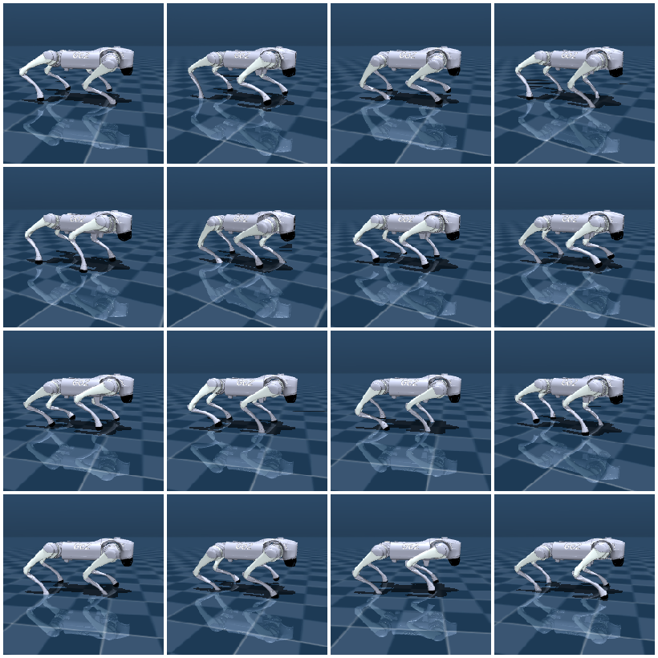

# 为什么 MJX

在跳进 JAX 之前，先回答一个问题：CPU 上多开几个进程跑 MuJoCo，不够吗？为什么还要专门做一个 GPU 版本？

## 本节目标

本节回答几个问题：

1. CPU 多进程仿真大致在什么规模上撞墙？
2. GPU 仿真为什么能帮上忙？
3. MJX 和 MuJoCo Warp 各自是什么定位？
4. 哪些项目其实并不需要 GPU 仿真？

## CPU 多环境的瓶颈

考虑一个典型的 RL 训练场景：PPO 每次迭代需要收集 2048 个 time step 的样本。如果在 CPU 上顺序跑（1 个环境、每环境 2048 步），假设每步仿真用时 1ms，单次 rollout 就需要 2 秒。这个速度对于实验迭代来说勉强可以接受。

但 on-policy 算法（如 PPO）往往需要更多样本：训练一个 Ant 任务到收敛，可能需要几千万到上亿步。如果只有 1 个环境，那就意味着几万秒（几小时）的纯仿真时间。

自然会想到多开一些环境。用 `AsyncVectorEnv` 或手写多线程，可以开到 8-16 个环境同时跑。但再往上往往会遇到 CPU 核心数的物理上限。一台 32 核的机器大致也就跑 32 个环境并行，而且每个核心还要分时间给渲染、神经网络推理等。想要 1024 个环境同时跑，CPU 上就比较吃力了，这正是 GPU 仿真的用武之地。

## GPU 仿真的优势

GPU 的设计哲学是"大量简单的计算单元同时做同一件事"。这和"跑几千个同样的仿真环境"天然匹配。

在 GPU 上，可以把 4096 个仿真的 step 合并成一次大规模的矩阵运算，利用 GPU 数千个核心一次性处理完。单个环境的 step 在 GPU 上往往比 CPU 慢（因为 GPU 单核频率低），但环境数足够多时，整体吞吐量能明显超过 CPU。具体高出多少很难一概而论：示意性地说，从数倍到一个数量级以上都有可能，强烈取决于硬件、模型复杂度和并行规模，本单元的[速度与 benchmark](03-speed-and-benchmarks.md) 一节会给一组实测。

<figure class="doc-figure" aria-label="CPU vs GPU 并行模式">
  <p class="doc-figure-title">CPU 多进程 vs GPU 批量并行</p>
  <table>
    <tr><th></th><th>CPU 多进程</th><th>GPU 批量（MJX）</th></tr>
    <tr><td>并行环境数</td><td>~4-32</td><td>~256-16384</td></tr>
    <tr><td>每个环境开销</td><td>独立进程、独立 mjData</td><td>共享计算、批量处理</td></tr>
    <tr><td>扩展性</td><td>线性（受核心数限制）</td><td>亚线性（到 GPU 满负荷前一直扩展）</td></tr>
    <tr><td>适合算法</td><td>off-policy（SAC）、调试</td><td>on-policy（PPO）、需要大量样本的算法</td></tr>
  </table>
</figure>

GPU 批量仿真的直觉就是：同一个模型，成百上千个实例同时往前推。



## MJX 是什么

**MJX（MuJoCo XLA）**是 DeepMind 官方提供的 MuJoCo GPU 后端。它的核心思路是用 JAX 重新实现 MuJoCo 的物理流水线（`mj_step`），让物理计算可以在 GPU 上运行，可以被 JAX 的 JIT 编译和自动向量化。这里的 JAX 是 Google 的数值计算库，特点是能把 Python 函数编译到 GPU/TPU 上并自动并行，下面几页会逐步用到它的几个能力。

安装：

```bash
pip install mujoco-mjx
```

使用方式和原生 MuJoCo 非常相似：

```python
import mujoco
import mujoco.mjx as mjx

model = mujoco.MjModel.from_xml_path("scene.xml")
mjx_model = mjx.put_model(model)    # 把 CPU 模型转成 MJX 格式
mjx_data = mjx.make_data(model)     # 创建 MJX 数据
mjx_data = mjx.step(mjx_model, mjx_data)   # 纯函数：返回新 data
```

`mjx.step` 是纯函数（输入确定则输出确定），这使得它可以被 `jax.jit` 编译加速和 `jax.vmap` 自动向量化，这是 MJX 能大规模并行的关键。

## MuJoCo Warp 是什么

**MuJoCo Warp** 是 NVIDIA 主导的另一个 GPU 后端，基于 NVIDIA 的 Warp 框架（一种 Python 到 CUDA 的编译工具链）。Warp 使用 Python 子集编写，可以编译为 CUDA 内核。

一句话定位：MJX 走 JAX 系——Google 主导、GPU/TPU 都能跑、和 Brax 生态打通；Warp 走 CUDA 系——NVIDIA 主导、只支持 NVIDIA GPU、接入 Isaac 生态，API 风格更接近原生 MuJoCo。两者的完整对照表放在[局限与 Warp](04-limitations-and-warp.md)一节，这里不展开。

截至写作时，对于刚接触 GPU 仿真的情况，MJX 通常是更稳妥的入门选择：它有更完善的文档，能和 Brax（JAX 原生 RL 训练库）较顺畅地对接，社区也更活跃。

## 什么任务不需要 GPU 仿真

不少场景其实并不需要 GPU 仿真：

- **单环境调试**：在 CPU 上跑一个环境、渲染出来看、改参数，这本来就是 MuJoCo 的长项，GPU 反而增加复杂度。
- **模仿学习录 demo**：通常只需要 1-2 个环境持续运行，并记录数据。
- **控制器设计**：调 PD 参数、测试 IK，每次只跑一个环境。
- **off-policy RL（如 SAC）**：需要的并行度不高，CPU 多进程就够。
- **小规模实验（< 32 并行环境）**：`AsyncVectorEnv` 最简单。

一个大致的顺序是：先跑通 CPU、确认算法能工作，当发现"并行环境数不够"成了瓶颈时，再考虑迁移到 MJX。

## 小结

- CPU 多进程在 16-32 环境以上遇到核心数硬限制，GPU 可以扩展到数千环境。
- MJX 是 DeepMind 官方 JAX 后端，MuJoCo Warp 是 NVIDIA 的 Warp 后端。
- MJX 更适合入门，文档和生态更完善。
- 控制实验、调试、小规模训练不需要 GPU 仿真。

## 参考资料

- [MuJoCo Documentation: MJX](https://mujoco.readthedocs.io/en/stable/mjx.html)
- [Brax（GitHub）](https://github.com/google/brax)
- [MuJoCo Warp（GitHub）](https://github.com/google-deepmind/mujoco_warp)

## 导航

- 上一节：[MJX 与 GPU 并行](../07-mjx-and-gpu.md)
- 返回上级：[MJX 与 GPU 并行](../07-mjx-and-gpu.md)
- 下一节：[最小迁移](02-minimal-migration.md)
