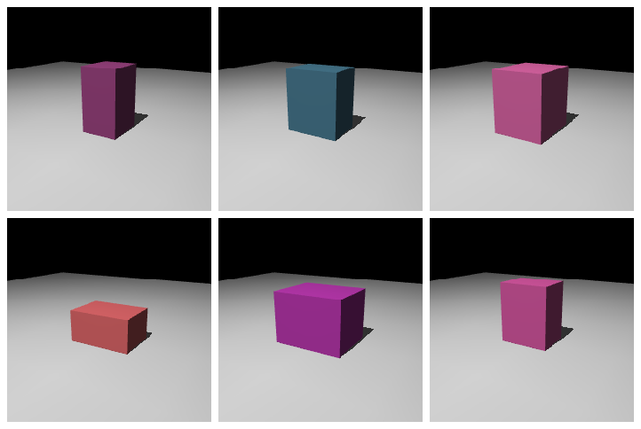

# Sim2Real 指路

仿真训出来的策略放到真机上能用吗？通常不能直接用，仿真和现实之间总会有差距。这一页不展开 Sim2Real 的方法细节，只把核心关注点列清，给一个最简单的域随机化例子。深入内容见 [12 真机实战](../../../11-real-robot-practice/README.md)。

## 本节目标

本节回答几个问题：

1. Sim2Real 差距主要来自哪几个维度？
2. 域随机化怎么用一个最小例子实现？
3. 还有哪些常见的减小差距的方法？

## Sim2Real 差距：从哪里来

仿真和真实世界之间的差距主要来自四个维度：

<figure class="doc-figure" aria-label="Sim2Real 差距的四个维度">
  <p class="doc-figure-title">Sim2Real 差距的四个维度</p>
  <table>
    <tr><th>维度</th><th>仿真中的问题</th><th>对策略的影响</th></tr>
    <tr><td>几何（Geometry）</td><td>CAD 模型和实物有偏差，collision 几何简化</td><td>接触位置偏移，抓取点不准</td></tr>
    <tr><td>动力学（Dynamics）</td><td>质量、惯量、摩擦、阻尼和实物不一致</td><td>关节力矩不准、物体滑落或弹飞</td></tr>
    <tr><td>感知（Perception）</td><td>渲染和真实相机差距大：光照、纹理、畸变</td><td>视觉策略容易直接失效</td></tr>
    <tr><td>延迟与时序（Latency）</td><td>仿真里控制是瞬时的，真机有通信和计算延迟</td><td>高频控制策略不稳定</td></tr>
  </table>
</figure>

## 域随机化：最简实现

域随机化是缩小 Sim2Real 差距最常用的方法之一。它的核心思路是：**在训练过程中，每次重置环境时随机改变一些物理参数（质量、摩擦、尺寸等），让策略学会适应各种变化，而不是过拟合到某一组精确的参数。**

```python
import numpy as np
import mujoco

def randomize_domain(model):
    """每次 reset 时调用，随机化物理参数"""
    # 随机化方块质量：0.03 ~ 0.08 kg
    block_id = mujoco.mj_name2id(model, mujoco.mjtObj.mjOBJ_BODY, "block")
    model.body_mass[block_id] = np.random.uniform(0.03, 0.08)

    # 随机化摩擦系数
    for i in range(model.ngeom):
        base_friction = model.geom_friction[i, 0]
        model.geom_friction[i, 0] = base_friction * np.random.uniform(0.7, 1.3)

    # 随机化关节阻尼（dof_damping 按自由度 nv 索引，不是按关节数 njnt）
    for i in range(model.nv):
        model.dof_damping[i] *= np.random.uniform(0.8, 1.2)
```

训练时每次 `env.reset()` 调用一次 `randomize_domain(model)`。这样策略在训练过程中会经历各种物理参数组合，部署到真机时更可能覆盖真实的参数范围。

注意事项：
- 随机化范围不宜一上来就开得很大（太大往往会让策略什么都学不会）。一般可以先用较窄的范围，确认训练能收敛，再逐步放宽。
- 上面的摩擦、阻尼是在当前值上乘系数，反复 reset 会累积漂移；实践中通常从一份保存好的基线参数出发随机化，或每次重新加载模型。想确认这两点，不必真训练：打印一次 `randomize_domain` 调用前后的 `model.body_mass` 和 `model.geom_friction[:, 0]`，看改动是否落在预期范围内即可。
- 渲染相关的随机化（光照、纹理）对视觉策略往往特别重要。

域随机化的效果可以这样想象：每次 reset 都换一组物理参数。下面只示意尺寸与颜色的变化。



## 其它常见方法

| 方法 | 思路 | 复杂度 |
|---|---|---|
| 系统辨识 | 测量真机的质量、摩擦等参数，校准仿真 | 中（需要真机做实验） |
| Residual Learning | 在仿真策略基础上，用真机数据学一个"残差修正" | 中-高（需要真机数据） |
| Domain Adaptation | 用域自适应技术把仿真图像"翻译"成真机风格 | 高（需要成对的仿真-真机图像） |
| 渐进式部署 | 先在仿真训练 → 在简化真机场景测试 → 逐步增加复杂度 | 中（工程量大） |

## 链到后续章节

Sim2Real 是一个工程和研究都活跃的领域。本章给出的只是最基础的入门配方。本课程后续有以下相关章节：

- [07 数据](../../../06-data-teleoperation-and-imitation-learning/README.md)：如何高效采集和组织真机与仿真数据。
- [10 强化学习](../../../09-reinforcement-learning-for-robotics/README.md)：更深入的 RL 算法，包括针对 Sim2Real 的训练技巧。
- [12 真机实战](../../../11-real-robot-practice/README.md)：把仿真策略部署到真实机器人的完整流程。

## 小结

- Sim2Real 差距来自几何、动力学、感知、延迟四个维度。
- 域随机化是缩小差距最简单有效的方法之一：训练时随机化物理参数，让策略学会适应。
- 域随机化、系统辨识、渐进式部署是常见的组合策略。
- 更深入的 Sim2Real 内容，留给 [12 真机实战](../../../11-real-robot-practice/README.md)。

## 参考资料

- [Tobin et al., "Domain Randomization for Transferring Deep Neural Networks from Simulation to the Real World", IROS 2017](https://arxiv.org/abs/1703.06907)
- [MuJoCo Documentation: MJX（域随机化与批量训练）](https://mujoco.readthedocs.io/en/stable/mjx.html)

## 导航

- 上一节：[行为克隆入门](04-imitation-from-demo.md)
- 返回上级：[训练教程](../08-training-recipes.md)
- 下一节：[附录：速查表](../99-cheat-sheet.md)
