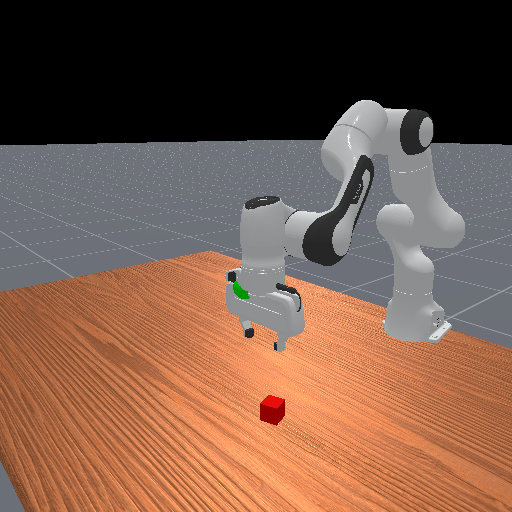

# ManiSkill 任务接口与 PickCube 实战

前面几节已经看到，机器人仿真不只是把一个机械臂画出来。真正进入学习算法之前，我们还要回答一组更具体的问题：任务从哪里开始，策略能看到什么，动作会怎样作用到机器人，奖励如何计算，什么状态才算成功。

ManiSkill 的价值正在这里。它把一批常见机器人操作任务整理成 Gymnasium 风格的环境，让我们可以先从任务接口学起，而不是一上来就从资产导入、场景搭建和物理参数调试开始。

本组页面用 ManiSkill 自带的 `PickCube-v1` 作为贯穿例子。它是一个环境 ID：导入 `mani_skill.envs` 后，Gymnasium 就能通过 `gym.make("PickCube-v1")` 创建这个抓方块任务。读者暂时不需要关心任务类在源码里的位置，只要先把它当作一个已经包装好的桌面操作练习场。



这个任务很小：机械臂在桌旁，桌面上有一个方块，目标是把方块抓起并放到目标位置附近。但它又足够完整：里面有机器人、夹爪、物体、目标、观测、动作、奖励和成功条件。把这个任务读透，后面再看开抽屉、插销、堆叠、多物体搬运等任务，会顺很多。

## 本节学什么

读完这一组页面，你应该能解释：

1. SAPIEN 和 ManiSkill 各自负责哪一层。
2. 为什么 `PickCube-v1` 能被 `gym.make()` 创建。
3. `reset()`、`step()`、`render()` 和 `info["success"]` 各自提供什么信息。
4. 随机 rollout、motion probe 和官方成功轨迹分别能说明什么。
5. `env_id`、`obs_mode`、`control_mode`、`reward_mode` 和 `success` 如何共同定义一个任务。
6. 为什么 `env.render()` 里的图和 `obs["sensor_data"]` 里的图不能混用。
7. 为什么 `num_envs=1` 时也可能看到 `(1, 42)` 这样的 shape。
8. ManiSkill 和 Genesis、Isaac Sim、Isaac Lab 在任务接口、资产生态和工程用途上的边界。

## 配套脚本

本节配有两个脚本：

```text
labs/04-simulation/maniskill_pickcube_demo.py
labs/04-simulation/maniskill_pickcube_artifacts.py
```

它们不是为了展示一个会成功抓取的策略，而是为了生成可检查的学习证据：summary、space、reset 截图、RGB-D 观测、rollout 视频、batch shape 和 wrapper 输出。仓库中随附的 `runs/04-simulation/` 和 `assets/` 产物来自一组完整 probe：state、rgbd、wrapper 和 `num_envs=16` vector 检查都已经生成。读者在自己的机器上重跑时，如果没有安装 ManiSkill、渲染链路不可用或 CUDA 条件不足，脚本会写出 `.skipped` 文件；这不是教程失败，而是在告诉你当前机器能学习到哪一层。

## 阅读路线

| 页面 | 读者此刻在问 | 这一页要建立的概念 |
|---|---|---|
| [ManiSkill 是什么](01-maniskill-task-interfaces/01-what-is-maniskill.md) | 它和 SAPIEN、Genesis、Isaac Sim 有什么关系？ | ManiSkill 是任务层，不是另一个大而全的仿真平台 |
| [安装与环境自检](01-maniskill-task-interfaces/02-install-and-env-check.md) | 我的机器能跑到哪一步？ | import、state、rgbd、GPU batch 要分层检查 |
| [PickCube 最小闭环](01-maniskill-task-interfaces/03-pickcube-minimal-loop.md) | 第一个任务怎样跑起来？ | reset、step、render、summary、success，并看到同一接口如何推广到更多任务 |
| [任务接口契约](01-maniskill-task-interfaces/04-task-interface-contract.md) | 一个任务到底由什么定义？ | env_id、obs_mode、control_mode、reward_mode、success |
| [观测与渲染](01-maniskill-task-interfaces/05-observation-rendering.md) | 策略看到的图和视频里的图有什么不同？ | state、rgbd、sensor_data、env.render |
| [Batch、GPU 与 Wrapper](01-maniskill-task-interfaces/06-batch-gpu-wrapper.md) | 为什么单环境也带 batch 维？ | num_envs、device、reward/done shape、CPUGymWrapper |
| [下游衔接与边界](01-maniskill-task-interfaces/07-downstream-boundaries.md) | 这些接口怎样接到训练、数据和评测？ | RL、IL、VLA、benchmark、平台边界 |
| [任务内部怎么读](01-maniskill-task-interfaces/08-read-a-task.md) | `PickCube-v1` 背后的任务类大致怎样组织？ | scene、episode、evaluate、reward、观测 |
| [速查与练习](01-maniskill-task-interfaces/09-cheat-sheet-and-exercises.md) | 写代码时忘了 API 怎么办？还可以怎么练？ | 常用 API、shape 速查、动手练习 |

第一次阅读建议按顺序走完。之后查接口时，可以直接回到“任务接口契约”“观测与渲染”和“Batch、GPU 与 Wrapper”三页。

## 导航

- 上一页：[SAPIEN 生态](../05-sapien-ecosystem.md)
- 返回本章：[仿真与任务建模](../README.md)
- 下一页：[ManiSkill 是什么](01-maniskill-task-interfaces/01-what-is-maniskill.md)
