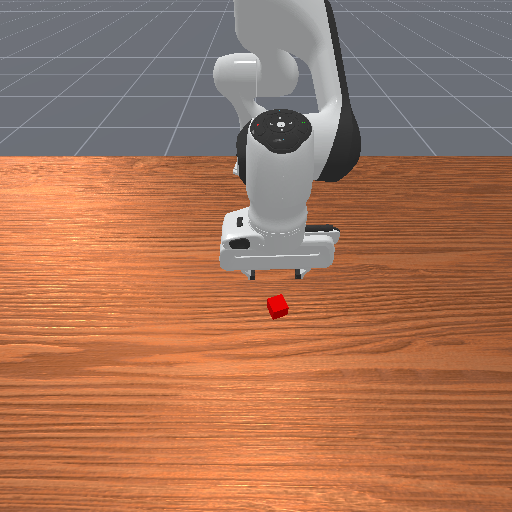

# 观测与渲染

学习视觉任务时，一个常见误解是：只要能录出一段视频，就说明策略也能看到这幅图。实际上，ManiSkill 里“策略看到的观测”和“人看到的渲染画面”是两条不同路径。

`obs["sensor_data"]` 里的图像可以进入策略、感知模块或数据集；`env.render()` 更适合人类检查任务画面、写文档截图或录制 rollout 视频。它们都可能是 RGB 图，但用途不同。

## state：先用低维观测读懂任务

`obs_mode="state"` 适合第一轮学习。它通常把机器人状态、物体状态和任务相关信息整理成一个向量，不依赖相机渲染链路。用 state 跑通 reset / step，可以先把任务接口读懂。

看到 state shape 时要注意 batch 维。例如 `num_envs=1` 时可能得到 `(1, 42)`。这里的 `42` 才是单个环境的状态维度，前面的 `1` 表示当前只有一个并行环境。

## rgbd：视觉观测不是只剩图像

切到 `obs_mode="rgbd"` 后，观测通常会变成字典结构。常见键包括下面几类；不同任务、版本或 wrapper 下实际键可能不同，写数据管线前应先打印 `obs.keys()` 和对应 shape。

| 键 | 含义 |
|---|---|
| `agent` | 机器人相关状态 |
| `extra` | 任务额外信息 |
| `sensor_data` | 相机返回的 RGB、depth 等数据 |
| `sensor_param` | 相机参数，例如内参和外参 |

也就是说，`rgbd` 不一定表示“观测里只有图像”。视觉策略是否只使用图像，是下游模型和数据管线自己的选择。

## render 和 sensor_data

下面两张图都来自 PickCube，但含义不同：




第一张更接近 `env.render()` 的用途：让人确认场景长什么样。第二张来自 RGB-D 观测，更接近策略或感知模块会使用的数据。一个简单判断是：如果它来自 `obs`，它可能进入策略或数据集；如果它来自 `env.render()`，它主要用于人类检查、截图和视频。

本章保留的图像可以这样读：

```text
maniskill_pickcube_reset.png    env.render() 画面
maniskill_pickcube_rollout.mp4  随机动作视频
maniskill_pickcube_rgb.png      rgbd 观测中的 RGB
maniskill_pickcube_depth.png    rgbd 观测中的 depth 可视化
```

## depth 和相机参数

RGB 图只能说明颜色和外观。做三维感知、点云、VLA 数据记录或跨平台比较时，还要记录 depth、相机名、相机内参和外参。只有图像没有相机参数，后续很难把像素和三维坐标联系起来。

## 小结

- `state` 适合第一轮接口检查，`rgbd` 适合视觉策略和感知管线。
- `rgbd` 通常是结构化观测，不一定只包含图像。
- `env.render()` 面向展示，`obs["sensor_data"]` 面向策略和数据。
- 不要用 rollout 视频替代观测数据检查。

## 导航

- 上一页：[任务接口契约](04-task-interface-contract.md)
- 返回上级：[ManiSkill 任务接口与 PickCube 实战](../01-maniskill-task-interfaces.md)
- 下一页：[Batch、GPU 与 Wrapper](06-batch-gpu-wrapper.md)
