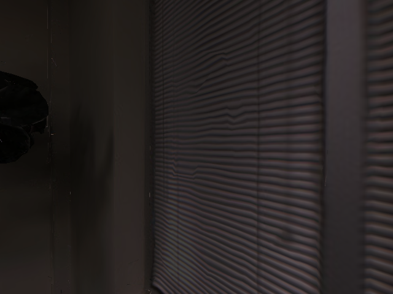
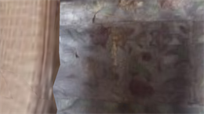
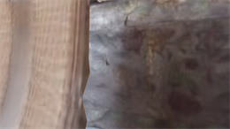
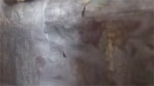
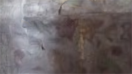
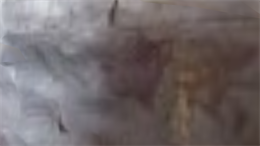
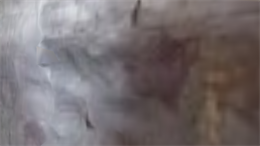

# Habitat 示例

目标：把 Habitat 在服务器上真实跑通一次，从安装、下载测试场景，到 Habitat-Sim 加载 3D 场景，再到 Habitat-Lab 创建 PointNav 环境并保存 RGB 帧和视频。

这一页不是完整训练教程，而是一个“先确认环境可用”的最小流程。前面几页已经讲了 Habitat-Sim、Habitat-Lab、数据集和任务的关系；这里直接落到命令和结果。读者照着跑完以后，至少应该能确认三件事：服务器能加载 Habitat 场景，传感器能渲染 RGB 图像，Habitat-Lab 能创建 PointNav 环境并执行 action。

本次实测环境是在服务器上完成的，因此安装命令使用 headless 版本，不依赖桌面 GUI。

## 创建 Habitat 专用环境：

```bash
conda create -n habitat python=3.9 cmake=3.14.0 -y
conda activate habitat
```

这里单独建一个环境是有必要的。Habitat-Sim、Habitat-Lab、Python、CMake、OpenGL / EGL 相关依赖之间比较容易互相影响。

## 安装 Habitat-Sim

服务器没有桌面显示窗口时，用 headless 版本：

```bash
conda install habitat-sim withbullet headless -c conda-forge -c aihabitat -y
```

这里几个关键词分别表示：

| 参数 | 含义 |
|---|---|
| `habitat-sim` | 安装底层仿真器 |
| `withbullet` | 带 Bullet 物理支持 |
| `headless` | 面向无显示器服务器，不打开 GUI viewer |
| `-c conda-forge -c aihabitat` | 从 conda-forge 和 aihabitat channel 安装 |

如果是在本地有显示器的 Linux 桌面上运行，可以不加 `headless`。

## 安装 Habitat-Lab

Habitat-Lab 提供任务、环境、配置和数据集接口。这里使用官方 `stable` 分支：

```bash
git clone --branch stable https://github.com/facebookresearch/habitat-lab.git
cd habitat-lab
pip install -e habitat-lab
```

`pip install -e habitat-lab` 是 editable install，意思是把当前源码目录作为 Python 包安装。后面运行 example 或修改源码时，不需要每次重新安装。

## 下载 Habitat 测试场景

先安装 Hugging Face 下载工具：

```bash
pip install -U huggingface_hub hf_transfer
```

然后创建数据目录，并设置下载环境变量：

```bash
mkdir -p data/scene_datasets/habitat-test-scenes

export HF_ENDPOINT=https://hf-mirror.com
export HF_HUB_DISABLE_XET=1
export HF_HUB_ENABLE_HF_TRANSFER=1
```

这里的 `HF_ENDPOINT=https://hf-mirror.com` 是为了在国内服务器上更稳定地访问 Hugging Face。如果服务器可以直接访问 Hugging Face，可以不设置这个镜像变量。

下载官方测试场景：

```bash
hf download ai-habitat/habitat_test_scenes \
  --repo-type dataset \
  --local-dir data/scene_datasets/habitat-test-scenes
```

下载完成后，后面的脚本会使用这个场景：

```text
data/scene_datasets/habitat-test-scenes/apartment_1.glb
```

## 测试 Habitat-Sim 能否加载场景

先写一个最小脚本，只检查 Habitat-Sim 能不能创建 simulator 并加载 3D 场景：

```bash
cat > test_habitat_sim.py <<'PY'
import habitat_sim

sim_cfg = habitat_sim.SimulatorConfiguration()
sim_cfg.scene_id = "data/scene_datasets/habitat-test-scenes/apartment_1.glb"

agent_cfg = habitat_sim.agent.AgentConfiguration()

cfg = habitat_sim.Configuration(sim_cfg, [agent_cfg])

sim = habitat_sim.Simulator(cfg)
print("Simulator created successfully")
print("Scene loaded:", sim_cfg.scene_id)

sim.close()
print("Habitat-Sim scene test ok")
PY

python test_habitat_sim.py
```

如果这里能输出 `Simulator created successfully` 和 `Habitat-Sim scene test ok`，说明底层仿真器、Python 包和测试场景路径基本没有问题。

## 保存一张 Habitat-Sim 渲染图

只加载场景还不够，我们还要确认 RGB 传感器能渲染图像。继续写一个脚本：

```bash
cat > render_habitat_sim.py <<'PY'
import habitat_sim
from PIL import Image

sim_cfg = habitat_sim.SimulatorConfiguration()
sim_cfg.scene_id = "data/scene_datasets/habitat-test-scenes/apartment_1.glb"

sensor_spec = habitat_sim.CameraSensorSpec()
sensor_spec.uuid = "color_sensor"
sensor_spec.sensor_type = habitat_sim.SensorType.COLOR
sensor_spec.resolution = [480, 640]
sensor_spec.position = [0.0, 1.5, 0.0]

agent_cfg = habitat_sim.agent.AgentConfiguration()
agent_cfg.sensor_specifications = [sensor_spec]

cfg = habitat_sim.Configuration(sim_cfg, [agent_cfg])
sim = habitat_sim.Simulator(cfg)

sim.initialize_agent(0)
obs = sim.get_sensor_observations()

rgb = obs["color_sensor"][:, :, :3]
Image.fromarray(rgb).save("habitat_render_test.png")

sim.close()
print("Saved image to habitat_render_test.png")
PY

python render_habitat_sim.py
ls -lh habitat_render_test.png
```

这一步生成的图片如下：



这张图的意义不是展示画面多好看，而是证明 Habitat-Sim 在服务器上已经能加载 `apartment_1.glb`，并通过 RGB camera sensor 输出图像。

## 下载 PointNav 测试 episode

前面只验证了 Habitat-Sim。接下来要验证 Habitat-Lab 能不能创建任务环境。先下载官方 PointNav 测试数据：

```bash
python -m habitat_sim.utils.datasets_download \
  --uids habitat_test_pointnav_dataset \
  --data-path data/ \
  --replace
```

这里下载的是最小测试 episode，不是 HM3D、Matterport3D 那种大数据集。它适合用来做环境连通性检查。

## 测试 PointNav 环境能否 step

写一个最小 PointNav 脚本：

```bash
cat > test_pointnav.py <<'PY'
import habitat

config = habitat.get_config(
    "benchmark/nav/pointnav/pointnav_habitat_test.yaml"
)

env = habitat.Env(config=config)

obs = env.reset()
print("PointNav environment created successfully")
print("Observation keys:", obs.keys())
print("Action space:", env.action_space)

actions = [
    {"action": "turn_left", "action_args": {}},
    {"action": "move_forward", "action_args": {}},
    {"action": "turn_right", "action_args": {}},
    {"action": "move_forward", "action_args": {}},
    {"action": "move_forward", "action_args": {}},
]

for i, action in enumerate(actions):
    obs = env.step(action)
    print(f"Step {i + 1} ok, action = {action['action']}")

env.close()
print("PointNav test ok")
PY

python test_pointnav.py
```

如果这一步能连续打印 `Step 1 ok` 到 `Step 5 ok`，说明 Habitat-Lab 已经能读取配置、创建 episode、执行 action，并返回 observation。

这里的 action 不是机器人底层关节控制，而是 Habitat 导航任务里的离散动作，例如左转、右转、向前移动。它更接近 embodied AI 任务环境里的 agent action。

## 保存 PointNav 的 RGB 帧和视频

最后把 PointNav 过程中的 RGB observation 保存下来，作为实验可视化证据。

```bash
cat > save_pointnav_video_hd.py <<'PY'
import os
import habitat
import imageio
from omegaconf import OmegaConf

config = habitat.get_config(
    "benchmark/nav/pointnav/pointnav_habitat_test.yaml"
)

OmegaConf.set_readonly(config, False)

config.habitat.simulator.agents.main_agent.sim_sensors.rgb_sensor.height = 720
config.habitat.simulator.agents.main_agent.sim_sensors.rgb_sensor.width = 1280

config.habitat.simulator.agents.main_agent.sim_sensors.depth_sensor.height = 720
config.habitat.simulator.agents.main_agent.sim_sensors.depth_sensor.width = 1280

env = habitat.Env(config=config)
obs = env.reset()

out_dir = "pointnav_rgb_frames_hd"
os.makedirs(out_dir, exist_ok=True)

frames = []

def save_rgb(obs, step_id):
    rgb = obs["rgb"]
    frame_path = os.path.join(out_dir, f"step_{step_id:03d}.png")
    imageio.imwrite(frame_path, rgb)
    frames.append(rgb)
    print(f"Saved {frame_path}, rgb shape = {rgb.shape}")

save_rgb(obs, 0)

actions = [
    {"action": "turn_left", "action_args": {}},
    {"action": "move_forward", "action_args": {}},
    {"action": "turn_right", "action_args": {}},
    {"action": "move_forward", "action_args": {}},
    {"action": "move_forward", "action_args": {}},
    {"action": "turn_left", "action_args": {}},
    {"action": "move_forward", "action_args": {}},
]

for i, action in enumerate(actions, start=1):
    obs = env.step(action)
    save_rgb(obs, i)

env.close()

video_path = "pointnav_rgb_video_hd.mp4"
imageio.mimsave(video_path, frames, fps=2)

print("HD PointNav RGB frames saved to:", out_dir)
print("HD PointNav RGB video saved to:", video_path)
PY

python save_pointnav_video_hd.py
```

按脚本里的 action 顺序，可以把 8 张 RGB 帧排在一起看：第 0 帧是 `env.reset()` 后的初始观测，后面 7 帧分别对应一次 `env.step(action)`。

|  |  |  |
|---|---|---|
|  |  |  |
| step 000：reset 初始观测 | step 001：turn_left | step 002：move_forward |
|  |  |  |
| step 003：turn_right | step 004：move_forward | step 005：move_forward |
|  |  |  |
| step 006：turn_left | step 007：move_forward |  |
视频结果：

<video controls width="720" src="../../assets/habitat-pointnav-video-hd.mp4"></video>

如果能生成 `pointnav_rgb_frames_hd/` 和 `pointnav_rgb_video_hd.mp4`，说明从 Habitat-Sim 的传感器渲染，到 Habitat-Lab 的任务 step，再到 RGB observation 保存，整条最小链路已经跑通。

## 这次最小实验验证了什么

这次实验不要理解成“已经完成 Habitat 训练”。它验证的是更基础、更关键的运行链路：

| 验证项 | 对应证据 |
|---|---|
| Habitat-Sim 可以加载测试场景 | `test_habitat_sim.py` 成功运行 |
| 服务器 headless 渲染可用 | 生成 `habitat_render_test.png` |
| Habitat-Lab 可以创建 PointNav 环境 | `PointNav environment created successfully` |
| action 能推动环境 step | 连续打印 `Step ... ok` |
| RGB observation 能保存 | `pointnav_rgb_frames_hd/` 和 MP4 视频 |

跑通这一步以后，再继续学习 ObjectNav、VLN、EQA 或训练 baseline 才比较稳。否则一开始就下载大数据集、跑 PPO 或改配置，很容易分不清问题出在安装、数据、渲染、任务配置还是训练代码。

## 进一步阅读可以看：

- [Habitat-Sim GitHub](https://github.com/facebookresearch/habitat-sim)
- [Habitat-Lab GitHub](https://github.com/facebookresearch/habitat-lab)
- [Habitat-Sim supported datasets](https://github.com/facebookresearch/habitat-sim/blob/main/DATASETS.md)