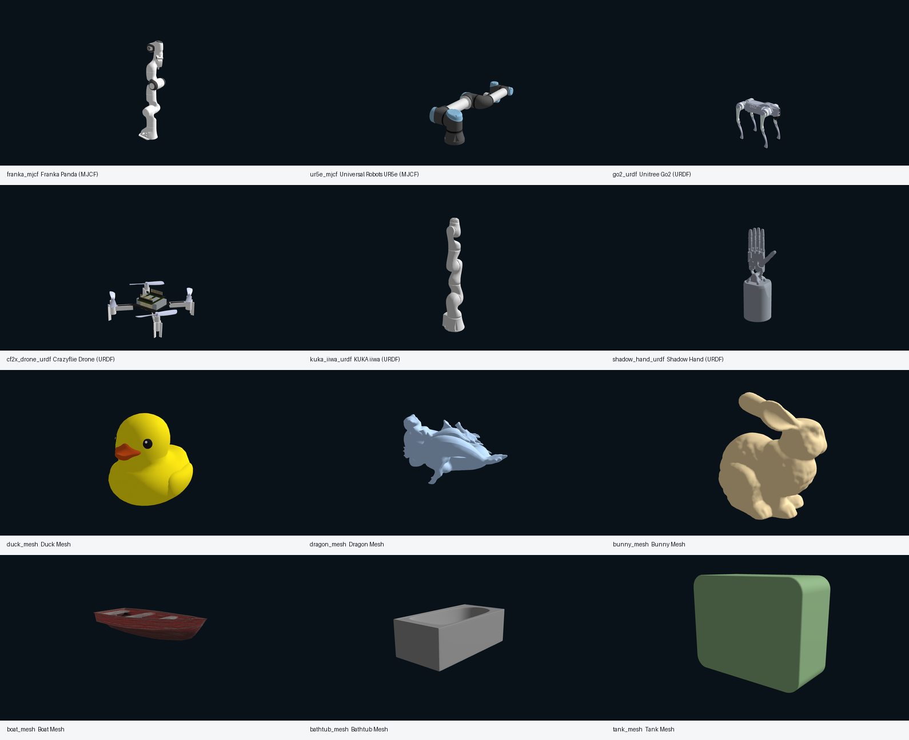

# 机器人资产加载

本页讲如何把机器人作为 `Entity` 加入 Genesis 场景。入门阶段优先使用官方示例 Franka，避免一开始就陷入自定义 URDF / MJCF 的惯量、关节轴、碰撞体和命名问题。

## 本节目标

本节围绕下面几个问题展开：

1. 为什么机器人在 Genesis 中也是 `Entity`？
2. MJCF、URDF、mesh 等资产入口分别适合什么情况？
3. 为什么第一轮建议先用官方 Franka 资产？
4. 自定义机器人资产导入前要检查哪些字段？

## 先用官方 Franka

第一轮机器人资产建议直接用官方 Franka：

下面的短片段默认已经创建好 `scene`，并完成 `import genesis as gs`。它只说明资产入口，完整控制脚本放在下一页和 `labs/06_genesis/03_robot_and_control.py`。

```python
franka = scene.add_entity(
    gs.morphs.MJCF(file="xml/franka_emika_panda/panda.xml")
)
```

原因很实际：官方资产路径、关节命名、碰撞体和惯量已经过示例验证。可先把精力放在 Genesis 的控制和观测链路上，而不是陷入自定义 URDF 的坐标轴、mesh 路径和惯量问题。

## 资产入口怎么选

| 入口 | 适合 |
|---|---|
| MJCF | MuJoCo 风格机器人，适合入门和 Franka 示例 |
| URDF | ROS / 机器人描述常见格式，适合真实机器人资产 |
| Mesh / GLB / OBJ | 物体、道具、渲染资产，不一定有完整关节结构 |

Nyx 示例里的 `PBR_Ball.glb` 就是 mesh 资产，Franka 控制示例则使用 MJCF。不要把“能渲染的 mesh”和“能控制的机器人模型”混为一谈。

## 把官方资产跑成素材

本书提供了一个专门的官方资产渲染脚本：

```bash
GENESIS_REPO_ROOT=/path/to/Genesis \
python labs/06_genesis/06_render_official_assets.py
```

它和 README showcase runner 不同。`06_render_official_assets.py` 不追求照搬官方动图，而是把常见 MJCF、URDF、OBJ 资产单独放进简单场景，用固定相机渲染成可检查素材。默认会输出到：

```text
runs/genesis_official_assets_YYYYmmdd_HHMMSS/
  artifacts/
  logs/
  summaries/
  RUN_SUMMARY.json
  RUN_MANIFEST.jsonl
```

最终资产预览目录是 `runs/genesis_official_assets_20260608_020235/`。它在 CPU 后端下生成了 12 个官方资产的 `1060x580` 预览图和一张 montage，`RUN_SUMMARY.json` 中 12 个 `asset_id` 的 `exit_code` 都是 `0`。这 12 个资产可以分成三类：

| 类型 | 保留资产 |
|---|---|
| MJCF 机器人 | `franka_mjcf`、`ur5e_mjcf` |
| URDF 机器人 | `go2_urdf`、`cf2x_drone_urdf`、`kuka_iiwa_urdf`、`shadow_hand_urdf` |
| mesh 物体 | `duck_mesh`、`dragon_mesh`、`bunny_mesh`、`boat_mesh`、`bathtub_mesh`、`tank_mesh` |

需要区分两种目录形态：脚本重新运行时会生成逐资产 `logs/` 和 `summaries/`；本书引用的最终目录主要包含 `artifacts/`、`RUN_SUMMARY.json` 和 `RUN_MANIFEST.jsonl`，用于稳定引用取景结果。因此引用该目录时，不要假设它和重新运行脚本后的目录逐文件完全相同。

<figure class="doc-figure">
<p class="doc-figure-title">Genesis 官方资产取景检查</p>

<p class="doc-figure-subtitle">这张 montage 来自 `runs/genesis_official_assets_20260608_020235/artifacts/`，用于证明官方资产可以被加载并由固定相机取景。</p>
</figure>

看这张 montage 时，不要只问“哪张图好看”。更应该按下面三步读：

| 问题 | 判断方式 |
|---|---|
| 它是什么格式？ | 先看 `asset_id` 属于 MJCF、URDF 还是 mesh |
| 它证明了什么？ | 只证明能加载、能 build、能被固定相机拍到 |
| 它还没证明什么？ | 还没证明关节命名、控制目标、碰撞体和任务奖励可用 |

如果重新运行脚本，每个资产的摘要会包含可检查字段。下面用 `franka_mjcf` 的一次真实运行摘要说明应该关注哪些字段；其中 `source_file` 保留字段含义，但路径写成示意服务器路径，具体追溯以本书保留目录中的 `RUN_SUMMARY.json`、`RUN_MANIFEST.jsonl` 和 `artifacts/` 为准：

```json
{
  "asset_id": "franka_mjcf",
  "title": "Franka Panda (MJCF)",
  "kind": "mjcf",
  "source_file": "/data/project/Genesis/genesis/assets/xml/franka_emika_panda/panda.xml",
  "resolution": [1060, 580],
  "backend": "cpu",
  "build_seconds": 2.511076736263931,
  "render_seconds": 0.19692184310406446,
  "rgb_shape": [580, 1060, 3],
  "rgb_min": 10.0,
  "rgb_max": 255.0,
  "result": "passed"
}
```

摘要里的 `source_file` 是当时服务器上的绝对路径；重新运行脚本时，应以当前运行目录中的 summary、PNG 和 log 为准，不要求路径字符串完全相同。如果引用的是本书保留目录，则以 `RUN_SUMMARY.json`、`RUN_MANIFEST.jsonl` 和 `artifacts/*.png` 为准。`RUN_SUMMARY` / `RUN_MANIFEST` 中的 `run_dir`、`log` 等绝对路径记录原始运行环境，不保证在本机可打开；本书保留产物以仓库内 `artifacts/*.png` 以及 asset / result 字段为准。

这个脚本适合回答两个问题：资产路径是否能加载，固定相机是否能拍到它。它不证明机器人能被控制，也不证明碰撞体、关节轴和惯量都适合任务；控制仍然要回到 `03_robot_and_control.py` 和关节 dof 检查。换句话说，资产取景是“能作为实体进入场景”的证据，不是“能作为机器人完成任务”的证据。

## 自定义资产前的检查

导入自定义机器人前，先检查：

| 字段 | 为什么 |
|---|---|
| mesh 路径 | 相对路径错会直接加载失败 |
| joint name | 控制代码通常依赖关节名或 dof 顺序 |
| joint axis / limit | 轴错会导致运动方向不符合直觉 |
| inertia / mass | 不合理会导致仿真发散或运动怪异 |
| collision geometry | 视觉 mesh 好看不等于碰撞体可靠 |

如果一个自定义机器人 `build()` 失败，先回到官方 Franka。用已知资产确认环境没问题，再查自定义模型。

## 读完应能回答

1. `franka_mjcf` 的取景摘要能证明什么，不能证明什么？
2. 为什么 mesh 能加载并不等于它适合做机器人控制？
3. 自定义 URDF 失败时，为什么要先回到官方 Franka 做对照？

## 小结

- 机器人在 Genesis 中也是 `Entity`。
- 入门优先用官方 Franka，不要第一步就调自定义 URDF。
- mesh 资产适合物体和渲染，不等于可控机器人。
- 自定义资产要检查路径、关节、惯量和碰撞体。

## 导航

- 上一页：[Scene 与 Entity](01-scene-entity.md)
- 返回目录：[场景、实体与机器人](../02-scene-entity-robot.md)
- 下一页：[关节、自由度与控制](03-joint-dof-control.md)
