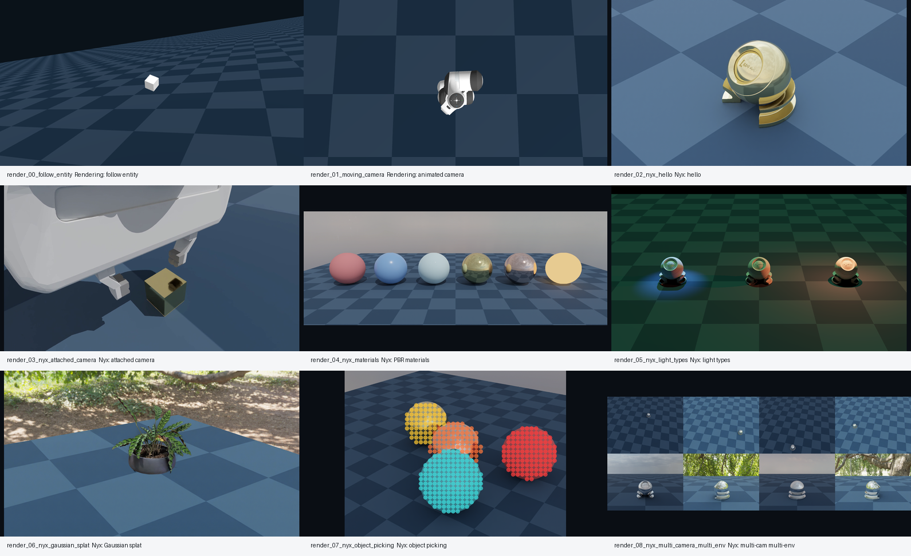

# 观察、渲染与传感器

本组把 Genesis 的观察链路单独拉出来：viewer 给人调试，camera 和 sensor 给程序读取观测，渲染结果需要保存和验收。官方 README showcase 的运行记录显示，这一组暴露出的信息最丰富：有些示例可以直接由相机保存，有些内容只存在于 viewer overlay，有些需要 Nyx 这样的额外渲染插件，还有一些交互式 GUI 在无界面服务器上必须降级处理。

所以这一组不只讲“怎么出图”。更重要的是建立一个判断：**画面到底来自物理仿真、相机传感器、viewer 叠加层，还是后处理 adapter？** 只有把来源分清楚，后面做数据、训练或复现实验时才不会把演示图误当成可直接训练的观测。

## 本节目标

本节围绕下面几个问题展开：

1. viewer、camera 和 sensor 分别解决什么问题？
2. 为什么远程服务器上要先验证无界面物理循环？
3. Genesis 直接 camera 写法和 1.x sensor API 有什么差异？
4. 渲染结果怎样保存，才方便复现和排错？
5. 官方 Rendering / Sensor showcase 的素材应该怎样转化成可引用证据？

## 从 9 个 Rendering 结果看观察链路

官方 README 的 `Rendering` 组一共有 9 项。本书已按 `1060x580` 统一预览尺寸跑出，并把原始日志、PNG、MP4 和摘要保存在：

```text
runs/genesis_readme_showcase_rendering_full_20260608_052306/
```

<figure class="doc-figure">
<p class="doc-figure-title">Genesis Rendering showcase 的 9 个观察入口</p>

<p class="doc-figure-subtitle">前两个来自 Genesis 主仓库 camera 示例；后七个来自 Nyx renderer plugin。所有预览统一为 `1060x580`，原始分辨率和日志保留在 `runs/`。</p>
</figure>

这些素材可以按学习价值分成三类：

| 类别 | 官方示例 | 初学者应该学到什么 |
|---|---|---|
| 基础 camera | `follow_entity.py`、`moving_camera.py` | 相机不是固定截图工具，它可以跟随实体，也可以在仿真循环里移动 |
| Nyx 渲染 | hello、materials、lights、Gaussian splat | 渲染后端会影响材质、光照、HDRI、光场资产和最终图像质量 |
| 多相机/多环境 | attached camera、object picking、multi-camera multi-env | 相机可以挂到机器人链路上，也可以服务于拾取、批量环境和多视角观测 |

这里最容易误解的是 Nyx。它不是 Genesis 最小安装的一部分，而是可选渲染插件；远端运行实际安装了 `gs-nyx==0.1.2`、`gs-nyx-plugin==0.1.3` 和 `av==17.1.0`。因此引用 Nyx 示例时要明确依赖，不要让读者以为 `pip install genesis-world` 后所有渲染示例都天然可用。

## 从 Sensor 结果看 adapter 边界

`Simulation Interface` 组里也有很多观察相关示例。它们不全是普通 camera 渲染：

| 示例 | 真实数据来源 | 处理方式 |
|---|---|---|
| depth camera | Genesis camera / sensor 输出 | 直接 headless capture |
| IMU | `sensor.read()` 的惯性数据 | 保留日志和相机画面 |
| LiDAR | `sensor.read()` 的点云和距离 | 把真实点云投影到 camera frame |
| ContactForce | `ContactForceSensor` 历史 | 左侧真实渲染，右侧绘制真实力曲线 |
| draw_debug | viewer debug primitives | 将官方图元投影到离屏相机图 |
| ImGui / mouse plugins | 交互式 viewer | 标成 GUI 依赖或静态 proxy |

这个表比“支持很多传感器”更重要。它提醒的是：说明性素材可以把 viewer overlay 变成图，但训练用 observation 必须回到传感器数据本身。LiDAR 点云、接触力曲线和 debug 图元的后处理图，是为了让人理解；它们不等于策略网络真实会收到的张量。

canonical run 中，Simulation Interface 的传感器相关条目 04-11 的实际运行事实如下，来源为：

```text
runs/genesis_readme_showcase_canonical_20260608_055500/summaries/
```

表里的 `adapter` 不是坏事，而是说明这张图经过了怎样的可视化转换：

| 素材 | 帧数 | 耗时 | adapter / 关键事实 | 读法 |
|---|---:|---:|---|---|
| `sim_04_depth_camera` | 150 | `47.82s` | 无 adapter | depth camera 可以直接 headless capture，但仍要检查 depth 数组而不是只看 RGB |
| `sim_05_imu` | 150 | `16.91s` | 无 adapter | IMU 的核心证据在惯性读数，画面只是帮助定位场景 |
| `sim_06_lidar` | 150 | `15.53s` | `lidar_obstacle_boundary`，`8192` 条射线，`1798` 个命中点，`1360` 个投影点，`266` 个边界方位角 | 预览图是障碍物边界；真正观测来自 `sensor.read()` |
| `sim_07_tactile_sandbox` | 150 | `63.60s` | 无 adapter | 触觉示例更依赖接触配置和时序变化，截图只能做入口 |
| `sim_08_contact_force` | 150 | `16.53s` | `contact_force_composite`，最大力范数约 `279.53`，`375` 个历史样本 | 左图是场景，右图是传感器历史曲线，不能把曲线当相机输出 |
| `sim_09_surface_distance` | 4 | `15.07s` | 短帧数，`result: passed` | 它更像几何关系能力入口，不要按长视频标准误判失败 |
| `sim_10_temperature_grid` | 4 | `11.80s` | 短帧数，`result: passed` | 温度网格要回到数组结构和物理含义，不靠长视频证明 |
| `sim_11_draw_debug` | 75 | `8.37s` | `draw_debug_projected_overlay`，包含 box、line、arrow、sphere、frame 等图元 | debug primitive 是 viewer / 调试语义，引用图像时需要说明投影来源 |

这张表也给实验报告一个写法模板：图片负责让人快速理解，`summary.json` 负责给出帧数、耗时、adapter 和 metrics，原始日志负责解释运行过程。三者缺一项，结论就要写得更保守。

## 学习顺序

| 页面 | 重点 |
|---|---|
| [viewer 与无界面运行](03-observation-rendering-sensors/01-viewer-headless.md) | viewer、headless、物理循环和图形环境排错 |
| [camera 与图像保存](03-observation-rendering-sensors/02-camera-and-image-save.md) | RGB、depth、相机配置和文件输出 |
| [Genesis 1.x 传感器接口](03-observation-rendering-sensors/03-genesis-1-sensor-api.md) | 官方 sensor-based camera 接口和版本差异 |
| [渲染常见问题](03-observation-rendering-sensors/04-rendering-check.md) | viewer / camera 边界、黑图、远程环境与 Nyx 排错 |

读完这一组后，应该能看懂一份渲染运行记录：它用了哪个示例、哪个后端、什么分辨率、是否依赖 viewer、是否需要 adapter、输出图像是不是来自真实相机或真实传感器数据。

如果要把观察或渲染素材写进实验报告，建议按“画面、summary、log、STATUS”的顺序说明它能支撑什么、不能支撑什么。

## 读完应能回答

1. `1060x580` 预览为什么不能直接当作训练时的 observation shape？
2. LiDAR 和 ContactForce 的预览图分别经过了什么后处理？
3. 为什么 Nyx 示例要单独写依赖和失败日志，而不是只贴成功图？

## 小结

- viewer、camera、sensor、overlay adapter 和 Nyx renderer 生成的图像证据等级不同。
- 传感器素材要回到 `summary.json` 的 metrics、帧数和 adapter 字段，而不是只看截图。
- Rendering 组不是每项都有 MP4；静态 Nyx 条目应看 preview、summary 和 log。
- 观察链路的核心问题是“画面从哪里来、能证明什么、不能证明什么”。

## 导航

- 上一页：[reset 与 control](02-scene-entity-robot/04-reset-and-control.md)
- 返回目录：[Genesis](../02-genesis.md)
- 下一页：[viewer 与无界面运行](03-observation-rendering-sensors/01-viewer-headless.md)
