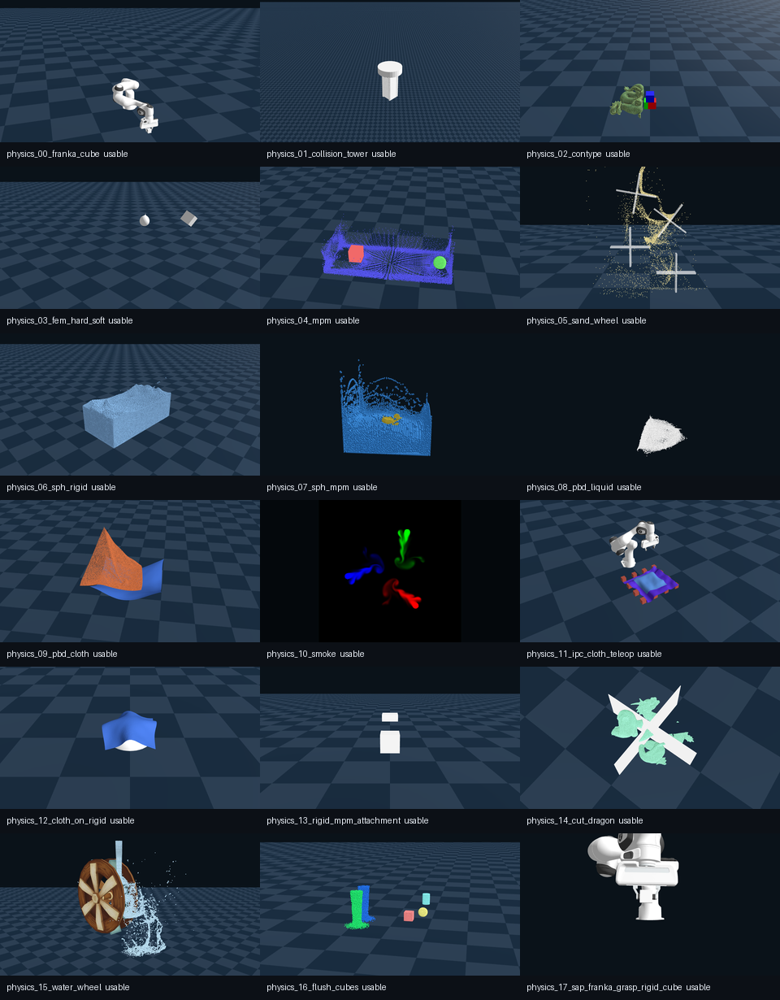

# 多物理入门

本组讲 Genesis 的多物理入口。学习多物理不应只停在“支持软体、流体、颗粒”，而要先从可验收的多刚体实验开始，再解释 solver、material、时间步和非刚体排错成本。

## 本节目标

本节围绕下面几个问题展开：

1. 为什么多物理入门先从多刚体对象开始？
2. solver、material、`dt`、`substeps` 分别影响什么？
3. SPH、MPM、PBD 分别常用于哪类物理对象？
4. 非刚体实验为什么比刚体实验更难验收？

## 官方 Physics 18 项怎么读

官方 README 的 `Physics` 组不是一张普通功能海报，而是 Genesis 多物理能力的入口索引。本书已把 18 项全部跑成 `1060x580` 预览、视频、日志和摘要：

```text
runs/genesis_readme_showcase_canonical_20260608_055500/
  contact_sheet_physics.png
  previews/
  videos/
  logs/
  summaries/
  STATUS.md
```

<figure class="doc-figure">
<p class="doc-figure-title">Genesis Physics showcase 的多物理谱系</p>

<p class="doc-figure-subtitle">这 18 项来自官方示例真实运行结果，不是官网截图。IPC cloth teleop 使用了记录在 `STATUS.md` 中的 plane material adapter。</p>
</figure>

初学者不要试图一次读懂这 18 项。更好的方式是按物理对象和耦合关系分组：

| 组 | 官方示例 | 学习重点 |
|---|---|---|
| 刚体与接触 | Franka cube、collision tower、contype | 接触、碰撞过滤、相机视角、稳定落地 |
| FEM / deformable | hard & soft constraint | 形变对象和约束不再只看刚体位姿 |
| MPM / SPH / PBD | MPM、sand wheel、SPH、PBD liquid、PBD cloth | 粒子、流体、布料、连续介质的状态表示不同 |
| 多物理耦合 | cloth on rigid、rigid + MPM、water wheel、flush cubes | 两类物理对象共享场景时，时间步和接触更敏感 |
| 高级耦合 / 求解器 | IPC cloth teleop、SAP grasp | 可选依赖、材料参数和求解器选择会直接影响能否运行 |

这张表要服务一个核心判断：**多物理不是“对象类型更多”，而是状态、求解、耦合和验收方式都变了。**

<figure class="doc-figure">
<p class="doc-figure-title">耦合：布料盖在刚体上</p>
<video src="/section/05-simulation-and-task-modeling/06-other-simulation-ecosystems/02-genesis/assets/physics_12_cloth_on_rigid.mp4" poster="/section/05-simulation-and-task-modeling/06-other-simulation-ecosystems/02-genesis/assets/physics_12_cloth_on_rigid.png" controls muted loop playsinline preload="none"></video>
<p class="doc-figure-subtitle">官方 <code>examples/coupling/cloth_on_rigid.py</code>。布料与刚体同场景时，接触与时间步都更敏感。</p>
</figure>

<figure class="doc-figure">
<p class="doc-figure-title">耦合：刚体与 MPM 附着</p>
<video src="/section/05-simulation-and-task-modeling/06-other-simulation-ecosystems/02-genesis/assets/physics_13_rigid_mpm_attachment.mp4" poster="/section/05-simulation-and-task-modeling/06-other-simulation-ecosystems/02-genesis/assets/physics_13_rigid_mpm_attachment.png" controls muted loop playsinline preload="none"></video>
<p class="doc-figure-subtitle">官方 <code>examples/coupling/rigid_mpm_attachment.py</code>。刚体与 MPM 材料附着，是两类状态表示共享一个世界的典型例子。</p>
</figure>

<figure class="doc-figure">
<p class="doc-figure-title">耦合：切割龙模型</p>
<video src="/section/05-simulation-and-task-modeling/06-other-simulation-ecosystems/02-genesis/assets/physics_14_cut_dragon.mp4" poster="/section/05-simulation-and-task-modeling/06-other-simulation-ecosystems/02-genesis/assets/physics_14_cut_dragon.png" controls muted loop playsinline preload="none"></video>
<p class="doc-figure-subtitle">官方 <code>examples/coupling/cut_dragon.py</code>。形变体被切割，展示连续介质在耦合场景里的拓扑变化。</p>
</figure>

<figure class="doc-figure">
<p class="doc-figure-title">耦合：水流冲刷弹性体</p>
<video src="/section/05-simulation-and-task-modeling/06-other-simulation-ecosystems/02-genesis/assets/physics_16_flush_cubes.mp4" poster="/section/05-simulation-and-task-modeling/06-other-simulation-ecosystems/02-genesis/assets/physics_16_flush_cubes.png" controls muted loop playsinline preload="none"></video>
<p class="doc-figure-subtitle">官方 <code>examples/coupling/flush_cubes.py</code>。两股 MPM 液体冲刷弹性方块、球与圆柱，是流体与可形变物体的耦合。</p>
</figure>

## 多物理素材读法三问

`contact_sheet_physics.png` 适合建立全貌，但它不是验收结论。读每一项 Physics 素材时，先问三个问题：

| 问题 | 要看的文件 | 例子 |
|---|---|---|
| 这是什么物理对象？ | preview / video / 官方素材名 | `physics_05_sand_wheel` 是颗粒介质和刚体耦合，不是普通刚体落地 |
| 它靠什么证据被引用？ | `summaries/*.json`、`logs/*.log` | 帧数、耗时、`result`、warning 和传感器 metrics 决定它能证明什么 |
| 有哪些边界要明说？ | `STATUS.md`、manifest note，以及部分 summary 的 `adapter` 字段 | `physics_10_smoke` 的 slice / resize 记录在 summary；`physics_11_ipc_cloth_teleop` 的 plane material adapter 主要记录在 `STATUS.md` |

18 项 Physics 都有可用的预览、视频、摘要和日志，统一预览尺寸是 `1060x580`。这个尺寸服务页面排版和横向比较，不代表原始物理状态或训练观测就是这个 shape。`usable` 也不是“原脚本无条件通过”，而是“有足够证据可以引用，并且限制条件已经记录下来”。

这一页只建立读法，完整 ID、帧数、版本和 adapter 说明可以回到各素材的 summary 与 STATUS 查看；非刚体的具体验收清单放在本组最后一页。

## 学习顺序

| 页面 | 重点 |
|---|---|
| [从多刚体开始](05-multiphysics/01-start-from-multi-rigid.md) | 地面、方块、球、圆柱和位置记录 |
| [solver、material 与时间步](05-multiphysics/02-solver-material-timestep.md) | 求解器、材料参数、`dt`、`substeps` |
| [SPH、MPM、PBD 分别解决什么](05-multiphysics/03-sph-mpm-pbd.md) | 常见非刚体求解思路 |
| [非刚体实验为什么难验收](05-multiphysics/04-non-rigid-check.md) | 状态、图像、稳定性和参数记录 |

写多物理实验报告时，不要只贴 Physics contact sheet，最好同时给出 `STATUS.md`、对应 `summary.json`、预览图、视频和原始日志。

## 读完应能回答

1. `usable` 为什么不等于“原脚本无条件通过”？
2. `physics_10_smoke` 和普通 camera runner 的证据读法有什么不同？
3. `physics_11_ipc_cloth_teleop` 为什么不能只用最后视频说明“跑通”？

## 小结

- 多物理不是对象类型更多，而是状态、求解、耦合和验收方式都变复杂。
- Physics contact sheet 只能做入口，报告要回到 summary、log、STATUS 和参数。
- 短帧数、adapter 和可选依赖不是缺陷标签，而是必须保留的工程边界。
- 进入非刚体前，先用多刚体对象训练状态记录和尺度检查习惯。

## 导航

- 上一页：[并行实验的记录与排错](04-parallel-envs/04-parallel-record-debug.md)
- 返回目录：[Genesis](../02-genesis.md)
- 下一页：[从多刚体开始](05-multiphysics/01-start-from-multi-rigid.md)
