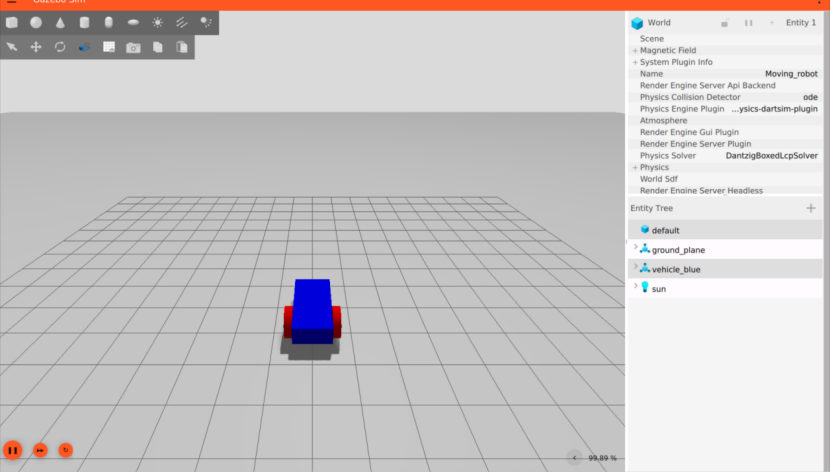

# Gazebo 示例

目标：把 Gazebo 在服务器上真实跑通一次，从安装 `gz-jetty`、无界面启动官方示例，到编写自己的最小 SDF 场景，再通过 Gazebo topic 验证物理结果，最后用 X11 转发在 Windows 桌面显示 Gazebo 图形界面。

这一页不是完整 Gazebo 安装手册，也不是 ROS-Gazebo 联调教程。它记录的是一条已经跑通的最小验证链路。跑完以后，读者至少能确认四件事：Gazebo 命令可用，server-only 仿真能运行，自己写的 SDF world 能被加载，GUI 可以通过远程显示在本地电脑上打开。

本次实测使用的是新版 Gazebo 的命令行工具，也就是 `gz sim` 这一套。

## 创建 Gazebo 环境

创建 Gazebo 专用环境，并安装 Gazebo Jetty：

```bash
conda create -n gazebo -c conda-forge gz-jetty -y
conda activate gazebo
```

这里直接把 `gz-jetty` 装进独立 conda 环境。这样做的好处是环境边界清楚，不会和已有 ROS、Python 或其他仿真器环境混在一起。

## 无界面启动官方示例

先不要急着写自己的 world。第一步只验证 `gz sim` 能启动，并且 server-only 模式可以运行官方示例：

```bash
gz sim -s -r shapes.sdf
```

这里几个参数的含义是：

| 参数 | 含义 |
|---|---|
| `gz sim` | 启动新版 Gazebo Sim |
| `-s` | 只启动 server，不打开 GUI |
| `-r` | 启动后直接运行仿真，不停在暂停状态 |
| `shapes.sdf` | Gazebo 自带的简单示例 world |

服务器没有图形桌面时，先用 `-s` 很重要。这样可以把“Gazebo 后端能不能跑”和“GUI 能不能显示”分开排查。

## 创建自己的最小场景

接下来写一个最小 SDF world。这个 world 只有三个核心元素：物理设置、地面和一个从空中落下的方块。

```bash
mkdir -p ~/gazebo_tutorial
cd ~/gazebo_tutorial

cat > minimal_world.sdf <<'EOF'
<?xml version="1.0" ?>
<sdf version="1.10">
  <world name="minimal_world">
    <physics name="default_physics" type="ignored">
      <max_step_size>0.001</max_step_size>
      <real_time_factor>1.0</real_time_factor>
    </physics>

    <gravity>0 0 -9.8</gravity>

    <light type="directional" name="sun">
      <pose>0 0 10 0 0 0</pose>
      <direction>-0.5 0.1 -0.9</direction>
    </light>

    <model name="ground_plane">
      <static>true</static>
      <link name="link">
        <collision name="collision">
          <geometry>
            <plane>
              <normal>0 0 1</normal>
              <size>20 20</size>
            </plane>
          </geometry>
        </collision>
        <visual name="visual">
          <geometry>
            <plane>
              <normal>0 0 1</normal>
              <size>20 20</size>
            </plane>
          </geometry>
        </visual>
      </link>
    </model>

    <model name="falling_box">
      <pose>0 0 2 0 0 0</pose>
      <link name="link">
        <inertial>
          <mass>1.0</mass>
          <inertia>
            <ixx>0.1667</ixx>
            <ixy>0.0</ixy>
            <ixz>0.0</ixz>
            <iyy>0.1667</iyy>
            <iyz>0.0</iyz>
            <izz>0.1667</izz>
          </inertia>
        </inertial>
        <collision name="collision">
          <geometry>
            <box>
              <size>1 1 1</size>
            </box>
          </geometry>
        </collision>
        <visual name="visual">
          <geometry>
            <box>
              <size>1 1 1</size>
            </box>
          </geometry>
        </visual>
      </link>
    </model>
  </world>
</sdf>
EOF
```

这里故意不用复杂模型。`ground_plane` 是静态地面，`falling_box` 初始位置在 `z=2`，盒子尺寸是 `1 x 1 x 1`。如果物理仿真正常，方块会在重力作用下落到地面上，最终中心高度应该接近 `z=0.5`。

## 运行自定义场景

继续用 server-only 模式运行：

```bash
gz sim -v 4 -s -r minimal_world.sdf
```

`-v 4` 表示打印更详细的日志，适合第一次排查 world 是否加载成功。`-s -r` 仍然表示不打开 GUI，直接让仿真跑起来。

## 查看方块最终位置

另开一个终端，激活同一个 conda 环境，然后查看 Gazebo 发布的 pose topic：

```bash
conda activate gazebo
cd ~/gazebo_tutorial

timeout 3 gz topic -e -t /world/minimal_world/pose/info \
  | grep -A 12 'falling_box' \
  | head -n 20
```

本次服务器输出中，关键部分是：

```text
name: "falling_box"
id: 8
position {
  x: 1.1783828495102571e-19
  y: -1.6820564242058102e-19
  z: 0.49933589681147938
}
orientation {
  x: 1.6862711642138811e-19
  y: 1.1861372279134372e-19
  z: -2.4807181882467634e-21
  w: 1
}
```

这个输出说明方块最后停在了地面上。因为方块高度是 1，中心点落到地面后应该接近 `z=0.5`；实际输出 `z=0.4993...`，和预期一致。这里比只看 GUI 更可靠，因为它直接读的是 Gazebo server 发布的仿真状态。

## 配置 SSH X11 转发

前面几步都不需要图形界面。确认 server 能跑以后，再测试 GUI 远程显示。

如果本地是 Windows，可以先启动 VcXsrv 作为 X Server，用来接收服务器上的图形窗口。然后用支持 X11 转发的 SSH 连接服务器：

```bash
ssh -Y your_user@your_server_address
```

连接后进入 Gazebo 环境：

```bash
conda activate gazebo
cd ~/gazebo_tutorial
```

这里的关键点是：Gazebo GUI 运行在服务器上，但窗口通过 X11 转发显示到 Windows 桌面。第一次调试时，如果 GUI 打不开，先检查 VcXsrv 是否启动、SSH 是否使用 `-Y`、服务器环境里的 `DISPLAY` 是否存在。

## 启动带界面的 Gazebo

最后启动带 GUI 的 Gazebo：

```bash
gz sim -v 4 -r minimal_world.sdf
```

这一次不加 `-s`，所以 Gazebo 会启动图形界面。运行结果如下：

<div align="center">
<video controls width="720" src="/section/05-simulation-and-task-modeling/assets/gazebo-minimal-world-gui.mp4"></video>
</div>

如果视频没有显示，可以单独打开：[Gazebo GUI 运行结果](../../assets/gazebo-minimal-world-gui.mp4)。

这段视频验证的是 GUI 远程显示链路：服务器上的 Gazebo 可以加载同一个 `minimal_world.sdf`，并通过 X11 转发在本地 Windows 桌面显示出来。它和前面的 topic 验证配合起来看，才算比较完整：一个证明 server 物理状态正确，一个证明 GUI 显示链路可用。

## 下载官方移动机器人场景

前面的 `minimal_world.sdf` 只验证了 Gazebo 的物理和 GUI。接下来再跑一个官方移动机器人示例，用来验证 Gazebo 中的控制插件和 topic 命令链路。

```bash
curl -L \
  https://raw.githubusercontent.com/gazebosim/docs/master/jetty/tutorials/moving_robot/moving_robot.sdf \
  -o moving_robot.sdf
```

这条命令会从 Gazebo 文档仓库下载官方 `moving_robot.sdf`。这个文件里已经写好了一个简单移动机器人、地面、光照和用于接收速度命令的插件配置。

## 启动移动机器人场景

下载完成后启动场景：

```bash
gz sim -v 4 -r moving_robot.sdf
```

这一次直接打开 GUI。正常情况下，可以看到一个蓝色车体、红色轮子的移动机器人：



## 让机器人直线前进

另开一个终端，进入同一个 Gazebo 环境，然后向 `/cmd_vel` 发送一条速度命令：

```bash
gz topic -t /cmd_vel \
  -m gz.msgs.Twist \
  -p 'linear: {x: 0.5}, angular: {z: 0.0}'
```

这条命令的含义是：线速度 `x=0.5`，角速度 `z=0.0`，也就是让机器人直线前进、不转弯。运行结果如下：

<div align="center">
<video controls width="720" src="/section/05-simulation-and-task-modeling/assets/gazebo-moving-robot-forward.mp4?v=result1"></video>
</div>

这个实验验证的是 Gazebo 的另一条链路：world 中的移动机器人插件正在监听 `/cmd_vel`，而 `gz topic` 发出的 `gz.msgs.Twist` 能被插件接收并转成机器人运动。它还没有接 ROS 2，但已经非常接近后面 `ros_gz bridge` 要做的事情。

## 这条链路验证了什么

| 验证项 | 对应步骤 | 说明 |
|---|---|---|
| Gazebo 命令可用 | `gz sim -s -r shapes.sdf` | 先验证官方示例能在 server-only 模式运行 |
| 自定义 SDF 可加载 | `minimal_world.sdf` | world、physics、light、ground、box 都被 Gazebo 解析 |
| 物理仿真正常 | `/world/minimal_world/pose/info` | 方块最终中心高度接近 `z=0.5` |
| GUI 远程显示可用 | VcXsrv + `ssh -Y` + `gz sim` | Gazebo 图形界面能显示到 Windows 桌面 |
| 官方移动机器人可运行 | `moving_robot.sdf` | 官方示例 world 可以加载，移动机器人能显示在 GUI 中 |
| topic 命令可控制机器人 | `gz topic -t /cmd_vel ...` | `gz.msgs.Twist` 命令能让机器人直线前进 |

这条路线还没有接 ROS 2、传感器和 Nav2，但已经覆盖了 Gazebo 入门最关键的几层：server-only 运行、自定义 SDF world、topic 状态检查、GUI 远程显示，以及通过 `/cmd_vel` 控制一个官方移动机器人。先把这些跑通，再继续接 robot model、sensor、ros_gz bridge 和导航栈，会更容易排查问题。

## 导航

- 上一页：[Gazebo 学习路线](09-learning-path.md)
- 返回：[Gazebo](../04-gazebo.md)
- 下一页：[Drake](../05-drake.md)

## 进一步阅读可以看：

- [Gazebo documentation](https://gazebosim.org/docs/latest/)
- [SDF worlds](https://gazebosim.org/docs/latest/sdf_worlds/)
- [Gazebo Transport tutorials](https://gazebosim.org/docs/latest/transport/)