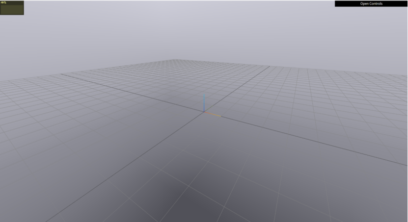
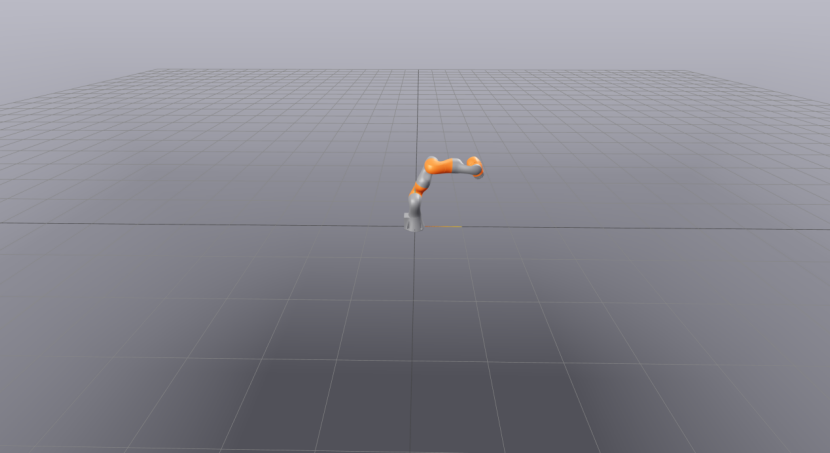
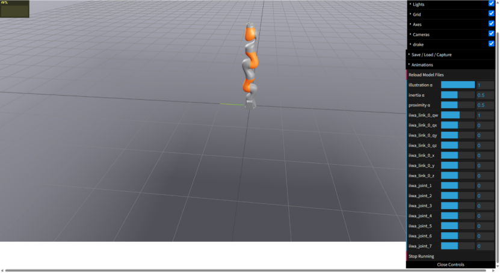

# Drake 示例

目标：把 Drake 在服务器上真实跑通一次，从安装 `pydrake`、运行无图形界面的最小仿真，到加载多体模型、启动 Meshcat、录制单摆动画，再到加载 KUKA iiwa 机械臂并生成关节运动可视化。

这一页不是 Drake 的完整安装手册，也不是所有 API 的速查表。它记录的是一条已经在服务器上跑通的最小验证链路。跑完以后，读者至少能确认五件事：`pydrake` 安装成功，Systems Framework 能仿真，MultibodyPlant 能加载模型，Meshcat 能通过端口转发在本地浏览器打开，机械臂模型能被加载和可视化。

本次实测使用：

| 项目 | 本次记录 |
|---|---|
| Python | 3.12 |
| Drake | `drake==1.54.0` |
| 运行方式 | 服务器 conda 环境 |
| 可视化 | Meshcat，默认监听服务器本机 `localhost:7000` |
| 本地查看 | 通过 SSH 端口转发打开 `http://localhost:7000` |

## 创建 Drake 环境：

```bash
conda create -n drake python=3.12 -y
conda activate drake
```

这里建议单独建环境。Drake 的 Python wheel、依赖库、可视化和求解器版本都比较重，不建议直接装到已有项目环境里。

## 安装 Drake

本次实测安装的是 `drake==1.54.0`：

```bash
python -m pip install --no-cache-dir "drake==1.54.0"
```

安装完成后，可以先建一个工作目录：

```bash
mkdir -p drake_workspace/examples
cd drake_workspace/examples
```

后面的脚本都放在这个目录里，方便统一管理。

## 运行一个无图形界面的最小仿真

先不要急着加载机器人模型。第一步只验证 Drake 的 Systems Framework 和 Simulator 能不能运行。下面这个例子创建一个一维积分器：

```text
dx/dt = u
x(0) = 1
u = 2
```

运行 1 秒以后，理论结果应该是 `x(1) = 1 + 2 * 1 = 3`。

```bash
cat > test_simulation.py <<'PY'
from pydrake.systems.analysis import Simulator
from pydrake.systems.primitives import Integrator

system = Integrator(1)
context = system.CreateDefaultContext()
context.SetContinuousState([1.0])

system.get_input_port().FixValue(context, [2.0])

simulator = Simulator(system, context)
simulator.Initialize()
simulator.AdvanceTo(1.0)

final_state = simulator.get_context().get_continuous_state_vector().CopyToVector()
print("Simulation completed successfully.")
print("Final simulation time:", simulator.get_context().get_time())
print("Final state:", final_state)
PY

python test_simulation.py
```

本次服务器输出为：

```text
Simulation completed successfully.
Final simulation time: 1.0
Final state: [3.]
```

这个例子很小，但它很重要。它证明 Drake 的系统、context、input port 和 simulator 都可以正常工作。

## 测试 MultibodyPlant 加载模型

第二步再进入机器人动力学。这里加载 Drake 自带的单摆 URDF，用 MultibodyPlant 运行 1 秒仿真：

```bash
cat > test_multibody.py <<'PY'
from pydrake.all import (
    AddMultibodyPlantSceneGraph,
    DiagramBuilder,
    FindResourceOrThrow,
    Parser,
    Simulator,
)

builder = DiagramBuilder()
plant, scene_graph = AddMultibodyPlantSceneGraph(
    builder,
    time_step=0.001,
)

model_file = FindResourceOrThrow(
    "drake/examples/pendulum/Pendulum.urdf"
)
model_instance = Parser(plant).AddModels(model_file)[0]

plant.Finalize()

diagram = builder.Build()
context = diagram.CreateDefaultContext()
plant_context = plant.GetMyMutableContextFromRoot(context)

plant.SetPositions(
    plant_context,
    model_instance,
    [1.0],
)

plant.get_actuation_input_port(model_instance).FixValue(
    plant_context,
    [0.0],
)

print("Model file:", model_file)
print("Number of bodies:", plant.num_bodies())
print("Number of positions:", plant.num_positions())
print("Initial position:", plant.GetPositions(
    plant_context,
    model_instance,
))

simulator = Simulator(diagram, context)
simulator.Initialize()
simulator.AdvanceTo(1.0)

print("Final simulation time:", simulator.get_context().get_time())
print("Final position:", plant.GetPositions(
    plant_context,
    model_instance,
))
print("Multibody simulation completed successfully.")
PY

python test_multibody.py
```

本次服务器输出中，结果是：

```text
Model file: /path/to/miniforge3/envs/drake/.../share/drake/examples/pendulum/Pendulum.urdf
Number of bodies: 4
Number of positions: 1
Initial position: [1.]
Final simulation time: 1.0
Final position: [-0.43981506]
Multibody simulation completed successfully.
```

这里验证的是另一层能力：Drake 不只是能跑一个抽象系统，还能通过 `Parser` 加载 URDF，用 `MultibodyPlant` 表示多体系统，并通过 `Simulator` 推进动力学状态。

## 启动 Meshcat 可视化服务器

服务器上通常没有图形桌面，所以 Drake 的可视化更适合用 Meshcat。先测试 Meshcat 能否启动：

```bash
cat > test_meshcat.py <<'PY'
from pydrake.geometry import StartMeshcat

meshcat = StartMeshcat()
print("Meshcat started successfully.")
print("Meshcat URL:", meshcat.web_url())
print("请暂时保持这个程序运行，不要按 Ctrl+C。")
input("按 Enter 可关闭 Meshcat...\n")
PY

python test_meshcat.py
```

服务器输出类似：

```text
INFO:drake:Meshcat listening for connections at http://localhost:7000
Meshcat started successfully.
Meshcat URL: http://localhost:7000
```

这里的 `localhost:7000` 是服务器自己的本地地址，不是你 Windows 电脑的本地地址。要在自己的电脑浏览器里看，需要重新打开一个 PowerShell 或 CMD 窗口，做 SSH 端口转发：

```bash
ssh -L 7000:localhost:7000 your_user@your_server_address
```

然后在 Windows 浏览器中打开：

```text
http://localhost:7000
```

如果端口转发成功，浏览器里会先看到 Meshcat 的空场景和网格地面，类似下面这样：



## 在 Meshcat 中运行单摆仿真

下面把单摆模型、MultibodyPlant、SceneGraph 和 MeshcatVisualizer 串起来。这样就不只是命令行输出数值，而是可以在浏览器中看到单摆运动。

```bash
cat > visualize_pendulum.py <<'PY'
from pydrake.all import (
    AddMultibodyPlantSceneGraph,
    DiagramBuilder,
    FindResourceOrThrow,
    MeshcatVisualizer,
    Parser,
    Simulator,
    StartMeshcat,
)

meshcat = StartMeshcat()
builder = DiagramBuilder()

plant, scene_graph = AddMultibodyPlantSceneGraph(
    builder,
    time_step=0.001,
)

model_file = FindResourceOrThrow(
    "drake/examples/pendulum/Pendulum.urdf"
)
model_instance = Parser(plant).AddModels(model_file)[0]
plant.Finalize()

MeshcatVisualizer.AddToBuilder(
    builder,
    scene_graph,
    meshcat,
)

diagram = builder.Build()
context = diagram.CreateDefaultContext()
plant_context = plant.GetMyMutableContextFromRoot(context)

plant.SetPositions(
    plant_context,
    model_instance,
    [1.0],
)
plant.get_actuation_input_port(model_instance).FixValue(
    plant_context,
    [0.0],
)

simulator = Simulator(diagram, context)
simulator.set_target_realtime_rate(1.0)
simulator.Initialize()

print("Meshcat URL:", meshcat.web_url())
print("开始运行 10 秒单摆仿真……")
simulator.AdvanceTo(10.0)

final_position = plant.GetPositions(
    plant_context,
    model_instance,
)
print("仿真完成。")
print("Final position:", final_position)
print("请保持程序运行，以便继续查看 Meshcat。")
input("按 Enter 关闭程序...\n")
PY

python visualize_pendulum.py
```

本次输出中可以看到：

```text
Meshcat URL: http://localhost:7000
开始运行 10 秒单摆仿真……
仿真完成。
Final position: [0.11889369]
```

如果这一步运行正常，浏览器中的 Meshcat 会出现单摆模型，并能看到它完成 10 秒仿真。

## 录制并反复播放单摆动画

MeshcatVisualizer 还可以录制动画。下面脚本会运行 10 秒单摆仿真，然后把 recording 发布到 Meshcat 页面底部的播放控制条里：

```bash
cat > record_pendulum.py <<'PY'
from pydrake.all import (
    AddMultibodyPlantSceneGraph,
    DiagramBuilder,
    FindResourceOrThrow,
    MeshcatVisualizer,
    Parser,
    Simulator,
    StartMeshcat,
)

meshcat = StartMeshcat()
builder = DiagramBuilder()

plant, scene_graph = AddMultibodyPlantSceneGraph(
    builder,
    time_step=0.001,
)

model_file = FindResourceOrThrow(
    "drake/examples/pendulum/Pendulum.urdf"
)
model_instance = Parser(plant).AddModels(model_file)[0]
plant.Finalize()

visualizer = MeshcatVisualizer.AddToBuilder(
    builder,
    scene_graph,
    meshcat,
)

diagram = builder.Build()
context = diagram.CreateDefaultContext()
plant_context = plant.GetMyMutableContextFromRoot(context)

plant.SetPositions(
    plant_context,
    model_instance,
    [1.0],
)
plant.get_actuation_input_port(model_instance).FixValue(
    plant_context,
    [0.0],
)

simulator = Simulator(diagram, context)
simulator.set_target_realtime_rate(1.0)
simulator.Initialize()

visualizer.StartRecording()
print("Meshcat URL:", meshcat.web_url())
print("正在仿真并录制 10 秒动画……")
simulator.AdvanceTo(10.0)

visualizer.StopRecording()
visualizer.PublishRecording()

print("录制完成。")
print("请刷新浏览器并使用页面底部的播放控制条。")
input("按 Enter 关闭程序...\n")
PY

python record_pendulum.py
```

本次输出为：

```text
Meshcat URL: http://localhost:7000
正在仿真并录制 10 秒动画……
录制完成。
请刷新浏览器并使用页面底部的播放控制条。
```

<div align="center">
<iframe src="../../assets/drake-meshcat-pendulum-recording.html" width="100%" height="520" style="border: 1px solid #ddd; border-radius: 6px;"></iframe>
</div>

## 加载 KUKA iiwa 7 机械臂

前面的单摆只有 1 个位置自由度。接下来加载 Drake 模型库中的 KUKA iiwa 7 机械臂，验证复杂一些的机器人模型能否解析和显示。

```bash
cat > visualize_iiwa.py <<'PY'
from pydrake.all import (
    AddMultibodyPlantSceneGraph,
    DiagramBuilder,
    MeshcatVisualizer,
    Parser,
    RigidTransform,
    StartMeshcat,
)

meshcat = StartMeshcat()
builder = DiagramBuilder()

plant, scene_graph = AddMultibodyPlantSceneGraph(
    builder,
    time_step=0.001,
)

model_url = (
    "package://drake_models/"
    "iiwa_description/sdf/iiwa7_no_collision.sdf"
)
model_instance = Parser(plant).AddModels(
    url=model_url
)[0]

plant.WeldFrames(
    plant.world_frame(),
    plant.GetFrameByName("iiwa_link_0", model_instance),
    RigidTransform(),
)
plant.Finalize()

MeshcatVisualizer.AddToBuilder(
    builder,
    scene_graph,
    meshcat,
)

diagram = builder.Build()
context = diagram.CreateDefaultContext()
plant_context = plant.GetMyMutableContextFromRoot(context)

joint_positions = [
    0.0,
    0.4,
    0.0,
    -1.2,
    0.0,
    1.0,
    0.5,
]
plant.SetPositions(
    plant_context,
    model_instance,
    joint_positions,
)

diagram.ForcedPublish(context)

print("Meshcat URL:", meshcat.web_url())
print("Model URL:", model_url)
print("Number of positions:", plant.num_positions())
print(
    "Joint positions:",
    plant.GetPositions(plant_context, model_instance),
)
print("KUKA iiwa 7 已加载，请刷新浏览器查看。")
input("按 Enter 关闭程序...\n")
PY

python visualize_iiwa.py
```

这个脚本运行后，浏览器中的 Meshcat 会显示已经固定到底座、并设置到 `joint_positions` 姿态的 iiwa 机械臂：



也可以直接用 Drake 自带的 model visualizer 查看模型：

```bash
python -m pydrake.visualization.model_visualizer \
  package://drake_models/iiwa_description/sdf/iiwa7_no_collision.sdf
```

`model_visualizer` 和前面的脚本不是同一个界面。它会打开带控制面板的模型查看器，可以在右侧调关节角、显示或隐藏网格、坐标轴等元素。本次运行结果如下：



## 让机械臂按照预设轨迹自动运动

最后做一个简单的运动学动画。这里不做控制器和轨迹优化，只是人为给 7 个关节设置周期变化的关节角，让 Meshcat 录制和播放机械臂运动。

```bash
cat > animate_iiwa.py <<'PY'
import numpy as np
from pydrake.all import (
    AddMultibodyPlantSceneGraph,
    DiagramBuilder,
    MeshcatVisualizer,
    Parser,
    RigidTransform,
    StartMeshcat,
)

meshcat = StartMeshcat()
builder = DiagramBuilder()

plant, scene_graph = AddMultibodyPlantSceneGraph(
    builder,
    time_step=0.0,
)

model_url = (
    "package://drake_models/"
    "iiwa_description/sdf/iiwa7_no_collision.sdf"
)
model_instance = Parser(plant).AddModels(
    url=model_url
)[0]

plant.WeldFrames(
    plant.world_frame(),
    plant.GetFrameByName("iiwa_link_0", model_instance),
    RigidTransform(),
)
plant.Finalize()

visualizer = MeshcatVisualizer.AddToBuilder(
    builder,
    scene_graph,
    meshcat,
)

diagram = builder.Build()
context = diagram.CreateDefaultContext()
plant_context = plant.GetMyMutableContextFromRoot(context)

duration = 10.0
fps = 30
num_frames = int(duration * fps) + 1

visualizer.StartRecording()
print("Meshcat URL:", meshcat.web_url())
print("正在生成机械臂关节运动动画……")

for frame in range(num_frames):
    t = frame / fps
    q = np.array([
        0.5 * np.sin(0.6 * t),
        0.4 + 0.3 * np.sin(0.8 * t),
        0.4 * np.sin(0.7 * t),
        -1.2 + 0.3 * np.sin(0.9 * t),
        0.4 * np.sin(1.0 * t),
        1.0 + 0.3 * np.sin(0.8 * t),
        0.5 * np.sin(1.2 * t),
    ])
    plant.SetPositions(
        plant_context,
        model_instance,
        q,
    )
    context.SetTime(t)
    diagram.ForcedPublish(context)

visualizer.StopRecording()
visualizer.PublishRecording()

print("动画生成完成。")
print("请刷新浏览器，并使用底部控制条播放动画。")
input("按 Enter 关闭程序...\n")
PY

python animate_iiwa.py
```

本次保存的 iiwa 关节动画也是一个 Meshcat HTML 录制结果，可以直接嵌入页面查看：

<div align="center">
<iframe src="../../assets/drake-meshcat-iiwa-recording.html" width="100%" height="520" style="border: 1px solid #ddd; border-radius: 6px;"></iframe>
</div>

这里要注意：这个脚本只是“按预设关节角播放动画”，不是轨迹优化，也不是闭环控制。它适合用来验证 iiwa 模型、Meshcat 可视化、recording 和关节位置设置是否正常。

## 这条链路验证了什么

| 验证项 | 对应步骤 | 说明 |
|---|---|---|
| Python 包可用 | 安装 Drake 后 import `pydrake` | 确认环境和 wheel 正常 |
| Systems Framework 可运行 | `test_simulation.py` | 抽象系统、context、input port、Simulator 正常 |
| MultibodyPlant 可加载 URDF | `test_multibody.py` | 单摆模型、positions、actuation input、动力学仿真正常 |
| Meshcat 可访问 | `test_meshcat.py` + SSH 端口转发 | 服务器可视化能在本地浏览器打开 |
| MeshcatVisualizer 可录制 | `record_pendulum.py` | 可以发布 recording 到网页播放 |
| 复杂模型可加载 | `visualize_iiwa.py` | KUKA iiwa 7 SDF 模型可以解析和显示 |
| 关节动画可发布 | `animate_iiwa.py` | 可以手动设置 `q` 并在 Meshcat 中播放 |

这条路线覆盖了 Drake 入门最关键的几个对象：`System`、`Context`、`Simulator`、`DiagramBuilder`、`MultibodyPlant`、`Parser`、`SceneGraph`、`MeshcatVisualizer`。如果这条链路能跑通，再继续写优化、IK、轨迹规划和控制器会稳很多。

## 导航

- 上一页：[入门学习路径](08-learning-path.md)
- 返回：[Drake](../05-drake.md)
- 下一页：[NVIDIA Newton 物理引擎](../06-nvidia-newton.md)

## 进一步阅读可以看：

- [Drake Python bindings](https://drake.mit.edu/python_bindings.html)
- [Drake tutorials](https://drake.mit.edu/tutorials.html)
- [Drake Meshcat documentation](https://drake.mit.edu/pydrake/pydrake.geometry.html#pydrake.geometry.Meshcat)
- [MultibodyPlant Python API](https://drake.mit.edu/pydrake/pydrake.multibody.plant.html)
- [Robotic Manipulation](https://manipulation.csail.mit.edu/)