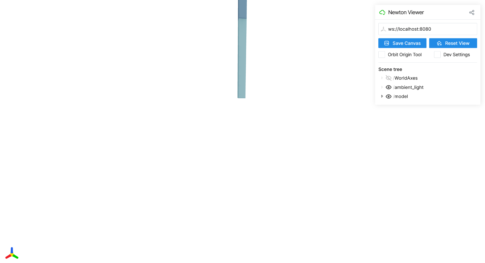
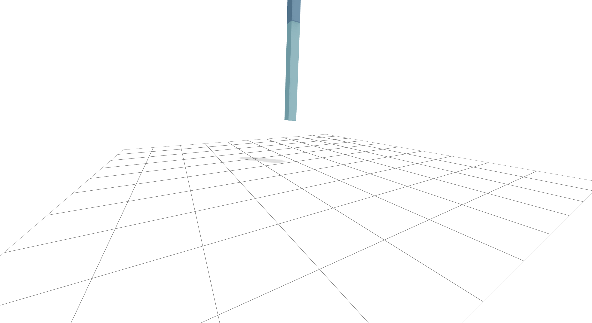
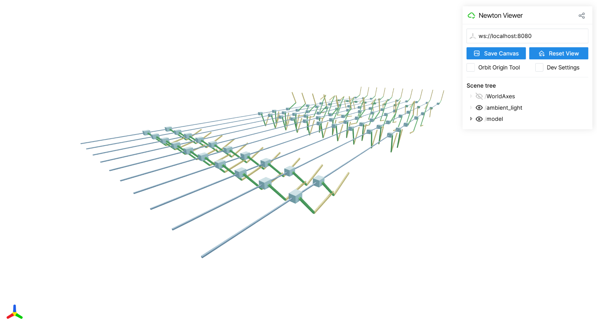
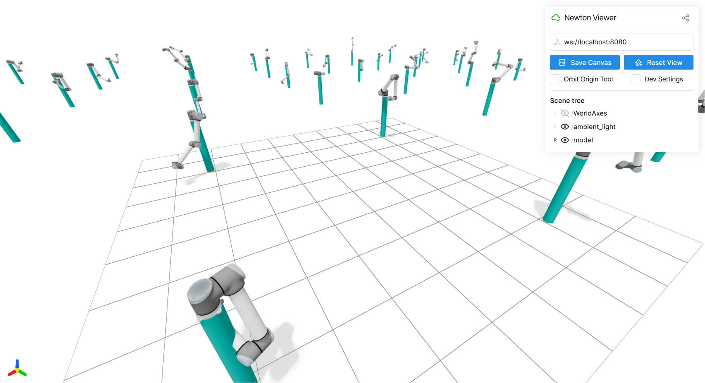

# NVIDIA Newton 物理引擎

目标：理解 Newton 在机器人仿真生态中的定位，知道它为什么出现、它和 Isaac Sim / Isaac Lab / Warp 的关系，以及它对具身智能和 VLA 训练可能带来的价值。

Newton 这一节要先把边界说清楚：它不是 Gazebo 那种完整机器人系统联调平台，也不是 Isaac Sim 那种带高保真渲染、传感器、ROS 接口和合成数据流水线的完整仿真软件。Newton 更接近一层新的物理引擎基础设施，重点是 GPU 加速、可微分物理、OpenUSD 场景标准、开源扩展和机器人接触动力学。

截至写作时，Newton 官方文档显示的版本是 Newton Physics 1.3.0。官方仓库对它的定位是：一个建立在 NVIDIA Warp 之上的 GPU 加速物理仿真引擎，面向机器人研究者和仿真研究者；它集成 MuJoCo Warp 作为主要后端，强调 GPU 计算、OpenUSD 支持、可微分能力和用户可扩展性。

## 1. 为什么机器人学习需要新的物理引擎？

传统机器人仿真已经有很多工具：MuJoCo 适合控制和强化学习基准，Gazebo 适合 ROS 系统联调，Isaac Sim 适合高保真场景、传感器和合成数据，Drake 适合模型化控制、系统框图和优化。既然已经有这些工具，为什么还会出现 Newton 这样的新物理引擎？

原因不是“旧工具不能用”，而是机器人学习的需求变了。

早期很多仿真任务只需要验证一个控制器是否稳定、一个机械臂轨迹是否能跑、一个小车导航栈是否能接上 ROS topic。现在具身智能和机器人基础模型的训练更关心下面几件事：

| 新需求 | 对物理引擎的要求 |
|---|---|
| 大规模采样 | 能在 GPU 上并行跑很多环境，而不是一个环境慢慢 step |
| 接触丰富操作 | 能处理手、夹爪、物体、桌面、工具之间复杂接触 |
| 可微分优化 | 仿真过程不只是黑盒 rollout，还能为学习和优化提供梯度 |
| 复杂材料和形变 | 不只模拟刚体，还要处理线缆、布料、软体、颗粒等对象 |
| 资产和场景互通 | 能和 USD、URDF、MJCF 等机器人和图形生态连接 |
| 研究可扩展性 | 研究者能改 solver、换模型、检查接触和状态，而不是只能调几个参数 |

以机械臂抓取为例，如果只是演示“夹爪靠近杯子”，很多工具都能做。但如果要训练一个策略，让它在不同物体、不同摩擦、不同初始姿态、不同夹爪控制误差下反复试错，就会遇到更具体的问题：

```text
策略需要大量 rollout
  -> 仿真必须足够快

抓取成败取决于接触
  -> 物理接触不能太粗糙

想校准仿真参数
  -> 最好能优化质量、摩擦、阻尼等参数

想接 VLA / RL / IL 训练
  -> 仿真数据要能进入机器学习流水线
```

Newton 试图解决的就是这类问题。它不是把现有仿真器重新包装一遍，而是把机器人学习需要的 GPU 并行、可微分、可扩展和现代场景标准放到物理引擎层来考虑。

## 2. Newton 是什么？

Newton 是一个开源的 GPU 加速物理仿真引擎。更具体地说，它有四个关键定位：

| 定位 | 解释 |
|---|---|
| 物理引擎 | 核心工作是推进物理状态、处理接触、约束、控制和动力学 |
| GPU 加速 | 建在 NVIDIA Warp 上，面向大规模并行仿真 |
| 可微分 | 支持可微分仿真，可用于机器学习和优化问题 |
| 面向机器人研究 | 支持 URDF、MJCF、USD 等格式，关注机器人、接触和多 solver 场景 |

它的基本概念可以这样理解：

```text
ModelBuilder
  -> 构建或导入机器人、物体、场景
  -> finalize 得到 Model

Model
  -> 保存刚体、关节、形状、质量、惯量、物理参数

State
  -> 保存当前时刻的位置、速度等动态状态

Control
  -> 保存关节目标、力、控制输入等

Contacts
  -> 保存当前碰撞和接触信息

Solver
  -> 根据状态、控制和接触推进下一步物理状态

Sensors / Viewer
  -> 读取观测、显示结果或导出数据
```

这套结构说明 Newton 不是一个只有 `env.step(action)` 的黑盒环境。它把模型、状态、接触、控制和求解器分开，方便研究者检查和替换其中的环节。

Newton 支持从多种格式导入模型和场景，包括 URDF、MJCF 和 USD。URDF 常见于 ROS 机器人模型，MJCF 常见于 MuJoCo 生态，USD 则是 Omniverse / Isaac Sim / OpenUSD 生态中的重要场景描述标准。

官方仓库里还列了很多示例类别，例如 basic、robot、cable、cloth、inverse kinematics、MPM、sensor、DiffSim、multi-physics、contacts、softbody、Kamino 等。这些类别本身就能看出 Newton 的目标：它不只想模拟一个刚体小球，也不只服务单一机械臂，而是想覆盖机器人学习里常见的接触、多物理和可微仿真问题。

## 3. Newton 在 NVIDIA 机器人生态中的位置

学习 NVIDIA 机器人生态时，容易把 Isaac Sim、Isaac Lab、Warp、PhysX、Newton 混在一起。它们确实有联系，但不是同一层东西。

可以先按层次理解：

```text
机器人应用和训练任务
  ├─ Isaac Lab：机器人学习任务、RL / IL 环境、并行训练接口
  │
  ├─ Isaac Sim：高保真场景、传感器、渲染、ROS、合成数据、测试验证
  │
  ├─ Newton：面向机器人学习的物理引擎和 solver 生态
  │
  └─ Warp：GPU kernel、可微分计算和高性能计算基础
```

Isaac Sim 是完整仿真平台。NVIDIA 官方页面把 Isaac Sim 描述为基于 Omniverse libraries 的机器人仿真、测试和合成数据生成框架。它关心的是完整虚拟世界：场景、材质、光照、传感器、机器人模型、ROS 接口、合成数据和软件在环测试。

Isaac Lab 是机器人学习框架。它更接近训练层：定义任务、reset、reward、observation、termination、domain randomization 和 policy 训练流程。它通常不负责从零写物理引擎，而是组织仿真能力给学习算法使用。

Warp 是底层计算框架。官方文档把 Warp 说成一个用于 GPU 加速仿真、机器人和机器学习的 Python framework。它能把普通 Python 函数 JIT 编译成 CPU 或 GPU kernel，并支持可微分计算，能和 PyTorch、JAX 等机器学习框架结合。

Newton 位于物理引擎层。它建立在 Warp 上，利用 Warp 的 GPU 和可微分能力，组织机器人模型、物理状态、控制输入、接触和求解器。NVIDIA Isaac Sim 页面也把 Newton 放在 realistic physics simulation 相关资源里，并说明它基于 Warp 和 OpenUSD，面向机器人，并可与 MuJoCo Playground 或 Isaac Lab 这类学习框架兼容。

所以不要把 Newton 写成 Isaac Sim 的替代品。更准确的关系是：

| 名称 | 更像哪一层 | 主要负责什么 |
|---|---|---|
| Warp | 计算底座 | GPU kernel、可微分计算、机器学习互操作 |
| Newton | 物理引擎 | 物理状态推进、接触、solver、多物理仿真 |
| Isaac Sim | 仿真平台 | 场景、渲染、传感器、ROS、合成数据、测试验证 |
| Isaac Lab | 学习框架 | RL / IL 任务、并行环境、训练和评测流程 |

一句话概括：Isaac Sim 管“虚拟世界怎么搭”，Isaac Lab 管“学习任务怎么训”，Warp 管“底层计算怎么跑”，Newton 管“物理过程怎么求解”。

## 4. Newton 的核心能力

Newton 的核心能力可以从四个方向理解：GPU 加速、可微分物理、OpenUSD 场景标准、开源与可扩展性。

### 4.1 GPU 加速

机器人学习需要大量数据。强化学习尤其明显：一个策略通常要在仿真里进行大量试错。如果每次只跑一个环境，训练周期会很长。

GPU 加速的意义不是让一个小场景“看起来更高级”，而是让大量相似的物理计算可以批量执行。比如训练一个抓取策略时，可以同时让很多机械臂在不同初始姿态、不同物体位置、不同摩擦参数下进行尝试。

可以把它理解成：

```text
传统方式：
  一个环境 -> step -> step -> step -> 收集一条轨迹

并行方式：
  很多环境 -> 同时 step -> 同时收集轨迹 -> 更快得到训练数据
```

当然，GPU 加速不等于物理一定更真实。它解决的是吞吐和规模问题。真实性还要看接触模型、质量惯量、摩擦参数、时间步长和 solver 选择。

### 4.2 可微分物理

传统仿真器通常被当成黑盒：输入状态和动作，输出下一步状态。强化学习可以靠大量采样训练策略，但如果我们想知道“某个物理参数对最终结果有什么影响”，黑盒仿真就不太方便。

可微分物理希望让仿真过程参与梯度计算。比如：

```text
控制输入 / 物理参数
  -> 仿真 rollout
  -> 得到末端误差或抓取失败 loss
  -> 反向传播梯度
  -> 更新控制输入或物理参数
```

这对系统辨识、轨迹优化、sim-to-real 参数校准、可微控制都有价值。比如真实机器人里杯子总是比仿真中更容易滑落，研究者可能想优化摩擦系数、夹爪阻尼、接触参数，让仿真轨迹更接近真实轨迹。

但这里要特别谨慎。接触、碰撞、滑移、卡住这些现象往往不是光滑连续的，梯度可能不稳定。可微分物理不是“所有机器人任务都能直接反向传播解决”，而是给学习和优化多了一条路径。

### 4.3 OpenUSD 场景标准

OpenUSD 可以理解成现代 3D 场景和资产交换标准。它不只是一个模型文件格式，而是能组织场景层级、几何、材质、变换、引用、变体和多工具协作的场景描述体系。

Newton 支持 USD 导入和导出，这一点很重要。因为 NVIDIA Omniverse、Isaac Sim 以及很多数字孪生和合成数据流程都围绕 USD 生态展开。如果物理引擎能理解 USD，就更容易和已有场景资产、机器人模型、仿真结果和可视化工具连接。

对机器人教程来说，可以把 OpenUSD 的价值理解成三点：

| 价值 | 说明 |
|---|---|
| 场景互通 | 机器人、桌面、物体、工厂环境可以在多个工具之间流转 |
| 资产复用 | Isaac Sim / Omniverse 里的资产更容易进入物理仿真链路 |
| 结果保存 | 仿真过程和结果可以导出为 USD，用于回放、检查和可视化 |

不要把 OpenUSD 误解成“渲染器”。它更像场景数据标准。渲染、传感器、物理求解、训练框架可以围绕这个标准协作。

### 4.4 开源与可扩展性

Newton 是开源项目，官方仓库采用 Apache-2.0 许可证，文档采用 CC-BY-4.0。它也是 Linux Foundation 项目，由 Disney Research、Google DeepMind 和 NVIDIA 发起。

开源对研究者很重要，因为物理引擎不是只拿来跑 demo。很多研究会关心：

| 研究需求 | 为什么需要可扩展 |
|---|---|
| 换 solver | 比较不同接触、约束、积分方法 |
| 查接触 | 分析接触点、接触力、摩擦和滑移 |
| 改物理参数 | 做系统辨识和 sim-to-real |
| 接学习框架 | 把状态、动作、梯度接到 PyTorch / JAX 训练流程 |
| 支持新模型 | 导入或扩展新的机器人、软体、线缆、布料、颗粒等对象 |

Newton 官方文档中列出了多个 solver 类型，例如 XPBD、VBD、MuJoCo、Featherstone、SemiImplicit、Kamino、ImplicitMPM、Style3D 等。初学者不需要一开始就懂每个 solver 的数学细节，但要知道 Newton 的设计不是“固定一个黑盒求解器”，而是给不同物理问题留出扩展空间。

## 5. Newton 与其他工具的区别

Newton 最容易被误解成“又一个仿真器”。实际上它和 MuJoCo、Drake、Gazebo、Isaac Sim 的层级不同。

| 工具 | 更适合做什么 | 和 Newton 的区别 |
|---|---|---|
| MuJoCo | 控制、强化学习、轻量动力学、MJCF 任务 | MuJoCo 更成熟轻量；Newton 集成 MuJoCo Warp，并更强调 GPU、OpenUSD、可微分和多 solver 扩展 |
| Drake | 模型化控制、系统框图、IK、轨迹优化、约束分析 | Drake 更像 model-based robotics toolbox；Newton 更偏物理引擎和大规模仿真 |
| Gazebo | ROS / ROS 2 系统联调、移动机器人、传感器插件 | Gazebo 更适合工程链路和 ROS topic；Newton 不主要解决 ROS 系统集成问题 |
| Isaac Sim | 高保真场景、传感器、合成数据、ROS、SIL / HIL 测试 | Isaac Sim 是完整仿真平台；Newton 是底层物理引擎能力之一 |
| Isaac Lab | 机器人学习任务、并行训练、RL / IL 环境 | Isaac Lab 是训练框架；Newton 可以作为物理层被学习框架利用 |
| Warp | GPU kernel 和可微分计算 | Warp 是底层计算框架；Newton 是建在 Warp 上的物理引擎 |

如果读者只想知道“该选哪个”，可以这样判断：

```text
我要做 ROS 2 导航联调 -> Gazebo
我要做高保真相机 / 合成数据 -> Isaac Sim
我要做机械臂 IK / 轨迹优化 / 模型控制 -> Drake
我要做经典 RL 控制 benchmark -> MuJoCo
我要做机器人学习里的 GPU 物理、复杂接触、可微仿真 -> 关注 Newton
```

这也是本节最重要的结论：Newton 不是万能替代品。它填补的是“面向机器人学习的新物理引擎层”，而不是把所有仿真软件都替换掉。

## 6. Newton 对具身智能和 VLA 的意义

具身智能和 VLA 模型关心的不只是图像和文字，还关心动作与物理世界之间的关系。一个 VLA 模型如果只看静态图像，很难真正理解“推一下会发生什么”“夹爪夹得太松会不会滑”“杯子碰到边缘会不会倒”。

Newton 对这类方向的意义，主要体现在三方面。

第一，它能提供更高吞吐的交互数据。VLA 和机器人基础模型需要大量状态、动作、结果之间的对应关系。真实机器人采集成本高，仿真不能替代真实数据，但可以用于预训练、策略筛选、失败案例生成和系统性扰动测试。

第二，它能更好地覆盖接触丰富任务。很多 VLA 任务不是“移动到目标点”这么简单，而是抓取、插入、推拉、整理、开关、拧动、堆叠。这些任务需要物理接触和动作后果。Newton 关注接触、多 solver、软体、线缆、布料和颗粒，对这类任务有潜在价值。

第三，它可能让学习算法更直接利用物理结构。可微分仿真使得一部分任务可以通过梯度优化控制输入、物理参数或中间表示。对 VLA 来说，这不一定意味着直接“反向传播训练整个大模型”，但可以用于生成更好的轨迹、校准仿真参数、优化低层控制器，或者把高层语言目标和低层物理约束更好地接起来。

不过也要说清楚：Newton 本身不是 VLA 模型，也不是数据集，也不是自动生成高质量机器人策略的完整系统。它更像底层物理能力。真正训练 VLA 还需要视觉数据、语言标注、动作空间定义、机器人控制接口、任务评测、真实数据校准和 sim-to-real 迁移。

可以这样理解它在 VLA 链路中的位置：

```text
语言目标
  -> 任务分解 / 高层规划
  -> 低层动作或控制目标
  -> Newton / Isaac Sim / 真机环境中验证物理后果
  -> 生成轨迹、失败案例、参数扰动和评测数据
  -> 反过来改进策略或模型
```

Newton 的价值不是让 VLA 直接“懂物理”，而是让训练和评测过程中有机会接入更大规模、更可控、更可分析的物理交互。

## 7. 典型使用流程：以机械臂抓取任务为例

这里用机械臂抓取任务说明 Newton 的典型流程。注意，这里讲的是工作流，不是某个固定 API 的完整代码。Newton 仍在迭代，具体函数名应该以你实际安装版本和官方示例为准。

一个机械臂抓取实验通常可以拆成下面几步。

**第一步：准备机器人和物体模型。**

机械臂可以来自 URDF 或 MJCF，场景和物体可以来自 USD 或用 Python API 构建。这里要重点检查质量、惯量、碰撞体、关节限位和坐标系。很多仿真问题不是引擎错，而是模型里的惯量、尺度或碰撞几何不合理。

**第二步：构建仿真世界。**

用 `ModelBuilder` 或导入器把机械臂、桌面、目标物体、障碍物放进同一个 world。然后 finalize 得到 `Model`。这一步相当于告诉 Newton：世界里有哪些物理对象，它们有哪些关节、碰撞体、质量和材料参数。

**第三步：设置状态和控制。**

创建初始 `State`，包括机械臂关节位置、速度、物体初始位姿等。再创建 `Control`，例如关节目标、关节力矩、夹爪开合指令等。

```text
state_t:
  robot q, qdot
  object pose, velocity
  contact-related state

control_t:
  arm joint targets / torques
  gripper command
```

**第四步：处理接触。**

抓取任务的关键就在接触。每一步仿真前，需要检测当前状态下哪些几何体发生接触，形成 `Contacts`。例如指尖和物体、物体和桌面、机械臂和障碍物之间的接触。

**第五步：选择 solver 并推进仿真。**

Newton 提供多个 solver 后端。不同 solver 适合的问题不完全一样。入门阶段不建议一开始就比较所有 solver，先选官方示例里对应任务使用的 solver，跑通后再改。

仿真循环可以理解成：

```text
for each step:
  根据当前 state 计算 contacts
  根据策略或控制器生成 control
  solver 根据 state + contacts + control 推进下一步
  读取传感器 / 观测 / 接触信息
  判断是否抓取成功、是否失败、是否需要 reset
```

**第六步：记录观测和结果。**

抓取任务通常要记录关节状态、物体位姿、夹爪命令、接触状态、成功失败标记，必要时还要导出 USD 或用 viewer 回放。对于 VLA 或模仿学习来说，还可能需要把语言目标、图像观测、动作序列和成功状态对齐保存。

**第七步：接入学习或优化。**

如果只是做验证，可以人工写控制器或轨迹。如果要做机器人学习，就需要把 Newton 的状态和动作接入训练框架。比如把多个初始状态并行跑起来，用策略网络输出动作，再根据抓取成功、碰撞、物体位移、夹爪接触等指标计算 reward 或 loss。

这一套流程和其他仿真器很像，但 Newton 的重点在于：物理层更强调 GPU 并行、接触、多 solver 和可微分能力。

## 8. 服务器实跑记录：Newton 1.3.0 最小验证流程

前面讲的是 Newton 的定位和概念。这里补一个真实服务器上的最小验证流程，目的是确认三件事：Newton 能正常安装，Warp 能识别 CUDA GPU，无界面和浏览器可视化两种运行方式都能跑通。

本次环境可以概括为：

| 项目 | 本次记录 |
|---|---|
| Python | 3.12 |
| Newton | 1.3.0 |
| Warp | 1.15.0 |
| CUDA Toolkit | 12.9 |
| Driver | 13.0 |
| GPU | NVIDIA A100-SXM4-80GB |
| viewer | `null` 和 `viser` |

### 第 1 步：创建 Newton 专用环境

先创建一个独立 conda 环境：

```bash
conda create -n newton python=3.12 -y
conda activate newton
```

然后安装 Newton 以及官方 examples 依赖：

```bash
python -m pip install "newton[examples]==1.3.0"
```

### 第 2 步：先跑无界面物理仿真

服务器上不一定一开始就有图形界面，所以先用 `--viewer null` 跑无界面仿真。这样可以先验证 Newton、Warp、CUDA 和 solver 编译是否正常。

第一个例子用 `basic_pendulum`：

```bash
python -m newton.examples basic_pendulum \
  --viewer null \
  --device cuda:0 \
  --num-frames 300
```

这一步运行后，终端里能看到 Warp 初始化和 CUDA 设备信息。本次记录中，Warp 识别到了 `cuda:0` 上的 `NVIDIA A100-SXM4-80GB`，并开始编译或加载多个 kernel，例如 articulation、collide、narrow phase、XPBD solver 等。

第一次运行时，很多 kernel 会显示 `(compiled)`，耗时可能比较长。这是正常现象，因为 Warp 需要为当前设备编译 kernel。后面再次运行类似示例时，会看到大量模块变成 `(cached)`，加载速度明显变快。

### 第 3 步：验证碰撞和基础形状

接着跑 `basic_shapes`：

```bash
python -m newton.examples basic_shapes \
  --viewer null \
  --device cuda:0 \
  --num-frames 300
```

这个例子更偏基础几何和碰撞验证。日志里可以看到 collision、BVH、broad phase、narrow phase、contact reduction、SDF contact、XPBD solver 等模块。对初学者来说，不需要马上理解每个 kernel 的内部实现，但要知道这些日志说明 Newton 正在做几何碰撞、接触生成和 solver 推进。

### 第 4 步：验证 URDF 机器人模型

再跑一个 URDF 相关示例：

```bash
python -m newton.examples basic_urdf \
  --viewer null \
  --device cuda:0 \
  --num-frames 300
```

这一步验证的是 Newton 能否加载和推进机器人模型。日志中除了基础几何和 solver 模块，还能看到 articulation 相关模块被加载。对机器人任务来说，这一步比只跑摆锤或基础形状更接近实际使用，因为真实机械臂、移动机器人和腿足机器人通常都有 link、joint、inertial、collision 等结构。

如果这一步失败，常见排查方向包括：URDF 依赖资源路径、mesh 文件是否存在、惯量是否合理、关节定义是否完整、当前 Newton 版本是否支持对应模型特性。

### 第 5 步：安装并使用 `viser` 浏览器可视化

无界面仿真跑通后，再看浏览器可视化。先安装 `viser`：

```bash
python -m pip install viser
```

然后用 `viser` viewer 运行摆锤示例：

```bash
python -m newton.examples basic_pendulum \
  --viewer viser \
  --device cuda:0 \
  --num-frames 10000
```

如果是在远程服务器上运行，需要在本地电脑开一个 PowerShell 或 CMD，做 SSH 端口转发：

```bash
ssh -L 8080:localhost:8080 <user>@<server-ip>
```

这里的 `<user>` 和 `<server-ip>` 换成自己的服务器用户名和地址。转发成功后，在本地浏览器打开：

```text
http://localhost:8080
```

本次 `basic_pendulum` 的浏览器可视化结果如下：





这一步主要验证 viewer 链路：仿真在服务器上运行，浏览器界面通过端口转发在本地显示。它和前面的 `--viewer null` 不是重复的：前者验证计算链路，后者验证可视化链路。

### 第 6 步：运行 CartPole 控制示例

接着运行一个带机器人控制含义的示例：

```bash
python -m newton.examples robot_cartpole \
  --viewer viser \
  --device cuda:0 \
  --num-frames 10000
```

浏览器中可以看到 CartPole 系统的运动：



CartPole 虽然简单，但它很适合验证机器人学习里的几个基本环节：系统有状态，有控制输入，有动力学推进，也可以在 viewer 中观察运动结果。后面接 RL 或控制算法时，这类例子比复杂机械臂更适合作为第一步。

### 第 7 步：运行 UR10 机械臂示例

最后运行 UR10 机械臂示例：

```bash
python -m newton.examples robot_ur10 \
  --viewer viser \
  --device cuda:0 \
  --num-frames 10000
```

浏览器中的 UR10 可视化结果如下：



这个例子比 CartPole 更接近真实机器人任务。它说明 Newton 不只是能跑简单摆锤，也能加载和显示多关节机械臂模型。后面如果要做机械臂抓取、轨迹跟踪、接触操作，就可以从这种机器人示例继续往下扩展。

## 本页小结

Newton 的核心价值在于：把机器人学习需要的 GPU 并行、可微分物理、OpenUSD 场景互通、开源扩展和复杂接触仿真放到物理引擎层来处理。它适合关注大规模机器人学习、接触丰富操作、系统辨识、sim-to-real 校准和 VLA 物理交互数据生成的人。

但它不是 Gazebo、Isaac Sim、Drake 或 MuJoCo 的简单替代品。真正选工具时，要先看任务在哪一层：系统联调用 Gazebo，高保真传感器和合成数据看 Isaac Sim，模型化控制和优化看 Drake，经典控制和 RL benchmark 看 MuJoCo，而 Newton 更适合放在新一代机器人物理引擎和物理 AI 基础设施这一层理解。

## 导航

- 上一页：[Drake](05-drake.md)
- 返回：[其他仿真生态](../06-other-simulation-ecosystems.md)

## 进一步阅读可以看：

- [Newton Physics Documentation](https://newton-physics.github.io/newton/stable/)
- [Newton GitHub](https://github.com/newton-physics/newton)
- [Newton Overview](https://newton-physics.github.io/newton/stable/guide/overview.html)
- [Newton Installation](https://newton-physics.github.io/newton/stable/guide/installation.html)
- [Newton Compatibility and Support](https://newton-physics.github.io/newton/stable/guide/compatibility.html)
- [NVIDIA Warp Documentation](https://nvidia.github.io/warp/stable/)
- [NVIDIA Isaac Sim](https://developer.nvidia.com/isaac/sim)
- [OpenUSD](https://openusd.org/release/index.html)