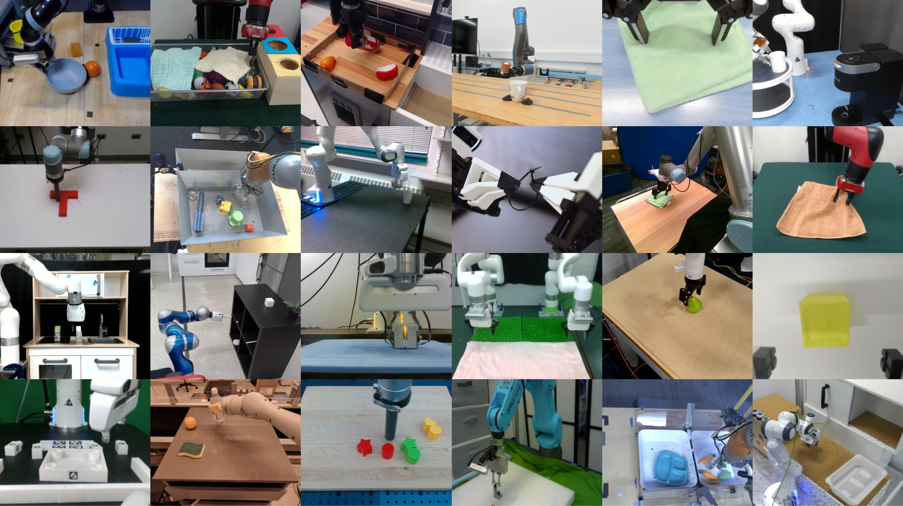

# Open X-Embodiment

目标：理解 Open X-Embodiment 的跨本体混合价值和风险，能把 RLDS 结构、action 差异和数据混合策略联系起来分析。

> 先修：[大规模真机数据集](../01-real-robot-datasets.md)
> 建议：不要先把它当成“一个可直接训练的万能数据包”，而要先把它看成一个跨实验室、跨机器人、跨任务的真实机器人经验库。
> 数据集规模：1M+ trajectories、22 robot embodiments、160,266 tasks、527 skills

前面几节已经讲过，机器人数据不是普通的视频或图片集合，而是由 episode、step、observation、action、task 和 metadata 共同构成的时间序列数据。Open X-Embodiment 正好给了一个真实例子：它不是某个实验室用同一种机器人从头采出来的数据集，而是把许多已有真实机器人数据集汇聚起来，整理成更容易读取和训练的格式。

如果用一句话概括，Open X-Embodiment 解决的是这样一个问题：**机器人学习能不能像视觉和语言模型一样，从很多来源的数据中预训练出更通用的能力，而不是每换一个机器人、一个场景、一个任务都重新从零训练？**

这个数据集包含 1M+ 真实机器人轨迹，覆盖 22 种机器人本体，从单臂机械臂到双臂机器人、四足机器人都有涉及。官方页给出的口径是：数据由 60 个已有机器人数据集汇聚而成，来自 34 个机器人研究实验室，并整理出 527 种技能和 160266 个任务说明。

<figure class="doc-figure" aria-label="Open X-Embodiment 官方示意图">
  <p class="doc-figure-title">Open X-Embodiment：跨机器人数据汇聚</p>
  
</figure>

## 阅读目标

读完这一页，可以用下面几个问题检查自己是否读懂：

1. Open X-Embodiment 到底是一个数据集、一个仓库，还是一个训练方案。
2. 为什么它的核心价值不只是“数据量大”，而是“跨机器人本体、跨任务、跨来源”。
3. 它的数据可以从哪些角度拆开理解：机器人本体、任务技能、数据模态、来源数据集、训练用途。
4. 为什么 RLDS 统一了 episode/step 结构，但没有真正消除 action 语义差异。
5. 为什么同样是 `action`，在不同机器人上可能代表完全不同的运动。
6. 如果想把它用于训练、筛选、转换或阅读材料，应该先检查哪些信息。

## 为什么会有 Open X-Embodiment

在传统机器人学习里，一个常见做法是：针对某个机器人、某个任务、某个环境单独采数据，然后单独训练一个策略。例如，用一台 Franka 机械臂在一个桌面环境中学习“把苹果放进碗里”，采集的数据、动作空间、相机位置和任务定义都围绕这一台机器人设计。

这种方式适合做小规模实验，但有两个明显问题。

第一，数据太窄。一个实验室的数据通常只覆盖有限的物体、场景和任务。如果模型只见过一种桌面、一种相机视角、一种机械臂，它很难自然泛化到别的机器人或别的实验室。

第二，机器人数据采集成本很高。和互联网图文数据不同，真实机器人数据需要硬件、场地、人工遥操作、设备维护和安全检查。每个实验室单独采一份“小而窄”的数据，长期看效率很低。

Open X-Embodiment 的出发点就是把很多已有机器人数据集合在一起，使研究者可以研究 **X-embodiment learning**，也就是跨机器人本体的学习。它背后的基本判断是：单个机器人数据集往往太窄，而多个机器人、多个实验室、多个环境的数据联合起来，可以更好地覆盖机器人学习需要的变化来源。

这里的 “X” 可以理解成“跨越很多差异”：

```text
跨机器人：Franka、xArm、Google Robot、WidowX、UR5 等不同平台
跨任务：抓取、放置、推拉、开合、整理、擦拭、组装等不同技能
跨场景：不同实验室、不同桌面、不同物体、不同相机布置
跨数据来源：60 个已有数据集，而不是单一采集流程
跨训练目的：可以用于通用策略、VLA、数据混合、跨本体迁移等研究
```

所以，Open X-Embodiment 的重要性不在于它替你解决了所有机器人学习问题，而在于它把“多机器人数据能不能共同训练”这个问题变成了可以系统研究的问题。

## 先区分三个名字：OXE、Open X-Embodiment Repository、RT-X

初学者第一次读这个项目时，容易把几个名字混在一起。

**Open X-Embodiment Dataset** 指的是数据本身。它由多个已有机器人数据集汇聚而成，包含真实机器人轨迹，核心用途是支撑跨机器人、跨任务的策略学习研究。

**Open X-Embodiment Repository** 更像一个开放仓库或生态。它不只包含数据，还包含数据格式、工具、预训练 checkpoint 和使用示例。这个 repository 面向 X-embodiment robot learning，除数据外还包含使用数据所需的配套资源。

**RT-X** 是在这些跨本体数据上训练或评估的模型系列。项目中讨论了 RT-1-X 和 RT-2-X：前者基于 RT-1 机器人策略架构，后者基于 RT-2 这类视觉-语言模型并把动作表示成 token。换句话说，OXE 是数据基础，RT-X 是用这些数据训练出的模型示例，不要把两者混为一谈。

## 它到底收集了什么

<figure class="doc-figure" aria-label="Open X-Embodiment 官方数据集概览图">
  <p class="doc-figure-title">Open X-Embodiment 官方数据集概览</p>
  
</figure>


### 1M+ 真实机器人轨迹：不是视频片段，而是可训练的行为记录

这里的轨迹不是普通视频。对机器人学习来说，一条 trajectory 通常对应一条 episode，也就是一次任务执行过程。它不仅包含机器人看到的图像，还包含动作、状态、任务文本和 episode 边界。

普通视频只能告诉你“发生了什么”，但机器人轨迹还告诉你“机器人在每一步做了什么”。这正是它能用于模仿学习和 VLA 训练的原因。

一个简化的 episode 可以这样理解：

```text
episode_000123
  step_000:
    observation:
      image: 当前相机画面
      state: 机器人关节、末端或夹爪状态，具体取决于源数据集
    language_instruction: "put the red block into the bowl"
    action: 当前要执行的机器人动作
    is_first: true
    is_last: false

  step_001:
    observation:
      image: 下一帧画面
      state: 下一帧机器人状态
    language_instruction: "put the red block into the bowl"
    action: 下一步动作
    is_first: false
    is_last: false

  ...

  step_T:
    observation: 结束时刻的观测
    action: 可能有效，也可能需要在训练时处理
    is_last: true
```

这和前面 RLDS 小节讲的结构一致：真正关键的是 episode 和 step 边界，而不只是文件能不能打开。

### 22 种机器人本体：Open X 的核心难点

Open X-Embodiment 覆盖 22 种机器人本体，跨越单臂机械臂、双臂机器人和四足机器人等形态。这个数字的含义不只是“机器人很多”，而是说明它本质上是一个由多种机器人共同组成的数据混合体。

可以把其中的机器人粗略分成几类：

| 机器人类型 | 直观理解 | 对数据使用的影响 |
|---|---|---|
| 单臂桌面机械臂 | 例如常见的 6/7 自由度机械臂加夹爪 | 适合桌面抓取、放置、推拉等任务 |
| 移动操作平台 | 带底盘、机械臂和工作空间相机 | action 可能同时涉及底盘和手臂，和纯机械臂差异更大 |
| 双臂机器人 | 两只机械臂协作完成任务 | 动作维度、左右臂同步和任务时序更复杂 |
| 四足或其他形态 | 本体结构与桌面机械臂差异明显 | 不适合简单假设为同一个 end-effector action |

这也解释了为什么“跨本体”不是一个漂亮的宣传词，而是一个真正的技术难点。同样的任务指令“move the object to the tray”，对不同机器人来说，底层动作可能完全不同。

例如：

```text
Robot A：action = [Δx, Δy, Δz, Δroll, Δpitch, Δyaw, gripper]
Robot B：action = [joint_1, joint_2, joint_3, joint_4, joint_5, joint_6, joint_7]
Robot C：action = [base_v, base_w, arm_action..., gripper]
```

它们在数据文件里都可能叫 `action`，但语义不是一回事。这个问题是 Open X-Embodiment 的核心难点，也是它最值得研究的地方。

<figure class="doc-figure figure-compare" aria-label="不同机器人 action 的差异">
  <p class="doc-figure-title">同名 action 不等于同一种动作</p>
  <p class="doc-figure-subtitle">跨本体数据最容易误解的地方，是把字段名相同误认为动作语义相同。</p>
  <div class="compare-panels">
    <section class="compare-panel compare-urdf">
      <div class="compare-label">单臂末端控制</div>
      <p class="compare-kicker"><code>[x, y, z, roll, pitch, yaw, gripper]</code></p>
      <ul>
        <li>控制末端执行器在空间中的运动。</li>
        <li>适合很多桌面操作任务。</li>
        <li>坐标系可能是世界系、机器人基座系或夹爪系。</li>
      </ul>
    </section>
    <section class="compare-panel compare-usd">
      <div class="compare-label">关节空间控制</div>
      <p class="compare-kicker"><code>[joint_1, ..., joint_n]</code></p>
      <ul>
        <li>直接控制每个关节的位置、速度或增量。</li>
        <li>维度取决于机器人自由度。</li>
        <li>和末端空间动作不能直接互换。</li>
      </ul>
    </section>
  </div>
  <div class="compare-bridge">
    <strong>实践中</strong>
    <span>Open X/RT-X 会做粗粒度对齐，但同一个 action vector 在不同机器人上仍可能诱发不同运动。</span>
  </div>
</figure>

### 60 个已有数据集：规模来自汇聚，而不是一次统一采集

Open X-Embodiment 是把 60 个已有机器人数据集汇聚起来，而不是从零统一采集一个完全一致的数据集。这些数据来自多个机器人研究实验室。

这带来两个结果。

好的一面是：数据天然多样。不同实验室有不同机器人、相机位置、物体、场景、任务设计和遥操作方式。对于研究通用机器人策略来说，这种多样性比单一实验室数据更有价值。

难的一面是：数据天然不一致。每个源数据集可能有自己的字段命名、相机视角、动作定义、采样频率、任务文本风格和质量控制流程。Open X-Embodiment 做了统一格式整理，但统一格式不等于所有语义都完全统一。

这也是为什么读 Open X-Embodiment 时，不能只问“总共有多少条轨迹”，还要问：

```text
这条轨迹来自哪个源数据集？
使用的机器人是什么？
任务文本怎么定义？
action 是末端增量、关节命令，还是速度？
相机是前视角、腕部相机，还是多个相机？
这条数据的采集频率和成功标签是否可靠？
```

### 527 种技能与 160266 个任务：多样性主要体现在语言和行为分布上

Open X-Embodiment 覆盖 527 种技能和 160266 个任务。初学者可以先这样理解：**skill 更像行为类别，task 更像具体任务实例或语言说明。**

例如：

```text
skill: pick-place
  task: pick up the red block and put it into the bowl
  task: move the green object to the tray
  task: place the cup on the plate

skill: open / close
  task: open the drawer
  task: close the cabinet door

skill: wiping
  task: wipe the table surface
```

从任务分布看，大部分技能属于 pick-place 家族，但长尾中也包含 wiping、assembling 等技能；物体覆盖了从电器、食物到餐具等家庭物品。

这说明 Open X-Embodiment 的任务分布不是均匀的。它既有高频的常见桌面操作，也有较少出现的长尾任务。训练模型时，高频任务可能贡献主要梯度，长尾任务则可能提供泛化线索，但也更容易被大数据混合淹没。

<figure class="doc-figure" aria-label="Open X-Embodiment 官方数据分布分析图">
  <p class="doc-figure-title">Open X-Embodiment 官方数据分布分析</p>
  
</figure>

从这张官方页的分析图可以看到，Open X-Embodiment 的规模优势和分布偏差是同时存在的。它覆盖了很多机器人和任务，但轨迹数量会集中在少数机器人本体和高频操作上。因此，后面做训练或比较实验时，不能只写“使用了 Open X-Embodiment”，还要说明具体用了哪些子数据集、是否重采样、是否过滤了某些机器人或任务。

## 可以从五个角度拆开理解这个数据集

Open X-Embodiment 太大，初学者如果直接看完整数据表，很容易迷失。更好的办法是从五个角度拆开：机器人本体、任务行为、数据模态、数据来源、训练用途。

### 第一种分类：按机器人本体看

从机器人本体角度，Open X-Embodiment 的价值在于覆盖多个平台。从数据分布看，Franka 在 visually distinct scenes 数量上占比较大，xArm 和 Google Robot 则贡献了大量 trajectories。这提醒我们：本体分布并不是均匀的。

这点非常重要。很多人看到“22 种机器人”会以为每种机器人都有差不多的数据量，但实际大规模混合数据集往往存在长尾：少数机器人贡献大量轨迹，许多机器人只贡献较少数据。实际使用时还要注意：原始 OXE 的真实数据存在明显不均衡，头部机器人类型占比较高。

放到训练里看，如果不做采样权重、数据配比或本体条件建模，模型可能主要学到头部机器人的分布，而不是平均理解所有机器人。

### 第二种分类：按任务行为看

从任务行为角度，Open X-Embodiment 主要围绕 manipulation，也就是机器人操作任务。

可以粗略分成几类：

| 行为类别 | 例子 | 学习难点 |
|---|---|---|
| 抓取与放置 | pick, place, move object to container | 物体定位、夹爪闭合、放置位置 |
| 推拉与移动 | push object, move item across table | 接触动力学、轨迹连续性 |
| 开合类任务 | open drawer, close door | 关节物体、力和接触方向 |
| 整理与组合 | put object into tray, arrange items | 目标关系和多步动作 |
| 长尾技能 | wiping, assembling 等 | 数据少、动作模式更复杂 |

其中 pick-place 是主干，长尾技能是多样性的来源。读这个数据集时不要只看“有很多技能”，更要看目标任务落在哪个区域。如果你的研究任务是桌面抓取和放置，它和 Open X 的主分布比较接近；如果你的任务是复杂工具使用或长程双臂协作，就要检查相关样本是否足够。

### 第三种分类：按数据模态看

Open X-Embodiment 的数据不是每条轨迹都完全一样。不同源数据集可能有不同模态。RLDS 能容纳不同机器人设置中的输入模态差异，例如不同数量的 RGB 相机、深度相机和点云。

常见模态可以分成：

| 模态 | 在机器人学习中的作用 | 使用时要问的问题 |
|---|---|---|
| RGB 图像 | 描述当前场景和物体状态 | 是哪个相机？前视角还是腕部相机？分辨率是否统一？ |
| 机器人状态 | 描述自身关节、末端、夹爪状态 | 是 joint state 还是 end-effector pose？单位是什么？ |
| 动作 action | 监督模型输出 | 是绝对值、增量，还是速度？坐标系是什么？ |
| 语言指令 | 告诉模型当前任务 | 是否每条 episode 都有？文本风格是否一致？ |
| 深度 / 点云 | 提供 3D 结构信息 | 是否所有数据都有？训练模型是否真的使用？ |
| metadata | 记录来源、本体、任务等 | 是否保留 dataset_source、robot type、task id？ |

以 RT-1-X checkpoint 为例，模型输入主要是 workspace RGB image 和 task string；该 checkpoint 当前不使用额外相机图像、腕部相机、in-hand camera 或 depth。这不代表数据集里没有这些模态，而是说明某个模型 checkpoint 的输入选择比较简化。

**数据集有什么，和某个模型实际用了什么，不是一回事。**

### 第四种分类：按数据来源看

从来源角度，Open X-Embodiment 更像一个“数据联盟”。它不是一次采集、一个协议、一个硬件堆栈完成的，而是把多个实验室已有成果统一整理。

这带来一个数据工程上的基本事实：每条数据都应该带着来源意识去读。源数据集决定了：

```text
采集者是谁；
机器人是什么；
任务怎么定义；
相机怎么安装；
动作如何记录；
是否有成功标签；
质量过滤规则是什么；
许可和使用边界是什么。
```

这也意味着它的使用边界不能只按总项目理解。对于课程项目或后续实验，要记录实际使用了哪些子数据集、它们来自哪里、各自有什么许可和使用限制。

### 第五种分类：按训练用途看

Open X-Embodiment 可以服务不同研究问题，但每种用法关注点不同。

| 用途 | 你真正研究的问题 | 最需要注意什么 |
|---|---|---|
| 通用策略预训练 | 大规模多机器人数据能否提升泛化 | 数据配比、模型容量、action 表示 |
| VLA 训练 | 图像 + 语言如何输出动作 | 语言指令质量、动作 token 化方式 |
| 跨本体迁移 | 其他机器人经验是否能帮助目标机器人 | 目标机器人和源机器人差异 |
| 数据混合研究 | 哪些数据该混，哪些不该混 | 子数据集权重、负迁移 |
| 格式学习 | 如何用 RLDS 表达机器人数据 | episode/step、metadata、action 字段 |
| 数据筛选 | 从大集合中筛出目标任务数据 | 任务文本、物体类别、机器人类型 |

这也是为什么 Open X-Embodiment 不是“下载后直接训练就完事”的数据集。它更像一个研究平台：你要先决定问题，再决定用哪些子数据、怎么采样、怎么对齐 action、怎么评估。

## 补充：OXE-AugE 是什么

理解原始 Open X-Embodiment 后，还会看到一个名字：**OXE-AugE**。它可以理解成基于 OXE 的机器人本体增强数据集。

为什么会有 OXE-AugE？原因还是前面反复提到的本体分布不均衡。原始 OXE 虽然覆盖很多机器人，但真实轨迹并不是均匀分布的，头部机器人类型占了很大比例。这样训练出来的策略可能会过度依赖某些机器人外观、夹爪形态或相机-机器人组合，而不是真正学到更本体无关的任务结构。

OXE-AugE 做的事情，是从 OXE 中选取常用于机器人 foundation model 训练的 16 个子数据集，对其中的任务、场景和机器人演示做 robot augmentation。简单说，它希望把同一类任务扩展到更多机器人外观和夹爪组合上，让模型不要只记住某一种机械臂长什么样。

可以把两者的关系放在一起看：

| 数据 | 它是什么 | 重点 |
|---|---|---|
| Open X-Embodiment | 多实验室、多机器人真实轨迹汇聚数据集 | 把已有真实机器人数据统一到可研究的跨本体数据生态里 |
| OXE-AugE | 基于 OXE 子集做机器人本体增强的数据集 | 扩大机器人外观和本体变化，用来研究 cross-embodiment policy learning |

OXE-AugE 的几个关键口径是：

| 项目 | 口径 | 怎么理解 |
|---|---|---|
| 来源 | OXE 中 16 个常用子数据集 | 不是覆盖原始 OXE 的全部子数据集 |
| 增强本体 | 最多扩展到 9 种 robot embodiments | 包含 Franka、UR5、xArm、WidowX、Google Robot、Jaco，以及 Sawyer、Kinova Gen3、KUKA 等 |
| 数据规模 | over 4.4M trajectories | 通过增强后超过原始 OXE 轨迹数量的 3 倍 |
| 格式 | LeRobot format，约 1 TB | 更方便接入 LeRobot 生态；工具也支持导出 RLDS |
| 研究目标 | cross-embodiment policy learning | 看本体增强是否提升跨机器人泛化和鲁棒性 |

这类增强数据的意义不在于“凭空产生了新的真实遥操作轨迹”，而在于系统性改变机器人本体外观和几何条件，让模型在训练时看到更多 robot-scene 组合。它更像一种数据增强和本体扩展方法，用来研究：当同一个任务出现在不同机械臂和夹爪组合上时，策略能不能更稳地迁移。

使用时要注意三点。

第一，OXE-AugE 不是原始 OXE 的简单升级包。写实验时应该明确说明使用的是 `Open X-Embodiment`、`OXE-AugE`，还是二者的某种混合。

第二，OXE-AugE 是增强数据，不等于所有轨迹都是重新真实采集。它适合研究本体增强、视觉鲁棒性和跨机器人泛化，但不能把它和原始真机遥操作数据完全等同。

第三，格式更接近 LeRobot 并不意味着 action 语义问题自动消失。即使数据已经整理成 LeRobot format，仍然要检查每个子数据集的机器人、相机、动作空间、增强方式和训练配比。

所以，在本节里更稳妥的表述是：**Open X-Embodiment 是原始跨本体真实机器人数据生态，OXE-AugE 是后续基于 OXE 的本体增强扩展，用来研究如何通过更多机器人形态提升跨本体策略学习。**

## 数据是怎么组织的：RLDS episode/step

Open X-Embodiment 中的每个子数据集可以表示为一系列 episode，每个 episode 使用 RLDS episode format。这和前面 RLDS 小节正好接上。

RLDS 的好处是，它把轨迹边界放在数据结构里，而不是靠文件名或外部脚本猜。对机器人数据来说，这很重要，因为模型训练要知道：

```text
哪一帧是 episode 开始；
哪一帧是 episode 结束；
当前 observation 对应哪个 action；
最后一帧是否还能当监督样本；
任务文本和 step 如何对应。
```

下面以 `ucsd_kitchen_dataset_converted_externally_to_rlds` 为例，它是 Open X-Embodiment 里的一个真实子数据集。

它的 `features.json` 中记录的核心结构可以整理成下面这样：

```text
episode = {
  "episode_metadata": {
    "file_path": text
  },
  "steps": Dataset[
    {
      "observation": {
        "image": uint8[480, 640, 3],
        "state": float32[21]
      },
      "action": float32[8],
      "language_instruction": text,
      "language_embedding": float32[512],
      "reward": float32[],
      "discount": float32[],
      "is_first": bool[],
      "is_last": bool[],
      "is_terminal": bool[]
    },
    ...
  ]
}
```

它能说明 RLDS 的两个层级：外层是一条 episode，里面的 `steps` 是时间序列；每个 step 里同时有观测、动作、语言、奖励和边界标志。

这里有几个细节值得注意。

第一，`action` 是 `float32[8]`，说明它在这个转换版本中已经被整理成 8 维向量。这个 8 维向量描述末端位置、姿态、夹爪开合和 episode 终止动作。读数据时不能只看 `8` 这个数字，还要看它对应的物理含义。

第二，`observation.image` 是 `uint8[480, 640, 3]`，也就是一张 480×640 的 RGB 图像；`observation.state` 是 `float32[21]`，描述机器人关节角、关节速度和关节力矩等状态。图像和状态属于同一个 step 的观测。

第三，语言信息不只有 `language_instruction`，还有 `language_embedding: float32[512]`。这说明有些 OXE 子数据集不只是保存文本，还会保存文本 embedding，方便下游模型直接使用。

第四，`is_first`、`is_last`、`is_terminal` 决定了 episode 边界和终止语义，后面把 episode 切成训练片段时必须用到这些标志。

不同子数据集的字段仍然会变化。例如有的数据集只有主视角 RGB 图像，有的会多出腕部相机、深度、点云或不同形式的机器人状态；有的 `action` 是字典，有的转换版本已经拼成向量。Open X-Embodiment 统一的是 RLDS episode/step 外层组织，不是把所有机器人动作和观测都改成完全相同的物理语义。

<figure class="doc-figure figure-loop" aria-label="Open X-Embodiment episode 结构">
  <p class="doc-figure-title">一条 Open X-Embodiment 轨迹的基本结构</p>
  <p class="doc-figure-subtitle">RLDS 统一的是 episode/step 的外层组织，不保证所有字段语义完全相同。</p>
  <div class="figure-pipeline">
    <div class="figure-node tone-green">
      <strong>episode</strong>
      <span>一次任务执行，从开始到结束。</span>
    </div>
    <div class="figure-node tone-blue">
      <strong>step</strong>
      <span>一个时间步，含观测、动作和标志位。</span>
    </div>
    <div class="figure-node tone-gold">
      <strong>observation</strong>
      <span>图像、状态、可能的深度或其他模态。</span>
    </div>
    <div class="figure-node tone-rose">
      <strong>action</strong>
      <span>当前 step 的动作监督，语义依赖机器人和源数据。</span>
    </div>
    <div class="figure-node tone-green">
      <strong>task / metadata</strong>
      <span>语言指令、来源、本体、任务信息。</span>
    </div>
  </div>
  <div class="figure-note">统一格式解决“怎么读”，但不自动解决“动作是什么意思”。</div>
</figure>

配套工具中也提供了可视化 episode 和构造训练 batch 的示例。动手接触 Open X 的第一步不应该是直接训练，而应该是先跑可视化 notebook，看清楚一个 episode 到底长什么样。

## action 是怎么被粗粒度对齐的

Open X-Embodiment 最核心、也最容易被误解的一点，是 action 对齐。

在 RT-X 设计中，为了在跨本体数据上训练模型，会采用粗粒度对齐：模型接收最近图像历史和语言指令，预测一个 7 维 action，控制末端执行器的 x、y、z、roll、pitch、yaw 和 gripper opening，或者这些量的变化率。这个动作通常被理解为相对于机器人夹爪坐标系的 7 维向量。

看起来这像是把所有机器人动作统一成了一个标准格式，但这种对齐有几个关键限制：

- 每个数据集选择一个 canonical camera view 作为输入图像，并调整到统一分辨率。
- 原始动作会被转换成 7 DoF end-effector action。
- 每个数据集的 action 在离散化前会单独归一化。
- 但相机视角仍然差异很大。
- action 坐标系并没有跨数据集完全对齐。
- action 可以是绝对位置、相对位置或速度，取决于原始机器人控制方案。
- 因此，同一个 action vector 对不同机器人可能产生不同运动。

所以，Open X-Embodiment 的统一不是物理意义上的完全统一，而是为了训练大模型做出的可操作粗对齐。

可以这样理解：

```text
完全不对齐：
  每个机器人都有自己的 action，模型无法直接共训。

粗粒度对齐：
  尽量转成 7D 末端动作，让模型有一个共同输出接口。

真正统一：
  所有机器人坐标系、控制频率、动作单位、动力学含义都一致。
  Open X 并没有达到这一层，也很难达到。
```

这就是为什么 Open X-Embodiment 很有价值，也为什么它不能被简单使用。

## 任务文本和语言指令怎么理解

Open X-Embodiment 与 RT-X 模型紧密相关，而 RT-X 的重要特点之一是语言条件控制。以 RT-1-X checkpoint 为例，模型输入包括 workspace camera RGB image 和 task string，任务通过 task string 传递给模型。

也就是说，模型不是只看图像然后猜任务，而是同时看任务文字。例如：

```text
图像：桌上有红色方块、碗、托盘
任务："move the red block to the tray"
动作：机械臂靠近红色方块、抓取、移动、放下
```

语言指令的意义在于：同一个视觉场景下，不同任务可能要求不同动作。

```text
同一张图像里有杯子和碗：
  task A: pick up the cup
  task B: put the cup into the bowl
  task C: move the bowl to the left
```

如果没有语言条件，模型很难知道当前到底要做哪件事。

但语言指令也会带来问题。因为 Open X 来自多个源数据集，不同实验室的任务文本可能风格不同：有的写得很具体，有的比较短，有的可能是模板生成，有的可能只描述高层任务。理解这些语言文本的分布，是理解数据多样性的一个重要入口。

所以使用 Open X 时，语言文本本身也是需要审计的对象。

## 它适合研究什么

Open X-Embodiment 更适合下面几类研究，而不是“小任务快速跑通”。

### 1. 通用机器人策略

它适合研究一个大模型能否从多机器人、多任务数据中学习更通用的操作能力。RT-1-X、RT-2-X 这类跨本体模型就是围绕这个问题展开的：多机器人数据是否能带来 positive transfer。

### 2. 跨本体迁移

如果你关心“别的机器人数据能不能帮助我的机器人”，Open X 是非常重要的研究对象。它让这个问题不再停留在概念上，而是可以在多个真实机器人和真实任务上系统分析。

### 3. 数据混合配方

大规模机器人数据不是越多越好。不同数据之间可能正迁移，也可能负迁移。Open X 可以用来研究：哪些数据应该混合，哪些应该降低权重，哪些机器人之间更容易互相帮助。

### 4. VLA 模型训练

Open X 的图像、任务文本和动作结构，使它很适合视觉-语言-动作模型研究。RT-2-X 就是把动作表示到语言模型可处理空间中的一个例子。

### 5. 数据格式和数据工程学习

即使暂时不训练大模型，Open X 也很适合作为学习 RLDS、episode/step 数据结构、跨数据源 metadata 的案例。它能让你看到真实大规模机器人数据的复杂性，而不是只看玩具示例。

## 它不适合什么

理解一个数据集，也要知道它不适合什么。

Open X-Embodiment 不适合被当成“直接下载、直接训练、直接部署”的数据包。原因是：

```text
不同源数据集的动作语义不同；
不同机器人本体差异很大；
相机位置和分辨率不完全一致；
任务文本风格不统一；
数据分布严重不均衡；
部分模态只在部分数据集里存在；
每个子数据集的许可和使用要求需要分别确认。
```

它也不适合用来回答“哪个机器人数据集最好”这种问题。Open X 是一个混合数据生态，真正有意义的问题是：

```text
我想研究的能力在不在它的覆盖范围里？
我应该使用全部数据，还是筛选某些子集？
我的模型能不能处理多本体 action 差异？
我是否需要对不同源数据集设置采样权重？
训练后如何区分正迁移和负迁移？
```

## 初学者使用前的最小检查流程

如果你第一次接触 Open X-Embodiment，不建议直接从全量训练开始。可以按下面流程走。

### 第一步：选一个子数据集，而不是全量数据

先从一个你能理解的子数据集开始，比如一个桌面机械臂数据集。目标是先看懂一条 episode，而不是马上处理百万级轨迹。

你要记录：

```text
dataset_name
robot embodiment
task text 是否存在
image key 有哪些
action shape 是多少
state key 有哪些
是否有 depth / point cloud
```

### 第二步：先可视化 episode

可以先使用配套可视化工具查看一些 episode。 你至少应该看：

```text
最短 episode
最长 episode
一个典型 pick-place episode
一个失败或异常 episode，如果能找到
一个含多相机或额外模态的 episode
```

看可视化时不要只看图像是否正常，还要看：图像和动作是否同步、任务文本是否对应画面、episode 结束位置是否合理。

### 第三步：检查 action 语义

只看 `action.shape` 不够。你要确认：

```text
action 是 7D 末端动作，还是源数据原始动作？
每一维代表什么？
单位是什么？
是绝对值、增量，还是速度？
坐标系是哪个？
gripper 是 1 表示开还是关？
```

如果这些问题答不上来，不要急着训练。

### 第四步：检查任务文本

语言条件模型很依赖 task string。你要看：

```text
任务文本是否每条 episode 都有？
文本是自然语言还是模板？
同一任务是否有多种写法？
文本是否包含物体、目标位置、动作动词？
```

如果任务文本很乱，后续可能需要清洗、规范化或重新标注。

### 第五步：决定数据配比

如果你用多个子数据集训练，要记录采样策略：

```yaml
data_mixture:
  bridge: 0.30
  rt1: 0.30
  berkeley_autolab_ur5: 0.10
  other: 0.30
sampling_rule: "temperature-based over datasets"
notes: "downweight very large datasets to avoid domination"
```

这里的数字只是示意。重点是：你不能默认所有数据均匀采样就是合理的。

### 第六步：保留来源字段

无论你转成 LeRobot、RLDS 还是自己的格式，都应该保留：

```text
dataset_source
robot_type
original_action_space
camera_names
task_text
license / citation
conversion_script_version
```

这些字段在后续分析正迁移、负迁移和错误案例时非常重要。

## 常见误解

**误解一：Open X-Embodiment 已经把所有机器人动作统一好了。**
  它做了统一格式和粗粒度 action 对齐，但不是物理语义完全统一。相机观察仍然有很大差异，action 坐标系也没有跨数据集完全对齐，同一个 action vector 在不同机器人上可能产生不同运动。

**误解二：数据越多，模型一定越好。**
  大规模数据可能带来正迁移，也可能带来负迁移。Open X 的意义是让这种问题可以研究，而不是保证所有数据混在一起必然提升。

**误解三：RLDS 解决了所有数据问题。**
  RLDS 解决的是 episode/step 组织和数据读取问题，不自动解决机器人本体、动作单位、坐标系和任务语义问题。

**误解四：Open X 和 RT-X 是同一个东西。**
  Open X-Embodiment 是数据和仓库；RT-X 是用这些数据训练出的模型系列。阅读相关工作时要分清数据贡献和模型贡献。

**误解五：只需要知道总数据集名称。**
  如果使用联合数据集中的具体子数据集，还要记录对应子数据集的来源、机器人类型、任务范围和使用要求。

**误解六：OXE-AugE 就是 Open X-Embodiment 的新版。**
  不准确。OXE-AugE 是基于 OXE 子集做机器人本体增强的后续扩展，用来研究 cross-embodiment policy learning。它不是原始 OXE 的替代版本，也不能和原始真实轨迹数据直接混为一谈。


## 小结

Open X-Embodiment 是一个跨机器人、跨任务、跨来源的大规模真实机器人数据集合。它的价值不只是“有很多数据”，而是把多个实验室、多个机器人和多种任务汇聚到统一数据生态中，使研究者可以系统研究跨本体机器人学习。

读这个数据集时，最重要的不是背数字，而是理解它的层次：它由多个源数据集组成，每个源数据集有自己的机器人、相机、动作语义、任务文本和采集流程。RLDS 让这些数据能被统一读取，但不会自动消除本体差异。RT-X 的实验说明跨本体数据可能带来正迁移，但这依赖模型容量、数据配比和 action 对齐方式。

所以，Open X-Embodiment 最适合被看作一个研究平台：它让我们能够研究通用机器人策略、VLA 模型、数据混合配方和跨本体迁移；OXE-AugE 这类后续扩展则进一步把问题推进到“如何通过机器人本体增强提升泛化”。但实际使用这些数据时，仍然必须从子数据集、episode、action、task、metadata 和增强方式一层层审计清楚。

进一步阅读可以看：
- [Open X-Embodiment / RT-X 主页](https://robotics-transformer-x.github.io/)
- [Open X-Embodiment 代码仓库](https://github.com/google-deepmind/open_x_embodiment)
- [Open X-Embodiment paper](https://arxiv.org/abs/2310.08864)
- [OXE-AugE](https://oxe-auge.github.io/)
