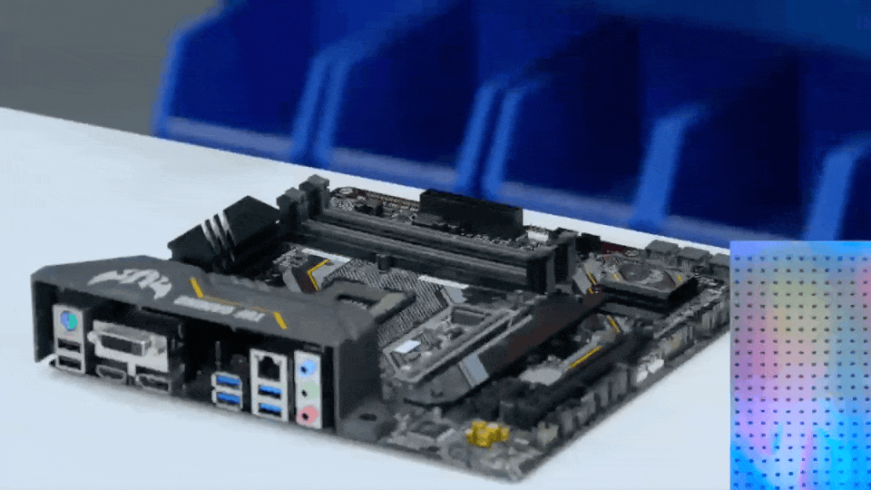
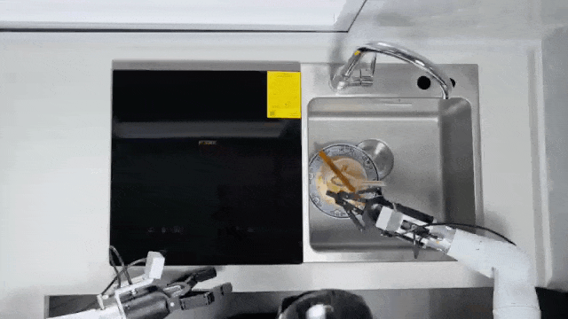
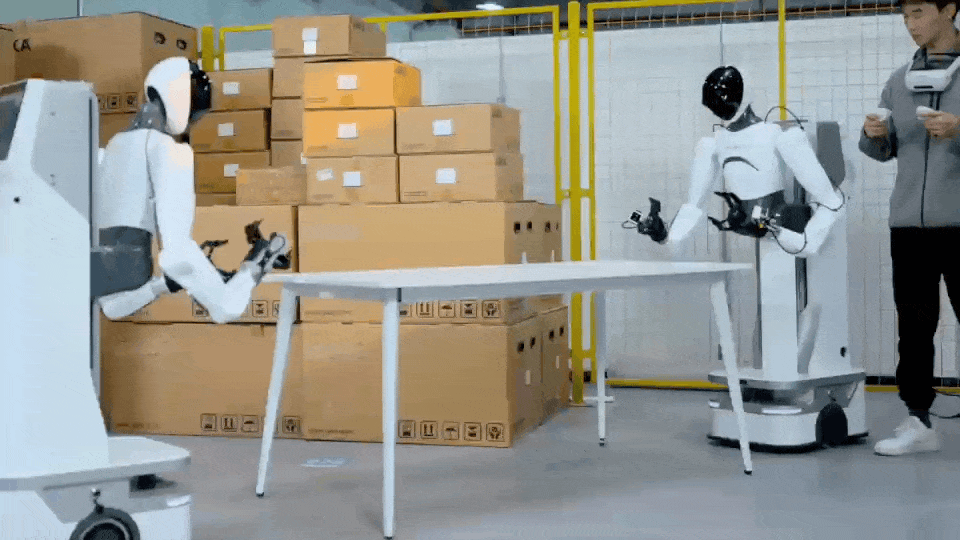
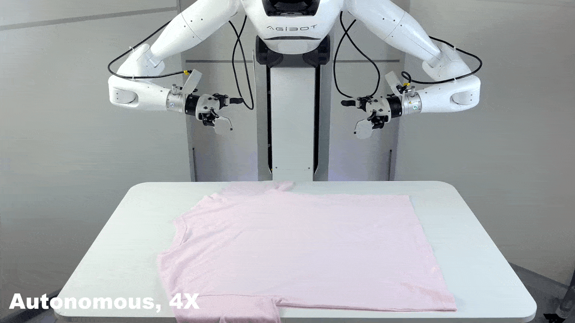

# AgiBot World Datasets

目标：理解 AgiBot World 作为工业化真机数据生产线的特点，能重点检查任务分层、质检流程、数据版本和 LeRobot 化组织。

> 先修：[大规模真机数据集](../01-real-robot-datasets.md)
> 建议：重点看它如何把“真机数据采集”做成一套可扩展的数据生产流程
> 数据集规模：AgiBot World Beta 数据集规模约为 43.8 TB，包含 1,003,672 条机器人轨迹；其精选子集 AgiBot World Alpha 包含 92,214 条轨迹，大小约 8.5 TB。

AgiBot World Datasets 可以先理解为一套面向通用机器人操作的大规模真机数据体系。它和 Open X-Embodiment 的出发点不完全一样：Open X 更像把多个实验室已有的数据集汇聚到一起，而 AgiBot World 更强调在统一硬件、统一场景建设、统一采集协议和统一质检流程下，批量生产高质量机器人轨迹。

这一区别很重要。很多大规模机器人数据集解决的是“数据够不够多”的问题，而 AgiBot World 还试图解决另一个问题：当数据量扩大到十万、百万级轨迹之后，怎样保证每条轨迹仍然有清楚的任务语义、动作语义、场景语义和质量记录。也就是说，它不只是一个下载后用于训练的文件集合，更像是一个围绕真机采集、人工标注、质量检查、任务分层和模型训练共同搭建起来的数据平台。

本节不把 AgiBot World 当作一个排行榜条目来读，而是把它当成一个真实机器人数据工程案例。读完这一节，你应该能回答：它的数据从哪里来，机器人是什么样，任务为什么比普通抓取更复杂，一条 episode 里到底包含什么，为什么它特别强调质检和人工在环，以及使用它训练模型前应该先检查哪些问题。

## 为什么需要 AgiBot World 这样的数据集

在机器人学习里，模型真正需要的不是单纯的视频，而是带动作标签的真实交互经验。以桌面抓取为例，一段普通视频只能告诉我们“机器人看到了什么”，但不能直接告诉我们“每一帧应该发送什么控制量”。而模仿学习、VLA 模型和通用机器人策略通常都需要这样的数据：

```text
视觉观测 + 机器人状态 + 语言任务 + 动作指令 + 时间对齐 + 任务结果
```

早期机器人数据集通常有几个限制。第一，任务比较短，常见的是抓取、放置、推拉这种单一技能。第二，场景比较受控，很多数据来自桌面或实验室环境。第三，机器人形态和传感器比较简单，常常是单臂机械臂加一个夹爪。第四，质量检查往往依赖采集后的简单过滤，而不是贯穿任务设计、采集、标注和模型反馈的完整流程。

AgiBot World 想解决的正是这些问题。它把数据采集放到更接近真实应用的场景中，例如家庭、零售、工业、餐饮和办公环境；它强调长时序任务，而不是只采集一个原子技能；它使用双臂移动机器人、灵巧手、视觉触觉传感器和多视角相机；它还保留失败恢复、关键帧、子任务和语言指令等信息，使数据不仅能用于端到端行为克隆，也能用于层级策略、任务分解和错误恢复研究。

<figure class="doc-figure" aria-label="AgiBot World 数据生产线">
  <p class="doc-figure-title">AgiBot World 更像一条真机数据生产线</p>
  <p class="doc-figure-subtitle">它不是只把 episode 堆起来，而是把场景、任务、采集、检查、标注和模型反馈串成闭环。</p>
  <div class="figure-pipeline">
    <div class="figure-node tone-green">
      <strong>场景建设</strong>
      <span>家庭、零售、工业、餐饮、办公等真实或 1:1 复刻场景。</span>
    </div>
    <div class="figure-node tone-blue">
      <strong>任务设计</strong>
      <span>从原子技能到长程任务，包含工具、衣物、货架、清洁等操作。</span>
    </div>
    <div class="figure-node tone-gold">
      <strong>真机采集</strong>
      <span>遥操作、动作捕捉、双臂移动平台、多相机和本体状态同步记录。</span>
    </div>
    <div class="figure-node tone-rose">
      <strong>质检标注</strong>
      <span>检查丢帧、任务完成、失败恢复、关键帧和语言分段。</span>
    </div>
    <div class="figure-node tone-green">
      <strong>训练反馈</strong>
      <span>用模型部署结果反过来改进采集规范和数据清洗流程。</span>
    </div>
  </div>
</figure>

## 版本与数据家族

AgiBot World 不是只有一个固定文件包，而是一组持续发布的数据和工具资源。阅读资料时容易混淆 Alpha、Beta、2026、Challenge 等名称，所以先把它们区分清楚。

| 名称 | 可以怎样理解 | 阅读时重点 |
|---|---|---|
| AgiBot World Alpha | 从完整数据中筛出的较小规模子集 | 适合先看格式、任务标注和样例结构 |
| AgiBot World Beta | 更完整的大规模版本 | 更接近“百万级轨迹”的主体数据 |
| AgiBot World 2026 | 后续面向真实场景和新研究方向的发布 | 更接近 LeRobot 风格组织，并包含新的标注层 |
| AgiBot World Challenge | 面向比赛和评测的数据设置 | 更关注任务 track、训练/测试划分和提交协议 |
| GO-1 / GO-1 Air | 基于 AgiBot World 训练的策略模型 | 不是数据集本身，但说明数据如何进入模型训练 |

阅读时要先确认自己看的到底是哪一个版本。当前官方仓库给出的 Colosseo 口径中，Beta 是 1,003,672 条轨迹的完整数据，Alpha 是 92,214 条轨迹的精选子集；AgiBot World 2026 则是后续发布的数据卡，采用 LeRobot v2.1 风格组织，并加入更丰富的标注层。版本不同，目录结构、硬件平台、标注字段和下载方式都可能不同。

如果只是学习数据集，建议先看 Alpha 或 2026 的数据卡和样例结构。Alpha 更容易理解原始层级：`task_info`、`observations`、`parameters`、`proprio_stats` 分别保存任务说明、视频/深度、相机参数和机器人本体状态。2026 版本则更接近 LeRobot 的 `meta/ + data/ + videos/` 组织方式，适合和前面学过的 LeRobot 格式联系起来看。

## 它和 Open X-Embodiment 的区别

前一节 Open X-Embodiment 的核心是跨机器人混合。它把多个实验室、多个机器人、多个数据源统一到一个更大的训练生态里。AgiBot World 的核心则是标准化采集。它更关注“如何用一批同构或高度统一的机器人，批量采集高质量、长时序、多场景的数据”。

这两种路线各有价值。

Open X 的优势在于覆盖面广。它把很多不同机器人本体和不同采集流程的数据汇总起来，适合研究跨本体泛化和数据混合配方。但它的问题也很明显：不同数据源的相机、动作空间、任务文本和质量标准都可能不同。

AgiBot World 的优势在于一致性强。统一硬件、统一场景、统一采集协议可以减少很多跨数据源噪声，让模型更容易从数据规模中受益。它的问题则是：同构数据不等于天然能泛化到所有机器人。如果目标系统和 AgiBot 的双臂移动平台差异很大，仍然需要重新审视 action space、状态定义、相机布局和末端执行器差异。

可以这样记：

```text
Open X-Embodiment: 多来源、多本体、强混合
AgiBot World: 统一平台、统一采集、强质检
```

## 机器人平台：为什么硬件统一很关键

AgiBot World 系列主要围绕 AgiBot G1/G2 等双臂移动机器人平台组织数据。不同版本的具体硬件口径会变化，例如 Colosseo 资料强调 AgiBot G1 平台，AgiBot World 2026 数据卡则写明采集于 AGIBOT G2 平台。关键不是记住某一个型号，而是理解这类平台不是简单的桌面单臂机械臂，而是接近服务机器人形态的系统：双 7 自由度机械臂、移动底盘、可调腰部、多相机、末端夹爪或灵巧手，以及部分任务中使用的视觉触觉传感器。

这套硬件决定了 AgiBot World 的数据有几个特点。

第一，它适合双臂操作。双臂任务比单臂抓取复杂得多，因为左右臂需要协同。比如折叠衣物时，一只手可能固定衣物边缘，另一只手完成翻折；整理货架时，一只手可能扶住容器，另一只手放入物体。这类任务无法简单地拆成“单臂抓取 + 单臂放置”。

第二，它适合移动操作。机器人不只是站在固定桌子前，还可以在货架、餐桌、办公区等场景中移动。因此 action 里除了手臂和夹爪，还可能涉及底盘、腰部、头部视角等状态。

第三，它适合研究更细粒度的末端控制。普通夹爪主要控制开合，而灵巧手可以表达多个手指关节的运动，视觉触觉传感器则为接触丰富任务提供额外信息。像拧、插、折、擦、握持、递交这类任务，对末端控制和接触反馈的要求明显高于普通 pick-and-place。

<figure class="doc-figure" aria-label="AgiBot World 机器人动作空间">
  <p class="doc-figure-title">AgiBot World 的 action 不只是“机械臂末端移动”</p>
  <p class="doc-figure-subtitle">它可能同时涉及双臂、末端执行器、腰部、头部和移动底盘。</p>
  <div class="compare-panels">
    <section class="compare-panel compare-urdf">
      <div class="compare-label">单臂桌面数据</div>
      <p class="compare-kicker">常见动作空间</p>
      <ul>
        <li>末端位置或关节位置</li>
        <li>单个夹爪开合</li>
        <li>固定相机或腕部相机</li>
      </ul>
    </section>
    <section class="compare-panel compare-usd">
      <div class="compare-label">AgiBot World</div>
      <p class="compare-kicker">更完整的身体状态</p>
      <ul>
        <li>左右 7-DoF 机械臂</li>
        <li>夹爪、灵巧手或视觉触觉末端</li>
        <li>头部、腰部、底盘和多相机观测</li>
      </ul>
    </section>
  </div>
  <div class="compare-bridge">
    <strong>读数据时</strong>
    <span>不要只看 <code>action.shape</code>，要查清每一段维度对应哪个身体部件、单位是什么、控制频率是多少。</span>
  </div>
</figure>

## 场景：从桌面走向真实应用环境

AgiBot World 的另一个重点是场景。很多机器人数据集虽然也是真机采集，但场景常常集中在桌面、厨房台面或实验室工位。AgiBot World 则把场景扩展到更接近实际部署的环境，并把这些场景组织成若干大类。

可以把它粗略理解成五类应用域：

| 场景域 | 典型例子 | 训练意义 |
|---|---|---|
| 家庭 | 卧室、厨房、客厅、阳台 | 物体杂乱、柔性物体多、任务语义更自然 |
| 零售 | 货架、生鲜区、购物车、冷柜 | 物体类别多，取放和补货任务密集 |
| 工业 | 工位、工具、零件、容器 | 操作精度和流程稳定性要求高 |
| 餐饮 | 餐桌、杯具、食物、清理任务 | 涉及倒水、擦拭、摆放、收纳等复杂交互 |
| 办公 | 桌面、文件、电子设备、日用品 | 适合研究日常服务和人机协作 |

这些场景不是背景装饰。对机器人策略来说，场景决定了视觉分布、物体分布、可达空间和任务先验。比如“从货架上拿饮料”和“从桌面上拿饮料”看似都是抓取，但相机角度、遮挡、可达方向、目标物体密度都不同。一个只在干净桌面上训练过的模型，到了货架环境中可能会因为遮挡、反光、相似包装和空间狭窄而失败。


## 任务：不是只有 pick-and-place

AgiBot World 里的任务比“拿起物体再放下”复杂得多。它的任务可以从两个层次理解：原子技能和长程任务。

原子技能是最小的可复用动作单元，例如 pick、place、push、pull、wipe、fold、pour、plug、chop 等。它们类似语言里的词。长程任务则像句子或段落，由多个原子技能按顺序组合而成。比如“整理货架”可能包含移动到货架前、识别目标物、抓取饮料、避开遮挡、放到指定层、调整朝向等多个子步骤。

这也是 AgiBot World 和很多短时序数据集的区别。短时序数据集中，一条轨迹可能只持续几秒，目标是完成一个动作。AgiBot World 中很多轨迹持续几十秒，甚至更长，任务中包含多个阶段。长时序数据对模型提出了更高要求：模型不仅要知道下一步手该怎么动，还要知道当前处于任务的哪个阶段，接下来要执行哪个子目标，以及失败时能否恢复。

几个典型任务可以这样理解：

| 任务 | 涉及能力 |
|---|---|
| Restock Beverage | 识别饮料、从购物车取出、放入货架、适应视觉干扰 |
| Table Bussing | 清理桌面、分类废弃物、移动到垃圾桶或收纳位置 |
| Pour Water | 抓住壶柄、控制倾倒角度、避免溢出 |
| Fold Shorts | 双臂协作、柔性物体操作、长时序规划 |
| Wipe Table | 工具使用、接触控制、覆盖指定区域 |
| Handover Bottle | 人机交互、递交姿态、接近和释放时机 |

<figure class="doc-figure" aria-label="AgiBot World 任务粒度">
  <p class="doc-figure-title">一条长程任务可以拆成多个原子技能</p>
  <div class="stage-tree-compact">
    <div class="tree-row tree-stage"><code>Restock Beverage</code><span>把饮料从购物车补到货架：</span></div>
    <div class="tree-row level-0"><code>Approach</code><span>移动到购物车或货架前</span></div>
    <div class="tree-row level-1"><code>Pick</code><span>抓取指定饮料</span></div>
    <div class="tree-row level-1"><code>Move</code><span>绕过遮挡，将物体送到目标层</span></div>
    <div class="tree-row level-1"><code>Place</code><span>放入正确位置，并调整姿态</span></div>
    <div class="tree-row level-2 sensor"><code>Verify / Recover</code><span>必要时修正位置或从失败中恢复</span></div>
  </div>
</figure>

这种粒度对研究非常有价值。对于端到端模仿学习，可以把整条轨迹当成 observation 到 action 的监督序列；对于层级策略，可以把子任务片段当成高层规划目标；对于语言条件策略，可以研究不同粒度的语言指令如何影响动作；对于失败恢复研究，可以利用标注过的错误状态和恢复行为。

## 采集流程：数据质量是怎样被保证的

AgiBot World 最值得学习的地方之一，是它把数据质量放在采集流程中，而不是采完以后再简单筛一下。

完整流程可以分成三步。

第一步是任务预采集和标准制定。在正式采集前，先小规模试采，确认这个任务是否可行，机器人能不能完成，场景布置是否稳定，操作员应该怎样执行，哪些状态算成功，哪些状态算失败。这个阶段类似给任务写采集规范。

第二步是正式采集。熟练的遥操作员根据采集标准布置场景并执行任务。采集过程中会记录多相机视频、深度、机器人状态、动作、时间戳和任务信息。数据采完后会先做本地有效性检查，例如是否丢帧、轨迹是否完整，再上传到后续处理流程。

第三步是后处理和人工标注。标注人员检查每条 episode 是否符合采集标准，并补充语言标注、关键帧、动作片段和错误信息。这里的标注不是简单给一个“成功/失败”标签，而是把长程任务切成更细的时间段，使模型可以知道某一段对应哪个子任务。

更特殊的是，AgiBot World 并不简单丢弃所有失败轨迹。某些轨迹中，操作员可能一开始抓错或碰掉物体，但随后进行了恢复并完成任务。这类失败恢复数据会被保留，并标注错误原因和时间戳。它们对训练只会“做对”的模型未必最干净，但对研究错误检测、失败反思和恢复策略非常有价值。

<figure class="doc-figure" aria-label="AgiBot World 数据采集流程">
  <p class="doc-figure-title">从任务规范到人工在环质检</p>
  <p class="doc-figure-subtitle">AgiBot World 的采集流程不是“录完就结束”，而是围绕质量不断闭环。</p>
  <div class="figure-pipeline">
    <div class="figure-node tone-green">
      <strong>预采集</strong>
      <span>验证任务可行性，建立采集标准。</span>
    </div>
    <div class="figure-node tone-blue">
      <strong>正式采集</strong>
      <span>遥操作员按标准完成任务，记录多模态轨迹。</span>
    </div>
    <div class="figure-node tone-gold">
      <strong>本地检查</strong>
      <span>检查丢帧、完整性、时间同步等低级问题。</span>
    </div>
    <div class="figure-node tone-rose">
      <strong>人工标注</strong>
      <span>补充任务文本、关键帧、错误原因和子任务分段。</span>
    </div>
    <div class="figure-node tone-green">
      <strong>模型反馈</strong>
      <span>用训练和部署结果反向改进采集协议。</span>
    </div>
  </div>
</figure>

## 看一条 episode：它到底包含什么

初学者容易把机器人数据集想成视频文件夹。AgiBot World 不是这样。一个 episode 至少要同时看四类信息。

第一类是视觉观测，包括不同相机视角的视频、深度图和相机参数。多相机很关键，因为单个视角很容易被机器人手臂、物体或遮挡物挡住。头部视角适合理解全局场景，腕部或手部视角适合观察接触和抓取细节。

第二类是机器人本体状态，包括左右臂关节、末端位姿、夹爪或灵巧手状态、头部、腰部、底盘等。这些状态告诉模型“机器人自己现在在哪里”。没有本体状态，模型只能看图像，很难稳定控制复杂动作。

第三类是动作，也就是当时发给硬件抽象层的控制指令。这里要特别注意：动作不是执行后的状态。数据中通常会区分 state 和 action，前者是传感器或执行器监测到的实际状态，后者是控制系统发送的目标或命令。由于延迟、控制器响应和物理接触，命令和实际状态不一定完全相同。

第四类是任务和标注信息，包括任务名、初始场景描述、语言指令、子任务片段、关键帧、成功帧、错误帧、2D 目标框等。这些标注让数据不仅能用于低层动作学习，也能用于语言理解、目标定位和层级规划。

在 Alpha 版本的原始组织中，可以看到类似这样的结构：

```text
data/
  task_info/
    task_327.json
    task_352.json
    ...
  observations/
    327/
      648642/
        depth/
        videos/
      648649/
        ...
  parameters/
    327/
      648642/
        camera/
  proprio_stats/
    327/
      648642/
        proprio_stats.h5
```

这棵目录树可以这样读：

- `task_info/` 保存任务级和 episode 级说明，其中包括语言指令和动作片段。
- `observations/` 保存每个 task、每条 episode 的视觉观测。
- `parameters/` 保存相机内参、外参等校准信息。
- `proprio_stats/` 保存机器人本体状态和动作，通常在 HDF5 文件中。

在 2026 版本中，数据组织更接近 LeRobot：

```text
dataset_root/
  meta/
    episodes.jsonl
    info.json
    episodes_stats.jsonl
    annotations.json
    tasks.jsonl
  data/
    chunk-000/
      episode_000000.parquet
      episode_000001.parquet
  videos/
    chunk-000/
      observation.images.top_head/
        episode_000000.mp4
      observation.images.hand_left/
        episode_000000.mp4
      observation.images.hand_right/
        episode_000000.mp4
```

这和前面 LeRobot 数据格式一节可以直接对应起来：`meta/` 解释数据 schema 和路径模板，`data/` 保存每帧低维数据，`videos/` 保存不同相机的视频流。不同的是，AgiBot World 2026 在 `info.json` 中还加入了更丰富的标注层，例如子任务片段、关键帧、2D 框和 step-level instruction。

## 任务标注：为什么它比单一 task 标签更有用

普通模仿学习数据集可能只给每条轨迹一个任务文本，例如：

```text
Pick up the bottle and put it on the shelf.
```

这对短任务够用，但对长程任务不够。因为一条几十秒的轨迹中，前几秒可能是在接近目标，中间是在抓取，后面是在移动和放置。如果整条轨迹只有一句话，模型很难知道每个时间段对应哪一步。

AgiBot World 的标注更细。以原始 Alpha 结构中的 `task_[id].json` 为例，里面的 `action_config` 会把一条 episode 切成多个动作片段，每个片段包含起止帧、原子技能和语言描述。例如：

```json
[
  {
    "start_frame": 0,
    "end_frame": 435,
    "action_text": "Pick up onion from the shelf.",
    "skill": "Pick"
  },
  {
    "start_frame": 435,
    "end_frame": 619,
    "action_text": "Place onion into the plastic bag in the shopping cart.",
    "skill": "Place"
  }
]
```

这类标注有几个作用。

第一，它可以训练分段策略。模型不必一次学完整长程任务，而可以先学习每个子技能。

第二，它可以训练语言对齐。不同片段对应不同自然语言动作描述，适合研究“语言如何约束动作”。

第三，它可以训练层级策略。高层模型选择下一段子任务，低层模型执行对应动作。

第四，它方便错误诊断。如果模型在某个子任务失败，可以知道它是在 pick、place、move、wipe 还是 fold 阶段出了问题。

2026 版本里，类似思想进一步体现在多层标注上：高层 task label、Task Frame 片段、2D Bounding Box、Instruction Segments 可以同时存在。这样一条长程 episode 既可以作为完整任务使用，也可以拆成多个单指令 episode 进入标准 LeRobot 训练脚本。

## 本体状态和动作：读数据时最容易出错的部分

AgiBot World 的 `proprio_stats.h5` 或 LeRobot 版本中的 `observation.state` / `action` 是这类数据里最需要认真读的部分。

以原始结构为例，本体状态大致包含：

```text
timestamp
state/
  effector/
  end/
  head/
  joint/
  robot/
  waist/
action/
  effector/
  end/
  head/
  joint/
  robot/
  waist/
```

这些字段不是随便命名的。它们对应机器人的不同身体部件：

| 字段组 | 含义 |
|---|---|
| `effector` | 末端执行器，例如夹爪或灵巧手 |
| `end` | 左右机械臂法兰或末端的 6DoF 位姿 |
| `head` | 头部视角的 yaw / pitch |
| `joint` | 左右 7DoF 机械臂的关节状态 |
| `robot` | 机器人在里程计坐标系下的位置和朝向 |
| `waist` | 腰部俯仰和升降 |

这里有几个非常容易犯错的点。

第一，左右臂通常在同一个数组里拼接。例如关节位置可能是 `[N, 14]`，前 7 维是左臂，后 7 维是右臂。如果误把 14 维当成单臂机器人，就会完全读错。

第二，单位并不统一。末端位置可能用米，夹爪开口可能用毫米，灵巧手关节可能用弧度，机器人底盘位置又在里程计坐标系中。不能只看 shape，要看每个字段的单位。

第三，state 和 action 的语义不同。state 是监测到的传感器和执行器状态，action 是发送给硬件抽象层的控制指令。二者在时间上也可能存在响应延迟。做行为克隆时，一般要明确用哪一帧 observation 对应哪一帧 action，不能随便把下一帧状态当作当前动作。

第四，某些字段可能暂不可用或版本变化。比如 effort、wrench 等字段在某些说明中标注为当前不可用。阅读数据时不要假设每个字段都一定有有效值。

<figure class="doc-figure" aria-label="AgiBot World proprioception">
  <p class="doc-figure-title">AgiBot World 的本体状态是多身体部件拼接的</p>
  <p class="doc-figure-subtitle">读 <code>observation.state</code> 或 <code>action</code> 时，要先拆清每一段属于哪个部件。</p>
  <div class="stage-tree-compact">
    <div class="tree-row tree-stage"><code>observation.state / action</code><span>一帧中的低维机器人数据</span></div>
    <div class="tree-row level-0"><code>joint</code><span>左右臂关节位置、速度、命令</span></div>
    <div class="tree-row level-1"><code>end</code><span>左右末端位置、姿态、速度</span></div>
    <div class="tree-row level-1"><code>effector</code><span>夹爪开合或灵巧手关节</span></div>
    <div class="tree-row level-1"><code>head / waist</code><span>头部视角和腰部状态</span></div>
    <div class="tree-row level-2 sensor"><code>robot</code><span>底盘位姿和速度</span></div>
  </div>
</figure>

## 示例

AgiBot World 官方仓库里展示了几类典型任务。

### 接触丰富操作



这类任务强调末端执行器与物体持续接触，例如擦拭、推压、插入或带摩擦的操作。它们的难点不只是“抓住物体”，而是要在接触过程中持续控制力、方向和运动轨迹。

### 长程任务规划



这类任务由多个子目标组成，模型需要知道当前处于哪一步，而不是只预测下一帧动作。它更接近真实服务任务：先移动到目标区域，再识别物体，再抓取、搬运、放置或整理。

### 多机器人协作



协作任务要求多个执行体在空间和时间上配合，难点不只在单个动作，而在协调。落到数据结构上，轨迹里可能同时包含多个机器人或多个执行单元的状态和动作。

### 不同平台上的同类任务



同样是折叠衣物，不同机器人平台、手部结构和相机布局会带来不同的数据分布。读这种数据时，不能只看任务名相同，还要看机器人本体、末端执行器和观测视角是否一致。

从这些例子可以看出，AgiBot World 不是只追求物体数量，而是在覆盖几类真正困难的机器人能力：长程规划、双臂协作、柔性物体操作、工具使用、接触控制和多模态感知。

## 两种使用方式：完整长程任务与切片任务

AgiBot World 的一个重要使用选择是：你到底要用完整 episode，还是把它切成短片段。

如果保留完整 episode，一条轨迹可能包含多个子任务，非常适合研究层级策略、长程规划和任务分解。高层模型可以决定下一步做什么，低层模型负责执行具体动作。这种方式保留了长时序上下文，但训练难度也更高，因为模型必须跨越多个阶段保持目标一致。

如果切成单指令片段，每段只对应一个较短的技能或子任务，更适合接入标准模仿学习训练脚本。比如将一条“整理冷柜”的长轨迹切成“拿起红色饮料”“放到第五层货架”“拿起酸奶”等短 episode。这样训练更简单，数据也更接近传统 LeRobot 单任务格式，但会损失完整任务的长期依赖关系。

可以这样选择：

| 目标 | 更适合的使用方式 |
|---|---|
| 训练标准行为克隆策略 | 切成单指令片段 |
| 研究 VLA 指令跟随 | 单指令片段或子任务片段 |
| 研究层级规划 | 保留完整 episode |
| 研究错误恢复 | 保留错误帧和恢复片段 |
| 研究物体定位和语言 grounding | 使用 2D 框和 instruction segments |
| 研究长时序任务泛化 | 保留完整长程任务 |

## 适合研究什么

AgiBot World 特别适合下面几类研究。

第一类是大规模模仿学习。因为它包含真实机器人动作、状态、视频和语言，能够直接作为 observation-to-action 的监督数据。对于双臂移动操作任务，它比普通桌面数据更贴近服务机器人形态。

第二类是视觉-语言-动作模型。多相机图像、语言指令和低层 action 同时存在，可以用来训练从语言和视觉到动作的策略模型。和只使用网页视频不同，这里有真实动作标签，监督信号更直接。

第三类是层级策略和长程规划。由于有长时序任务和子任务标注，可以研究“先决定做哪一步，再执行这一段动作”的策略，而不是让模型一次性从整条指令直接预测所有低层动作。

第四类是失败恢复和错误反思。保留部分失败恢复轨迹并标注错误原因，使它能支持模型学习“出错后如何继续”，而不是只模仿完美演示。

第五类是接触丰富和灵巧操作。视觉触觉传感器、灵巧手和双臂任务让它适合研究擦拭、折叠、倒水、插入、递交等更接近日常操作的技能。

第六类是数据质量与数据规模关系。AgiBot World 的一个核心观点是，质量控制不只是附属环节。人类验证数据虽然数量可能更少，但对某些任务的提升可能比简单增加未验证数据更明显。因此它也适合研究“什么样的数据更值得采”。

## 使用前要小心什么

AgiBot World 很有价值，但不能把它当成即插即用的万能数据。

首先，硬件一致性是一把双刃剑。统一机器人平台让数据更干净，但如果你的目标机器人不是双臂移动平台，不能默认迁移有效。尤其是 action 维度、末端执行器、相机位置和本体状态不同，都会影响模型能否复用。

其次，长程任务更难训练。完整 episode 很有价值，但直接端到端训练可能会遇到 credit assignment 难、阶段混淆、语言目标过长等问题。初学者如果只是想跑通模仿学习，可以先使用切片后的单指令片段。

第三，状态和动作字段必须逐项审计。不要只看 `observation.state` 和 `action` 的 shape。左右臂拼接、单位差异、底盘速度、夹爪开度、灵巧手关节和头腰状态都可能混在同一个向量中。

第四，数据许可需要提前确认。AgiBot World 系列使用非商业共享协议，适合科研学习和非商业研究，但如果涉及商用训练、再分发或产品部署，需要单独评估许可边界。

第五，不同版本格式不同。Alpha 原始格式和 2026 LeRobot 风格格式不完全一样。如果你在写转换脚本或训练代码，必须先确认自己使用的是哪个版本，而不是看到 “AgiBot World” 就默认目录一致。

## 一个推荐的阅读顺序

实际使用这个数据集前，可以按下面的顺序检查。

```text
1. 先看 task_info 或 tasks.jsonl
   确认任务名、语言指令和任务粒度。

2. 再看一条 episode 的视频
   确认相机视角、任务过程、是否有长程阶段。

3. 接着读 info.json 或 proprio_stats.h5
   确认 state/action 的维度、单位和身体部件映射。

4. 查看关键帧和 instruction segments
   确认一条 episode 能否拆成子任务。

5. 抽样检查时间同步
   确认视频帧、状态、动作、timestamp 是否对齐。

6. 决定训练形式
   保留完整 episode，还是切成单指令片段。
```


## 常见误解

- **误解一：百万级轨迹就一定比小数据集好。**
  规模重要，但数据质量、任务覆盖、标注粒度和目标机器人匹配度同样重要。

- **误解二：同构机器人数据就没有泛化问题。**
  同构只减少本体差异，不消除场景、物体、任务和视觉分布差异。

- **误解三：一条 episode 只有一个任务标签。**
  很多长程 episode 内部包含多个子任务片段，应该根据训练目标选择使用完整轨迹还是切片。

- **误解四：action 就是关节角。**
  action 可能包含关节、末端、底盘、夹爪、灵巧手、头部或腰部相关命令，必须查 schema。

- **误解五：失败轨迹都应该删除。**
  对普通行为克隆来说，失败轨迹可能会污染训练；但对错误检测、恢复和反思策略来说，带标注的失败恢复数据非常有价值。

- **误解六：LeRobot 格式意味着可以直接训练。**
  格式统一只解决读取问题，不自动保证任务粒度、动作语义和 split 设计正确。

## 小结

AgiBot World Datasets 的重点不只是“数据量大”，而是它展示了一种工业化真机数据采集方式：统一硬件、真实场景、长程任务、多模态观测、细粒度标注、失败恢复和人工在环质检共同组成一个数据平台。它比普通桌面抓取数据更接近真实服务机器人应用，也比单纯混合多个开源数据集更强调采集标准和质量闭环。

如果你要用它做研究，第一步不是训练模型，而是先理解它的身体结构、任务粒度、数据版本、状态动作 schema 和标注层。只有把这些看清楚，AgiBot World 才能真正发挥它在大规模模仿学习、VLA、长程规划、双臂协作和失败恢复研究中的价值。

进一步阅读可以看：
- [AgiBot World](https://agibot-world.com/)
- [AgiBot World Colosseo paper](https://arxiv.org/abs/2503.06669)
