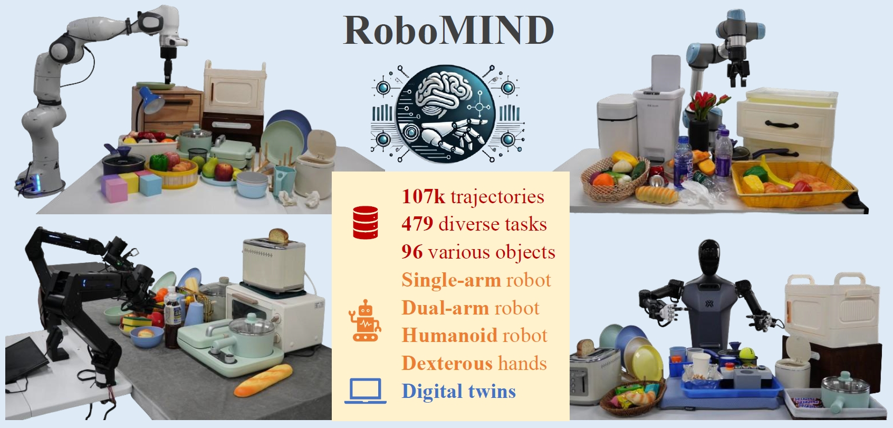
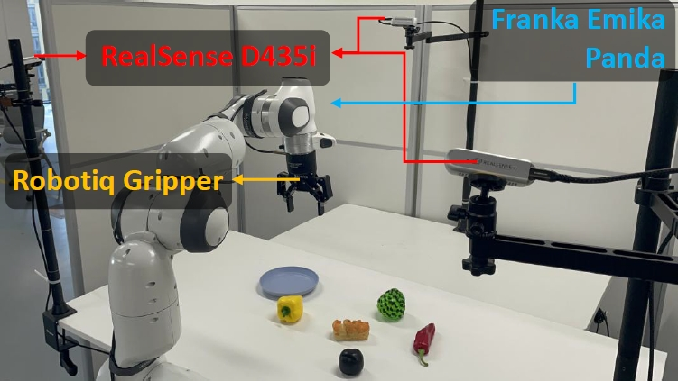
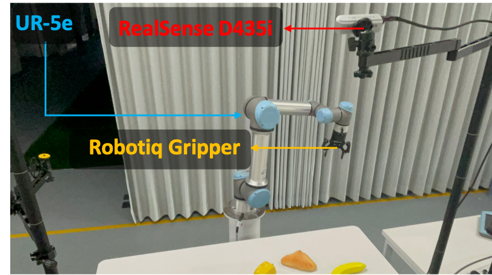
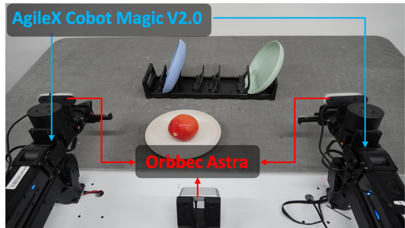
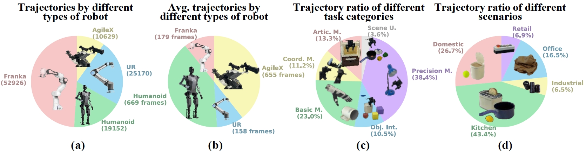
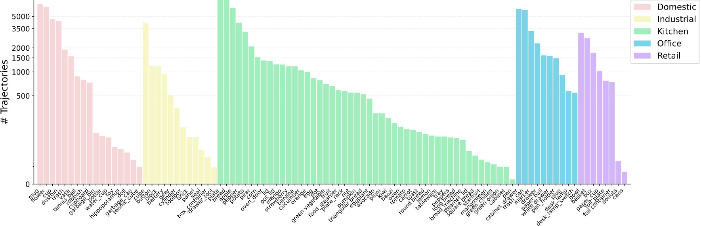
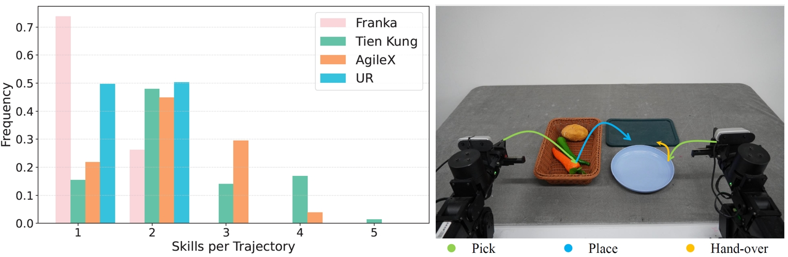
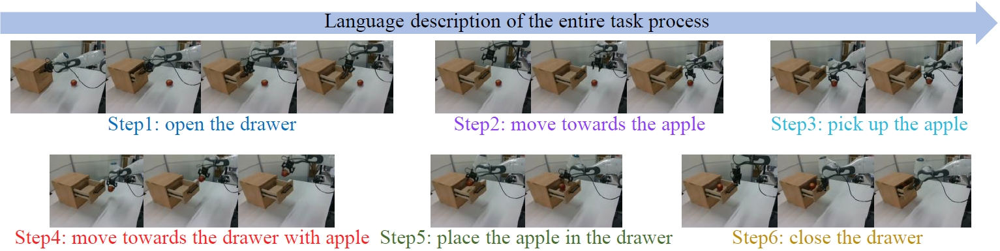
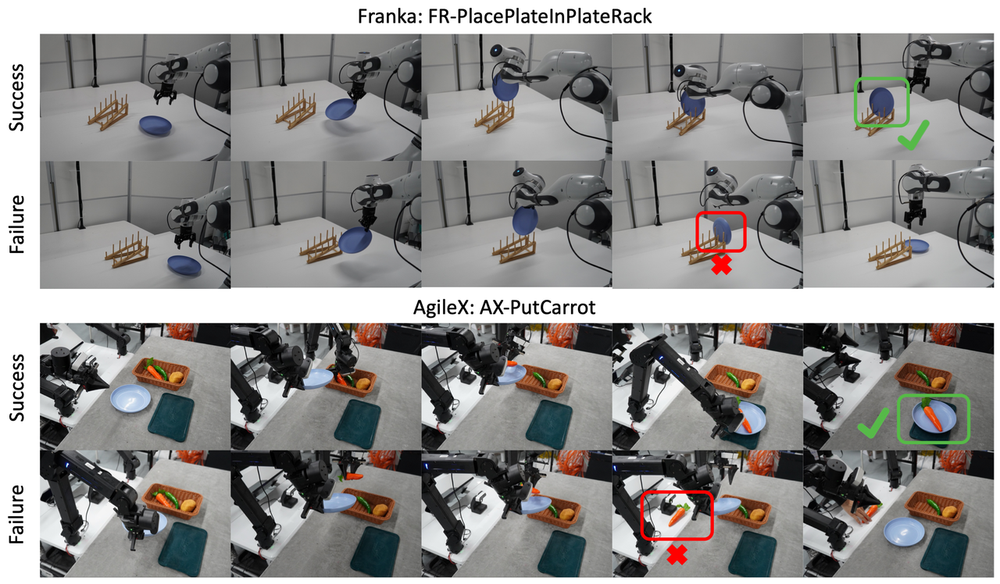

# RoboMIND

目标：理解 RoboMIND 的多本体、多任务真实演示定位，能从任务 taxonomy、物体覆盖和动作语义判断它适合哪些研究。

> 先修：[大规模真机数据集](../01-real-robot-datasets.md)
> 建议：重点看任务类别、机器人本体、真实演示质量和数据组织方式
> 数据集规模：RoboMIND 数据集规模超过 1 TB，包含 107K 条真实机器人示范轨迹，覆盖 479 个操作任务和 96 类物体。此外，RoboMIND 还提供约 5,000 条带失败原因标注的失败示范数据，用于研究机器人错误分析和策略改进。

RoboMIND 的全称是 **Multi-embodiment Intelligence Normative Data for Robot Manipulation**。从名字里就能看出它想解决的问题：机器人操作数据不能只停留在“某一台机器人、某一个任务、某一种采集脚本”的层面，而应该有一套更规范的采集方式，让不同机器人本体、不同任务类别、不同物体和不同场景都能被放到同一个数据体系里理解。

如果把上一节的 AgiBot World 看成一条大规模工业化数据生产线，那么 RoboMIND 更适合被看成一个“多本体真实操作演示库”：它不是只强调数据量，也不是把很多来源不同的数据简单拼在一起，而是用统一采集平台和标准协议，采集来自多种机器人本体的真实遥操作轨迹。它的核心价值在于：读者可以通过它看到真实机器人操作数据如何同时覆盖**机器人差异、任务差异、物体差异、场景差异和轨迹质量差异**。

这一页从实际使用时会遇到的问题出发：它包含哪些机器人？任务是怎么分类的？一条轨迹里有什么？为什么有的轨迹短、有的轨迹很长？为什么它既有成功数据也有失败数据？为什么读取图像时还要关心 RGB / BGR？读完后，你应该能判断 RoboMIND 适合什么研究，也能知道使用它之前必须检查哪些细节。

先说明版本口径：本页主要围绕 RSS 2025 论文和 Hugging Face 数据卡中的 RoboMIND 版本展开，也就是 107k 轨迹、479 个任务、96 类物体、4 类机器人本体这一口径。RoboMIND V2.0 的规模、机器人本体、任务数和下载入口都不同。实际使用数据前，要先确认自己使用的是 RoboMIND、RoboMIND v1.1/v1.2，还是 RoboMIND V2.0。

## 阅读目标

这一页先围绕几个实际问题展开：

1. RoboMIND 是什么，它和 Open X-Embodiment、AgiBot World 这类大规模数据源有什么不同。
2. RoboMIND 覆盖了哪些机器人本体，为什么“多本体”不仅是数量问题，还会影响状态、动作和轨迹长度。
3. 数据集里的任务如何分类，哪些任务更偏基础操作，哪些任务更偏长程组合和场景理解。
4. 一条 RoboMIND 轨迹通常包含哪些信息：多视角图像、机器人状态、动作、语言任务、成功或失败标注。
5. RoboMIND 的 HDF5 数据大致如何组织，初学者读数据时最容易踩哪些坑。
6. 失败轨迹、语言标注和数字孪生环境分别有什么价值，为什么它们不能和普通成功轨迹混在一起随便使用。
7. 如果想把 RoboMIND 接入模仿学习、VLA 或 LeRobot 工作流，应该先做哪些检查。

## 先看总体：RoboMIND 到底是什么

RoboMIND 是一个面向机器人操作学习的大规模真实演示数据集。它包含约 **107k 条真实世界 demonstration trajectories**，覆盖 **479 个任务**和 **96 类物体**，并且来自四类不同机器人本体：Franka Emika Panda、UR5e、AgileX Cobot Magic V2.0 双臂平台，以及带双灵巧手的人形机器人 Tien Kung。它不是只采集某一种机械臂的抓取数据，而是把多种机器人、多种物体、多种任务类型和多种场景放在同一个规范化数据框架下。



从这张总览图可以看出，RoboMIND 的重点并不只是“机器人会拿东西”。它覆盖了单臂、双臂、人形机器人、灵巧手、真实场景物体和数字孪生环境。可以先把它理解成三层：

```text
第一层：真实操作轨迹
  机器人在真实桌面、厨房、办公、工业等场景中完成任务。

第二层：多本体覆盖
  同一数据集中包含单臂、双臂和人形机器人，不同机器人有不同状态和动作空间。

第三层：任务与物体多样性
  数据不仅有抓取和放置，也有抽屉、柜门、盘架、容器、组合操作和场景理解任务。
```

这三层放在一起，决定了 RoboMIND 的定位：它适合用来研究**真实世界、多任务、多本体机器人操作学习**，尤其适合模仿学习和 Vision-Language-Action 模型训练中的数据理解与数据筛选问题。

## 它和 Open X-Embodiment、AgiBot World 有什么不同

在本节所在的这一组内容里，我们会连续介绍多个大规模真机数据源。它们都很大，但“大”的含义不一样。

Open X-Embodiment 更像一个跨实验室、跨来源的数据汇聚工程。它的重点是把大量已有机器人数据统一到可训练接口里，价值在于覆盖面极广，但来源之间差异也很大。

AgiBot World 更像工业化数据生产线。它强调同构机器人平台、标准采集流程、规模化采集和质检闭环，适合观察数据如何被批量生产和治理。

RoboMIND 则处在两者之间。它既不是完全异源汇聚，也不是单一同构平台；它强调的是在一个相对统一的采集平台和协议下，覆盖多种机器人本体、多类任务和多种物体。下面这张对照表可以帮助你快速定位：

| 数据源 | 更像什么 | 重点 | 主要风险 |
|---|---|---|---|
| Open X-Embodiment | 跨来源机器人数据集合 | 数据规模和跨本体覆盖 | 来源差异大，action 语义不统一 |
| AgiBot World | 工业化采集生产线 | 同构采集、人工在环、质检流程 | 同构数据强，跨本体泛化不能默认成立 |
| RoboMIND | 多本体真实演示库 | 多机器人、多任务、多物体、失败数据和语言标注 | 不同机器人状态和动作语义需要仔细区分 |

所以，RoboMIND 的学习价值不只是“有多少轨迹”。它更像一个用来训练读者数据判断力的例子：当一个数据集同时包含单臂、双臂和人形机器人时，什么字段能统一？什么字段只能分开解释？哪些任务能直接用于行为克隆？哪些任务更适合长程 VLA 学习？这些问题都能在 RoboMIND 里看到。

## 它覆盖了哪些机器人本体

RoboMIND 覆盖四类机器人本体。机器人本体不同，数据里的 state 和 action 就不只是维度不同，而是语义也可能不同。

### Franka Emika Panda：单臂基础操作的主要来源

Franka Emika Panda 是常见的 7 自由度协作机械臂，配合 Robotiq gripper 进行抓取、放置、开合等桌面操作。RoboMIND 中 Franka 部分约有 52,926 条轨迹，是数据集中占比最高的机器人本体之一。



Franka 数据的一个特点是：许多任务更接近基础 manipulation，例如抓取、移动、放入、摆放、开合简单容器等。官方数据分析中也能看到，Franka 任务中大量轨迹只包含 1 个技能，因此平均轨迹长度通常较短。Franka 子集比较适合作为入门对象，因为它接近经典单臂桌面操作数据：动作链短、观察视角相对清晰、任务语义比较直接。

但即使是 Franka，也不能简单认为所有数据都一样。RoboMIND 里有 `h5_franka_1rgb` 和 `h5_franka_3rgb` 等不同数据文件夹，说明相机数量和观测配置可能不同。对训练视觉策略来说，单相机和三相机不是同一个输入设置，不能不加区分地合并。

### UR5e：另一类单臂协作机器人

UR5e 也是常见协作机械臂，RoboMIND 中约有 25,170 条 UR5e 轨迹。它和 Franka 都属于单臂机器人，但这不代表二者的数据可以直接混在一起训练。



从数据角度看，UR5e 和 Franka 至少有三类差异：

```text
机器人结构不同：
  关节限制、机械臂工作空间、末端姿态范围不同。

控制和状态字段不同：
  即使都保存 joint_position，关节含义和顺序也不一样。

相机设置不同：
  UR 数据通常使用外部 top camera，而 Franka 可能有 top / left / right 多视角。
```

因此，UR5e 子集适合用来研究“不同单臂机器人之间的迁移”或“统一视觉语言模型下的不同动作头”，但不适合在没有 action 适配的情况下直接和 Franka 混成一个动作空间。

### AgileX Cobot Magic V2.0：双臂长程任务

AgileX Cobot Magic V2.0 是双臂平台，RoboMIND 中约有 10,629 条轨迹。虽然数量少于 Franka 和 UR5e，但它在任务复杂度上很有代表性。双臂意味着机器人可能需要同时协调左右手，完成单臂不容易完成的操作，例如一只手扶住容器，另一只手放入物体，或者两只手配合搬运和整理。



AgileX 数据的平均轨迹长度通常比 Franka 和 UR 更长，原因不是采集慢，而是任务本身更长：它常常包含多个子技能。例如官方展示的 `AX-PutCarrot` 可以被拆成 pick、place、hand-over 等不同阶段。对模型训练来说，这类数据更适合研究长程任务、子技能组合和双臂协同，但也更难训练，因为模型不仅要学“抓什么”，还要学“什么时候换阶段、左右臂怎么配合”。

### Tien Kung：人形机器人和双灵巧手

RoboMIND 还包含约 19,152 条 Tien Kung 人形机器人轨迹。它和机械臂最大的差别不是外观，而是操作本体更加复杂：人形机器人带双臂、双灵巧手，状态和动作的维度、控制约束、动作冗余都会更高。

对于初学者来说，人形机器人数据最容易被误解。看到“人形机器人”不能马上等同于“全身运动数据”。在 RoboMIND 里，它主要还是围绕 manipulation 任务展开，也就是用双臂和灵巧手完成开合、拿取、放置、整理等操作。它的重要性在于：同样是操作任务，人形机器人在本体上更接近未来通用机器人，因此它的数据对研究人形 VLA、双手操作和人机环境适配更有价值。

## 轨迹数量、任务数量和物体数量

```text
107k trajectories
479 tasks
96 object classes
```


### trajectory：一次完整操作过程

trajectory 是一条完整任务轨迹。它不是一张图，也不是一个动作，而是一段连续时间序列：

```text
trajectory
  frame 0: image + robot state + action
  frame 1: image + robot state + action
  frame 2: image + robot state + action
  ...
  final frame: task completed or failed
```

如果任务是“把梨放进碗里”，一条 trajectory 就是从机械臂开始运动，到完成放置或失败结束的全过程。

### task：任务语义

task 是对操作目标的抽象描述。比如：

```text
place pear in bowl
close drawer
put carrot on plate
open trash bin
pack bowl
```

同一个 task 可以有多条 trajectory，因为同一任务会在不同初始位置、不同物体实例、不同操作者、不同时间被重复采集。

### object class：物体类别

object class 是任务中涉及的物体类型。RoboMIND 的 96 类物体覆盖厨房、家庭、办公、工业和零售场景。比如厨房中有水果、鸡蛋、面包、餐具和电器；办公和工业场景中有电池、齿轮等需要精细操作的小物体。

这三层关系可以这样理解：

```text
object class 决定“操作什么”
task 决定“要完成什么”
trajectory 决定“机器人具体怎么做”
```


## 任务可以分成哪几类

RoboMIND 不是把所有任务都简单叫做 pick-and-place。它把任务分成六类，这一点很重要，因为任务类别决定了模型需要学习的能力。



官方统计图中展示了机器人类型、平均轨迹长度、任务类别比例和场景比例。

| 任务类别 | 可以理解成什么 | 典型能力 |
|---|---|---|
| Basic Manipulations | 基础操作 | 抓取、移动、放置、简单推拉 |
| Articulated Manipulations | 关节物体操作 | 开抽屉、关门、翻盖、移动带铰链或滑轨的部件 |
| Coordination Manipulations | 协调操作 | 双臂协作、手眼配合、阶段切换 |
| Multiple Object Interactions | 多物体交互 | 在多个物体之间选择、组合、放入、整理 |
| Precision Manipulations | 精细操作 | 对齐、插入、小物体定位、需要较高控制精度的动作 |
| Scene Understanding | 场景理解 | 根据环境关系理解目标、选择合适物体或区域 |

这六类任务可以按照难度大致理解成三层。

第一层是基础操作。Basic Manipulations 对应最常见的桌面操作，如拿起一个物体、放到某个容器中。这类任务通常是训练基础视觉-动作映射的起点。

第二层是结构化物体和多物体操作。Articulated Manipulations 和 Multiple Object Interactions 要求机器人理解物体结构或物体之间的关系。例如抽屉不是普通物体，它有滑动方向；盘架不是普通容器，它要求盘子按特定姿态插入。

第三层是更复杂的长程与理解任务。Coordination Manipulations、Precision Manipulations 和 Scene Understanding 往往要求更细的动作控制、更长的步骤链，或者对场景语义有更强理解。对于 VLA 模型来说，这类任务比简单 pick-and-place 更能检验语言指令、视觉理解和动作规划之间的连接。

## 场景和物体为什么重要

机器人操作数据不能只看“任务名”，还要看物体和场景。RoboMIND 的场景大致覆盖厨房、家庭、办公、工业和零售几类，其中厨房和家庭场景占比较高。



物体分布图能说明一个关键问题：真实操作数据里的物体并不是均匀分布的。有些物体出现频率高，有些物体很少出现。这会直接影响模型学习到的偏好。

比如厨房场景中的水果、碗、盘子、抽屉、烤箱等，和办公场景中的电池、齿轮、小工具，训练出来的视觉特征和动作策略会不同。厨房物体往往形状多样、材质复杂、可能有遮挡；工业或办公小物体则更考验精细定位和夹爪闭合时机。

对于实际使用者来说，读 RoboMIND 的物体分布至少要问三个问题：

```text
第一，你的目标物体是否在数据集中大量出现？
第二，你的目标场景是否和数据集场景相似？
第三，模型是否会因为高频物体而忽略低频物体？
```

例如，如果你想训练机器人整理厨房用品，RoboMIND 的厨房场景和餐具、水果、容器类数据会有直接帮助；如果你想训练机器人操作实验室仪器，则需要检查是否有足够相似的物体和场景，不能只因为数据集很大就默认适合。

## 轨迹长度反映了任务复杂度

RoboMIND 中不同机器人本体的平均轨迹长度差异明显。Franka 和 UR5e 的轨迹通常较短，不少轨迹少于 200 个时间步；Tien Kung 和 AgileX 这类双臂或人形机器人轨迹往往更长，很多超过 500 个时间步。

这件事很重要，因为轨迹长度通常暗示任务结构：

```text
短轨迹：
  多数是单技能或简单技能组合，如抓取、放置、开合简单物体。
  更适合训练基础操作策略或单任务模仿学习。

长轨迹：
  往往包含多个子技能，如接近物体、抓取、转移、放置、整理、关闭容器。
  更适合研究长程任务、语言分段、阶段切换和多技能组合。
```

下面这张图展示了不同本体中每条轨迹包含技能数的分布，以及一个 AgileX 长程任务的示例。



对于
一条 trajectory，它在不同机器人上可能代表完全不同的复杂度。Franka 的一条轨迹可能是一次简单放置；AgileX 的一条轨迹可能包含 pick、place、hand-over 等多个阶段。如果训练时不区分这些差异，模型很容易在长程任务上表现不稳定。

## 一条 RoboMIND 数据里通常有什么

RoboMIND 主要面向机器人学习，尤其是模仿学习和 VLA 训练。因此，一条轨迹不能只保存视频，还必须保存动作和机器人状态。

可以把一条轨迹拆成下面几类信息：

```text
trajectory.hdf5
  ├─ 多视角图像
  │   ├─ top / left / right camera
  │   └─ 或机器人内置相机 / 外部相机
  ├─ proprioceptive state
  │   ├─ joint_position
  │   ├─ gripper state
  │   └─ 其他机器人自身状态
  ├─ action
  │   ├─ 下一步动作或控制目标
  │   └─ 不同机器人动作语义不同
  ├─ task language
  │   └─ 当前任务对应的自然语言描述
  ├─ split / success metadata
  │   ├─ train / val
  │   └─ success / failure
  └─ robot embodiment metadata
      ├─ Franka / UR / AgileX / Tien Kung
      └─ 相机数量、图像通道、控制频率等信息
```

其中最关键的是三组数据：

第一是 observation，也就是模型输入。它通常包含图像和机器人自身状态。图像告诉模型“外部世界是什么样”，机器人状态告诉模型“自己现在在哪里”。

第二是 action，也就是监督目标。行为克隆训练通常学习 `observation -> action`。但 action 的语义必须按机器人本体解释，不能只看字段名。

第三是 language instruction，也就是任务文本。VLA 模型需要根据语言指令决定当前视觉场景下该做什么，因此任务文本不是可有可无的说明，而是模型输入的一部分。

## 数据是怎么组织的

RoboMIND 主要以 HDF5 形式组织。数据目录不是单一扁平结构，而是按机器人本体、相机配置、任务、成功样本和 train/val 划分逐层组织。

一个简化结构可以写成：

```text
RoboMIND/
  h5_agilex_3rgb/
  h5_franka_1rgb/
  h5_franka_3rgb/
    bread_in_basket/
      success_episodes/
        train/
          1014_144602/
            data/
              trajectory.hdf5
          1014_144755/
            data/
              trajectory.hdf5
        val/
          1014_144642/
            data/
              trajectory.hdf5
  h5_simulation/
  h5_tienkung_gello_1rgb/
  h5_tienkung_xsens_1rgb/
  h5_ur_1rgb/
```

这个结构里有几个细节值得注意。

### 1. 文件夹名包含本体和相机信息

例如 `h5_franka_1rgb` 和 `h5_franka_3rgb` 表示同样是 Franka，但图像输入配置不同。`h5_agilex_3rgb` 表示 AgileX 双臂平台和三路 RGB 图像。不要只根据任务名合并数据，而要先看机器人本体和观测配置。

### 2. success_episodes 表示成功轨迹集合

成功轨迹适合用于标准行为克隆训练。如果你额外使用 failure data，就应该明确它的训练角色：是作为负样本、反思数据、纠错数据，还是只用于分析。不要把失败轨迹当成普通成功演示混进去。

### 3. train / val 已经按轨迹划分

使用数据时应尊重已有 split，或者在重新切分时按 trajectory 级别切分，不能按 frame 随机切。相邻帧高度相关，按 frame 切会造成训练和验证泄漏。

### 4. 每条轨迹通常存成 trajectory.hdf5

HDF5 的好处是可以把图像、状态、动作等多种数组放在一个层次化容器里；缺点是字段语义容易藏在文档或代码里。读 RoboMIND 时，第一步不是训练，而是先打开 HDF5 树，确认里面有哪些 group、key、shape 和 dtype。

## 读取图像时必须注意 RGB / BGR

RoboMIND 有一个很容易被忽略的细节：不同子集的图像通道顺序并不完全一致。官方数据说明中提到，`h5_franka_3rgb`、`h5_franka_1rgb`、`h5_ur_1rgb` 和 `h5_franka_fr3_dual` 的图像是 BGR 顺序；其他本体的数据是 RGB 顺序。

这听起来像小问题，但对视觉策略很重要。因为很多深度学习模型默认输入是 RGB。如果你把 BGR 当成 RGB，图像颜色会错，但程序通常不会报错。模型仍然能训练，只是它看到的世界颜色和真实颜色不一致。

正确的处理逻辑可以写成：

```python
if embodiment in [
    "h5_franka_3rgb",
    "h5_franka_1rgb",
    "h5_ur_1rgb",
    "h5_franka_fr3_dual",
]:
    image = cv2.cvtColor(image, cv2.COLOR_BGR2RGB)
else:
    image = image
```

这个例子非常重要：机器人数据的风险不一定是“文件读不了”，更常见的是“读出来了，但语义悄悄错了”。RGB / BGR 错误、action 维度顺序错误、相机视角命名错误，都会让训练悄悄偏掉。

## 语言标注不只是任务名

RoboMIND 提供每个任务对应的语言指令，并且还对部分成功轨迹提供了更细粒度的语言描述。官方示例中，一个“把苹果放进抽屉”的过程被分成多个阶段：打开抽屉、靠近苹果、拿起苹果、带着苹果靠近抽屉、把苹果放进抽屉、关闭抽屉。



这类语言标注有两个层次。

第一层是任务级指令。例如：

```text
place the apple in the drawer
```

它告诉模型整条轨迹的目标。

第二层是过程级描述。例如：

```text
open the drawer
move towards the apple
pick up the apple
move towards the drawer with apple
place the apple in the drawer
close the drawer
```

它把长程任务拆成几个阶段。对 VLA 和长程任务学习来说，这比单一句子更有用，因为模型可以学习“语言阶段”和“动作阶段”的对应关系。

不过，使用这类语言标注时要注意：不是所有轨迹都有同样粒度的标注。任务级语言和帧级或片段级语言不是同一层信息。如果训练时混用，需要明确模型到底输入的是整条任务文本，还是当前阶段文本。

## 失败轨迹为什么值得保留

很多模仿学习数据集只保留成功演示，因为行为克隆通常希望模型模仿正确动作。RoboMIND 的一个特别之处是，它还包含约 5k 条真实失败演示，并且失败案例带有详细原因。这一点很有价值。



失败轨迹至少有三种用途。

第一，用来做数据质量分析。它告诉我们真实采集中哪些任务容易失败，例如对齐不准、夹爪提前打开、物体滑落、操作受到干扰等。

第二，用来训练模型识别错误状态。一个模型如果只看成功演示，可能不知道“什么状态已经偏离目标”。失败样本可以帮助模型学习失败前兆。

第三，用来做 failure reflection 或 correction。也就是说，模型不仅学习“怎么做”，还可以学习“为什么这次没成功，下一次应该怎么改”。

但失败轨迹不能随便混入普通 BC 训练。如果你把失败轨迹当作成功演示，模型会模仿错误动作。更合理的用法是：

```text
成功轨迹：
  用于标准 observation -> action 模仿学习。

失败轨迹：
  用于失败分类、反思、纠错、偏好学习或单独分析。

带失败原因的轨迹：
  可以用于训练模型解释错误和选择修正策略。
```

因此，RoboMIND 的 failure data 是优点，但也是使用风险。它要求训练管线能正确识别 success / failure 标签和失败原因。

## 数字孪生环境有什么作用

RoboMIND 还构建了 Isaac Sim 数字孪生环境，用来复现真实任务和资产。数字孪生不是简单的“仿真替代品”，它更像是真实数据的补充工具。

它有三个作用：

```text
低成本扩充数据：
  某些任务可以在仿真中生成更多变化，而不必每次都动真机。

高效评测：
  在仿真里可以更快地批量测试策略，避免真机损耗和人工复位成本。

控制变量：
  可以改变物体位置、材质、纹理、布局，观察模型对环境变化的鲁棒性。
```

但数字孪生数据和真实数据不能不加标记地混合。仿真里的相机、材质、接触、摩擦和动力学都可能和真实世界不同。使用时要保留 `source=real` 或 `source=simulation` 之类的来源标记，并在训练或评估报告中说明是否混合了仿真数据。

## 为什么 joint_position 很关键

官方工具说明中提到，RoboMIND 数据主要面向 VLA 训练，其中核心使用的特征是 `joint_position`。这句话很重要。它意味着在不少训练流程里，模型主要依赖关节位置来描述机器人自身状态，而不是完全依赖末端执行器位姿。

为什么这很关键？因为不同机器人都可以有 joint_position，但它们的维度和语义不同：

```text
Franka:
  7 个机械臂关节 + 夹爪状态

UR5e:
  6 个机械臂关节 + 夹爪状态

AgileX:
  左右两臂关节 + 双夹爪状态

Tien Kung:
  双臂 + 灵巧手，状态维度更复杂
```

所以，`joint_position` 不是一个可以跨本体直接拼接的统一向量。它必须和 robot embodiment 一起解释。使用 RoboMIND 做多本体训练时，通常需要以下几种处理方式之一：

```text
方式一：按机器人本体分别训练
  每个本体有自己的状态维度和 action head。

方式二：统一到某种高层动作表示
  例如末端位姿增量，但要保证每个机器人都能稳定映射。

方式三：模型输入包含 embodiment token
  让模型知道当前数据来自哪一种机器人。

方式四：使用不同 action head
  共享视觉语言编码器，但每个本体有自己的动作输出头。
```

如果不做这些处理，只是把所有 joint_position 当成同一个连续向量，模型很容易学到混乱的动作分布。

## 什么时候适合用 RoboMIND

RoboMIND 适合以下几类研究。

### 1. 单任务模仿学习

如果你只想训练某个具体任务，例如 Franka 放置盘子、UR 关闭抽屉，可以先选一个本体、一个任务、一个成功轨迹集合，做标准行为克隆。这是最适合初学者的入口。

```text
选择一个机器人本体
  -> 选择一个任务
  -> 只取 success_episodes
  -> 检查图像通道和 action shape
  -> 训练 ACT / Diffusion Policy / 其他 IL 方法
```

### 2. 多任务 VLA 微调

RoboMIND 有大量语言任务和多任务轨迹，适合微调 VLA 模型。模型输入可以包含图像、语言指令和机器人状态，输出动作。

这类训练的关键不是把数据越多越好地塞进去，而是要设计清楚：

```text
任务文本怎么编码
不同本体怎么区分
是否共享 action head
成功和失败轨迹是否分开
长程任务是否需要分段语言
```

### 3. 跨本体泛化研究

RoboMIND 覆盖单臂、双臂、人形机器人，因此适合研究跨本体迁移。例如：在 Franka 和 UR 上学到的视觉语言能力，能否帮助 AgileX 或 Tien Kung？双臂长程任务是否能从单臂基础技能中获益？

但这个方向难度也更高。跨本体泛化不是把数据合在一起就能发生，它需要模型结构或动作表示支持。

### 4. 失败反思与纠错

由于 RoboMIND 包含失败轨迹和失败原因，它适合研究机器人如何识别失败、解释失败和修正动作。这类研究和普通 BC 不一样，更接近：

```text
输入：失败轨迹或失败前状态
输出：失败原因、纠正建议或下一次尝试策略
```

这也是 RoboMIND 区别于许多只包含成功演示数据集的地方。

## 使用前的最小检查流程

如果你真正要使用 RoboMIND，建议不要一开始就全量下载或全量训练。更稳妥的流程是：

```text
第一步：选定机器人本体
  例如先选 h5_franka_1rgb，而不是所有本体一起用。

第二步：选定任务
  例如只选 bread_in_basket 或 close_drawer。

第三步：查看目录结构
  确认 success_episodes、train、val 和 trajectory.hdf5 的层级。

第四步：打开 3 条 HDF5
  打印 group/key、shape、dtype、帧数。

第五步：检查图像
  看是否需要 BGR -> RGB，确认相机画面方向和视角。

第六步：检查 state/action
  确认 joint_position、gripper、action 的维度和每一维含义。

第七步：抽样可视化
  播放图像序列，画出 action 曲线，确认时间同步。

第八步：再决定训练
  先做一个小任务闭环，不要直接跑全量多本体训练。
```

同时要检查访问和许可边界。当前 Hugging Face 数据卡显示 RoboMIND 使用 Apache-2.0 许可，但访问数据文件需要先同意共享联系信息；如果改用 ModelScope 上的 RoboMIND V2.0，也要重新阅读对应数据卡、许可和下载条件。

## 常见易错点

下面这些错误在使用 RoboMIND 时尤其容易出现：

- **把不同机器人本体的 action 当成同一种向量**：Franka、UR、AgileX、Tien Kung 的动作语义不同，不能只看字段名。
- **忽略轨迹长度差异**：Franka 和 UR 多为短轨迹，AgileX 和 Tien Kung 更常见长程任务，训练窗口长度要区别处理。
- **把 BGR 图像当 RGB 图像**：部分 Franka 和 UR 子集图像是 BGR，直接喂给 RGB 模型会造成颜色错误。
- **混淆成功轨迹和失败轨迹**：失败数据有价值，但不能当作普通成功演示使用。
- **忽略语言标注层级**：任务级语言和过程级语言不是一回事，混用会让训练目标不清楚。
- **把仿真数据和真实数据直接合并**：数字孪生数据应保留来源标记，避免仿真分布影响真实评估。
- **只看数据集总规模**：107k 轨迹不是一个均匀池子，必须按机器人、任务、物体和场景拆开看。
- **忽略 HDF5 字段审计**：HDF5 可以读出来不代表语义正确，必须检查 key、shape、dtype、单位和帧数。
- **依赖末端位姿但不做验证**：如果任务强依赖 end-effector pose，应确认该字段同步可靠，必要时用 joint_position 和 URDF 重新计算。

## 本节小结

RoboMIND 是一个多本体真实机器人操作数据集，核心特点是：用统一采集平台和标准协议，收集来自 Franka、UR5e、AgileX 双臂平台和 Tien Kung 人形机器人的真实遥操作轨迹。它包含约 107k 条轨迹、479 个任务和 96 类物体，并额外提供失败轨迹、语言标注和数字孪生环境。

理解 RoboMIND 时，不要只记住“107k”。更重要的是知道：不同机器人本体对应不同状态和动作语义；不同任务类别对应不同操作难度；不同场景和物体分布会影响模型泛化；成功轨迹、失败轨迹和仿真轨迹有不同用途；HDF5 格式虽然方便归档，但必须认真审计图像通道、字段含义和时间同步。

进一步阅读可以看：
- [RoboMIND 主页](https://x-humanoid-robomind.github.io/)
- [RoboMIND paper](https://arxiv.org/abs/2412.13877)
- [RoboMIND 2.0 paper](https://arxiv.org/abs/2512.24653)
