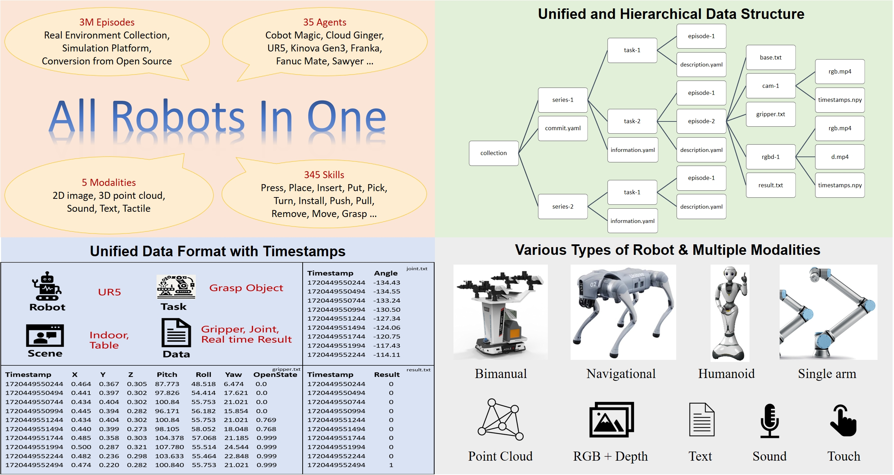
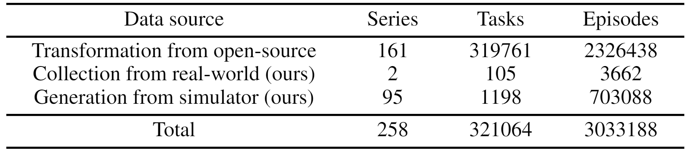
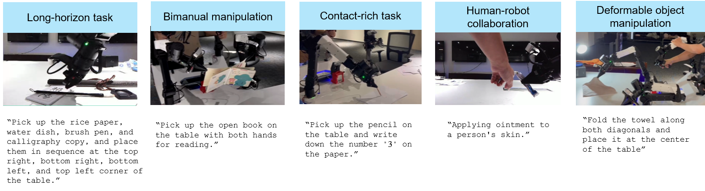
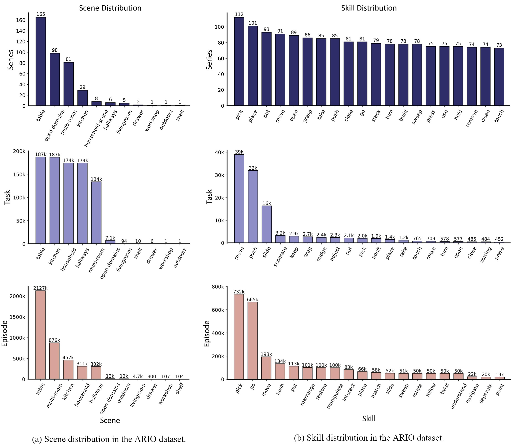

# ARIO

目标：理解 ARIO 的多模态统一视角，能判断 2D、3D、文本、触觉和声音等模态在具体训练目标中的作用。

> 先修：[大规模真机数据集](../01-real-robot-datasets.md)
> 建议：把重点放在“多模态、统一格式、真实与仿真混合”这三件事上
> 数据集规模：ARIO 数据集包含约 300 万条机器人交互轨迹（episodes），覆盖 258 个机器人系列和 321,064 个任务。

ARIO 的全称是 **All Robots in One**。从名字看，它似乎是在强调“把所有机器人放到一个数据集里”；但更准确地说，ARIO 想解决的是：当具身智能数据来自不同机器人、不同场景、不同传感器和不同采集方式时，能不能用一套更统一的结构把它们组织起来。

如果说 Open X-Embodiment 的重点是“把大量已有机器人数据汇聚起来”，AgiBot World 的重点是“工业化地采集同构真机数据”，RoboMIND 的重点是“多任务真实操作演示”，那么 ARIO 的特点是更进一步关注 **多模态统一**：它不只关心图像和动作，还希望把 2D 图像、3D 信息、文本、触觉和声音放到同一个数据标准下观察。

这也是 ARIO 比前面几个数据集更难读的地方。它既是一个数据集，也是一个数据组织标准；它既包含真实机器人数据，也包含仿真生成数据，还包含从已有开源数据集转换而来的数据。因此，读 ARIO 不能只问“它有多少 episode”，而要问：这些 episode 来自哪里、有哪些模态、每种模态是不是每条轨迹都有、不同机器人和传感器之间是如何对齐的。



ARIO 的核心信息可以浓缩成几件事：300 万级 episode、多种机器人形态、五类感知模态、层次化数据结构和基于时间戳的统一格式。

## 阅读目标

读完这一页，可以用下面几个问题检查自己是否读懂：

1. ARIO 到底是一个数据集，还是一种数据标准，二者有什么区别。
2. 它为什么强调 2D、3D、文本、触觉和声音，而不是只做图像与动作。
3. 它的数据来源为什么要分成真实采集、仿真生成和开源数据转换三类。
4. `collection → series → task → episode` 这种层次结构解决了什么问题。
5. 为什么 ARIO 虽然叫 All Robots in One，但不能简单理解成“所有数据可以直接混训”。
6. 实际使用 ARIO 前，应该怎样检查模态缺失、时间对齐、真实/仿真来源和动作语义。

## 为什么会有 ARIO

大规模机器人学习最早遇到的问题通常是“数据不够”。所以很多工作会先扩大 episode 数量，尽可能采更多轨迹。但当数据量变大以后，新的问题会出现：

- 数据来自不同机器人，动作空间不一样；
- 数据来自不同实验室，字段命名不一样；
- 有的数据只有 RGB 图像，有的数据有 RGB-D，有的数据有力觉或触觉；
- 有的数据是真实采集，有的数据是仿真生成；
- 有的数据有语言指令，有的数据只有任务 ID；
- 各类传感器频率不同，时间戳不一定天然对齐。

可以把它理解成一个“机器人数据拼接难题”。如果只是把文件放在一个目录里，数据规模看起来变大了，但训练程序仍然不知道这些字段该如何解释。

ARIO 正是针对这个问题提出的。它不是只想再增加一个机器人数据集，而是试图提出一套更统一的组织方式，让不同来源的数据可以用更一致的层级、配置和时间戳来描述。

这里要区分两个概念：

| 概念 | 含义 |
|---|---|
| ARIO standard | 一套数据组织标准，规定数据层级、元信息、模态和时间戳怎么表示。 |
| ARIO dataset | 按照这套标准整理出来的大规模数据集合，包含真实采集、仿真生成和开源数据转换数据。 |

也就是说，ARIO 不只是“一个下载链接里的数据”，它更像是作者提出的一套 embodied data schema，然后用一个大规模数据集来展示这套 schema 可以覆盖哪些来源。

## ARIO 想补上哪些缺口

ARIO 反复强调四个问题。理解这四个问题，基本就理解了它为什么存在。

### 1. 只靠视觉不够

很多机器人数据集的主模态是相机图像，最多再加机器人状态和动作。这样对 pick-and-place 这类任务已经有帮助，但对很多真实操作任务还不够。

例如：

- 插头是否插进插座，视觉能看一部分，但接触力和细微位姿也很重要；
- 倒液体、敲击、贴胶带等任务中，声音可能包含接触事件信息；
- 抓柔性物体或拧瓶盖时，触觉和力反馈能提供视觉之外的线索；
- 导航任务里，3D 结构和深度信息比单张 RGB 图像更直接。

所以 ARIO 把模态扩展到五类：

```text
2D image
3D vision
text
sound
tactile
```

但这句话要谨慎理解：**ARIO 支持五类模态，不等于每一条 episode 都同时包含五类模态。** 例如声音数据主要来自特定来源，触觉也只会出现在带相应传感器的机器人或任务中。使用 ARIO 时，必须先检查具体子集有哪些字段，而不能默认所有模态都齐全。

### 2. 统一格式比统一目录更重要

把数据放到同一个文件夹里不等于统一。真正的统一至少要回答：

```text
这个 episode 属于哪个场景？
它由哪种机器人采集？
任务指令是什么？
有哪些传感器？
相机、雷达、触觉和本体状态的时间戳如何对应？
action 是末端位姿、关节角、速度，还是底盘控制量？
```

ARIO 试图用层次化目录和配置文件回答这些问题。它把数据组织成 collection、series、task、episode 四层，并使用 `information.yaml` 和 `description.yaml` 保存场景、机器人、传感器和任务描述等信息。

### 3. 多机器人数据不能只靠 action 字段混合

机器人本体不同，动作语义就可能不同。比如：

```text
单臂机械臂：action 可能是 6D 末端位姿增量 + gripper
双臂机器人：action 可能同时包含左臂、右臂和双夹爪
移动机器人：action 可能包含底盘线速度和角速度
人形机器人：action 可能涉及头部、躯干、手臂甚至腿部
```

如果只把这些字段都命名为 `action`，模型并不会自动理解它们的差异。ARIO 的思路是：在统一结构里保留机器人形态、控制对象、物理变量和控制方式等信息，帮助后续使用者区分不同动作语义。

### 4. 只看真机或只看仿真都不够

真机数据价值高，但成本高、采集慢、风险大；仿真数据便宜、可扩展，但和真实世界有差距。ARIO 同时纳入真实采集和仿真生成数据，目的不是说仿真可以直接替代真机，而是给研究者提供一个观察 sim-to-real、数据混合和跨场景泛化的统一入口。

## 它到底包含多少数据

ARIO 的数据规模很大，但这里不要只记一个“3M episodes”。更重要的是看它的来源结构。



ARIO 的总体规模由三类来源组成：开源数据转换、真实场景采集和仿真生成。

| 数据来源 | Series | Tasks | Episodes | 应该怎么理解 |
|---|---:|---:|---:|---|
| 开源数据转换 | 161 | 319,761 | 2,326,438 | 规模最大，主要体现“把已有数据标准化”的能力。 |
| 真实场景采集 | 2 | 105 | 3,662 | 数量不大，但任务设计更有针对性，包含真实双臂操作。 |
| 仿真生成 | 95 | 1,198 | 703,088 | 用于扩展导航和操作场景，也方便研究 sim-to-real。 |
| 总计 | 258 | 321,064 | 3,033,188 | 一个混合来源的大规模统一数据集。 |

这张表说明了一个关键事实：ARIO 的主体规模来自 **开源数据转换**，而不是作者自己从零采集了 300 万条真机轨迹。它的价值不只是“采得多”，而是把 Open X-Embodiment、RH20T、ManiWAV 等已有数据按统一格式重新整理，再加上自己的真实采集和仿真数据。

因此，读 ARIO 时要把三类数据分开看：

```text
开源转换数据：看格式统一和字段保留程度
真实采集数据：看任务设计、传感器和双臂操作质量
仿真生成数据：看场景覆盖、任务生成和与真机的差距
```

如果把三类数据混成一个整体，只看总 episode 数，反而容易误解这个数据集。

## 三条数据来源分别是什么

### 第一条来源：从已有开源数据集转换

ARIO 最大的一部分来自已有开源数据集转换。这里的转换不是简单复制，而是把原数据重新整理到 ARIO 的层次化格式中。

主要涉及的来源包括：

| 来源 | 在 ARIO 中的意义 | 需要注意的点 |
|---|---|---|
| Open X-Embodiment | 提供大规模跨机器人操作数据 | 原始数据来源复杂，字段和动作语义差异大。 |
| RH20T | 提供真实机器人操作、多视角、力/触觉等信息 | 需要处理缺失相机、缺失关节数据和任务描述问题。 |
| ManiWAV | 提供带声音的机器人操作数据 | 声音模态很稀有，但任务数量和规模较小。 |

这一部分体现的是 ARIO 的“标准化能力”。它尝试把不同开源数据转换到同一套结构里，让后续使用者不必为每个数据集重新写读取逻辑。

但转换数据也有天然限制：源数据如果本来缺少某些字段，ARIO 不能凭空补出来。比如某个原始数据集没有触觉传感器，转换后也不会自动变成触觉数据；某个源数据没有清晰的 action convention，转换时只能尽量保留和说明，不能完全消除语义不确定性。

### 第二条来源：真实机器人采集

ARIO 自采的真实机器人数据主要来自 Cobot Magic 平台。这个平台可以理解成一个双臂移动操作系统：它有移动底盘、双臂、夹爪和多路 RGB-D 相机，能够完成桌面场景下的双臂操作任务。



真实采集任务不只包含简单抓取，还包含长程任务、双臂协作、接触丰富操作、人机协作和柔性物体操作。

从教学角度看，这部分最值得关注的不是数量，而是任务类型。它设计了很多比单纯 pick-and-place 更接近真实操作难点的任务，例如：

| 任务类别 | 例子 | 为什么重要 |
|---|---|---|
| 长程任务 | 整理物品、堆叠杯子、按顺序摆放 | 需要模型维持任务进度，而不是只做一步动作。 |
| 双臂精细操作 | 拧瓶盖、传递物体、拉开拉链 | 需要左右臂协调，动作同步比单臂更难。 |
| 接触丰富任务 | 插插头、写字、按压按钮 | 视觉之外的力和接触状态很重要。 |
| 人机协作 | 给人递物、协助涂抹 | 环境中有人参与，安全和交互边界更复杂。 |
| 柔性物体操作 | 折毛巾、铺桌布、处理布料 | 物体形变难预测，不能只靠刚体位姿建模。 |

真实采集还包含人工操作和人工检查。采集者会根据任务说明进行遥操作，每个任务通常会收集多条 episode，任务完成后还会记录难度反馈，并在后处理阶段过滤信息缺失或相机频率异常的轨迹。

这部分数据的价值在于：它让 ARIO 不只是一个“已有数据整理工程”，还包含作者围绕多模态、双臂和真实接触任务设计的采集样本。

### 第三条来源：仿真生成数据

ARIO 的仿真数据主要用于扩展任务和场景覆盖。它包括导航和操作两类方向：

| 仿真来源 | 主要任务 | 数据价值 |
|---|---|---|
| Habitat / HM3D | ObjectNav 等室内导航任务 | 提供大规模室内场景、导航轨迹和 RGB-D 观察。 |
| MuJoCo | 机械臂操作任务 | 适合生成抓取、放置、开抽屉等可控操作数据。 |
| SeaWave 等平台 | 场景与操作生成 | 用于补充更多机器人任务和场景变化。 |

仿真数据的好处是规模大、可控、容易重复生成；问题是仿真和真实之间仍然有 domain gap。比如摩擦、接触、光照、物体材质、传感器噪声都可能和真实环境不同。因此，使用 ARIO 做训练时，最好显式保留 `is_simulated` 或数据来源标记，不要把仿真和真机数据完全混成不可区分的一类。

## ARIO 的层次结构怎么理解

ARIO 的数据结构不是简单的 `episode_0001/episode_0002`。它更强调层次：

```text
collection
  └── series
        └── task
              └── episode
```

每一层有自己的作用：

| 层级 | 含义 | 例子 |
|---|---|---|
| collection | 一个完整数据集合 | ARIO 数据集整体。 |
| series | 一组共享场景、机器人或采集设置的数据 | 某个机器人在某类室内场景下的数据。 |
| task | 具体任务，通常有文本描述 | “把苹果放进篮子”。 |
| episode | 一次完整执行轨迹 | 第 1 次尝试、第 2 次尝试等。 |

这种设计的好处是：它不是只把数据按编号平铺，而是保留了“这条轨迹来自什么场景、属于什么任务、由什么机器人执行”这些上下文。

一个简化后的目录可以写成：

```text
collection/
  series-1/
    information.yaml
    task-1/
      description.yaml
      episode-1/
        cam-1/
          rgb.mp4
          timestamps.npy
        rgbd-1/
          d.mp4
          timestamps.npy
        gripper.txt
        base.txt
        result.txt
      episode-2/
        ...
    task-2/
      description.yaml
      episode-1/
        ...
```

这里有两个配置文件特别重要：

| 文件 | 作用 |
|---|---|
| `information.yaml` | 描述 series 级别的信息，例如场景、机器人、本体、传感器配置。 |
| `description.yaml` | 描述 task 级别的信息，例如任务文本、所需技能、初始和终止条件。 |

读 ARIO 时不要先急着打开视频，而应该先看这两个 YAML 文件。它们相当于这组数据的说明书。如果你不知道当前 series 用的是什么机器人、有哪些传感器、任务描述是什么，直接读取 episode 很容易误解字段。

## 一条 episode 里可能有什么

一条 ARIO episode 通常可以分成几类信息。

### 1. 视觉信息

视觉信息可能包括 RGB 图像、深度图、RGB-D 或点云。对应文件可能是 `rgb.mp4`、`d.mp4`、点云文件或相机目录。

视觉数据回答的是：

```text
机器人在每个时间点看到了什么？
相机是第一视角、第三视角，还是腕部视角？
图像和动作是否同步？
```

这里不能只看图像本身，还要看相机位置和时间戳。一个腕部相机看到的是夹爪附近，第三视角相机看到的是全局场景，它们对策略学习的帮助不同。

### 2. 3D 信息

3D 信息可能来自深度相机、RGB-D、点云或激光雷达。它回答的是：

```text
物体在哪里？
空间结构是什么？
障碍物和目标之间的距离是多少？
```

对于导航任务，3D 信息可以帮助模型理解房间布局和可通行区域；对于操作任务，深度和点云可以帮助模型判断物体高度、距离和接触位置。

但 3D 模态通常比 RGB 更难处理。你需要关心坐标系、相机内参外参、深度尺度、点云坐标单位，以及是否和 RGB 帧时间对齐。

### 3. 文本信息

文本信息包括 series 描述、task 指令、任务说明、所需技能或终止条件。它回答的是：

```text
机器人应该做什么？
当前 episode 属于哪个任务？
这个任务的成功条件是什么？
```

文本在 VLA 或语言条件策略中尤其重要。没有文本时，模型只能从视觉和动作里推断任务；有文本后，模型可以学习“指令—观察—动作”之间的关系。

### 4. 触觉或力相关信息

触觉信息可能来自指尖传感器、力矩估计、关节电流或末端力反馈。它回答的是：

```text
机器人有没有接触到物体？
夹得是否太紧？
是否发生滑动？
插入、拧动、按压等任务是否进入接触状态？
```

触觉不是每个 episode 都有。它通常只出现在特定机器人或特定来源中。使用时要先检查字段是否存在，再决定是否作为模型输入。

### 5. 声音信息

声音信息在机器人数据集中比较少见。它可以帮助判断接触事件，例如敲击、倒入、贴合、刮擦等。ARIO 中的声音模态主要来自包含音频的特定来源数据。

声音数据的难点是：它和视觉、动作的采样频率完全不同，需要根据时间戳切片或对齐。不能把声音当成一个普通低维状态字段直接拼接。

### 6. 控制和状态信息

控制和状态是训练策略最核心的数据之一，包括：

```text
joint position
joint velocity
torque / force
end-effector pose
gripper state
base velocity
navigation state
```

这里最容易出错的是动作语义。比如同样是 `position`，可能是关节角，也可能是末端位置；同样是 `velocity`，可能是关节速度，也可能是移动底盘速度。ARIO 把机器人参数和控制对象纳入统计和配置，就是为了降低这种误解。

## 为什么时间戳是 ARIO 的重点

多模态数据最大的难点之一是频率不同。ARIO 明确强调基于时间戳的记录与对齐。例如，不同传感器可能有不同频率：

```text
camera: 30 Hz
lidar: 10 Hz
proprioception: 200 Hz
tactile: 100 Hz
```

如果没有时间戳，只按第几个样本去对齐，很容易出现错位：

```text
第 10 帧图像
不一定对应第 10 条关节状态
也不一定对应第 10 条触觉读数
```

对机器人学习来说，时间错位会直接破坏监督关系。比如模型本该学习：

```text
当前观察 -> 当前动作
```

结果因为对齐错误，变成：

```text
动作之后的图像 -> 动作之前的控制
```

模型仍然可以训练，loss 也可能下降，但学到的时序关系是错的。

所以在 ARIO 里，时间戳不是辅助字段，而是连接多模态数据的核心线索。实际使用时，至少要检查：

```text
每个模态是否有 timestamps
同一 episode 内时间戳是否递增
相机、状态、动作、触觉之间是否能插值或最近邻对齐
终止帧是否有有效 action
```

## 场景和技能分布怎么看

ARIO 的场景和技能分布很不均匀，这一点非常重要。



从统计图可以看出，ARIO 中大量数据集中在桌面、厨房、家庭和室内场景，技能上也更偏 pick、go、move、push 等常见基础技能。

这说明 ARIO 虽然规模很大，但它不是均匀覆盖所有具身智能任务。它更偏向：

```text
桌面操作
室内导航
家庭场景
常见操作技能
多模态感知
```

所以使用它前要先问：你的研究问题是否和这些分布匹配？

如果你研究桌面操作、室内导航、跨模态感知、语言条件任务，ARIO 很有参考价值。若你研究室外越野、工业重载机械臂、无人机飞行、复杂多人协作，它就不是最直接的数据来源。

此外，场景和技能分布不均匀还会影响训练：

```text
高频技能会主导模型学习；
低频技能可能被模型忽略；
模型看似泛化，实际可能只学会了高频场景；
评估时如果没有按技能类别拆分，很难知道模型真正会什么。
```

因此，如果用 ARIO 训练模型，最好按 scene、skill、robot morphology 和 data source 做分组统计，而不是只报告整体指标。

## ARIO 和 Open X-Embodiment 有什么不同

因为 ARIO 的一部分数据来自 Open X-Embodiment，很多人会把它们混在一起理解。其实两者侧重点不同。

| 对比项 | Open X-Embodiment | ARIO |
|---|---|---|
| 核心定位 | 大规模跨机器人数据集合 | 多模态统一标准 + 混合来源数据集 |
| 主要组织方式 | 常与 RLDS / TFDS 生态相关 | collection / series / task / episode 层次结构 |
| 模态重点 | 主要围绕视觉、状态、动作、语言 | 进一步强调 2D、3D、文本、触觉、声音 |
| 数据来源 | 多个开放机器人数据集 | 开源转换 + 自采真机 + 仿真生成 |
| 关键问题 | 跨本体数据混合 | 多模态、时间戳、统一配置和 sim-real 混合 |

可以这样理解：Open X-Embodiment 更像“大规模跨机器人经验库”；ARIO 更像“试图把多来源、多模态机器人数据整理成统一标准的工程”。

ARIO 并不是替代 Open X，而是在吸收它的一部分数据后，进一步强调格式、模态和时间对齐。

## 它适合研究什么

ARIO 比较适合下面几类研究。

### 1. 多模态具身感知

如果研究问题涉及视觉之外的模态，比如深度、点云、触觉、声音，ARIO 是一个值得看的数据源。它可以帮助研究者思考：

```text
触觉什么时候比视觉有用？
声音能不能帮助判断接触事件？
3D 信息能不能提升导航或操作泛化？
多模态缺失时模型应该怎么处理？
```

### 2. 跨机器人统一表示

ARIO 覆盖多种机器人形态，包括单臂、双臂、移动机器人、人形等。它适合研究不同机器人之间如何共享表示，但不适合简单把所有 action 拼起来训练。

更合理的问题是：

```text
哪些信息可以跨机器人共享？
哪些信息必须保留 robot-specific embedding？
动作空间能不能拆成控制对象、物理变量和坐标系？
```

### 3. 真实与仿真的数据混合

ARIO 同时包含真实和仿真数据，因此可以用来研究：

```text
仿真数据能否提升真机任务？
哪些场景适合从仿真迁移到真实？
仿真和真机是否应该分阶段训练？
是否需要 domain randomization 或 source embedding？
```

### 4. 统一数据格式和数据治理

对于做机器人数据工程的人来说，ARIO 的格式设计本身就有学习价值。它展示了一个大规模多源数据集如何用层次结构、YAML 配置和时间戳把复杂信息组织起来。

## 使用 ARIO 前的最小检查流程

如果你以后真的要用 ARIO，不建议一开始就全量加载。更稳妥的流程是：

```text
第一步：选一个 series
  先确定场景、机器人、本体、传感器配置。

第二步：读 information.yaml
  看 robot morphology、sensor、camera、是否仿真、采集来源。

第三步：选一个 task
  读 description.yaml，看任务文本、所需技能和成功条件。

第四步：抽样几个 episode
  检查视频、深度、状态、动作、result、timestamps。

第五步：检查模态缺失
  确认哪些 episode 有 RGB，哪些有 depth，哪些有 tactile 或 audio。

第六步：检查时间对齐
  比较 image / state / action / tactile / audio 的时间戳。

第七步：决定训练字段
  不需要的模态先作为 metadata，不要盲目拼进模型。
```

这个流程的核心不是“能不能打开文件”，而是确认你理解了这批数据的来源、模态、动作语义和时序关系。

还要单独检查来源许可。ARIO 的一部分数据来自已有开源数据集转换，使用时不能只看 ARIO 项目页，还要回到 Open X-Embodiment、RH20T、ManiWAV 等原始数据源确认许可、引用和再分发边界。

## 常见误解

**误解一：ARIO 每条数据都有五种模态**

不是。ARIO 支持五种模态，但不同来源的数据模态不同。很多 episode 可能只有 RGB、状态和动作；音频和触觉只在特定数据来源或任务中出现。

**误解二：统一格式等于统一动作空间**

不是。统一格式只是让不同数据能放进相似结构里，不能自动消除机器人本体差异。单臂、双臂、移动底盘、人形机器人的 action 仍然需要分开解释。

**误解三：仿真数据和真机数据可以直接混在一起**

不建议。仿真和真机的视觉风格、接触动力学、传感器噪声和动作执行误差都不同。训练时最好保留数据来源标记，并在实验设计中区分来源。

**误解四：数据越多，模型一定越好**

不一定。数据规模只是一个因素。模态是否对齐、任务是否相关、动作语义是否一致、低质量轨迹是否过滤，都会影响训练结果。

## 小结

ARIO 是一个以多模态统一为核心的大规模具身智能数据集。它的价值不只在 300 万级 episode，更在于它提出了一套 collection、series、task、episode 的层次化结构，并尝试用统一配置和时间戳把真实采集、仿真生成和开源转换数据组织起来。

读 ARIO 时，最重要的是不要把它当作普通图像数据集，也不要只按 episode 数量评价它。它真正值得学习的是：当机器人数据包含多种本体、多种任务、多种传感器和多种来源时，应该怎样记录场景、机器人、任务、模态和时间关系。

进一步阅读可以看：
- [ARIO 主页](https://imaei.github.io/project_pages/ario/)
- [ARIO paper](https://arxiv.org/abs/2408.10899)
