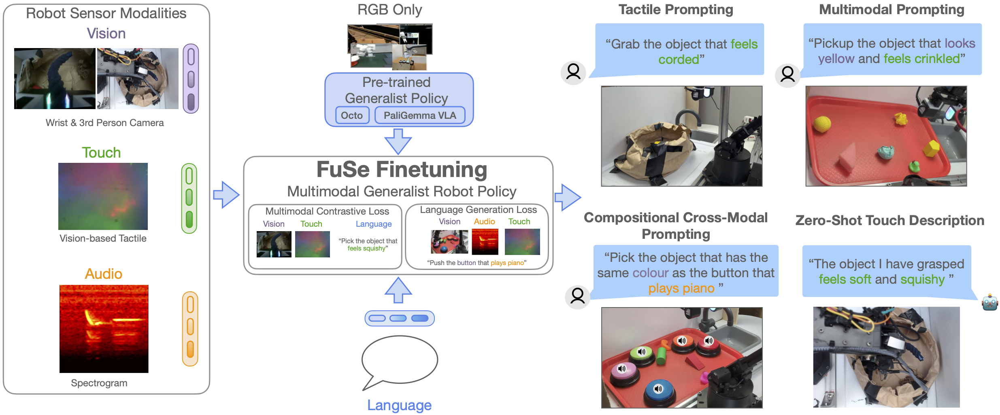
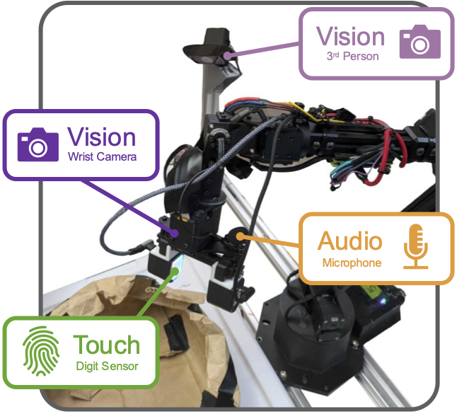
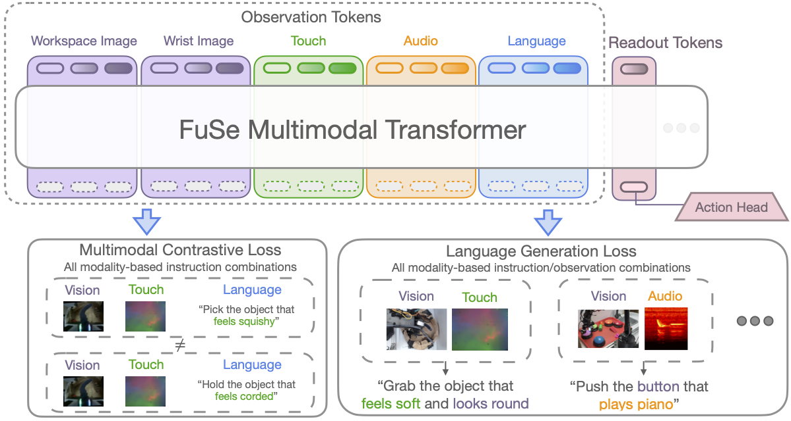

# FUSE Dataset

目标：理解 FUSE Dataset 对遮挡、远程操控和多传感器融合的价值，能区分训练样本、困难条件和评测样本。

> 先修：[大规模真机数据集](../01-real-robot-datasets.md)
> 建议：重点看远程操控、遮挡条件和视觉之外的传感器信息
> 数据集规模：FuSe 数据集包含 26,866 条机器人操作轨迹，数据规模约 361 GB。

它对应的工作是 Beyond Sight: Finetuning Generalist Robot Policies with Heterogeneous Sensors via Language Grounding。从题目就能看出，这个数据集真正想强调的不是“又多了一批机器人轨迹”，而是一个更具体的问题：当视觉信息不够用时，机器人能不能借助触觉、声音等异构传感器继续完成任务。

前面几节我们已经看过 Open X-Embodiment、AgiBot World、RoboMIND 和 ARIO。它们各自代表了不同方向：Open X-Embodiment 强调跨本体大规模汇聚，AgiBot World 强调工业化同构采集，RoboMIND 强调多任务真实演示，ARIO 强调多机器人和多模态统一。FUSE 的位置更窄，但也更尖锐：它不是百万级规模数据集，也不是覆盖大量机器人平台的数据集，而是专门构造了一组**视觉不充分、需要多感官推理**的真实机器人操作任务。

这也是为什么本节不能只把 FUSE 看成“带触觉和音频的数据集”。更准确地说，它是一个用来研究下面这类问题的数据源：

```text
只看图像时，机器人无法确定目标；
接触到物体后，触觉能补充形状、材质、软硬等信息；
按下按钮后，声音能告诉机器人这个按钮对应什么语义；
语言指令把视觉、触觉、声音这些模态连接到同一个任务目标。
```

读完这一页，应该能看懂 FUSE Dataset 为什么重要、它包含哪些任务、每种模态各自解决什么问题，以及为什么这类数据不能用普通“图像 + 动作”的方式简单处理。

## 阅读目标

这一页先围绕几个实际问题展开：

1. FUSE Dataset 是什么，它和大规模视觉机器人数据集有什么不同。
2. 为什么这个数据集特别强调视觉之外的触觉、声音和语言。
3. 它的机器人硬件和传感器是怎样布置的，一条轨迹里通常包含哪些观测。
4. 三类任务分别考察什么能力：桌面抓取、购物袋抓取和按钮按压。
5. 为什么购物袋任务是理解 FUSE 的关键例子，因为它故意制造了视觉遮挡和弱光条件。
6. 语言在这个数据集里不只是任务文本，而是连接视觉、触觉和声音的公共语义接口。
7. 使用这批数据前要检查哪些东西：模态是否齐全、时间是否对齐、action 是否能对应每一步观测。

## 为什么会有 FUSE Dataset

机器人学习数据长期以视觉为主。最常见的数据形式是：给机器人一个或多个 RGB 相机，再记录机器人状态和动作。对很多任务来说，这已经足够，比如桌面上有一个清楚可见的红色方块，指令是“抓起红色方块”，模型只要从图像里定位目标，再输出动作即可。

但真实操作并不总是这样清楚。很多时候，视觉会遇到三个问题。

第一，目标可能被遮挡。比如机器人把手伸进袋子里，第三视角相机只能看到袋子外部，腕部相机也可能因为袋内光线差而看不清。此时图像并不能完整描述机器人正在接触什么。

第二，不同物体可能外观看起来相似，但触感不同。一个物体可能柔软、粗糙、硬、光滑，这些性质很难只从 RGB 图像里稳定判断。人类拿起物体时会自然依赖触觉，但普通视觉策略不会。

第三，有些任务本身与声音有关。例如按钮按下后会播放不同声音，任务可能要求“按下播放钢琴声的按钮”。如果模型只看图像，它看到的是按钮颜色和位置，却不知道按钮发出的声音是什么。

FUSE Dataset 就是围绕这些问题设计的。它不是为了覆盖尽可能多的机器人，而是为了让一个真实机器人在有限任务中同时记录视觉、触觉、声音、动作和语言，从而研究多模态信息如何进入通用机器人策略。



这张图可以从左到右理解：左侧是机器人能够感知到的不同模态，包括视觉、触觉、音频和语言；中间是把这些模态接入通用机器人策略的 finetuning 方法；右侧展示的是多模态能力，例如根据触觉提示抓物体、根据声音和颜色进行组合推理，以及让机器人描述接触到的物体感觉。

FUSE 给人的提醒很直接：机器人数据不一定越大越好，有时更关键的是任务是否迫使模型使用某种传感器。如果一个任务只靠图像就能轻松完成，那么即使数据里保存了触觉和声音，模型也可能完全不使用它们。FUSE 的设计重点正是把任务做成“只看视觉会不够”的形式。

## 它和前面几个数据集有什么不同

FUSE 和前面几个数据集的差别，可以从“规模”和“问题意识”两个角度看。

| 数据源 | 主要特征 | 更适合观察的问题 |
|---|---|---|
| Open X-Embodiment | 多来源、多机器人、大规模汇聚 | 跨本体泛化、数据混合、通用策略预训练 |
| AgiBot World | 同构平台、大规模工业化采集 | 工业化数据生产、质检流程、任务规模化 |
| RoboMIND | 多机器人、多任务真实演示 | 多任务操作、物体分布、机器人本体差异 |
| ARIO | 多机器人、多模态统一结构 | 多模态数据标准、真实与仿真混合 |
| FUSE | 单一主要平台、异构传感器密集记录 | 视觉不足时如何利用触觉、声音和语言 |

FUSE 公开数据卡给出的规模是 26,866 条 trajectories，约 2.7 万条，不属于本章最大的那类数据集。但它的数据价值不在“轨迹数量压倒性大”，而在“每条轨迹里的感知条件更复杂”。尤其是触觉和声音这两类模态，与动作数据和语言指令同时出现，这在机器人数据集中并不常见。

因此，FUSE 更像一个小而尖的数据集：它不是用来替代 Open X-Embodiment 这种大规模预训练数据，而是用来研究通用策略如何接入新的传感器。论文中也正是把它用于 finetune 已有 generalist policy，例如 Octo 或 VLA 模型，而不是从零开始训练一个超大规模机器人基础模型。


## 机器人和传感器设置

FUSE Dataset 的真实机器人平台是 **WidowX 250 6-DoF 机械臂**。这是一类常见的桌面操作机器人，适合抓取、放置、按按钮等中小范围操作任务。机器人通过末端执行器的增量位移命令控制，频率为 5 Hz。这里的 5 Hz 很重要，因为它决定了 action 的时间尺度：每秒只有 5 次动作命令，和视频帧率、音频采样率、触觉图像频率都不是同一个概念。



从传感器角度看，FUSE 的机器人不是只有一台相机。它包含几类不同观测：

| 模态 | 具体设备或数据 | 作用 |
|---|---|---|
| 第三视角视觉 | 外部 RGB 相机 | 看整体场景、物体位置、袋子或托盘布局 |
| 腕部视觉 | 安装在机械臂末端附近的 RGB 相机 | 看夹爪附近局部区域 |
| 触觉 | 两个 DIGIT tactile sensor，位于夹爪手指 | 感知接触、材质、形变、软硬等接触信息 |
| 音频 | 标准麦克风 | 记录按钮按下后的声音反馈 |
| IMU | 9-DoF IMU | 提供惯性相关信息 |
| 本体状态 | 机器人自身状态 | 描述机械臂和夹爪状态 |
| 动作 | 末端执行器 delta action | 行为克隆或策略训练的监督目标 |
| 语言 | 模板化任务指令 | 指定目标，并把不同模态连接到同一语义空间 |

视觉图像分辨率为 640×480，DIGIT 触觉图像分辨率为 320×240，音频观测保存最近 1 秒的麦克风采样，采样率为 44,100 Hz。这里要特别注意：这些模态的原始数据形态完全不同。视觉和触觉都可以看成图像，但触觉图像不是普通 RGB 场景图；音频是高频时间序列；action 是低频控制命令；语言是离散文本。

因此，FUSE 的难点不只是“多了几个字段”。这些字段的采样频率、物理含义和模型输入方式都不一样。一个模型要用好它，至少要解决三个问题：

```text
第一，如何把视觉、触觉、音频和语言编码到可比较的表示空间；
第二，如何让这些模态和同一时刻的 action 对齐；
第三，如何避免模型只依赖视觉，而忽略新增的触觉和声音。
```

## 一条轨迹里通常有什么

FUSE Dataset 的基本单位仍然是 trajectory，也就是一次完整的机器人操作过程。每条 trajectory 是通过 Meta Quest 2 VR 头显远程操控采集的，并且带有模板化语言指令。

可以把一条轨迹抽象成下面这样：

```text
trajectory_i
  instruction: "pick up the soft red object"
  steps:
    step_000:
      third_person_rgb
      wrist_rgb
      tactile_left
      tactile_right
      recent_audio_window
      robot_state
      action
    step_001:
      third_person_rgb
      wrist_rgb
      tactile_left
      tactile_right
      recent_audio_window
      robot_state
      action
    ...
```

不同任务并不一定包含完全相同的模态。例如桌面抓取和购物袋抓取主要包含视觉、触觉和动作；按钮按压任务除了视觉、触觉和动作，还包含声音。这个差异非常重要，因为它说明 FUSE 不是一个“所有 episode 都有完全同构字段”的简单数据表。

如果把它转成通用格式，例如 LeRobot 或 RLDS，需要认真处理缺失模态和任务类型：

```text
桌面抓取：vision + touch + action + language
购物袋抓取：vision + touch + action + language
按钮按压：vision + touch + audio + action + language
组合任务：vision + touch + audio + action + language + cross-modal instruction
```

如果模型只能消费图像和动作，那么触觉、音频最多只能作为 metadata，不能直接参与训练。如果模型确实要使用触觉或音频，就必须确认每一步 action 对应的触觉图像和音频窗口是否对齐。

## 三类主要任务

FUSE Dataset 的任务数量不像 RoboMIND 那样按数百个 task 展开。它的任务设计更集中，主要围绕三个核心环境：桌面抓取、购物袋抓取和按钮按压。它们各自服务于不同的多模态学习问题。

### 桌面抓取：先看普通视觉任务如何加入触觉

桌面抓取任务是最接近常规机器人操作的数据。多个物体被放在托盘上，机器人根据文本指令抓取正确目标。例如，指令可能要求抓某个特定物体，或者根据外观和触感属性选择目标。

这个任务看起来简单，但它的作用很关键：它提供了一个相对可控的环境，用来比较“只看视觉”和“同时看视觉与触觉”有什么区别。在桌面场景中，第三视角和腕部视角通常能看到目标，因此视觉信息比较强。触觉在这里更多用于补充物体属性，例如软硬、表面纹理、接触形变等。

可以这样理解：桌面抓取是 FUSE 的基础任务，用来证明多模态策略在普通可见场景中不会因为加入触觉而失效，同时也能在物体属性判断上得到额外信息。

### 购物袋抓取：视觉不够用时触觉变得重要

购物袋抓取是理解 FUSE Dataset 的核心任务。它和桌面抓取类似，也是让机器人抓取指定物体，但物体被放在纸袋中。

这个设置会带来两个问题。

第一，第三视角相机很容易被袋子遮挡。当机械臂伸进袋子之后，相机看到的可能主要是袋口、机械臂外部和一部分纸袋，而不是目标物体。

第二，腕部相机进入袋子后会遇到弱光和近距离遮挡。即使相机在夹爪附近，也不一定能稳定看到完整物体。

这时触觉就不是“锦上添花”，而是可能成为决定性信息。机器人接触到物体后，触觉传感器能反馈局部形变、边缘、软硬或表面性质。对于人类来说，在袋子里摸东西是一件很自然的事；对机器人来说，这就要求模型能把触觉和语言目标连接起来。

购物袋任务之所以重要，是因为它人为制造了一个 partially observable 场景：视觉观测不完整，机器人必须依赖非视觉信息才能更稳地完成任务。这也是 FUSE 和普通视觉机器人数据集最大的区别之一。

### 按钮按压：声音成为任务语义的一部分

按钮按压任务引入了音频。场景中有多个彩色按钮，每个按钮被按下后会播放不同声音，同时还有一些 distractor 物体。机器人收到的指令可能是视觉相关的，也可能是声音相关的。

比如视觉指令可以是：

```text
press the red button
```

声音指令可以是：

```text
press the button that plays piano
```

这两种指令对应的推理方式不同。前者主要依赖视觉，模型只要识别红色按钮即可；后者不能只看图像，因为“piano”对应的是按下后产生的声音。模型需要把按钮和声音建立联系。

按钮任务还包含组合推理。例如：

```text
grab the object that has the same color as the button that plays piano
```

这条指令要求模型先知道哪个按钮会播放 piano，再找到和这个按钮颜色相同的物体，最后抓取这个物体。这里语言把声音、颜色和物体操作连接起来，任务不再是单一模态识别。

这类设计使 FUSE 不只是多传感器数据集，而是一个研究跨模态语义组合的数据集。

## 为什么语言在 FUSE 里特别重要

在普通语言条件机器人数据集中，语言通常只是告诉机器人“做什么”。例如：

```text
pick up the carrot
put the cup in the bowl
open the drawer
```

但在 FUSE 中，语言还有另一层作用：它是不同传感器之间的公共语义接口。

触觉本身是一个局部接触信号。音频本身是一段波形。视觉本身是一张图。它们直接之间很难比较，但语言可以把它们统一起来：

```text
视觉：red, round, yellow, button, bag
触觉：soft, squishy, crinkled, hard
声音：piano, metal, sound of a specific button
动作：grab, press, lift
```

FUSE 的训练思想就是把这些模态通过语言连接起来。比如触觉图像可以对应“feels soft”，音频片段可以对应“plays piano”，视觉图像可以对应“red button”。这样模型不仅学习从 observation 到 action，还学习不同模态和语言概念之间的关系。



这张架构图里可以看到，视觉、触觉、音频和语言都被编码成 observation tokens。模型不只是输出 action，还通过多模态对比损失和语言生成损失学习模态之间的语义关系。对数据集使用者来说，这说明一个关键点：FUSE 的语言标注不是可有可无的 caption，而是训练目标的一部分。

因此，如果只把 FUSE 当作普通行为克隆数据来用，丢掉语言和触觉/音频之间的关联，就会浪费它最有价值的部分。

## 触觉数据应该怎么看

FUSE 使用的是 DIGIT tactile sensor。DIGIT 传感器输出的是图像形式的触觉观测。它不是“力传感器读数表”，也不是简单的接触开关，而是通过视觉方式记录弹性表面变形，从而反映接触位置、局部形状和压力变化。

触觉数据和普通 RGB 图像有相似之处，也有很大区别。

相似之处在于：它也可以输入卷积网络或视觉编码器，也可以被看成一张 2D 图像。

不同之处在于：触觉图像没有普通场景图像中的物体外观和背景，而是局部接触形变。模型要从它里面学到的是“接触到了什么、接触形状如何、是不是软、是不是皱、是不是硬”等属性。

FUSE 中还对触觉观测做了一个重要处理：从触觉图像中减去静态背景图像，用来强调相对于零形变状态的变化。这一步的直觉很简单：不同 DIGIT 传感器本身可能有固定纹理、亮度差异或安装差异，减去背景后，可以更突出真正由接触导致的变化。

使用触觉数据时要特别注意三件事：

```text
第一，左右两个夹爪手指的触觉传感器不能随便合并。
  左指和右指接触到的物体局部不同，时间上也可能不完全同步。

第二，触觉图像只有接触后才真正有信息。
  在没有接触时，它可能主要是背景或噪声。

第三，触觉和 action 的对应关系要看接触时刻。
  如果动作还没碰到物体，触觉不能提前告诉模型物体属性。
```

所以，触觉数据并不是“多一个图像通道”那么简单。它和动作阶段强相关：接触前、接触中、抓起后，触觉图像的意义完全不同。

## 声音数据应该怎么看

FUSE 中的音频主要出现在按钮按压任务中。每个按钮按下后播放不同声音，任务可能要求机器人根据声音语义选择目标。

音频数据与视觉和触觉又不同。视觉和触觉是图像，音频是时间序列。FUSE 保存的是最近 1 秒的麦克风样本，采样频率为 44,100 Hz。一段音频窗口会包含大量采样点，通常不能直接把原始波形当成普通低维状态使用，而要转换成频谱图、音频 embedding 或其他音频特征。

在 FUSE 的图示中，音频常以 spectrogram 的形式出现。可以把 spectrogram 理解成“声音的图像表示”：横轴表示时间，纵轴表示频率，颜色表示能量强弱。不同按钮播放不同声音，它们在频谱图上的模式也不同。

声音数据最容易产生两个误解。

第一个误解是：只要有音频字段，模型就一定会使用声音。实际上，如果任务可以只靠视觉完成，模型可能会忽略音频。因此按钮任务必须设计成“声音本身决定目标”的形式。

第二个误解是：音频只在按下按钮后才出现，所以不能像图像一样从一开始就给出完整目标信息。对于需要根据声音做推理的任务，声音可能是机器人交互之后才获得的反馈。这就让任务变成一个更接近主动感知的问题：机器人需要通过行动获得声音，再根据声音继续决策。

## 远程操控数据的意义和风险

FUSE Dataset 的轨迹是通过 Meta Quest 2 VR 头显远程操控采集的。远程操控在机器人数据中很常见，因为它能让人类较自然地控制机械臂完成任务，尤其适合收集真实世界 demonstration。

但远程操控也会带来数据解释上的问题。

首先，动作里包含操作者的习惯。不同操作者可能有不同的移动速度、抓取姿态和纠错方式。如果数据只来自少量操作者，模型可能会学到操作者风格。

其次，远程操控存在延迟。人看到画面、做出动作、机器人执行动作之间有时间差。如果延迟稳定，训练时还能通过对齐处理；如果延迟不稳定，就会导致 observation 和 action 之间的监督关系变得模糊。

第三，远程操控轨迹中常常包含试探动作。尤其在购物袋任务中，人类操作者可能会先伸进去摸一摸，再调整夹爪位置。这类轨迹对多模态学习很有价值，但对普通行为克隆来说也更难，因为同一条轨迹里既有信息收集动作，也有最终抓取动作。

因此，FUSE 里的远程操控数据不能只看成“专家最优轨迹”。它更像人类在复杂感知条件下完成任务的过程记录，其中包含观察、试探、接触、修正和执行。

## 为什么不能把 FUSE 当作普通视觉数据集

使用 FUSE 时最容易犯的错误，就是只保留 RGB 图像和 action，把触觉、声音、语言都丢掉。这样当然也能得到一批机器人操作轨迹，但会把 FUSE 的核心价值削弱掉。

可以用三种读取方式来理解它：

```text
最弱读取方式：vision + action
  把它当成普通行为克隆数据，只训练图像到动作。
  能跑通，但无法体现 FUSE 的多模态价值。

中等读取方式：vision + touch + action
  适合研究遮挡和接触信息，尤其是购物袋抓取。
  需要处理触觉图像编码和时序对齐。

完整读取方式：vision + touch + audio + language + action
  适合研究多模态提示、跨模态组合推理和 VLA finetuning。
  需要模型结构真正支持异构模态输入。
```

如果你的模型结构只能接受图像，那么 FUSE 不是不能用，但要明确你使用的是它的弱版本。如果你的研究目标是多模态机器人学习，就应该尽量保留触觉、音频和语言字段。

## 适合研究什么

FUSE Dataset 适合的研究问题比较明确。

### 视觉遮挡下的机器人操作

购物袋任务天然适合研究部分可观测场景。机器人看到的信息不完整，必须依靠触觉补充。这比普通桌面抓取更接近真实世界：很多物体会被容器、袋子、抽屉、柜门或其他物体遮挡。

### 触觉增强的模仿学习

如果模型能把 DIGIT 图像转成有效表示，就可以在抓取过程中根据接触反馈调整动作。触觉对软物体、形变物体、外观相似物体特别有价值。

### 音频条件机器人任务

按钮按压任务提供了一个很清楚的音频监督场景。声音不是背景噪声，而是任务语义的一部分。它适合研究声音如何进入 VLA 或 policy 模型。

### 跨模态语言 grounding

FUSE 的语言指令可以把视觉、触觉、声音连接起来，因此适合研究跨模态对齐。比如“soft”“crinkled”“plays piano”这些词分别对应触觉、视觉和声音信息，模型必须建立语言和传感器之间的映射。

### 通用策略的多模态微调

FUSE 很适合作为 finetuning 数据集，而不是从零训练数据集。它可以用来研究：一个在大规模视觉机器人数据上预训练的 generalist policy，如何吸收新的传感器模态。

## 使用前的最小检查流程

如果你只是看论文或网页，理解上面的内容就够了。但如果你真的要使用 FUSE Dataset，至少要先做下面这些检查。

### 1. 确认你使用的是哪类任务

先区分：

```text
tabletop grasping
shopping bag grasping
button pressing
compositional prompting tasks
```

不同任务包含的模态不同。如果把所有任务混在一起训练，必须处理缺失音频、不同指令结构和不同成功定义。

### 2. 确认每条轨迹的模态是否齐全

至少检查：

```text
third-person RGB 是否存在
wrist RGB 是否存在
left/right tactile 是否存在
audio window 是否存在
action 是否存在
language instruction 是否存在
```

按钮任务中音频尤其重要；购物袋任务中触觉尤其重要。如果关键模态缺失，这条轨迹对对应研究问题的价值会下降。

### 3. 检查时间对齐

多模态数据最怕时间错位。视觉、触觉、音频和 action 的采样频率不同，不能假设每个数组下标天然对应同一时刻。

最小检查方式是抽样可视化一条轨迹：

```text
看机械臂接触物体前后，触觉图像是否发生变化；
看按钮被按下之后，音频窗口是否出现对应声音；
看 action 高峰是否和机器人实际运动阶段对应。
```

如果这些关系不对，模型即使训练成功，也可能学到错误对应关系。

### 4. 检查语言指令和任务是否一致

FUSE 使用模板化语言指令。模板化的好处是语义明确，坏处是语言多样性有限。因此如果要训练开放语言模型，可能需要考虑指令改写或扩展；如果只是做严格任务条件训练，则模板化指令更稳定。

### 5. 检查 action 表示

FUSE 的机器人通过末端执行器增量位置命令控制，频率为 5 Hz。不要把它误解成关节角位置，也不要直接和其他机器人数据集的 action 混用。

如果要转成 LeRobot 或 RLDS，`action` 的 metadata 至少要写清：

```text
机器人本体：WidowX 250
控制方式：delta end-effector position
控制频率：5 Hz
夹爪动作：是否单独编码
任务类型：tabletop / bag / button
可用模态：vision / touch / audio / language
```

## 常见误解

**误解一：FUSE 是一个大规模通用机器人数据集**

FUSE 的规模是 2.7 万条轨迹左右，不属于百万级大规模数据集。它的价值在于多模态密度和任务设计，而不是轨迹数量。

**误解二：触觉和声音只是额外输入，随便加就行**

触觉和声音都有自己的时序和物理含义。触觉只有接触时才有高价值；音频往往在按钮按下后才出现。直接把它们拼到图像特征后面，不一定能让模型实际使用这些信息。

**误解三：购物袋任务只是更难的抓取任务**

购物袋任务的重点不是“抓取更难”，而是视觉被遮挡后，模型必须依赖触觉等非视觉信息。它是部分可观测多模态任务的代表。

**误解四：按钮任务只是颜色分类**

如果指令是“press the red button”，它确实接近视觉分类；但如果指令是“press the button that plays piano”，任务就必须使用声音语义。组合任务还会把声音、颜色和物体抓取连接起来。

**误解五：语言只是标注文本**

在 FUSE 中，语言是多模态 grounding 的核心。它把视觉、触觉和声音的感知结果连接到任务目标。如果丢掉语言，就很难复现 FUSE 的核心思想。

## 小结

FUSE Dataset 是一个面向异构传感器机器人学习的数据集。它不靠机器人平台数量取胜，也不靠百万级轨迹取胜，而是通过精心设计的真实任务，让机器人在视觉不足时必须利用触觉和声音等信息。

它的核心可以概括为三点：

```text
第一，数据包含视觉、触觉、音频、语言、动作和机器人状态。
第二，任务故意覆盖遮挡、弱光、接触判断和声音语义。
第三，语言被用作连接不同传感器模态的公共语义接口。
```

因此，FUSE 最适合用来研究多模态机器人策略、触觉和声音对操作的帮助、以及通用机器人策略如何吸收视觉之外的新传感器。使用它时，重点不是“能不能读出图片和动作”，而是要确认各模态是否齐全、是否对齐、是否真的被任务需要。

进一步阅读可以看：
- [FuSe 主页](https://fuse-model.github.io/)
- [FuSe paper](https://arxiv.org/abs/2501.04693)
- [FuSe 代码仓库](https://github.com/fuse-model/FuSe)
- [FuSe dataset](https://huggingface.co/datasets/oier-mees/FuSe)
