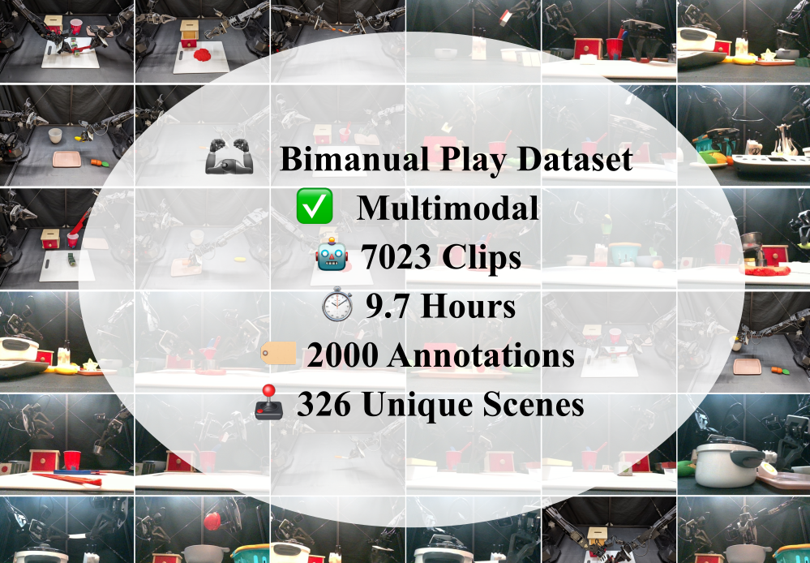

# BiPlay Dataset

目标：理解 BiPlay Dataset 的双臂、长 episode 和语言片段特点，能检查左右臂同步、clip 边界和语言标注粒度。

> 先修：[大规模真机数据集](../01-real-robot-datasets.md)
> 建议：重点看双臂轨迹、长 episode 切片和语言片段对齐
> 数据集规模：BiPlay 数据集大小约 335 GB，包含 7,023 条双臂机器人操作轨迹，总计 9.7 小时机器人交互数据。

BiPlay Dataset 是一个面向**双臂机器人操作**的数据集。它不是 Open X-Embodiment 那种跨很多机器人本体的大混合数据，也不是 AgiBot World 那种工业化大规模采集数据，而是围绕 ALOHA 双臂平台采集的一批多样化 play-style 演示数据。它最值得学习的地方，是如何把一段较长的双臂操作过程切成带语言描述的短片段，并用这些片段训练语言条件下的双臂操作策略。



如果只看表面数字，BiPlay 似乎比前面几个百万级数据集小很多；但对双臂机器人来说，它的价值不在“规模最大”，而在于它专门覆盖了更复杂的双手协作场景。单臂机器人常见任务是抓、放、推、拉；双臂机器人则会出现更多需要两只手配合的动作，例如一只手固定物体、另一只手操作工具，一只手递交物体、另一只手接住，或者两只手同时完成一个长程过程。这样的数据很难只靠单臂数据迁移得到。

本节会围绕几个问题展开：BiPlay 为什么出现，它和普通 ALOHA 数据有什么区别；它的“play”到底是什么意思；它的数据是怎样从长 episode 切成 clips 的；语言标注在其中起什么作用；双臂 action 为什么不能按单臂数据简单处理；最后，使用这个数据集前应该检查哪些地方。

## 为什么需要 BiPlay

在机器人学习里，双臂操作一直比单臂操作更难收集数据。原因很直接：双臂系统的自由度更多，动作同步更复杂，任务也更长。一个简单的抓取任务，单臂可能只需要接近、闭合夹爪、抬起；双臂任务可能需要一只手拿住容器，另一只手把物体放进去，或者一只手扶住笔杆，另一只手拔掉笔帽。

早期公开的双臂数据集通常更像“任务演示集合”：每个任务固定物体、固定场景、固定目标，收集若干条成功演示。这类数据适合训练一个特定任务的策略，但不太适合测试模型是否能在随机物体、随机背景和变化目标下泛化。BiPlay 的出发点正是补这个空缺：它希望提供一批更接近“自由交互”的双臂数据，让模型看到更丰富的物体组合、场景布局和语言任务。

可以把 BiPlay 和传统任务演示这样区分：

| 数据类型 | 典型做法 | 适合什么 | 局限 |
|---|---|---|---|
| 固定任务演示 | 一个任务、一套物体、一批重复成功轨迹 | 训练单一任务策略 | 泛化弱，容易记住场景 |
| Play-style 数据 | 一个随机场景里连续完成多个短任务 | 学习多样动作片段和语言条件行为 | 切片、标注和边界处理更复杂 |
| BiPlay | 随机场景 + 双臂操作 + clip 级语言描述 | 研究双臂泛化、语言 grounding 和大模型策略训练 | 数据规模不如跨平台大数据集，且主要集中在 ALOHA 本体 |

这里的“play”不是随便乱动，而是指在一个随机布置的场景中连续完成多个有意义的交互。采集时先构造一个包含多种物体的场景，然后操作者在这个场景里完成一串任务。采完之后，再把长时间操作切成多个片段，每个片段对应一个较明确的语言描述。

## 数据集的基本规模

| 项 | 数值 |
|---|---:|
| 机器人平台 | ALOHA 双臂机器人 |
| 采集地点 | UC Berkeley RAIL Lab |
| 数据时长 | 9.7 小时 |
| clips 数量 | 7023 |
| language annotations | 2000 |
| unique scenes | 326 |
| Hugging Face 仓库总大小 | 约 335 GB |
| 其中 `BiPlay/` 主目录大小 | 约 155 GB |

首先，`7023 clips` 不是 7023 条从头到尾独立采集的完整 episode。BiPlay 的原始采集过程是较长的 play episode，每个 play episode 大约数分钟，里面包含多个连续任务。后处理时，这些长 episode 会被切成更短的 clips。每个 clip 更像一个训练样本单位，描述一段局部行为。

其次，`2000 language annotations` 和 `7023 clips` 不是同一个统计口径。不要简单理解成“每条 clip 都有一个完全不同的自然语言句子”。更稳妥的理解是：数据集中存在大量语言标注，这些标注用于把动作片段和任务语义联系起来；实际使用时，需要查看加载器返回的字段，确认每条样本对应的是哪一种语言信息。

最后，`326 unique scenes` 是理解 BiPlay 泛化能力的关键。它说明数据不是在一个固定桌面布局上重复录，而是构造了许多不同场景。对语言条件策略来说，这一点很重要：模型不能只记住“红色方块总在左边”，而需要在不同背景、物体和布局里定位目标。

## 它用的是什么机器人

BiPlay 使用的是 ALOHA 双臂机器人。可以先把 ALOHA 理解成一种低成本双臂遥操作平台：它有左右两只机械臂，每只手臂末端有夹爪，采集时由人类通过遥操作设备控制机器人完成任务。

这和前面几个数据集有明显区别：

- Open X-Embodiment 强调跨本体，里面包含很多不同机器人。
- AgiBot World 强调工业化规模采集和质检流程。
- RoboMIND 强调多任务、多物体和多协作臂覆盖。
- BiPlay 主要集中在一个双臂平台上，重点是双臂动作片段和语言任务的多样性。

这种设计有优点也有边界。优点是：本体比较统一，左臂、右臂、相机、夹爪和动作语义相对一致，更适合训练同一类双臂策略。边界是：它不是天然的跨机器人泛化数据集。如果你的目标机器人不是 ALOHA，尤其是关节数、夹爪、控制频率、相机布局差别很大，就不能直接把它当成可无缝复用的训练数据。

## 从长 episode 到短 clip

BiPlay 最重要的组织方式，是从较长 play episode 中切出短 clip。这个过程可以理解成三层：

```text
长 play episode
  ├─ 场景固定：一组随机物体和背景
  ├─ 操作者连续完成多个任务
  └─ 时间长度约数分钟
        ↓ 后处理切分
短 clip
  ├─ 覆盖一个局部任务或动作片段
  ├─ 对应一段语言描述
  └─ 可作为训练样本使用
        ↓ 训练时再切窗口
模型训练 window
  ├─ 若干帧 observation
  ├─ 对应 action chunk
  └─ 语言条件作为目标约束
```

这个结构和普通“一个 episode 就是一个任务”的数据集不同。普通数据集中，一条 episode 往往从任务开始到任务结束；而 BiPlay 的 clip 是从长序列里切出来的，clip 边界可能是后处理定义的，不一定等同于机器人自然 reset 的边界。

这会带来一个很实际的问题：如果你训练行为克隆模型，必须确认 clip 的第一帧是否已经处于任务中间，最后一帧是否包含完整结果。如果一个 clip 从“手已经抓住物体”开始，那么它不适合教模型完整的抓取策略；它更适合教模型抓住之后的后续操作。同样，如果 clip 在动作完成前就结束，语言描述却写的是完整任务，那么监督信号就会变得模糊。

所以使用 BiPlay 时，不能只看 clip 数量。更重要的是抽样可视化：看 clip 的开始和结束是否与语言描述一致。

## 一条样本里通常有什么

从机器人学习角度看，BiPlay 不是普通视频数据集。一个有效的训练样本通常要同时包含：

```text
clip
  ├─ visual observation
  │   ├─ 全局视角图像
  │   ├─ 左腕部视角图像
  │   └─ 右腕部视角图像
  ├─ proprioception
  │   ├─ 左臂状态
  │   ├─ 右臂状态
  │   └─ 夹爪状态
  ├─ action
  │   ├─ 左臂动作
  │   ├─ 右臂动作
  │   └─ 夹爪动作
  └─ language
      └─ 当前片段对应的任务描述
```

项目页展示的 DiT-Block Policy 使用全局视角、左腕部视角和右腕部视角图像作为输入，这也反映出双臂操作中多视角的重要性。全局视角帮助模型理解桌面布局、目标物体和容器位置；腕部视角则更靠近夹爪，能够提供接触附近的细节。对双臂任务来说，左右腕部相机尤其重要，因为两只手可能同时接触不同物体，单一全局视角很难看清每只手附近的局部细节。

这里要注意一个常见误解：BiPlay 里的视频不是“附属材料”，而是 observation 的核心组成。真正训练策略时，模型不是只读语言，也不是只读动作，而是要把图像、状态、语言和 action 对齐起来。

## 双臂 action 为什么更难处理

单臂机器人里，action 通常只对应一只机械臂和一个夹爪。双臂机器人则不同，它至少要表达左臂、右臂和两个夹爪。更复杂的是，两只手不是独立完成两个无关动作，而是经常形成协作关系。

例如下面这些动作，对双臂策略来说含义完全不同：

| 场景 | 左臂作用 | 右臂作用 | 难点 |
|---|---|---|---|
| 递交物体 | 抓取并移动物体 | 接住或辅助定位 | 两臂时序要对齐 |
| 打开容器 | 固定容器 | 拉开盖子或门 | 一臂提供约束，另一臂操作 |
| 拔笔帽 | 固定笔身 | 拉开笔帽 | 需要相反方向力和精细接触 |
| 切割食物 | 固定食物或工具 | 执行切割动作 | 长时序和接触稳定性要求高 |
| 放入目标容器 | 抓取物体 | 调整目标或避障 | 目标 grounding 和双臂协调 |

因此，不能把 BiPlay 的 action 简单拆成“左手单臂数据”和“右手单臂数据”。很多片段里的意义来自两只手的相互配合。如果把两臂分开训练，模型可能学到每只手局部动作，却学不到两只手什么时候该同步、什么时候该让一只手等待另一只手。

这也是 BiPlay 对双臂策略有价值的地方：它不仅提供更多图像和动作，还提供了双臂协作的时间结构。

## 语言标注在这里起什么作用

BiPlay 是 text-annotated dataset，也就是说，它不只是记录机器人做了什么，还给部分片段配上了任务描述。语言的作用可以分成三层。

第一层是任务选择。比如同一个场景里有多个物体，语言描述告诉模型当前应该操作哪个目标。没有语言时，模型只能从动作轨迹里猜目标；有语言后，模型可以学习“目标词”和“视觉物体”之间的关系。

第二层是行为约束。比如“pick up the red object and put it in the bowl”和“push the red object to the side”可能开始时看到的场景很相似，但后续动作完全不同。语言可以把相同 observation 分到不同任务意图下。

第三层是片段索引。因为 BiPlay 来自长 play episode，语言描述能帮助后处理后的 clip 保留任务语义。没有语言时，一个 clip 只是动作片段；有语言后，它才更像一个可训练的条件行为样本。

但语言也不是万能的。使用时至少要检查三件事：

1. 语言是否描述完整任务，还是只描述局部动作。
2. 语言是否和 clip 的起止边界一致。
3. 多个不同 clip 是否共享同一句描述，导致语言粒度较粗。

如果语言粒度太粗，模型可能难以区分相似动作；如果语言和 clip 边界错位，模型会学到错误的语义对应关系。

## 随机场景为什么重要

BiPlay 的一个关键设计，是在 ALOHA play-pen 里构造大量随机场景。这里的随机性主要体现在三个方面。

第一是物体组合不同。不同 scene 里会出现不同物体、容器、工具或背景物。这样模型不能只记住某个固定物体的位置，而要学习更通用的视觉识别和目标定位。

第二是空间布局不同。即使是同一类任务，物体在桌面上的位置也可能不同。对双臂机器人来说，这一点很重要，因为左右臂的可达范围不同，某个物体在左侧还是右侧，会影响哪只手更适合先行动。

第三是背景和遮挡不同。真实采集里，桌面边缘、光照、物体遮挡、容器形状都会变化。虽然 BiPlay 不是专门研究遮挡的数据集，但这些随机背景和物体配置能帮助策略减少对固定场景的过拟合。

可以把 BiPlay 的随机场景理解成一种“真实世界的数据增强”。它不是在图像上做后处理增强，而是在采集阶段就改变物体和背景，让模型从源头看到更多变化。

## 数据仓库里有什么

公开 Hugging Face 仓库不只包含一个简单目录。它既包含 BiPlay 主数据，也包含一些和论文训练设置相关的任务数据。文件列表中可以看到类似这样的结构：

```text
oier-mees/BiPlay
  ├─ BiPlay/
  │   └─ aloha_play_dataset
  ├─ aloha_dough_cut_dataset
  ├─ aloha_drawer_dataset
  ├─ aloha_pen_uncap_diverse_dataset
  ├─ aloha_pen_uncap_diverse_raw
  ├─ aloha_pick_place_dataset
  ├─ aloha_static_dataset
  └─ aloha_sushi_cut_full_dataset
```

`BiPlay/aloha_play_dataset` 才是本节讨论的 BiPlay 主数据；同级的 `aloha_*` 目录是仓库一起发布的 ALOHA 相关任务数据，不能把它们的任务语义、轨迹数量和规模直接算到 BiPlay 主数据里。

使用这个仓库时，建议先做目录级别的清点：

```text
第一步：确认你要用的是 BiPlay 主数据，还是任务其他数据。
第二步：查看每个子目录的加载方式和字段。
第三步：不要把不同子目录直接合并，除非确认 action、相机、状态和语言格式一致。
第四步：如果做 train/val/test split，先按 scene 或原始 episode 切，不要按 clip 随机切。
```

## 它和 DiT-Block Policy 的关系

BiPlay 是在 DiT-Block Policy 工作中提出和使用的数据集。这个工作关注的是：高容量 Diffusion Transformer Policy 在机器人控制中如何稳定训练，以及更多样的数据是否能改善双臂策略的泛化。

BiPlay 和模型方法的关系比较紧。它不是单纯为了“发布一个数据集”而存在，而是服务于一个更具体的问题：当策略模型容量变大时，是否能从更丰富的双臂数据中获得收益。

项目中的 DiT-Block Policy 采用多视角图像、语言目标和机器人本体状态作为条件，输出动作 chunk。这里的 action chunk 很重要。与每次只预测一个动作不同，action chunk 会一次预测未来一段动作序列。对机器人来说，这有两个好处：一是能让模型学习更长的局部运动模式，二是部署时可以通过时间集成提高动作平滑性。

不过，在介绍 BiPlay 时不要把数据集和模型混在一起。可以这样理解：

```text
BiPlay
  提供多样化双臂语言条件演示数据

DiT-Block Policy
  是使用这些数据训练和验证的一种策略模型

二者关系
  BiPlay 是数据基础，DiT-Block Policy 是方法之一
```

如果后续你只是想研究数据本身，可以不必采用 DiT-Block Policy；如果你想复现实验结果，则需要同时理解模型、加载器、训练 mix 和评测任务。

## 和 ALOHA、Open X、DROID 的区别

读 BiPlay 时，很容易把它和几个相关数据集混在一起。下面这张表可以帮助定位：

| 数据源 | 核心特点 | 和 BiPlay 的区别 |
|---|---|---|
| ALOHA 原始任务数据 | 双臂机器人、固定任务演示 | BiPlay 更强调随机场景和 play clips |
| Open X-Embodiment | 多机器人、多来源、多本体 | BiPlay 主要集中在 ALOHA 双臂本体 |
| DROID | 多场景真实世界数据，偏单臂 Franka 生态 | BiPlay 更聚焦双臂协作和语言片段 |
| AgiBot World | 工业化大规模同构采集 | BiPlay 规模更小，但双臂片段语义更突出 |
| FUSE | 多模态传感、遮挡、声音触觉 | BiPlay 重点不是触觉声音，而是双臂视觉-语言动作 |

这样看，BiPlay 的定位很清楚：它不是最大的数据集，也不是跨机器人最广的数据集，而是一个专门用来研究**语言条件双臂操作泛化**的数据集。

## 适合研究什么

BiPlay 最适合以下几类问题。

第一，双臂策略学习。它提供了大量左右臂协同的操作片段，适合训练需要两臂配合的模仿学习模型。

第二，语言条件操作。因为数据中带有语言描述，可以研究模型如何把自然语言目标映射到视觉场景和动作片段上。

第三，多视角视觉策略。双臂任务通常需要全局视角和腕部视角一起使用，BiPlay 可以用来研究多相机输入如何融合。

第四，play data 到 task policy 的转化。BiPlay 的数据不是单一任务的整齐 episode，而是从长 play episode 中切片而来。因此它适合研究如何从自由交互数据中抽取有用行为。

第五，扩散策略和 Transformer 策略的数据规模问题。它可以作为研究高容量策略是否能利用更多多样化演示的一个案例。

## 使用前的最小检查流程

如果你准备实际使用 BiPlay，不建议一上来就训练。至少要做下面几步。

### 1. 先看目录，不要直接合并

确认你用的是 `BiPlay/aloha_play_dataset`，还是其他任务数据目录。不同目录可能对应不同任务、不同切片方式或不同训练用途。

### 2. 抽样可视化 clip

每个随机场景至少抽几个 clip，看：

- clip 起点是否已经处于任务中间；
- clip 终点是否完成语言描述的行为；
- 左右臂是否都在参与任务；
- 相机视角是否正常；
- 是否存在明显空动作或无效片段。

### 3. 检查语言和动作是否对齐

对每条带语言的 clip，确认语言描述和实际行为一致。尤其要看目标物体是否一致，动作方向是否一致，clip 是否覆盖完整任务。

### 4. 按 scene 或原始 episode 切分

不要按 clip 随机切 train/val/test。原因是同一个 scene 里切出的多个 clip 共享物体、背景和布局。随机切 clip 会让训练集和验证集出现高度相似场景，评估结果会偏高。

更合理的切分方式是：

```text
按 scene 切分
  训练集：部分随机场景
  验证集：另一部分随机场景

或按原始 play episode 切分
  同一长 episode 切出的 clips 不跨 split
```

### 5. 检查 action 维度和左右臂顺序

双臂数据最怕左右顺序错。使用前要明确：

- 哪些维度属于左臂；
- 哪些维度属于右臂；
- 夹爪状态怎么编码；
- action 是关节目标、末端位姿，还是其他形式；
- action 和 observation 是否是同一时间步对齐。

如果左右臂顺序错了，训练可能还能跑，但模型学到的动作会完全不对。

## 常见误解

**误解一：BiPlay 是一个普通视频数据集。**
它不是只用来看视频的。它是机器人学习数据，核心是图像、状态、动作、语言和时间边界的对应关系。

**误解二：7023 clips 就等于 7023 条完整任务 episode。**
这些 clips 来自更长的 play episode 切片，clip 边界需要检查。它们更像局部行为片段，不一定都从任务初始状态开始。

**误解三：语言标注越多，语言 grounding 就一定越好。**
语言是否有效取决于它和 clip 边界、目标物体、动作结果是否对齐。数量本身不能保证质量。

**误解四：可以把左右臂拆成两个单臂数据集。**
很多双臂任务的关键在协作。如果拆开，可能丢掉两臂之间的时间关系和约束关系。

**误解五：BiPlay 能直接代表所有双臂机器人。**
它主要基于 ALOHA 双臂平台。换到其他双臂机器人时，仍然要处理本体、动作空间、相机位置和夹爪语义差异。

## 小结

BiPlay Dataset 的核心价值，是提供了一批多样化、语言标注的 ALOHA 双臂 play 数据。它通过随机场景、长 episode、clip 切片和语言描述，把双臂操作从固定任务演示扩展到更丰富的行为片段。读这个数据集时，重点不是只记住 7023 clips、9.7 小时这些数字，而是理解它的三层结构：长 play episode、短 clip、训练窗口。

BiPlay 最值得学习的地方有三点。第一，双臂数据不能按单臂思路简单处理，因为两只手之间存在协作关系。第二，clip 级语言标注让数据具备任务语义，但也要求我们检查语言和动作边界是否对齐。第三，随机场景能提升多样性，但切分数据时必须避免同一场景泄漏到验证或测试集。

如果你的目标是研究语言条件双臂操作、扩散策略、多视角输入或 play data 到任务策略的转换，BiPlay 是一个很合适的入门数据集。如果你的目标是跨机器人泛化、触觉声音多模态，或者工业级百万轨迹采集，则需要结合其他数据源一起看。

进一步阅读可以看：
- [DiT-Policy / BiPlay 主页](https://dit-policy.github.io/)
- [DiT-Policy paper](https://arxiv.org/abs/2410.10088)
- [DiT-Policy 代码仓库](https://github.com/sudeepdasari/dit-policy)
- [BiPlay dataset](https://huggingface.co/datasets/oier-mees/BiPlay)
