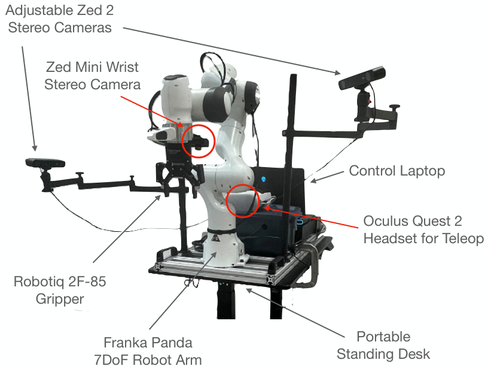
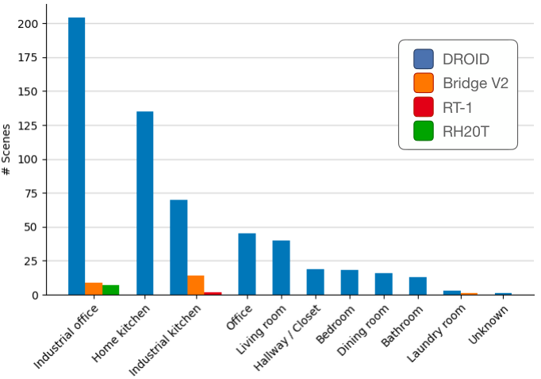
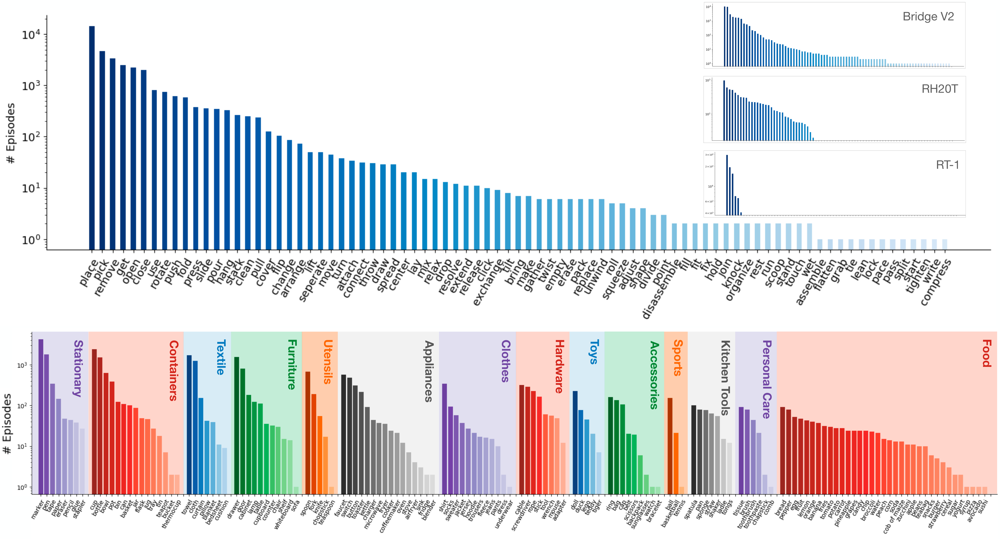
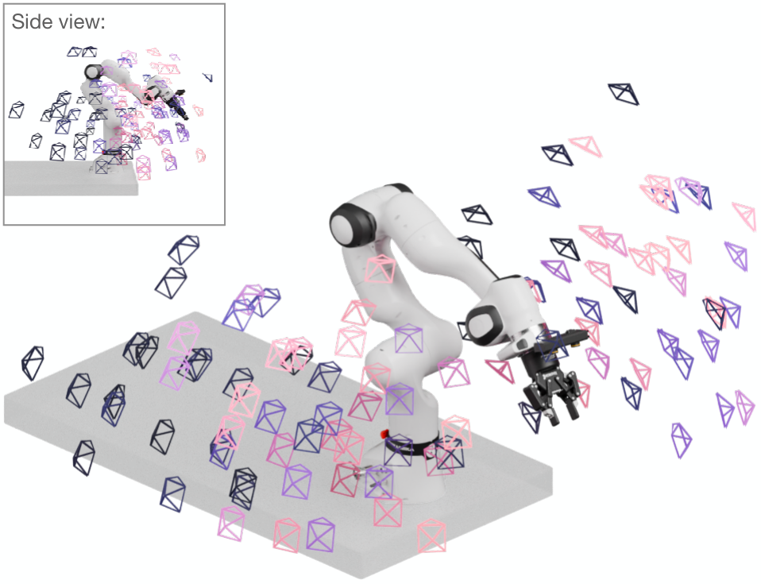

# DROID

目标：理解 DROID 的真实多场景分布式采集价值，能区分 RLDS 训练版本、raw data 和合理的泛化验证 split。

> 先修：[大规模真机数据集](../01-real-robot-datasets.md)
> 建议：重点看“统一硬件 + 分布式真实场景采集”这条主线
> 数据集规模：DROID 数据集包含 76,000 条真实机器人操作轨迹，总交互时间约 350 小时，原始数据规模约 8.7 TB。

DROID 的全称是 **Distributed Robot Interaction Dataset**，可以理解为一个“把同一套机器人搬到很多真实环境里采集出来”的大规模操作数据集。它和 Open X-Embodiment 这种跨机器人混合数据集不一样：Open X 的重点是把很多机器人本体的数据汇聚起来，而 DROID 的重点是尽量使用统一的机器人硬件，在大量真实房间、办公室、厨房和实验室环境中采集操作轨迹。

这一区别非常重要。DROID 不是为了证明“机器人种类越多越好”，而是想回答另一个问题：如果机器人本体相对统一，但采集环境、物体、相机视角、任务语言和操作者都尽量多样，那么这些真实世界数据能不能帮助策略获得更好的泛化能力。

DROID 数据规模约为 **7.6 万条 demonstration trajectories**，约 **350 小时交互数据**，覆盖 **564 个真实场景**、**86 个任务**，由 **50 位数据采集者** 在北美、亚洲和欧洲多个地点历时约 12 个月采集。不必一开始就记住这些数字，更重要的是看懂这些数字背后的设计：DROID 把“真实环境多样性”放在很核心的位置。



上图展示了 DROID 的标准采集平台。它使用 Franka Panda 机械臂、Robotiq 2F-85 夹爪、两个外部 Zed 2 双目相机、一个腕部 Zed Mini 双目相机，以及 Oculus Quest 2 头显和手柄进行遥操作。整套系统安装在可移动、可调高度的桌面上，方便在不同地点快速部署。

## 阅读目标

这一页先围绕几个实际问题展开：

1. DROID 为什么要做“分布式真实环境采集”，它和 Open X-Embodiment、AgiBot World 这类数据集有什么不同。
2. DROID 的硬件平台具体由哪些部分组成，为什么统一硬件对数据使用很重要。
3. 一条 DROID 轨迹里到底包含哪些内容：图像、状态、动作、语言指令和 episode metadata 分别是什么。
4. DROID 的任务、场景和物体分布应该怎么看，为什么不能只看 7.6 万条轨迹这个总数。
5. 使用 DROID 训练策略时，为什么 split、action 语义、语言标注和 raw/RLDS 版本选择都需要提前想清楚。
6. 如果后续要把 DROID 转成 LeRobot 或用于自己的模型训练，应该先检查哪些字段和风险点。

## 为什么需要 DROID

在机器人学习里，早期很多数据集都是在固定实验室台面上采集的：相机位置固定，桌面固定，物体种类有限，任务也比较集中。这样的数据很适合做算法原型验证，但训练出来的策略往往容易对采集环境过拟合。

比如，一个策略在同一个实验室桌面上学会了“把杯子放进碗里”，并不代表它到了真实厨房、办公室桌面或者杂乱的工作台上还能成功。真实世界中会出现很多变化：桌面高度不同，光照不同，相机摆放不同，物体位置和背景不同，甚至操作者示范动作的风格也不同。

DROID 正是针对这个问题设计的。它没有把重点放在“换很多机器人”上，而是把重点放在“同一类机器人在很多真实环境中做很多真实任务”。这样做有一个好处：action space 和机器人本体相对统一，模型不必同时处理太多机器人形态差异；但环境、场景、物体和任务又足够多样，可以更集中地研究真实世界泛化。

可以把 DROID 和前面几个数据源放在一起理解：

| 数据集 | 主要变化来源 | 更适合观察什么 |
|---|---|---|
| Open X-Embodiment | 多机器人、多实验室、多来源数据混合 | 跨本体数据混合与通用策略 |
| AgiBot World | 工业化同构采集、大规模质检 | 标准化采集流程和数据生产线 |
| RoboMIND | 多协作臂、多任务真实演示 | 任务类别、物体类别和多臂覆盖 |
| DROID | 同一套硬件进入大量真实环境 | 真实场景泛化和分布式采集 |

所以，DROID 的核心价值不是“机器人最丰富”，而是“真实场景最有代表性之一”。

## 硬件平台：统一本体，分布式采集

DROID 使用的硬件平台比较标准化。它的主体是 Franka Panda 7 自由度机械臂，末端使用 Robotiq 2F-85 夹爪。视觉系统包括两个外部 Zed 2 双目相机和一个腕部 Zed Mini 双目相机。遥操作设备是 Oculus Quest 2 头显和手柄。

这套设计有几个重要含义。

第一，**机器人本体相对统一**。DROID 不是把 UR5、Franka、双臂机器人、移动机器人全部混在一起，而是主要围绕 Franka Panda 平台展开。这样它的 action、关节状态、夹爪状态等字段更容易统一，适合用来研究在同一 embodiment 下，场景和任务多样性对策略泛化的影响。

第二，**相机视角是可移动的**。DROID 并不是固定一个相机架拍所有数据。两个外部相机可以根据场景调整，腕部相机则跟随机械臂运动。这使得数据里的视觉分布更丰富，也更贴近真实部署时的变化。

第三，**采集系统可以搬到不同地点**。平台安装在便携式桌面上，不是固定在一个大型实验室环境中。这让数据采集可以跨机构、跨房间、跨国家进行，从而得到更丰富的真实场景。

这也解释了为什么 DROID 的硬件和采集代码一起公开很重要：它不只是提供数据，还提供了一套可以复现和扩展的数据采集平台。对于想自己采真机数据的读者来说，DROID 的硬件文档和代码本身就是很有价值的参考。

## DROID 到底采了什么

DROID 的数据可以从四个层次理解：场景、任务、episode 和 step。

```text
DROID dataset
  -> scene：真实房间、办公室、厨房、实验室等采集环境
      -> task：某类操作任务，例如移动、打开、放置、清理
          -> episode：一次完整的人类遥操作示范
              -> step：一个时间步，包含图像、状态、动作和语言
```

这里的重点是：DROID 不是只提供视频，也不是只提供动作轨迹。它是一套用于机器人策略训练的数据，每条轨迹都把视觉观测、机器人状态、动作命令、语言描述和 episode 边界组织在一起。

### 场景：真实环境是 DROID 的核心

DROID 覆盖 564 个真实场景。这里的“场景”不是仿真里的一个 fixed environment，而是真实世界中的采集位置，例如办公室、家庭厨房、工业厨房、客厅、卧室、餐厅、浴室等。



这张图展示了 DROID 相比 Bridge V2、RT-1、RH20T 等数据集在场景类型上的覆盖。读这张图时不要只看柱子高低，而要看它说明了什么：DROID 试图把机器人从单一实验台面中带出来，让它接触更多真实环境。

这类场景多样性会直接影响策略学习。模型如果只在单一桌面训练，视觉背景和物体位置变化较少；而在 DROID 中，机器人可能面对不同桌面材质、不同高度、不同光照、不同杂物布局。这些变化会迫使策略学习更稳健的视觉和动作对应关系。

### 任务：不是均匀分布，而是长尾分布

DROID 包含 86 个任务。这些任务大多是日常物体操作，例如放置、拿起、移动、打开、关闭、倒出、整理、清理等。



这张图上半部分展示了动作动词的分布，下半部分展示了交互物体类别的分布。你会发现它不是一个“每类任务数量都差不多”的数据集，而是有明显长尾：少数高频动作和物体出现很多次，大量低频动作和物体只出现少量样本。

长尾分布在真实机器人数据中很常见。真实采集不是像分类数据集那样可以轻松保证每个类别样本数量完全平衡，很多任务天然更容易采集，也更常见；而一些复杂任务、罕见物体或特殊场景的样本就会少得多。

这对训练和评测有两个影响。

第一，模型可能会偏向高频任务。比如，如果“place”“pick”“move”这类动作很多，而某些复杂操作样本很少，模型在低频任务上的能力不能只靠整体成功率判断。

第二，划分训练集和验证集时要特别小心。如果同一个场景、同一个物体、同一类任务的高度相似样本同时出现在 train 和 val 中，评估指标可能会虚高。更严格的测试应该考虑按场景、物体或任务做 held-out split。

### 视角：DROID 有大量相机位姿变化

DROID 中每条轨迹通常有三个主要图像视角：两个外部相机视角和一个腕部相机视角。外部相机用于观察整体场景，腕部相机则靠近夹爪，适合观察末端和物体之间的局部关系。



DROID 官方分析中提到，数据覆盖了 1417 个第三方相机视角，并提供内参与外参标定信息。官方在 2025 年 4 月还补充发布了 3.6 万条 episode 的改进相机标定。这个设计对策略训练很重要：同一个任务从不同相机角度看起来可能差异很大。一个只依赖固定视角训练的视觉策略，到了新环境中容易因为相机位置变化而失败。

使用 DROID 时，要注意外部相机和腕部相机承担的作用不同。外部相机更适合全局定位和理解任务场景，腕部相机更适合精细操作阶段，例如夹爪是否对准物体、是否接触到目标等。训练时是否使用所有视角、是否只用一个视角、是否融合多视角，都需要根据模型结构决定。

## 一条 DROID episode 里有什么

DROID 的训练版本使用 RLDS 格式。每个 episode 是一个完整示范，每个 episode 里面有一系列 step。每个 step 里包含图像、状态、动作、语言指令和 RLDS 边界标记。

官方文档给出的 RLDS schema 可以简化理解为：

```text
DROID episode
  episode_metadata
    recording_folderpath
    file_path

  steps
    is_first
    is_last
    is_terminal
    language_instruction
    language_instruction_2
    language_instruction_3

    observation
      gripper_position
      cartesian_position
      joint_position
      wrist_image_left
      exterior_image_1_left
      exterior_image_2_left

    action_dict
      gripper_position
      gripper_velocity
      cartesian_position
      cartesian_velocity
      joint_position
      joint_velocity

    action
      7 维动作：[6 维动作分量 + 1 维夹爪分量]

    reward
    discount
```

这个结构要分几层看。

### episode_metadata

`episode_metadata` 记录原始数据路径等信息。它不一定直接进入模型训练，但对追踪数据来源非常重要。做数据转换或调试时，如果发现某条 episode 有问题，metadata 可以帮助找到它在原始数据中的位置。

### RLDS 标记

`is_first`、`is_last` 和 `is_terminal` 是 RLDS 里很关键的字段。它们告诉训练管线一条轨迹从哪里开始、在哪里结束。前面 [RLDS 小节](../../01-common-data-formats/03-rlds.md)已经讲过，不能简单把所有 step 拼成一个大时间序列，否则模型会误以为不同 episode 之间是连续的。

在 DROID 里，`is_terminal` 对 demonstration 来说通常在最后一步为 true。行为克隆训练时，还要特别注意最后一帧是否有有效动作标签。如果最后一帧只是结束状态，它可能不应该被当成普通监督样本处理。

### observation

DROID 的 observation 同时包含低维机器人状态和图像：

- `gripper_position`：夹爪位置状态。
- `cartesian_position`：机器人末端笛卡尔位姿，通常是 6 维。
- `joint_position`：机械臂 7 个关节的位置。
- `wrist_image_left`：腕部相机左目图像。
- `exterior_image_1_left`：第一个外部相机左目图像。
- `exterior_image_2_left`：第二个外部相机左目图像。

这里的图像尺寸在 RLDS 训练版本中是低分辨率图像，适合高效训练。如果你需要更高分辨率、双目图像、深度或完整相机记录，就要看 raw 版本，而不是只用 RLDS 版本。

### action 和 action_dict

DROID 里既有 `action`，也有 `action_dict`。这点很重要。

`action` 是训练时更常用的统一动作字段，官方 schema 中它是 7 维张量。`action_dict` 则保留了更细的命令形式，包括夹爪位置、夹爪速度、笛卡尔位置、笛卡尔速度、关节位置、关节速度等。

最容易犯的错是看到 `action` 就直接拿来训练，而没有理解它对应什么控制接口。DROID 的机器人硬件相对统一，但不同字段仍然代表不同控制语义。训练前至少要确认：

```text
模型预测的是哪个 action 字段？
这个 action 是速度、位置，还是某种处理后的控制量？
夹爪维度是位置命令还是开合状态？
训练时是否需要归一化？
部署时如何把模型输出还原给机器人接口？
```

如果后续要转成 LeRobot，也不能只把 `action` 搬过去，还要在 `meta/info.json` 或数据卡里说明每一维含义。

### language_instruction

DROID 提供自然语言指令字段，而且后续还补充了更多语言标注版本。官方 2024 年 12 月更新中提到，约 95% 的成功 episode，也就是约 7.5 万条 episode，提供了 3 条自然语言描述。这样做的意义是：同一条轨迹可以有不同语言表达方式，有利于训练语言条件策略。

比如同一个动作可以被描述为：

```text
"put the cup into the bowl"
"place the cup inside the bowl"
"move the cup to the bowl"
```

这些描述语义接近，但词面不同。多语言标注可以减少模型对单一模板表达的依赖，提高语言泛化能力。

不过，使用语言字段时也要注意：语言指令通常是 episode 级别的，不一定精确对应每一个 step 的局部子动作。比如一条长轨迹的指令是“clean the table”，中间可能包含拿起、移动、放下多个动作阶段。模型如果逐帧学习，需要理解语言是全局任务条件，而不是每一帧的精确动作描述。

## Raw Data 和 RLDS 版本的区别

DROID 提供两类主要数据形态：RLDS 版本和 Raw Data 版本。

RLDS 版本适合训练策略。它已经把 episode、step、observation、action、language 等整理成训练友好的结构，读取方便，适合通过 TensorFlow Datasets 或相关 dataloader 加载。官方给出的完整 RLDS 版本约为 1.7TB，并提供了一个 100 条 episode 的小版本用于调试。

Raw Data 版本适合需要操纵原始数据的人使用。它包含更高分辨率的视频、双目视频、原始 ZED SVO 文件，以及低维轨迹信息。Raw 版本体积更大，完整版本约为 8.7TB；如果排除 stereo video 和 raw SVO 文件，也仍有数 TB 规模。

二者的区别可以这样记：

| 版本 | 更适合什么 | 典型内容 |
|---|---|---|
| RLDS | 训练策略、快速读取、批量 dataloader | 低分辨率图像、状态、动作、语言、episode 边界 |
| Raw Data | 做相机标定、深度/双目研究、高分辨率处理 | 高分辨率 MP4、stereo MP4、SVO、trajectory.h5、metadata JSON |

如果只是训练一个行为克隆或 VLA 策略，通常从 RLDS 版本开始。如果要研究多视角几何、相机标定、深度估计、3D 交互点，Raw 版本更合适。

还要注意发布版本。DROID 既有官方 RLDS/Raw Data，也有社区转换的 LeRobot 版本；不同版本的字段、图像分辨率、episode 计数、许可证和下载体积可能不同。写实验记录时要标清楚使用的是哪个版本，而不是只写“DROID”。

## Raw episode 文件长什么样

Raw Data 中每条 episode 不是一个简单视频文件，而是一个目录。它通常包含：

```text
episode/
  metadata_*.json
  trajectory.h5
  recordings/
    MP4/
      *.mp4
      *-stereo.mp4
    SVO/
      *.svo
```

其中：

- `metadata_*.json` 保存 episode 级元信息，例如采集者、建筑或场景相关信息。
- `trajectory.h5` 保存低维信息，例如 action、机器人状态和 proprioception 轨迹。
- `recordings/MP4/*.mp4` 保存单个相机视角的高分辨率视频。
- `recordings/MP4/*-stereo.mp4` 保存拼接后的双目视频。
- `recordings/SVO/*.svo` 是 ZED 相机的原始记录文件，可能包含更多相机相关元数据。

这也说明，Raw Data 的价值不仅是“画质更高”，更是包含了更完整的传感器记录。如果你只是做普通策略训练，Raw Data 可能过重；但如果你要研究视觉几何、相机校准或三维交互，它比 RLDS 版本更有用。

## 如何快速查看 DROID 数据

不需要一上来下载完整数据。DROID 提供了几种更轻量的查看方式。

第一，可以先看官方 interactive dataset visualizer。它适合快速了解不同 episode 的视频、动作和语言长什么样。初学者最应该先从这里看，而不是直接下载 TB 级数据。

第二，可以运行官方 Dataset Colab。Colab 会演示如何用 `tfds.load` 加载少量 DROID 样本，并访问 step 里的图像、动作和语言指令。

第三，如果只是调试 dataloader，可以下载 `droid_100` 这个 100 条 episode 的版本，而不是直接下载完整数据。

## DROID 适合研究什么

DROID 适合的研究问题和它的数据设计高度相关。

### 1. 真实场景泛化

DROID 最直接的用途是研究策略能否从大量真实场景中学到更稳健的操作能力。由于它覆盖了办公室、厨房、家庭空间等多种真实环境，因此比单一实验室数据更适合观察模型的真实泛化。

### 2. 语言条件操作

DROID 提供自然语言指令和多条语言标注版本，适合训练语言条件策略。对于 VLA 模型来说，语言不是额外说明，而是任务条件的一部分。

### 3. 多视角视觉策略

DROID 同时提供外部相机和腕部相机视角。研究者可以比较只用外部视角、只用腕部视角和多视角融合的差异。

### 4. 数据混合和 co-training

DROID 论文中的一个重要实验方向是把 DROID 与目标任务数据一起训练，观察是否能提升策略成功率和鲁棒性。它可以作为真实世界预训练或 co-training 数据源。

### 5. 采集系统复现

因为 DROID 公开了硬件设置和采集代码，它也适合作为“如何搭建分布式真机数据采集系统”的案例。

## 为什么不能只看 7.6 万条轨迹

很多人读 DROID 时会先记住“76k trajectories”。但对训练来说，轨迹数量只是第一层信息。更关键的是：这些轨迹分布在什么场景、什么任务、什么物体、什么语言描述和什么相机视角下。

如果一个数据集有很多轨迹，但任务很单一，模型可能只学会少数技能。如果任务很多但每类样本很少，模型又可能学不稳。DROID 的价值在于它同时扩展了场景、任务、物体和相机视角，但这些维度也带来长尾和不均衡问题。

所以使用 DROID 时，不应该只问：

```text
它有多少条轨迹？
```

而应该问：

```text
我的目标任务在 DROID 里有多少相似样本？
这些样本来自多少不同场景？
是否有相似语言指令？
是否有相似物体类别？
我的测试场景会不会和训练场景重复？
```

这些问题比单纯记住总规模更有用。

## 使用 DROID 前的最小检查流程

下面是一条比较稳妥的检查路线：

```text
打开 dataset visualizer
  -> 随机看若干 episode
  -> 选择目标相关任务
  -> 检查图像视角和语言指令
  -> 读取 RLDS schema
  -> 确认 observation/action 字段
  -> 确定训练 split
  -> 决定是否需要 Raw Data
  -> 记录数据版本和标注版本
```

具体可以检查：

1. **场景是否和目标任务接近**：如果目标是家庭厨房操作，就重点看 kitchen 类场景；如果目标是办公室桌面整理，就看 office 类场景。
2. **任务是否覆盖目标技能**：不要只看任务名，要看 episode 里的真实动作过程。
3. **相机视角是否适合模型**：只用腕部相机和使用三视角训练，模型输入完全不同。
4. **action 字段是否符合你的 policy**：如果你的模型预测末端速度，就不能不加处理地使用不匹配的 action 表示。
5. **语言指令是否作为任务条件使用**：如果训练非语言策略，可以把语言作为 metadata；如果训练 VLA，语言就是核心输入。
6. **split 是否避免泄漏**：不要按 frame 随机切，也不要让高度相似的同场景轨迹同时进入 train 和 test。
7. **是否需要 raw 版本**：如果只是训练策略，RLDS 通常够用；如果做三维、深度、标定或高分辨率视觉，需要 raw。

## 常见误解

**误解 1：DROID 是跨很多机器人本体的数据集。**
  DROID 的重点不是跨本体，而是在统一硬件平台上做大规模真实场景采集。它和 Open X-Embodiment 的侧重点不同。

**误解 2：RLDS 版本就是全部原始信息。**
  RLDS 版本适合训练，但为了高效读取，它使用的是训练友好的结构和图像分辨率。如果需要高分辨率、双目视频或 SVO 原始相机文件，要看 Raw Data。

**误解 3：有语言指令就等于每一帧都有精确语义。**
  语言指令通常描述 episode 级任务，不一定细到每个子动作阶段。

**误解 4：轨迹数量越多，效果一定越好。**
  数据规模有帮助，但任务长尾、场景泄漏、动作语义和模型输入设计都会影响最终效果。

**误解 5：可以按 frame 随机切分训练集和验证集。**
  相邻帧高度相似，按 frame 切分会造成数据泄漏。更合理的是按 episode、场景、任务或采集者切分。

**误解 6：只用一个外部相机就等于用完整 DROID。**
  DROID 的多视角设计是它的重要特点。只用单视角可以做实验，但要在数据卡里说明输入被简化了。

## 小结

DROID 是一个以真实环境多样性为核心的大规模机器人操作数据集。它使用相对统一的 Franka Panda 硬件平台，在多个机构和大量真实场景中采集了 7.6 万条左右的遥操作示范，包含图像、机器人状态、动作、语言指令和 episode 边界信息。

和 Open X-Embodiment 相比，DROID 的机器人本体没有那么分散，但场景、任务、物体和相机视角更强调真实世界变化。读 DROID 时，最重要的不是只记住数据规模，而是理解它如何通过统一硬件和分布式真实采集来提高环境多样性。

如果用于训练，建议优先从 visualizer、Colab 或 `droid_100` 小版本开始，先看清楚 episode 长什么样，再决定是否使用完整 RLDS 或 Raw Data。使用时要特别注意 action 语义、多视角输入、语言标注、split 策略和数据版本。

进一步阅读可以看：
- [DROID 主页](https://droid-dataset.github.io/)
- [DROID paper](https://arxiv.org/abs/2403.12945)
- [DROID 硬件与数据代码](https://github.com/droid-dataset/droid)
- [DROID policy learning](https://github.com/droid-dataset/droid_policy_learning)
- [DROID Hugging Face 数据页](https://huggingface.co/KarlP/droid)
