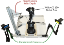
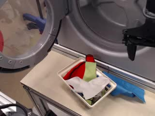
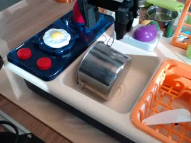
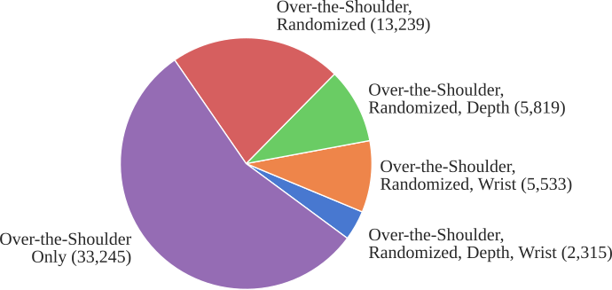

# BridgeData V2

目标：理解 BridgeData V2 的多环境、多技能和条件输入设计，能检查目标图像、语言指令、teleop 与 scripted 数据来源差异。

> 先修：[大规模真机数据集](../01-real-robot-datasets.md)
> 建议：重点看多环境、多技能、目标图像和语言条件如何共同服务机器人泛化
> 数据集规模：BridgeData V2 包含 60,096 条机器人操作轨迹，覆盖 24 个不同环境和 13 类操作技能，其数据规模约为几十 GB 到百 GB 级，其中 LeRobot 转换版本约 90 GB。

BridgeData V2 是一个面向机器人操作学习的大规模真实数据集。和 Open X-Embodiment 那类跨机器人混合数据不同，BridgeData V2 的特点不是“机器人本体特别多”，而是用相对统一、低成本、可复现的机器人平台，在许多不同环境和任务中采集了大量真实操作轨迹。它的名字里有一个很重要的词：**Bridge**。这里的“桥接”不是指某一种具体任务，而是指数据希望在不同任务、不同物体、不同环境之间建立可复用经验，让模型不要每换一个场景就从零开始采数据。

如果只把它理解成“6 万条机械臂数据”，会漏掉更值得看的部分。BridgeData V2 更适合被看作一个研究问题：在真实机器人上，能否通过多任务、多环境、多条件输入的数据，让策略学到可迁移的操作能力？它既可以用来训练语言条件策略，也可以用来训练目标图像条件策略，还可以用于离线强化学习、行为克隆和数据规模效应分析。

## 阅读目标

读完这一页，可以用下面几个问题检查自己是否读懂：

1. BridgeData V2 和原始 Bridge Data 是什么关系，为什么要做 V2。
2. 它的数据规模、机器人平台、环境、任务和传感器分别是什么。
3. 为什么它既支持目标图像条件，也支持语言条件。
4. 远程操控数据和脚本策略 rollout 在训练中有什么差异。
5. 为什么 BridgeData V2 的 split 不能只按 trajectory 随机切。
6. 如果要把它用于 LeRobot、RLDS 或 VLA 训练，应该先检查哪些字段和语义。

## 从 Bridge Data 到 BridgeData V2

在机器人学习里，最常见的困境是：每个实验室都能在自己的机器人和场景里采一些数据，但这些数据往往只对本实验室的任务有效。换一个房间、换一批物体、换一个目标任务，原来的数据可能就很难直接复用。Bridge Data 系列的出发点正是这个问题：能不能收集一个覆盖多个任务和环境的共享数据集，让它成为新任务训练时的“桥”。

早期 Bridge Data 主要强调跨任务、跨环境复用。BridgeData V2 则进一步扩大了规模和覆盖范围，并配套了训练代码、预训练权重和多种学习方法。它不只是把轨迹放出来，而是把数据、条件输入、训练方法和真实机器人评估连成了一套工作流。这样做的意义在于：读者不只可以下载数据，还可以看到这些数据如何用于 goal-conditioned BC、language-conditioned BC、diffusion policy、IQL 和 contrastive RL 等方法。


## 先看整体构成


| 维度 | 内容 |
|---|---|
| 机器人平台 | WidowX 250 6-DoF 机械臂 |
| 采集方式 | VR 控制器远程操控 + 脚本 pick-and-place policy rollout |
| 数据规模 | 60,096 条轨迹，其中 50,365 条 teleoperated demonstrations，9,731 条 scripted rollouts |
| 环境数量 | 24 个环境 |
| 技能数量 | 13 类技能 |
| 条件输入 | 目标图像、自然语言指令 |
| 主要模态 | 主视角 RGB/RGBD 图像、可选随机视角/腕部视角图像、机器人动作、语言任务标注 |
| 原始数据形态 | JPEG / PNG / pkl 文件 |
| 训练友好格式 | TFRecord / TFDS / RLDS 版本 |
| 许可 | Creative Commons Attribution 4.0 International License |

这张表里最重要的是三点。第一，BridgeData V2 使用的是相对统一的机器人平台，所以 action space 的跨本体问题比 Open X-Embodiment 轻一些。第二，它的任务和环境很多，所以重点在环境泛化、物体泛化和任务泛化。第三，它同时支持目标图像和语言指令，因此很适合用来理解“条件输入”如何改变机器人策略学习。

## 机器人和硬件：为什么低成本平台很重要

BridgeData V2 使用的是 WidowX 250 6-DoF 机械臂。它不是工业生产线里的大型机械臂，也不是高自由度人形机器人，而是一个公开可获得、成本相对较低、适合实验室复现的桌面机械臂平台。

这件事很重要。大规模机器人数据集经常会遇到一个问题：数据看起来很大，但硬件不可复现。如果别的实验室没有同样的机器人、相机、控制接口，就很难使用同样方式继续采数据，也很难验证训练出的策略。BridgeData V2 选择公开可获得的低成本机器人，本质上是在降低“跟进这个数据集”的门槛。

它的采集系统可以粗略理解成：

```text
WidowX 250 机械臂
  ├─ VR 控制器：人类远程操控
  ├─ 固定 RGBD 相机：over-the-shoulder 主视角
  ├─ 两个随机位姿 RGB 相机：增加视觉视角变化
  ├─ 腕部 RGB 相机：从夹爪附近观察物体
  └─ 控制频率：5 Hz
```

官方项目页还给出了一个重要数字：平均每条轨迹约 38 个 timestep。结合 5 Hz 控制频率，可以直观看出它记录的是短时桌面操作片段，而不是几分钟甚至几十分钟的长程家务流程。



这套硬件设计也解释了 BridgeData V2 的优势和局限。优势是：同一套机器人和相机系统降低了动作语义混乱，使得目标图像条件和语言条件实验更容易比较。局限是：它主要服务桌面操作任务，不适合直接代表移动机器人、人形机器人或双臂协作任务。

## 环境：不是一个厨房，而是一组有变化的桌面世界

BridgeData V2 覆盖 24 个环境。这些环境不是随机背景贴图，而是真实物理空间中的不同桌面和玩具场景。项目页把这些环境分成 4 类，其中大部分数据来自 7 个 toy kitchen。这些 toy kitchen 通常包含水槽、炉灶、微波炉等元素；剩余环境包括不同桌面、独立 toy sink、toy laundry machine、tool chest 等。





环境变化至少有三层意义。

第一，环境变化会改变视觉背景。比如同样是“把物体放进容器”，在 toy kitchen、水槽和桌面环境里的背景完全不同。模型如果只记住了某个固定桌面的纹理，就很难泛化。

第二，环境变化会改变任务可用 affordance。水槽、炉灶、抽屉、洗衣机、工具箱这些结构本身就是任务的一部分。机器人不是在空白桌面上抓物体，而是在带有容器、门、抽屉、孔洞和边界的环境中操作。

第三，环境变化会改变评估难度。一个任务在训练环境中出现过，并不代表在新环境中容易成功。比如“把胡萝卜放到盘子上”和“把物体放进洗衣机”都可以看成放置任务，但目标区域形状、遮挡、背景和相机视角都不同。

因此，BridgeData V2 最适合用来研究：

```text
同一技能在不同环境中的泛化
同一语言指令在不同物体和布局下的执行
目标图像如何帮助模型适应新的目标状态
训练数据规模和多样性对泛化的影响
```

## 任务和技能：13 类技能如何理解

BridgeData V2 标注为 13 类技能，但这 13 类技能不应该被理解成 13 个孤立类别。更自然的理解方式，是把它们分成三层。

第一层是基础物体操作，包括 pick-and-place、pushing、sweeping、reorienting objects 等。这些任务看起来简单，但它们构成了许多桌面操作的基本动作单元。比如“拿起胡萝卜放到盘子上”“把玩具扫到指定区域”都可以归入这一层。

第二层是环境交互，包括打开和关闭门、抽屉等。这类任务比单纯抓放更难，因为机器人需要和带约束的物体交互。抽屉不是自由物体，它只能沿某个方向滑动；门也不是任意移动，而是绕转轴旋转。模型必须从视觉中理解可动结构的位置和方向。

第三层是更复杂或组合式任务，例如堆叠积木、折叠布料、清扫颗粒状物体等。这类任务对接触、时序和状态变化更敏感，不是简单的一步抓取能完成。

可以这样理解：

```text
BridgeData V2 的技能分布
  ├─ 基础物体操作
  │   ├─ pick-and-place
  │   ├─ push
  │   ├─ sweep
  │   └─ reorient
  ├─ 环境结构操作
  │   ├─ open / close drawer
  │   ├─ open / close door
  │   └─ manipulate toy appliances
  └─ 复杂操作
      ├─ stack blocks
      ├─ fold cloth
      └─ sweep granular media
```

这里要注意一个细节：BridgeData V2 每条轨迹都有自然语言任务标注。语言标注不是为了让数据“看起来更像大模型数据”，而是让同一批轨迹可以服务 open-vocabulary、multi-task、language-conditioned policy 学习。也就是说，模型可以接收类似 “put the carrot on the plate” 这样的指令，然后根据当前视觉观察输出动作。

## 条件输入一：目标图像

BridgeData V2 的一个重要特点是兼容 **goal image conditioned** 方法。所谓目标图像条件，指的是模型不仅看到当前观测，还看到一张目标状态图像。模型要学习如何从当前状态运动到目标图像对应的状态。

这和语言条件不同。语言描述是抽象的，比如：

```text
put the carrot on the plate
```

目标图像则是具体的，它直接展示了任务完成后的视觉状态：

```text
当前图像：胡萝卜在桌面左侧
目标图像：胡萝卜在盘子上
模型输出：让机械臂把胡萝卜移动到盘子上的动作
```

目标图像的优势是信息具体。它不需要模型完全理解语言，也不需要把“盘子”“胡萝卜”“放上去”全部解析成符号关系。只要模型学会比较当前状态和目标状态，就有可能完成操作。

但目标图像也有局限。目标图像通常来自相似相机视角和相似环境，如果目标图像和当前环境差异太大，模型就可能难以判断哪些差异是任务目标、哪些只是无关背景。因此使用 BridgeData V2 做 goal-conditioned learning 时，要特别关注目标图像和当前观测之间的环境、相机、物体分布是否一致。

## 条件输入二：自然语言指令

语言条件的作用，是让同一视觉状态下的不同任务可以被区分。例如桌上同时有胡萝卜、盘子、锅和水槽，如果只给图像，模型并不知道该做哪件事；如果给语言指令，任务就变得明确。

```text
observation:
  图像中有胡萝卜、盘子、锅、水槽

language instruction:
  put the carrot on the plate

policy:
  输出朝胡萝卜移动、抓取、移动到盘子并释放的动作
```

语言条件的价值在于任务复用。同一个数据集里的许多轨迹可以共享视觉空间和动作空间，但通过不同指令区分目标。这样模型不是学习一个单任务策略，而是学习一个可以根据指令切换行为的多任务策略。

但是语言标注也有风险。首先，同一句话可能对应不同初始状态；其次，不同采集者对同一动作可能使用不同表达；再次，语言指令通常是 episode 级标注，不一定精确到每个阶段。比如一条指令是 “open the drawer and put the object inside”，这条轨迹中可能包含靠近抽屉、拉开抽屉、抓取物体、放入抽屉等多个阶段。如果把整条轨迹都看成同一个语义动作，就会忽略中间子任务结构。

因此，语言条件训练时要明白：BridgeData V2 的语言标注主要提供 episode 级任务目标，而不是每一帧的细粒度动作说明。

## 数据来源：teleoperation 和 scripted rollout 不能混为一谈

BridgeData V2 的 60,096 条轨迹中，有 50,365 条是人类远程操控 demonstration，另外 9,731 条来自脚本 pick-and-place policy rollout。这两个来源在训练时不能简单看成同一种数据。

远程操控数据的特点是质量较高、行为更灵活，能处理一些复杂场景和细微视觉变化。人类操作员会根据实时观察调整动作，这使得轨迹更像专家示教。但远程操控也会带来人类习惯，例如不同操作者的路径偏好、速度差异、接近物体的方式差异。

脚本 policy rollout 的特点是规模更容易扩大，行为更一致，但覆盖的任务和策略分布更窄。它适合补充一些标准 pick-and-place 样本，但不应该被误解成同等质量的人类专家演示。脚本策略可能在某些状态下失败，也可能只覆盖有限的物体和环境变化。

可以这样区分：

| 来源 | 优点 | 风险 |
|---|---|---|
| Teleoperated demonstrations | 人类在环、灵活、任务覆盖广 | 操作者风格差异、路径不完全一致 |
| Scripted rollouts | 规模补充、动作模式稳定 | 任务较窄、失败模式可能集中 |
| Mixed data | 提高覆盖和数量 | 如果不标记来源，模型可能混合学习不同质量分布 |

所以在正式使用时，最好保留 `source` 或类似字段，用于区分 demonstration 和 rollout。训练时可以选择全部使用，也可以给不同来源设置不同采样权重，还可以先只用 teleop 数据做基线，再加入 scripted 数据观察变化。

## 传感器和图像：多视角并不等于每条轨迹都有全部视角

BridgeData V2 的传感器设计比较丰富，包括固定 over-the-shoulder RGBD 相机、两个随机位姿 RGB 相机和腕部 RGB 相机。图像保存分辨率为 640×480。项目页还说明，更多相机是在数据采集过程中逐步加入的，所以并不是每条轨迹都有完整的 4 个视角。



这对数据使用非常关键。很多初学者看到“多相机”就默认每条样本都有多视角图像，但 BridgeData V2 不是这样。数据集中多数轨迹只有主固定相机视角，少量轨迹包含更多相机视角、深度或腕部视角。

使用时要先确认：

```text
当前子集是否有 primary fixed camera
是否有 randomized camera views
是否有 wrist camera
是否有 depth
图像分辨率是原始 640×480 还是 TFDS 下采样后的 256×256
缺失视角是直接缺字段，还是用空值 / mask 表示
```

如果模型结构固定要求多视角输入，而数据中许多轨迹缺少某些视角，就必须决定如何处理：丢弃缺失轨迹、只使用共有视角、加入 mask，或者为不同视角训练不同模型。

## 数据格式：原始数据和训练格式不是一回事

BridgeData V2 有两类常见使用形态。

第一类是原始数据。GitHub README 中说明，raw dataset 由 JPEG、PNG 和 pkl 文件组成，其中 demonstration 数据和 scripted policy 数据以不同 zip 文件提供。原始数据适合做自定义处理，比如重新编码图像、恢复原始分辨率、检查 pkl 中的状态和动作。

第二类是训练友好格式。官方提供了预处理后的 TFDS 版本，图像下采样到 256×256，并使用 RLDS 组织轨迹。对于大多数训练实验，TFDS/RLDS 版本更方便，因为它已经把数据整理成 episode/step 结构，可以被 Octo 等数据加载器读取。

可以这样理解：

```text
raw BridgeData V2
  ├─ JPEG / PNG 图像
  ├─ pkl 轨迹信息
  ├─ demos*.zip
  └─ scripted*.zip

processed BridgeData V2
  ├─ TFRecord
  ├─ TFDS loader
  └─ RLDS episode / step structure
```

这和前面的[常见数据格式](../../01-common-data-formats.md)和[数据转换](../../02-data-conversion.md)内容正好接上。原始数据更像项目内部格式，适合深度审计；RLDS 版本更适合训练管线，适合快速接入 VLA 或机器人基础模型训练。

还要注意版本差异。BridgeData V2 既有官方 raw/TFDS/RLDS 使用方式，也可能出现在 Open X-Embodiment、RT-X、Octo 或社区 LeRobot 转换数据中。不同版本可能在图像分辨率、相机字段、episode 计数、动作归一化和许可证说明上不同，实验记录里不要只写“BridgeData V2”，要写清具体来源和处理格式。

## 一条轨迹大概包含什么

BridgeData V2 的一条轨迹可以理解成一个短时操作 episode。虽然不同格式下字段名不完全一样，但从概念上看，它至少包含：

```text
trajectory
  ├─ observation
  │   ├─ image from primary camera
  │   ├─ optional randomized camera images
  │   ├─ optional wrist camera image
  │   └─ optional depth
  ├─ action
  │   └─ WidowX arm command / gripper command
  ├─ language instruction
  │   └─ episode-level task description
  ├─ goal image or final-state-related target
  ├─ timestep / step index
  └─ source metadata
      ├─ teleop demonstration or scripted rollout
      ├─ environment
      └─ task / skill
```

如果转成 RLDS，可以把它看成：

```text
dataset
  episode_000
    step_000:
      observation
      action
      language instruction
    step_001:
      observation
      action
      language instruction
    ...
    step_T:
      observation
      is_last
```

初学者要特别注意最后一帧。许多机器人数据中最后一步可能是终止观测，不一定有有效 action。训练行为克隆时，需要确认当前格式下 action 与 observation 是否严格一一对应。

## 它适合研究什么

BridgeData V2 最适合研究的是“真实机器人操作数据如何通过规模和多样性提升泛化”。具体可以分成几类。

第一类是多任务行为克隆。模型输入当前图像和语言指令，输出机器人动作。这里的关键问题是：语言能否帮助模型在同一环境中切换任务。

第二类是目标图像条件策略。模型输入当前图像和目标图像，学习从当前状态到目标状态的动作。这里的关键问题是：目标图像是否比语言更直接地表达任务结果。

第三类是离线强化学习。由于数据中不仅有示教，还包含脚本策略 rollout，研究者可以尝试 IQL、contrastive RL 等方法，从离线轨迹中学习可泛化策略。

第四类是数据规模效应。BridgeData V2 论文中一个重要实验方向，是观察更多数据、更高容量模型和更多技能种类是否带来更好泛化。这非常适合用作“机器人数据规模是否有效”的案例。

第五类是跨环境泛化。它覆盖 24 个环境，因此可以设计训练环境和测试环境分离的实验，观察模型是否真的学到了技能，而不是记住了某个桌面布局。

## 为什么它叫 Bridge

“Bridge” 的含义可以从两个角度理解。

第一个角度是跨任务桥接。比如训练数据中有抓取、放置、推、扫等基本技能，目标是让模型能在新任务中复用这些技能，而不是每个新任务都重新采集大量示教。

第二个角度是跨环境桥接。比如模型在多个 toy kitchen、tabletop 和 toy sink 中看过类似的操作，就可能在新的厨房布置中更容易泛化。

这也是 BridgeData V2 和单任务演示数据集最大的区别。单任务数据集的目标通常是把一个任务做好；BridgeData V2 的目标是提供足够多样的背景、任务和目标条件，让机器人策略有机会学到可迁移的操作结构。

## 使用时最容易出错的地方

### 只按 trajectory 随机切分

如果直接把 60,096 条轨迹随机分成 train 和 val，很可能出现环境泄漏。比如同一个 toy kitchen、同一批物体、同一种任务同时出现在训练集和验证集，验证结果就不能说明模型能泛化到新环境。

更好的切分方式是按研究问题来设计：

| 研究目标 | 更合理的切分 |
|---|---|
| 测试同环境任务泛化 | 按任务或物体划分 |
| 测试新环境泛化 | 按 environment 划分 |
| 测试新物体泛化 | 按 object set 划分 |
| 测试语言泛化 | 按 instruction template / semantic family 划分 |
| 测试视角鲁棒性 | 按 camera setting 或 view availability 划分 |

### 忽略 teleop 和 scripted 的来源差异

如果训练时不区分 teleop 和 scripted rollout，模型可能混合学习两种不同质量的数据分布。尤其在比较不同算法时，最好明确写出是否使用 scripted rollout，以及使用比例是多少。

### 默认多视角完整

BridgeData V2 的相机是在采集过程中逐步扩展的，并不是每条轨迹都具备所有视角。模型输入设计时必须先确认实际可用字段。

### 把语言标注当成细粒度阶段标注

语言通常是 episode 级任务说明，不等于每一步的动作解释。长一点的任务如果被一条语言覆盖，模型仍然需要从视觉和动作序列中学习中间阶段。

### 忽略目标图像的环境依赖

目标图像在相似环境中很有效，但它不是抽象语义。目标图像里的背景、光照、相机角度也会进入模型输入，因此要小心模型是否学习了无关视觉差异。

## 一个最小数据检查流程

使用 BridgeData V2 之前，建议至少做一次这样的检查：

```text
1. 先确定使用 raw 版本还是 TFDS/RLDS 版本
2. 随机抽样若干 trajectory，查看 initial image、final image 和 language instruction
3. 检查 action 维度、单位、范围和 gripper 语义
4. 检查所选子集是否包含 goal image、language instruction、wrist camera、depth
5. 区分 teleop demonstration 和 scripted rollout
6. 按 environment / task / object 重新设计 split，而不是直接随机切
7. 训练前统计每个 skill、environment、source 的样本数量
8. 如果转换到 LeRobot，确认图像、action、language 和 episode 边界都被保留
```

这个流程不是为了增加负担，而是为了避免训练结果解释不清。BridgeData V2 的规模并不小，如果没有清楚记录筛选规则，后面很难判断模型提升来自数据规模、环境多样性、目标图像，还是某个数据子集本身更容易。

## 和前面几个数据集的关系

BridgeData V2 和 Open X-Embodiment 都强调可扩展机器人学习，但两者重点不同。Open X-Embodiment 更强调跨机器人本体和跨实验室数据混合，BridgeData V2 更强调在统一低成本平台上做多环境、多技能采集。前者更适合研究跨本体泛化，后者更适合研究同一机器人平台上的任务和环境泛化。

它和 AgiBot World 的区别也很明显。AgiBot 更像工业化大规模生产线，强调同构硬件、标准采集和质检闭环；BridgeData V2 更像学术开放数据集，强调低成本、可复现、开放训练代码和多种离线学习方法。

它和 DROID 的关系也值得注意。DROID 强调多场景真实环境下的大规模采集，并附带硬件和代码；BridgeData V2 则更聚焦桌面操作、目标图像/语言条件学习和多环境技能泛化。两者都适合真实机器人操作学习，但切入点不同。

## 常见误解

**误解 1：BridgeData V2 是跨机器人数据集。**
  它主要使用 WidowX 250 平台，跨本体不是它的核心卖点。

**误解 2：所有轨迹都是人类专家示教。**
  数据中既有人类远程操控 demonstration，也有 scripted pick-and-place rollout。

**误解 3：多相机意味着每条轨迹都有完整多视角。**
  相机是在采集过程中逐步加入的，很多轨迹只有主固定视角。

**误解 4：语言指令可以解释每一帧动作。**
  语言通常是 episode 级任务标注，不是逐帧动作说明。

**误解 5：随机切分就能评估泛化。**
  如果同一环境或物体分布泄漏到验证集，评估结果会偏乐观。

## 小结

BridgeData V2 是一个以 WidowX 250 为统一硬件平台的大规模真实机器人操作数据集。它包含 60,096 条轨迹，覆盖 24 个环境和 13 类技能，其中既有远程操控 demonstration，也有脚本策略 rollout。它最重要的价值不是单纯规模，而是把多环境、多技能、目标图像、语言指令和开放训练代码结合起来，为机器人泛化学习提供了一个相对完整的实验基础。

读这个数据集时，要抓住三条主线：第一，它主要研究同一机器人平台上的跨环境、跨物体、跨任务泛化；第二，它同时支持目标图像条件和语言条件，因此可以连接到 VLA 和多任务策略训练；第三，它的数据来源、相机视角和处理格式并不完全统一，使用前必须检查 source、camera、action 和 split。

进一步阅读可以看：
- [BridgeData V2 主页](https://rail-berkeley.github.io/bridgedata/)
- [BridgeData V2 paper](https://arxiv.org/abs/2308.12952)
- [BridgeData V2 代码仓库](https://github.com/rail-berkeley/bridge_data_v2)
- [BridgeData V2 数据下载目录](https://rail.eecs.berkeley.edu/datasets/bridge_release/data/)
