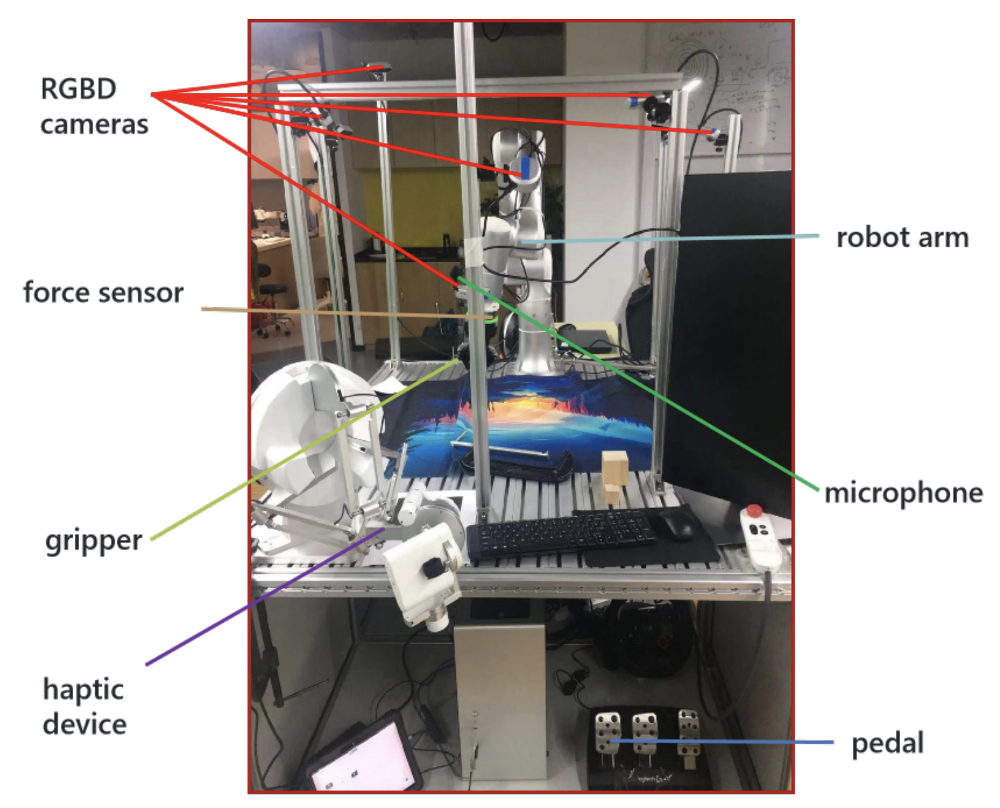

# RH20T

目标：理解 RH20T 的人类示教、机器人执行和多模态接触数据如何成对组织，能处理多频率同步、隐私许可和转换取舍。

> 先修：[大规模真机数据集](../01-real-robot-datasets.md)
> 建议：先看隐私、模态同步和“人类示教—机器人执行”配对关系
> 数据集规模：RH20T 包含超过 110,000 条真实机器人操作序列，覆盖 147 类操作任务，其原始数据规模约 40 TB，官方提供压缩版本用于降低存储需求；其社区整理版本约 332 GB。

RH20T 是一个面向真实机器人操作学习的大规模多模态数据集。它和前面几个数据集的关注点不完全一样：Open X-Embodiment 更像跨机器人数据混合工程，AgiBot World 更强调工业化规模采集，DROID 更强调统一硬件和多场景采集，而 RH20T 的关键在于 **接触丰富的操作任务、多模态传感器记录，以及每条机器人执行轨迹都有对应的人类示教视频**。

因此，RH20T 不能只当成视觉策略用的视频数据集，也不能只当成机械臂状态和动作日志。它更像一套“同一任务在人类和机器人两种执行方式下的多模态记录”：人类如何完成任务，机器人如何执行同类任务，任务过程中视觉、深度、力、声音、机器人状态和动作如何同时变化，都被组织在同一个数据体系里。

RH20T 值得重点看的地方有两个。第一，它展示了真实接触操作数据集怎样记录多模态信息，尤其是力觉、声音、深度和多视角相机。第二，它提醒我们，真机数据一旦包含人类示教视频、语音或人脸，使用边界就不再只是技术问题，还包括隐私、许可和再分发限制。

## 阅读目标

读完这一页，可以用下面几个问题检查自己是否读懂：

1. RH20T 和普通机器人操作数据集有什么不同。
2. 为什么它强调“人类示教—机器人执行”配对。
3. 它覆盖了哪些任务，为什么这些任务比简单 pick-and-place 更复杂。
4. 它有哪些传感器模态，每种模态对机器人学习有什么作用。
5. 它的数据目录如何组织，`metadata.json`、`cam_*`、`transformed/`、`*_human` 分别表示什么。
6. 为什么 RH20T 的时间同步、相机标定和力觉处理特别重要。
7. 使用 RH20T 时为什么要首先检查隐私和许可证。
8. 如果要把它接入 LeRobot、RLDS 或自定义训练管线，应该先检查哪些字段。

## 为什么会有 RH20T

很多早期机器人学习数据集主要关注视觉引导下的简单操作，例如抓取、推动、放置。这类任务当然重要，但它们并不能覆盖真实操作中的所有困难。现实中的操作经常是 **contact-rich** 的，也就是任务成功高度依赖接触过程：机器人不只是“看到物体在哪里”，还要感知是否碰到了、是否夹稳了、是否插进去了、是否卡住了、是否产生了过大力。

例如下面这些任务都很难只靠单张图像判断：

```text
把物体插入孔洞
拧动或旋转某个结构
推开带阻力的部件
把柔性或细小物体整理到指定位置
在接触过程中调整夹爪姿态
```

这类任务里，视觉很重要，但视觉不一定足够。力/力矩信号可以告诉模型是否产生接触，声音可以反映碰撞、摩擦或敲击，深度和多视角相机可以帮助重建 3D 场景，机器人关节和末端位姿可以描述动作轨迹。RH20T 的设计正是为了把这些信号一起记录下来，让研究者可以研究更接近真实操作的数据问题。

另一个重要背景是 one-shot imitation learning。所谓 one-shot，不是说模型只用一条训练数据就学会所有任务，而是希望模型看到某个任务的人类示教后，能够把示教中的目标和过程迁移到机器人执行上。RH20T 每条机器人操作序列都配有对应的人类示教视频和语言描述，因此它天然适合研究“人类如何做”和“机器人如何做”之间的对应关系。

## 先看整体构成

RH20T 的基本信息可以先用一张表把握：

| 维度 | 内容 |
|---|---|
| 数据类型 | 真实世界机器人操作数据 |
| 数据规模 | 超过 110,000 条接触丰富的机器人操作序列 |
| 任务规模 | 147 类任务：48 个来自 RLBench，29 个来自 MetaWorld，70 个为自定义真实常见任务 |
| 核心结构 | 每条机器人操作序列对应一个人类示教视频和语言描述 |
| 主要模态 | RGB、Depth、双目红外、机器人关节、关节力矩、末端位姿、夹爪宽度、6-DoF 力/力矩、音频，部分配置包含指尖触觉 |
| 采集硬件 | 多个 RGBD 相机、力/力矩传感器、夹爪、触觉设备、脚踏板、麦克风、数据采集工作站 |
| 主要用途 | one-shot imitation learning、多模态机器人操作学习、接触丰富任务学习、人类示教到机器人执行的对应学习 |
| 数据体量 | 原始版本约 40TB；官方也提供降采样和低维版本 |
| 许可 | 分为 CC BY-SA 4.0 子集和 CC BY-NC 4.0 子集，使用前必须按 scene 范围确认 |
| 主要风险 | 人脸、语音、志愿者行为隐私；多模态同步；不同机器人配置下的状态/动作维度差异 |

RH20T 同时包含机器人执行数据和人类示教数据，同一条任务轨迹中又有多个相机、多种频率、多个坐标系和不同许可证边界。使用它之前，不能只问“能不能下载”，而要先问：我到底要用哪一部分，是否需要人类视频，是否需要深度，是否需要力觉，是否有权限把相关样例展示出来。

## 它和前面几个数据集有什么不同

把 RH20T 放到本组大规模真机数据集里，可以更清楚地看出它的定位。

| 数据集 | 主要特点 | RH20T 的不同点 |
|---|---|---|
| Open X-Embodiment | 跨本体、多来源、大混合 | RH20T 更关注单个数据体系内的人类示教、机器人操作和多模态接触数据 |
| AgiBot World | 工业化规模采集、质检流程 | RH20T 更强调视觉、力、音频、触觉等多模态同步记录 |
| RoboMIND | 多任务真实演示、多种协作臂 | RH20T 更突出人类示教与机器人执行的成对关系 |
| ARIO | 多模态统一标准，含真实和仿真 | RH20T 是具体真实操作数据集，重点在接触丰富任务 |
| FUSE | 视觉、触觉、声音与远程操控 | RH20T 的规模更大，任务更多，并提供人类示教对应数据 |
| DROID | 统一硬件、多场景真实操作 | RH20T 更强调多传感器、多配置和人类—机器人对应 |

因此，RH20T 最适合被放在“多模态真实操作数据集”这一类里。它不是最简单的入门数据集，但非常适合用来理解：当机器人任务进入复杂接触和人机交互场景后，数据记录会变得多么复杂。

## 147 个任务

RH20T 的任务来自三部分：

```text
48 个任务来自 RLBench
29 个任务来自 MetaWorld
70 个任务为作者自定义的真实常见任务
```

这个构成很有意思。RLBench 和 MetaWorld 都是常见的机器人学习 benchmark，它们提供了一批标准化任务定义。RH20T 从这些 benchmark 中选择任务，相当于把一部分“仿真或标准任务思想”搬到真实世界中。同时，它又加入了 70 个自定义任务，用来覆盖真实机器人更常遇到的操作场景。

可以把 RH20T 的任务粗略理解成几类：

```text
基础物体操作
  ├─ 抓取
  ├─ 放置
  ├─ 推动
  └─ 移动物体到目标区域

工具和容器操作
  ├─ 打开 / 关闭
  ├─ 插入 / 拔出
  ├─ 倾倒 / 装入
  └─ 对齐到某个容器或结构

接触丰富任务
  ├─ 需要力反馈判断是否接触
  ├─ 需要调整姿态避免卡住
  ├─ 需要根据接触声音或力变化判断状态
  └─ 需要在局部遮挡下继续操作

人类示教相关任务
  ├─ 人类先完成一次任务
  ├─ 机器人执行同类任务
  └─ 模型需要理解示教和机器人动作之间的对应关系
```

这里不能只看“147 个任务”这个数字。对训练来说，更重要的是任务之间的结构关系。比如“把 A 放到 B 上”和“把 A 放进 B 里”都是放置，但接触方式、目标状态和失败模式不同；“推开物体”和“插入物体”都需要接触，但前者主要是平面运动，后者更依赖精确姿态和力反馈。一个模型如果只学到了视觉中的目标位置，不一定能处理这些接触差异。

因此，RH20T 的任务价值在于：它迫使我们从“任务标签”进一步看到“技能类型”。

```text
任务标签：put object into container
技能结构：识别目标 → 接近 → 抓取 → 移动 → 对齐容器 → 接触调整 → 释放
```

这对 one-shot imitation learning 尤其重要。模型看到一段人类示教视频时，不能只识别最终目标，还要推断中间过程中的关键接触和动作阶段。

## 人类示教和机器人执行为什么要成对

RH20T 的一句核心描述是：每个任务中包含大量 `<Human Demonstration, Robot Manipulation>` 配对。这个设计是 RH20T 和很多纯机器人数据集最大的区别。

普通机器人模仿学习数据通常长这样：

```text
robot episode
  ├─ observation
  ├─ action
  ├─ state
  └─ task label
```

RH20T 的结构更接近：

```text
same task
  ├─ human demonstration video
  │   ├─ 多视角 RGB / depth
  │   ├─ 人类完成任务的过程
  │   └─ 语言描述 / metadata
  └─ robot manipulation sequence
      ├─ 多视角 RGB / depth
      ├─ robot state / action
      ├─ force / torque / audio
      └─ 任务完成质量评分
```

这带来一个非常关键的研究问题：人类身体和机器人身体不一样，动作空间也不一样，那模型如何把“人类完成任务的方法”迁移成“机器人可执行的动作”？

例如人类拿起杯子可能是：

```text
手指张开 → 手掌靠近杯子 → 手指包住杯壁 → 手腕旋转 → 提起
```

机器人可能是：

```text
末端执行器移动到杯子一侧 → 二指夹爪闭合 → 末端沿 z 方向抬起
```

两者的动作轨迹并不相同，但任务语义相同。RH20T 的价值正在这里：它提供了成对数据，让研究者可以研究人类示教视频中的哪些信息能帮助机器人执行任务。

这类数据不适合简单地直接做 `human_action -> robot_action` 映射，因为人类动作通常没有机器人 action 那样的低维控制标签。更合理的问题是：

```text
从人类示教中识别任务目标
从人类示教中抽取关键阶段
从人类示教中判断目标物体和交互方式
再让机器人根据自身本体执行对应策略
```

## 采集平台：为什么硬件配置这么复杂

RH20T 的每个采集平台包含一条机器人臂、力/力矩传感器、夹爪、1–2 个手内相机、8–10 个全局 RGBD 相机、2 个麦克风，以及触觉设备和脚踏板。操作者通过触觉设备和脚踏板进行直观遥操作，所有设备连接到数据采集工作站。



这张图说明了 RH20T 的硬件思路：它不是只在机械臂旁边放一个摄像头，而是把机器人操作过程看成一个多传感器场景。多相机负责提供不同视角，手内相机提供夹爪附近的局部观察，力/力矩传感器记录接触信号，麦克风记录操作过程中的声音，触觉设备和脚踏板帮助人类操作者更精确地控制机器人。

硬件复杂的原因有三个。

第一，接触任务需要局部信息。很多接触发生在夹爪附近，从远处全局相机看不清，手内相机可以补充局部视角。

第二，3D 重建需要多视角和标定。单个相机很难稳定恢复物体和机器人的空间关系，多台 RGBD 相机配合外参标定，可以融合出更完整的点云。

第三，力和声音能补充视觉。比如插入、碰撞、卡住、摩擦这些事件，有时在图像中不明显，但力/力矩和声音信号会发生变化。

因此，RH20T 的硬件系统其实是在回答一个问题：如果一个任务不再只是“看见物体并抓住”，而是需要在接触过程中做判断，那么到底应该记录哪些传感器？

## 数据模态：每种信号到底有什么用

RH20T 的数据模态非常多，而且频率不同。下面这张表可以作为读数据前的入口。

| 模态 | 尺寸 / 维度 | 频率 | 作用 |
|---|---:|---:|---|
| RGB 图像 | 1280 × 720 × 3 | 10 Hz | 记录外观、物体、场景和操作过程 |
| Depth 图像 | 1280 × 720 | 10 Hz | 提供深度和 3D 几何信息 |
| 双目红外图像 | 2 × 1280 × 720 | 10 Hz | 辅助近距离和深度相关感知 |
| 机器人关节角 | 6 / 7 维 | 10 Hz | 记录机器人关节状态 |
| 机器人关节力矩 | 6 / 7 维 | 10 Hz | 记录关节受力相关信息 |
| 末端笛卡尔位姿 | 6 / 7 维 | 100 Hz | 描述夹爪 / TCP 在空间中的运动 |
| 夹爪宽度 | 1 维 | 10 Hz | 判断夹爪开合和抓取状态 |
| 6-DoF 力/力矩 | 6 维 | 100 Hz | 记录接触力和扭矩 |
| 音频 | N/A | 30 Hz | 记录碰撞、摩擦、环境声音 |
| 指尖触觉 | 2 × 16 × 3 | 200 Hz | 记录指尖接触分布，仅部分配置可用 |

这张表里有一个非常重要的点：不同模态的采样频率不一样。视觉是 10 Hz，末端位姿和力/力矩是 100 Hz，指尖触觉可以到 200 Hz。也就是说，不能把所有数据简单看成同一个 `frame_index` 下的一行表格。

更准确的理解是：RH20T 依赖时间戳来对齐多模态数据。

```text
视觉帧：10 Hz
  t0, t1, t2, ...

力/力矩：100 Hz
  t0, t0+0.01, t0+0.02, ...

触觉：200 Hz
  t0, t0+0.005, t0+0.010, ...

训练时可能要：
  以视觉帧为主采样
  在对应时间附近插值或聚合力觉 / 位姿 / 触觉
```

这也是为什么 RH20T 的 API 里会提供 `get_tcp_aligned`、`get_ft_aligned`、`get_joint_angles_aligned` 等按时间戳对齐的读取接口。直接按数组下标对齐，很容易把视觉、动作和力觉错位。

## 七种 robot configuration 怎么理解

RH20T 按 `RH20T_cfg1` 到 `RH20T_cfg7` 组织数据。这里的 `cfg` 可以理解为机器人和传感器配置。不同配置下，机器人类型、自由度、传感器组合、是否有指尖触觉等可能不同。

这对使用者很重要，因为很多字段的维度会随机器人类型改变。例如官方表格里机器人关节角、关节力矩和末端笛卡尔位姿都标注为 `6 / 7`，说明不同机器人配置下维度不完全一样。指尖触觉也不是所有配置都有，而是只在 `Cfg. 7` 中可用。

所以，不能把 RH20T 当成一个完全同构数据集。它不是 Open X 那样跨大量机器人混合，但内部仍然存在配置差异。

使用时要先确认：

```text
我使用的是 cfg1 还是 cfg7？
该 cfg 的机器人是 6 轴还是 7 轴？
是否有指尖触觉？
是否有 depth？
是否有完整 calibration？
训练时是否要跨 cfg 合并？
```

如果只在一个 cfg 上训练，问题相对简单；如果跨 cfg 合并，就必须显式处理 state/action 维度差异和传感器缺失。

## 数据目录：一条机器人轨迹和一条人类示教如何组织

RH20T 的目录结构非常适合用来学习真实机器人数据应该如何组织。简化后可以写成：

```text
RH20T/
  RH20T_cfg1/
    calib/
    task_0001_user_0001_scene_0001_cfg_0001/
      metadata.json
      cam_[serial_number]/
        color.mp4
        timestamps.npy
        depth.mp4          # optional
      transformed/
        tcp.npy
        tcp_base.npy
        joint.npy
        gripper.npy
        force_torque.npy
        force_torque_base.npy
        high_freq_data.npy
      audio_mixed/

    task_0001_user_0001_scene_0001_cfg_0001_human/
      metadata.json
      cam_[serial_number]/
        color.mp4
        timestamps.npy
        depth.mp4          # optional
      audio_mixed/
```

这里要逐层看。

`RH20T_cfg1` 表示一个机器人配置。它下面的 `calib/` 是标定数据，包含相机内参、外参，以及校准时的夹爪位姿等。没有标定，RGBD 点云融合、相机坐标到机器人基座坐标转换都会出问题。

`task_0001_user_0001_scene_0001_cfg_0001/` 是一条机器人操作数据。名字里同时包含任务编号、用户编号、场景编号和配置编号。这个命名方式很有价值，因为它让 split 可以按 task、user、scene 或 cfg 来设计，而不是只能随机按 episode 切。

`task_0001_user_0001_scene_0001_cfg_0001_human/` 是与上面机器人操作对应的人类示教数据。它不是机器人低维动作，而是人类完成任务过程的视频和相关 metadata。

这一对目录可以这样理解：

```text
同一个 task / user / scene / cfg
  ├─ robot folder：机器人如何执行
  └─ human folder：人类如何示教
```

这也是 RH20T 和很多纯机器人轨迹数据集最大的不同。

## `metadata.json`：不要忽视质量评分和标定质量

RH20T 的 `metadata.json` 不是随便记录几个备注，而是决定数据能否进入训练的关键文件。机器人操作目录中的 `metadata.json` 包含任务完成时间、任务完成评分、标定时间、标定质量等信息。

其中任务完成评分有明确含义：

```text
0：robot failure
1：task failure
2–9：完成质量，数值越高质量越好
```

RH20T 不是简单的“所有 episode 都是成功示教”。它内部有质量层级。训练时可以根据任务完成评分做过滤：

```text
只使用评分 >= 2 的样本
只使用评分 >= 6 的高质量样本
保留失败样本用于失败检测或恢复策略研究
区分 robot failure 和 task failure
```

这里要特别注意 `robot failure` 和 `task failure` 的区别。

`robot failure` 更像硬件或执行过程的问题，例如机器人异常、采集出错、动作未正常执行。`task failure` 则可能是机器人执行了动作，但任务没有完成。二者都失败，但含义不同。如果一律当成普通失败标签，会丢掉很多诊断信息。

标定质量同样重要。多相机和机器人坐标系要融合，需要相机外参、内参和机器人基座坐标之间一致。如果标定质量差，视觉和 3D 点云对不上，模型使用 depth 或点云时就会受影响。做 2D 图像行为克隆时，标定问题影响可能较小；做 3D 策略、点云策略或力/位姿投影时，标定质量就变得非常关键。

## `cam_[serial_number]`：多相机数据不只是多个视频

每个 `cam_[serial_number]` 文件夹通常包含：

```text
color.mp4
进程对应的 timestamps.npy
depth.mp4（可选）
```

`color.mp4` 是该相机的 RGB 视频。`timestamps.npy` 是每帧图像对应的时间戳。`depth.mp4` 是可选深度视频。这里最重要的是 `timestamps.npy`，因为多相机之间并不应该简单用第 0 帧对第 0 帧，而应该按照时间戳对齐。

多相机数据可以支持两种研究方向。

第一种是多视角视觉策略。模型可以从不同角度观察任务，减少单一视角遮挡问题。

第二种是 3D 重建。多台 RGBD 相机经过标定后，可以融合成点云，把操作场景放到机器人基座坐标系下理解。

RH20T 官方展示了用多视角 RGBD 数据融合点云，并渲染机器人模型的效果。这个设计说明：数据集不是只想提供“看起来好看的视频”，而是希望把视觉、深度、机器人关节和相机标定连接起来，形成可用于 3D 学习的数据。

## `transformed/`：真正用于控制和对齐的低维数据

`transformed/` 文件夹是 RH20T 中最重要的低维数据入口。它包含：

| 文件 | 含义 |
|---|---|
| `tcp.npy` | 夹爪 / TCP 在每个相机坐标系下的 7D 位姿，通常为 xyz + quaternion |
| `tcp_base.npy` | 夹爪 / TCP 在机器人基座坐标系下的 7D 位姿 |
| `joint.npy` | 机器人关节角 |
| `gripper.npy` | 夹爪命令和夹爪状态，包含实际夹爪宽度 |
| `force_torque.npy` | 每个相机坐标系下的 6-DoF 力/力矩 |
| `force_torque_base.npy` | 机器人基座坐标系下的 6-DoF 力/力矩 |
| `high_freq_data.npy` | 高频数据，包括力/力矩、TCP 等高频信号 |

这里要理解两个坐标系：相机坐标系和机器人基座坐标系。

```text
相机坐标系：适合把位姿和视觉图像联系起来
机器人基座坐标系：适合控制和机器人运动分析
```

比如同一个末端位姿，如果在相机坐标系下表示，就容易和当前视角图像对应；如果在基座坐标系下表示，就更适合作为机器人控制状态。训练时选哪个表示，取决于你的模型输入和动作空间。

`gripper.npy` 也要特别小心。官方说明其第一维包含实际夹爪宽度，单位是毫米，范围大约为 0–110。很多机器人数据集里的 gripper 只是二值开合，RH20T 这里记录的是更具体的宽度和命令信息。如果你把毫米宽度当成归一化开合量，动作尺度就会错。

## 频率不同，不能按数组下标硬对齐

RH20T 的一个核心难点是多频率同步。视觉 10 Hz，力/力矩 100 Hz，触觉 200 Hz。假设你拿到第 30 帧 RGB 图像，不能简单取 `force_torque[30]` 当成同一时刻的力。

更合理的方式是：

```text
1. 读取图像帧时间戳 t_img
2. 在力/力矩时间戳序列中找到最接近 t_img 的窗口
3. 对窗口内的高频信号做插值、平均、最大值或时间序列片段提取
4. 将处理后的力觉特征与该图像帧组成训练样本
```

不同任务适合不同对齐方式。

如果只做视觉行为克隆，可以把高频力觉忽略，只使用 RGB + action。但如果研究接触状态识别，最好保留图像前后一小段力/力矩序列，而不是压成单个值。如果研究触觉策略，200 Hz 触觉数据可能需要单独的时序编码器。

因此，RH20T 的数据读取不是简单的：

```python
image[i], action[i]
```

而更接近：

```text
query by timestamp
  -> 获取对应图像
  -> 对齐 TCP / joint / force / gripper
  -> 根据任务需要聚合高频模态
```

这也是官方 API 提供 scene loader 和 aligned query 的原因。

## API 和可视化：为什么先用官方工具读一遍

RH20T 官方提供了 `rh20t_api`。这个 API 的价值不只是“帮你少写代码”，而是帮助你避免很多数据读取错误。

API 里包括几类功能：

```text
数据解码：把 RGB-D mp4 解码成原始图像格式
Scene Data Loader：按 scene 读取相机、标定、低维状态和时间戳
Online Preprocessor：把原始力/位姿数据投影到指定相机坐标系
Visualizer：可视化多视角图像、点云和机器人状态
```

初学者不建议一开始就绕过官方 API 直接读 `.npy` 和 `.mp4`。原因很简单：你可能会忽视相机内参缩放、视频压缩后的分辨率变化、力/力矩零偏、坐标系转换和时间戳插值。

尤其是官方 API 文档里提到，640×360 版本是从原始 1280×720 缩放而来的，做点云投影时需要相应缩放相机内参。如果你直接用原始内参去投影降采样后的 depth，点云位置就会错。

所以正式训练前，建议先完成一个最小读取流程：

```text
选择一个 cfg
选择一个 scene folder
用官方 API 读取 calibration
读取一个相机的 color / depth
按时间戳对齐 tcp / joint / gripper / force_torque
可视化一段 episode
确认任务评分和 human folder 是否匹配
```

## 数据版本和体量：为什么要先选子集

RH20T 原始数据体量很大，官方说明原始版本约 40TB，并提供降采样版本。640×360 版本在解压后 RGB 约 5TB，RGBD 约 10TB；此外还有 320×180 版本、LowDim 版本和 Calibration 包。

这对实际使用非常重要。你不应该一开始就尝试下载全量数据。更合理的使用顺序是：

```text
第一步：只下载 calibration + 一个 cfg 的小部分数据
第二步：跑通 API 和可视化
第三步：只用 RGB 或 LowDim 做一个最小训练实验
第四步：根据任务需要决定是否加入 depth / force / audio / tactile
第五步：再扩大到更多 cfg 或更多任务
```

不同版本适合不同目标：

| 数据版本 | 适合什么 |
|---|---|
| RGB + Robot Information | 视觉策略、行为克隆、多视角观察 |
| Depth / RGBD | 3D 感知、点云策略、空间关系学习 |
| LowDim | 快速调试、状态动作建模、低成本实验 |
| Calibration | 坐标变换、点云融合、多视角对齐 |
| 320×180 resized | 快速实验和较低存储开销 |
| 原始高分辨率数据 | 高质量视觉、精细感知研究，但存储和计算成本很高 |

如果只是想验证一个模型的数据加载器，LowDim 或小分辨率 RGB 更合适。如果要研究接触丰富任务中的 3D 几何和力觉，才有必要引入 depth、calibration 和 force/torque。


## 它适合研究什么

RH20T 特别适合下面几类研究。

第一类是多模态机器人操作学习。因为它同时包含视觉、深度、力、声音、动作和部分触觉，可以研究不同模态对任务成功的贡献。比如比较 RGB-only、RGB-D、RGB+force、RGB-D+force 的效果。

第二类是接触丰富任务学习。任务中存在插入、推动、旋转、对齐、夹持等接触过程，力觉和声音可能比普通视觉任务更重要。

第三类是 human-to-robot imitation。它提供人类示教视频和机器人执行序列，适合研究如何从人类示教中提取任务意图，再映射到机器人动作。

第四类是 one-shot imitation learning。模型可以看到某个任务的人类示教，再尝试指导机器人完成相同任务。

第五类是多视角 3D 场景理解。多台 RGBD 相机和 calibration 使得点云融合、相机坐标转换和机器人位姿投影成为可能。

第六类是数据质量和失败模式分析。任务完成评分、robot failure、task failure、calibration quality 都可以用于研究数据过滤和质量控制。

## 它不适合什么

RH20T 并不适合所有机器人学习问题。

如果你的模型只接受单路 RGB 图像和固定 7 维 action，RH20T 的大部分多模态优势可能用不上，反而会增加数据处理负担。

如果你的任务是移动导航或全身人形控制，RH20T 并不是最直接的数据来源。它主要面向机械臂操作和接触任务。

如果你没有明确处理人类数据隐私的流程，就不适合直接在材料中展示人类示教视频。

如果你只想快速跑通一个 LeRobot 入门训练，RH20T 也不是最轻的数据集。它更适合作为中级或高级数据工程案例，而不是第一个上手的数据集。

## 和 LeRobot / RLDS 的关系

RH20T 原始数据不是 LeRobot 风格的 `meta + parquet + mp4` 组织，也不是直接以 RLDS 形式发布。它有自己的目录结构和 API，核心是多相机视频、时间戳、低维 `.npy`、标定文件和 metadata。

如果要转成 LeRobot，需要考虑：

```text
每个 task_* 文件夹如何映射成 episode
使用哪个相机作为 observation.images.front
是否保留多相机作为多个 video feature
joint / tcp / gripper / force_torque 如何映射到 observation.state
action 到底使用 TCP 增量、关节角目标，还是其他控制表示
任务评分如何映射成 success 或 quality metadata
human folder 是否进入训练，还是只作为 metadata / paired demonstration
```

如果要转成 RLDS，需要考虑：

```text
如何生成 episode / step
以哪个时间频率作为 step 频率
is_first / is_last 如何设置
高频 force / tactile 是聚合到 step，还是作为时序子窗口
human demonstration 是否作为 episode-level context
license 和 privacy 字段是否写入 metadata
```

这说明 RH20T 的转换重点不是文件格式，而是语义选择。你必须先决定模型到底要学什么，再决定哪些字段进入 observation，哪些字段进入 action，哪些字段只作为 metadata。

## 一个最小使用流程

如果第一次使用 RH20T，可以按下面的顺序来，不要直接从全量训练开始。

```text
1. 先选一个 cfg
   只选择一个机器人配置，避免跨配置维度差异。

2. 选少量 task 和 scene
   先用 1–2 个任务、少量场景跑通读取。

3. 下载 calibration 和对应数据
   确认相机内参、外参、时间戳和低维状态都能读取。

4. 用官方 API 可视化
   检查 color、depth、point cloud、tcp、joint、force 是否对齐。

5. 读取 metadata.json
   根据 completion rating 和 calibration quality 过滤异常样本。

6. 决定输入模态
   先用 RGB + TCP / joint 做 baseline，再逐步加入 force、depth、audio 或 tactile。

7. 检查隐私和许可证
   明确是否使用 human folder，是否展示视频，是否涉及非商业子集。

8. 再做格式转换
   需要 LeRobot 或 RLDS 时，先写出字段映射和时间对齐规则。
```

这个流程的核心是先把一个小子集读懂，而不是一开始就追求规模。RH20T 的数据价值很大，但复杂度也高，只有先读懂一条轨迹，后面的训练才可靠。

## 常见误解

**误解一：RH20T 是一个人机交互视频数据集。**
不准确。它包含人类示教视频，但核心是成对的人类示教和机器人操作数据，并且机器人部分有丰富的低维状态、力觉、音频和标定信息。

**误解二：所有模态每一帧都能直接对应。**
不准确。不同模态频率不同，必须用时间戳对齐或插值。

**误解三：所有配置都有触觉。**
不准确。指尖触觉只在部分机器人配置中可用，不能默认全量样本都有。

**误解四：下载 RGB 就等于拿到了完整 RH20T。**
不准确。RGB 只是视觉部分。depth、lowdim、calibration、force/torque、human demonstration 都可能是独立部分。

**误解五：scene_0001 到 scene_0010 可以随便混用。**
不准确。不同 scene 范围对应不同许可证，尤其是非商业限制必须单独检查。

**误解六：任务评分可以直接当成 success。**
不完全准确。0、1、2–9 有不同含义，最好保留原始质量等级，而不是只压成 true/false。

## 小结

RH20T 是一个以接触丰富操作为核心的大规模真实机器人多模态数据集。它的特殊价值不只是超过 11 万条机器人操作序列，而是把机器人执行、人类示教、语言描述、多视角 RGBD、力/力矩、音频、机器人状态和部分触觉放进同一体系中。它非常适合研究多模态操作学习、one-shot imitation、人类示教到机器人执行的迁移，以及接触丰富任务中的感知融合。

但 RH20T 也不是一个可以随手丢进训练脚本的数据集。它有多种机器人配置、多种采样频率、多种文件版本、复杂标定、不同许可证和人类隐私风险。实际使用前，必须先读懂目录结构、metadata、时间戳、坐标系和许可边界。

进一步阅读可以看：
- [RH20T 主页](https://rh20t.github.io/)
- [RH20T paper](https://arxiv.org/abs/2307.00595)
- [RH20T API](https://github.com/rh20t/rh20t_api)
