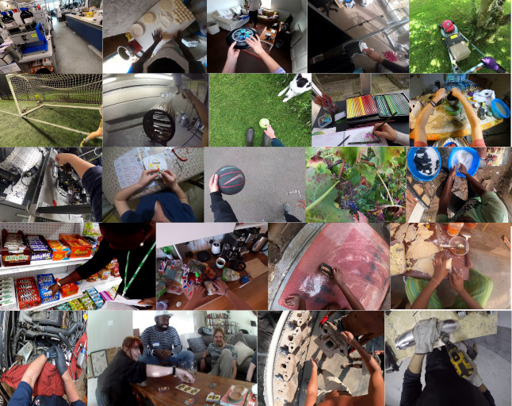
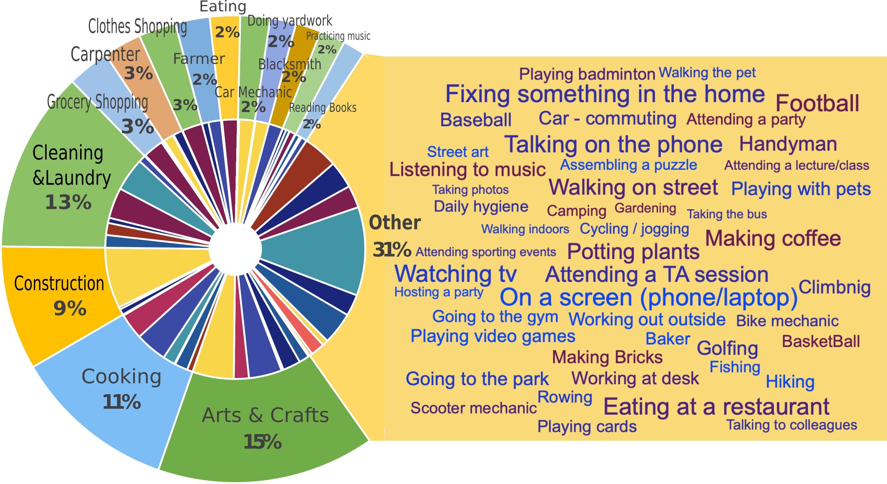

# Ego4D

目标：理解 Ego4D 作为大规模第一人称视频基础数据集的定位，能判断它适合哪些具身 AI 预训练、动作理解和长期记忆任务，也能说清楚它为什么不能直接当成机器人轨迹数据使用。

> 先修：[Egocentric 视频数据集](../02-egocentric-video-datasets.md)
> 建议：重点看“第一人称视频能给机器人学习补什么”，不要把它误读成机器人示教数据集
> 数据集规模：Ego4D 包含约 3,670 小时第一视角视频数据，完整数据规模超过 30 TB，其中主要视频数据约 7.1 TB。

Ego4D 是第一人称视频领域最重要的基础数据集之一。它不是机器人数据集，也不是某个单一任务的动作识别数据集，而是一个覆盖日常生活、工作、社交、户外和手工活动的大规模 egocentric video 数据集。

它的规模可以先记住这几个数字：超过 **3,670 小时**第一人称日常活动视频，覆盖 **74 个采集地点**、**9 个国家**和 **923 位参与者**。


如果只用一句话概括 Ego4D：

```text
Ego4D 是用人类第一视角记录真实生活活动的大规模视频数据集，
适合学习“人如何看、如何找、如何操作、如何预测下一步”，
但它不提供机器人 action，不能直接拿来做行为克隆。
```

## 它到底收集了什么

Ego4D 收集的是人戴着头戴式相机时看到的世界。和普通第三人称视频不同，egocentric 视角有几个明显特点：

第一，视角和行动者绑定在一起。相机随着人的头部和身体运动，画面会自然包含“我正在看什么”“我准备接近什么”“我的手正在操作什么”这些线索。

第二，手和物体经常出现在画面中心。很多日常任务不是远处观察，而是近距离操作，比如切菜、修理、拿取、拼装、清洁、搬运、运动和社交。

第三，视频往往是长时段、非脚本化的。它不像普通动作识别数据那样只剪出几秒钟标准动作，而是包含寻找、停顿、转头、走动、交谈、准备和收尾这些真实过程。

Ego4D 使用了 7 种现成头戴式相机采集，包括 GoPro、Vuzix Blade、Pupil Labs、ZShades、ORDRO EP6、iVue Rincon 1080 和 Weeview。这样做的好处是数据不会过度绑定某一种设备；代价是分辨率、视场、稳定性和可用模态会有差异。

除了 RGB 视频，Ego4D 的部分数据还包含：

| 模态 | 不是所有样本都有 | 对具身 AI 的意义 |
|---|---|---|
| Audio | 是 | 理解对话、环境声音和任务提示 |
| Gaze | 是 | 学习人在操作前看哪里 |
| IMU | 是 | 辅助理解头部运动和身体运动 |
| Stereo / 多 ego 相机 | 是 | 提供更丰富的几何和视角信息 |
| 3D scans / mesh | 是 | 用于场景空间理解 |
| Narrations | 是 | 把视频片段和自然语言描述关联起来 |

这一点很重要：不能看到 Ego4D 就默认每条视频都有所有模态。实际下载和训练前，必须根据 metadata 检查目标 subset 有哪些字段。

## 为什么它对具身 AI 有用

机器人学习最缺的是大规模真实交互经验。真机数据难采、贵、慢，还容易受硬件和安全限制。人类第一视角视频虽然没有机器人动作，却有三个机器人学习很需要的东西。

第一是视觉经验。机器人在家庭、厨房、工作台或户外场景中会遇到大量日常物体和场景结构。Ego4D 可以帮助模型先学到“真实世界长什么样”，而不是只在少量机器人相机数据上从零开始。

第二是手-物交互先验。人类做任务时，手会靠近目标物体，视线会聚焦关键区域，物体状态会发生变化。这些模式不能直接变成机器人动作，但可以用于训练感知模型、视频表征模型、动作预测模型和 affordance 模型。

第三是长时序理解。很多机器人任务不是单步抓取，而是“先找到物体，再判断状态，再执行操作，再确认结果”。Ego4D 的长视频和 episodic memory benchmark 正好适合训练这种从过去视频中检索、定位和推理的能力。

可以把 Ego4D 放在机器人训练链条的前半段：

```text
Ego4D
  -> 学视觉表征、手-物交互、场景记忆、动作预测
  -> 再迁移到机器人数据集
  -> 最后用真机轨迹学习 action
```

不要把它放在最后一步。最后一步需要机器人 observation-action 对，Ego4D 本身不给这个监督信号。

## 五类 benchmark 怎么理解

Ego4D 不是只有一堆视频文件。它同时定义了一组 benchmark，用来把“第一人称理解”拆成可评测问题。主要 benchmark 包括 Episodic Memory、Hand + Object Interaction、Audio-Visual Diarization、Social Interaction 和 Forecasting。


下面按具身 AI 视角解释这五类任务。

| Benchmark | 官方关注的问题 | 放到具身 AI 里怎么理解 |
|---|---|---|
| Episodic Memory | 过去发生了什么，某个物体在哪里 | 长期记忆、事件检索、物体位置回忆 |
| Hand + Object Interaction | 物体在交互中何时、何地、如何变化 | 手-物交互、状态变化、active object 检测 |
| Audio-Visual Diarization | 谁在说话、什么时候说话 | 多人协作、语音和视觉对齐 |
| Social Interaction | 谁在关注谁、谁在和我互动 | 人机社交感知、安全协作 |
| Forecasting | 接下来会发生什么 | 动作预测、目标预测、下一步规划 |

### Episodic Memory

Episodic Memory 的问题很像人类记忆助手：我把钥匙放在哪里了？刚才有没有加盐？什么时候和某人说过话？它要求模型在长视频中根据视觉查询、文本查询或 moment query 找到相关片段。

对机器人来说，这类能力很有价值。家庭机器人如果长期在一个环境里工作，就不能只看当前帧。它需要知道物体之前在哪里、谁移动过它、任务做到哪一步了。Ego4D 不会直接教机器人拿钥匙，但能训练模型从长时间第一视角记录里检索事件。

### Hand + Object Interaction

Hand + Object Interaction 关注物体在操作中的状态变化。这个 benchmark 里的典型任务包括 Point-of-no-return Temporal Localization、Active Object Detection 和 State-Change Classification。

这对机器人操作很直接。比如洋葱从完整变成切碎，门从关闭变成打开，包装从未拆变成拆开。机器人如果只知道“手碰到了物体”，还不够；它还要知道物体状态有没有真的改变，改变发生在什么时候，哪个物体是 active object。

### Audio-Visual Diarization 和 Social Interaction

这两类任务都和人有关。Audio-Visual Diarization 关注谁在说话、声音和画面中的人如何对应；Social Interaction 关注视线、交谈和人与人之间的互动。

这部分看起来离机械臂操作远一些，但对服务机器人很重要。真实机器人经常处在多人环境中，需要判断谁在对它说话，谁正在关注它，谁可能靠近机器人工作区域。它不是抓取策略的直接训练数据，但可以作为人机交互感知的基础数据。

### Forecasting

Forecasting 关注未来。它包含未来运动、手的位置、短期和长期动作预测等问题。对具身 AI 来说，这类任务对应“下一步会发生什么”和“应该提前准备什么”。

例如，机器人看到人把杯子拿向水槽，可能要预测接下来是清洗、放置还是倒水。动作预测能力不等于控制能力，但它可以让机器人更好地规划、等待、避让或接力。

## 场景多样性

Ego4D 的优势之一是场景范围很宽。它覆盖家庭、户外、工作、休闲等多类场景，而不是只在厨房或实验室里采集。



从具身 AI 的角度看，场景多样性至少有三层意义。

第一，视觉背景更真实。机器人实际部署时不会只看到干净桌面，还会看到杂乱房间、移动人群、光照变化和遮挡。

第二，物体长尾更明显。真实生活里物体种类、摆放方式和使用方式都很分散。Ego4D 可以帮助模型学到更宽的物体和场景分布。

第三，动作不是单一模板。同样是“拿起物体”，不同场景下可能是烹饪、维修、运动、整理或社交活动的一部分。模型需要理解动作背后的上下文。

## 下载前先想清楚要什么

Ego4D 很大，不建议一上来下载全量数据。获取数据和标注前，需要先签署 license agreement；审批后会收到 AWS 访问凭证。这个凭证有有效期，所以通常应该把需要的数据下载到本地，而不是长期直接从 AWS 消费。

实际使用时，可以按下面这个顺序来：

```text
1. 先阅读并接受 license agreement
2. 浏览数据和 benchmark 文档
3. 安装 Ego4D CLI
4. 选择自己需要的 subset
5. 再下载数据
```

如果只是为了理解数据结构，建议从下面几类开始：

| 目标 | 先看什么 |
|---|---|
| 理解视频和标注结构 | annotations、metadata、sample notebooks |
| 做长视频检索 | Episodic Memory subset |
| 做手-物交互 | Hands & Objects subset |
| 做动作预测 | Forecasting subset |
| 做人机交互感知 | AV / Social subset |

## 读 Ego4D 时先检查哪些字段

实际使用 Ego4D，不要只看视频文件。至少要检查下面几件事。

第一，视频是否已经 de-identification。Ego4D 很重视隐私和伦理，官方说明多数视频在发布前做过去标识处理，但使用者仍然要遵守许可，尤其是展示样例、发布模型和再分发数据时。

第二，当前视频有没有音频、gaze、IMU、narration 或 3D 信息。不同模态不是全量覆盖，不能写死假设。

第三，benchmark 的 clip 和原始 long video 是什么关系。很多任务会从长视频中切出片段，训练时要清楚时间边界、query、label 和原始视频之间的映射。

第四，任务标注的粒度。Episodic Memory 的标注不是 action label；Hands & Objects 的 state change 也不是机器人 reward；Forecasting 的未来动作预测也不是 robot policy。

第五，数据许可。Ego4D 是需要签署协议的数据，不是随便下载、随便再分发的公开视频集合。

## 和机器人数据集的区别

| 维度 | Ego4D | 机器人轨迹数据 |
|---|---|---|
| 采集主体 | 人类佩戴相机 | 机器人执行任务 |
| 核心记录 | 第一人称视频和相关标注 | observation、state、action、reward 或 episode |
| 是否有 robot action | 没有 | 有 |
| 适合用途 | 视觉预训练、记忆、预测、交互理解 | 行为克隆、离线强化学习、VLA 控制 |
| 最大价值 | 大规模真实生活经验 | 可直接学习控制策略 |

因此，Ego4D 更像“世界经验”和“人类操作先验”的来源，而不是直接的控制监督。

一个合理的使用路径是：

```text
先用 Ego4D 学：
  场景、物体、手-物交互、语言查询、未来预测

再用机器人数据学：
  机器人动作空间、控制频率、末端执行、成功标准

最后在目标机器人上验证：
  是否真的能完成任务，而不是只会理解视频
```

## 适合研究什么

Ego4D 适合下面几类研究。

第一，egocentric video representation。大量第一人称视频可以用来训练更适合头戴相机、腕部相机或移动机器人视角的视频表征。

第二，long video understanding。Episodic Memory 让模型在长视频里找事件、找物体、回答问题，这对长期运行的家庭机器人很有启发。

第三，hand-object interaction。Hands & Objects benchmark 直接关注 active object、状态变化和操作关键时刻，很适合做操作前感知预训练。

第四，forecasting。机器人要安全协作，就需要预测人下一步可能往哪里走、手会接触哪里、物体状态将如何变化。

第五，human-aware robot perception。Social 和 Audio-Visual 任务可以帮助研究多人环境中的说话人定位、视线理解和社交互动。

## 不适合直接做什么

Ego4D 不适合直接做以下事情。

第一，直接训练机器人控制策略。因为没有机器人 action，也没有机器人状态和控制频率。

第二，直接评估机器人成功率。视频里的人类活动不是机器人任务环境，不能把 benchmark 准确率等同于机器人执行成功率。

第三，不检查许可就展示样例。Ego4D 涉及真实人类生活视频，下载、展示、再分发都要按协议来。

第四，默认所有视频都有完整模态。音频、gaze、IMU、3D、stereo、多相机和 narration 都要按 metadata 检查。

## 最小使用流程

如果你后续真的要把 Ego4D 用到具身 AI 项目里，可以按下面流程做：

```text
1. 选研究目标
   是做记忆检索、手-物交互、动作预测，还是人机交互？

2. 选 benchmark subset
   不要一开始下全量视频。

3. 下载 annotations 和少量样例
   先看字段、时间戳、clip 边界、视频分辨率。

4. 抽样可视化
   检查画面是否符合你的目标场景。

5. 决定训练输入
   RGB、audio、gaze、narration 是否真的可用？

6. 记录许可和处理版本
   写清楚 Ego4D 版本、subset、下载日期和过滤规则。

7. 再迁移到机器人数据
   不要停留在视频 benchmark 上，要验证机器人任务是否受益。
```

## 常见误解

**误解一：Ego4D 是机器人数据集。**
不准确。它是人类第一人称视频数据集，不包含机器人 action。

**误解二：Ego4D 可以直接做 imitation learning。**
不准确。模仿学习需要 observation-action 对，Ego4D 主要提供视频和感知/语言标注。

**误解三：3,670 小时就代表能学会所有日常操作。**
不准确。数据量大不等于覆盖所有任务，也不等于能自动迁移到机器人执行器。

**误解四：所有样本都有 gaze、audio、3D 或 narration。**
不准确。很多模态只覆盖部分数据，必须看 metadata。

**误解五：Ego4D 只适合视频理解，和具身 AI 没关系。**
也不准确。它不能直接教控制，但非常适合学习第一人称视觉、手-物交互、长期记忆和动作预测。

## 小结

Ego4D 的核心价值，是把第一人称日常生活视频的规模和多样性拉到了一个新的量级。它让模型有机会从大量真实人类活动中学习场景、物体、手-物交互、社交线索和未来预测。

但读 Ego4D 时一定要把边界想清楚：它是 egocentric video dataset，不是 robot trajectory dataset。用它做具身 AI，最合理的位置是预训练、感知、记忆和预测；真正学习机器人动作，还需要 DROID、BridgeData V2、Open X-Embodiment 这类有机器人 action 的数据。

进一步阅读可以看：

- [Ego4D 主页](https://ego4d-data.org/)
- [Start Here 文档](https://ego4d-data.org/docs/start-here/)
- [Ego4D paper](https://arxiv.org/abs/2110.07058)
