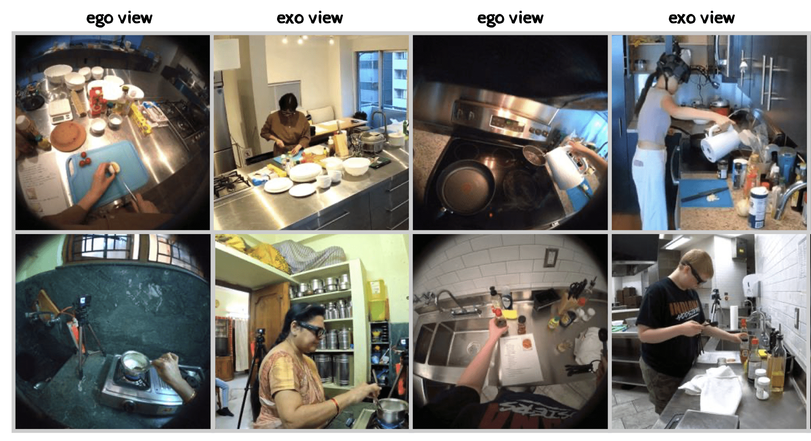
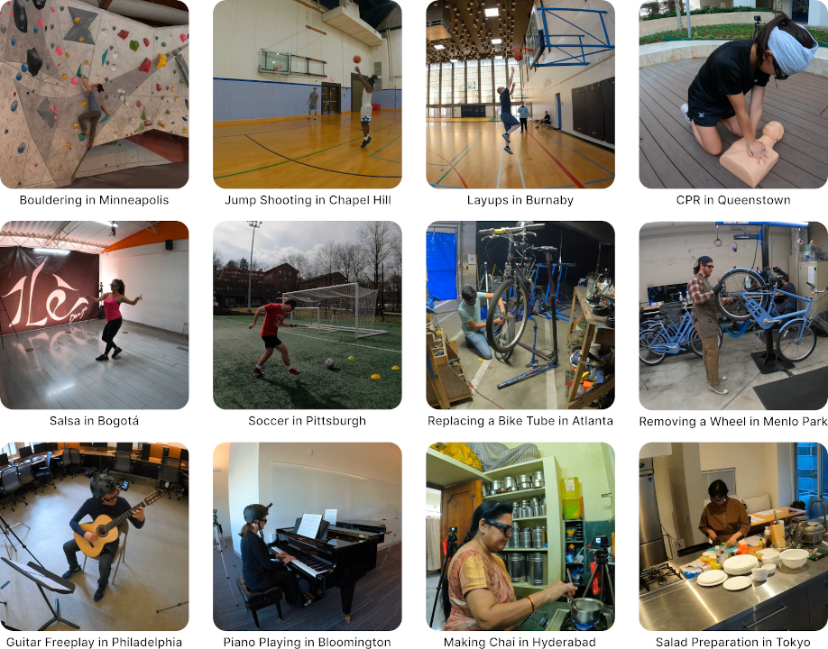
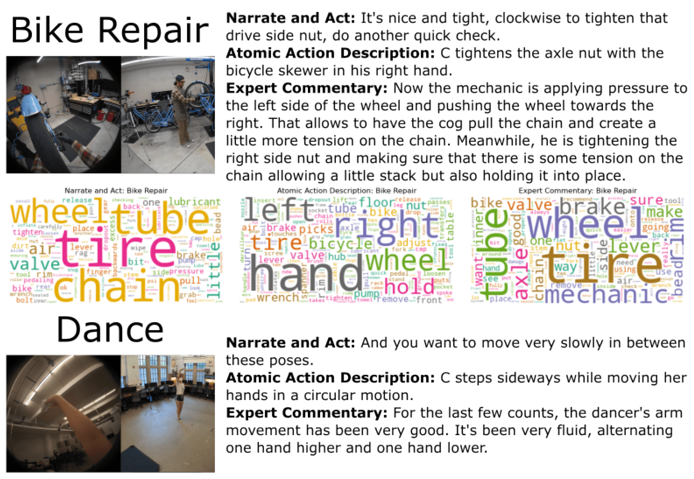

# Ego-Exo4D

目标：理解 Ego-Exo4D 的 ego/exo 同步多视角设计，能说明它为什么适合研究人类技能、跨视角对齐、三维姿态和人类视频到机器人学习的迁移。

> 先修：[Ego4D](01-ego4d.md)
> 建议：重点看“同一个动作在第一人称和第三人称下如何对齐”，不要把它简单理解成 Ego4D 的续集
> 数据集规模：Ego-Exo4D 数据集视频规模约 1,286 小时，完整视频数据约 10.5 TB，同时包含丰富的多模态标注信息。

Ego-Exo4D 可以看成 Ego4D 思路的一次重要扩展。Ego4D 主要记录人自己看到的世界；Ego-Exo4D 则进一步把同一个活动从两个方向同时记录下来：人自己看到的 **ego view**，以及外部相机看到的 **exo view**。

这件事对具身 AI 很关键。机器人学习经常遇到一个问题：网上有很多人类示教视频，但这些视频多数是第三人称拍摄；机器人真正执行任务时，看到的却可能是头部相机、胸前相机、腕部相机或机身相机。两种视角之间有很大的差异。Ego-Exo4D 就是在数据层面提供一座桥：同一个动作、同一个时间、同一个场景，同时有第一人称和多个第三人称视角。



一句话概括：

```text
Ego-Exo4D 不是普通第一人称视频集，
而是同步采集 ego 视角、多个 exo 视角、音频、IMU、眼动、3D 点云和语言描述的多模态多视角技能数据集。
```

## 先把名字看懂

`Ego-Exo4D` 这个名字里有三个关键词。

第一，`Ego` 指 egocentric，也就是第一人称视角。这里主要由 Aria glasses 采集，接近“执行者自己看到什么”。

第二，`Exo` 指 exocentric，也就是第三人称视角。这里通常由 4 到 5 台固定 GoPro 从外部拍摄同一个活动，接近“旁观者看到什么”。

第三，`4D` 指它不只关心单张图像，而是关心三维空间随时间变化。数据里有相机位姿、点云、人体和手部姿态、时间同步视频，这些都在帮助模型理解动态的 3D 活动过程。

所以读 Ego-Exo4D 时，不要只问“有多少小时视频”。更重要的问题是：

```text
同一段动作的 ego 和 exo 视角能不能对齐？
动作过程里人的身体、手、物体和场景关系是什么？
语言描述、专家点评和视频时间轴怎么对应？
这些信息能不能帮助模型从观看人类活动迁移到执行任务？
```

## 数据规模和版本口径

Ego-Exo4D 的规模口径是 **1,286.3 小时视频**、**740 名 camera wearers**、**13 个城市**、**123 个自然场景上下文**。

实际下载和写实验记录时，要写清楚：

```text
使用 Ego-Exo4D 的哪个 release？
下载了哪些 parts？
使用的是 full videos、downscaled videos，还是 benchmark subset？
统计的是 combined video hours，还是 ego-hours？
```

在这里先记住这个结论就够了：Ego-Exo4D 是千小时级、多城市、多视角、带 3D 与语言标注的技能活动数据集。

## 它采集的不是随手活动，而是 skilled activities

Ego4D 更偏日常生活流，Ego-Exo4D 则更强调“有技能结构的活动”。这些活动既包括身体运动类，也包括程序性任务。

| 类型 | 场景 | 为什么适合 Ego-Exo4D |
|---|---|---|
| 物理技能 | Basketball、Soccer、Dance、Bouldering / Rock Climbing、Music | 动作姿态、身体协调、熟练程度很重要 |
| 程序技能 | Cooking、Bike Repair、Health | 步骤顺序、关键阶段、工具使用很重要 |



这和普通动作识别数据不一样。普通数据可能只要判断“这个人在打篮球”。Ego-Exo4D 更关心的是：这个动作做得是否熟练？关键步骤有没有完成？从外部视角能否还原第一人称视角中的手部操作？从第一人称视角能否找到第三人称画面中的同一个物体或动作？

对具身 AI 来说，这类数据最有价值的地方不是“它能不能直接训练机械臂”，而是它把人类技能拆成了更可学习的结构：步骤、姿态、视角、语言和熟练程度。

## 采集系统：一副 Aria 眼镜加多台 GoPro

Ego-Exo4D 的采集系统可以粗略理解成：

```text
一个 camera wearer
  ├─ Aria glasses
  │   ├─ RGB camera
  │   ├─ 2 个 monochrome SLAM cameras
  │   ├─ 7-channel audio
  │   ├─ 2 个 IMU
  │   ├─ eye gaze
  │   ├─ camera pose
  │   └─ sparse 3D point cloud
  └─ 4-5 台 GoPro
      ├─ 外部 RGB 视频
      ├─ stereo audio
      └─ 与 ego 视角时间同步
```

这里最核心的是同步。不是“有人拍了第一人称视频，另一个人又拍了第三人称视频”，而是同一个 take 里，ego 和 exo 相机在同一时间记录同一个动作。这让模型可以学习跨视角对应关系。

数据里常见的信息可以分成几类：

| 信息类型 | 内容 | 使用价值 |
|---|---|---|
| Ego video | Aria RGB / SLAM 相机 | 接近执行者视角 |
| Exo video | 4-5 台 GoPro | 外部观察和动作全局结构 |
| Audio | Aria 7-channel audio、GoPro stereo audio | 语音、教学、环境声音 |
| IMU | Aria 双 IMU | 头部和身体运动线索 |
| Camera poses | Aria / GoPro 6DoF localization | 视角对齐、3D 重建 |
| Point clouds | 静态环境稀疏点云 | 场景几何理解 |
| Eye gaze | 3D gaze vectors | 注意力、目标意图 |
| Pose annotations | 2D/3D 身体和手部关节 | 动作姿态、技能分析 |
| Language | narrations、atomic actions、expert commentary | 语言-视频对齐、教学语义 |

这张表里有一个容易忽略的点：Ego-Exo4D 的价值不是某一种模态特别强，而是多种模态可以在同一个 take 上互相对齐。

## 语言标注为什么重要

Ego-Exo4D 不只是视频和传感器数据，它还提供了多种和时间轴对齐的语言资源。大致可以分成三类。

第一类是 participant narrations，也就是执行者从第一人称角度描述自己为什么这么做、怎么做。

第二类是 atomic action descriptions，也就是密集时间点上的动作描述。它更像把长视频拆成可以检索和训练的小动作语义。

第三类是 expert commentary，也就是教练、老师或领域专家从第三人称角度对表现进行点评。这个设计很有意思，因为它不只是说“发生了什么”，还会涉及“做得好不好”“哪里需要改进”。



对具身 AI 来说，这三类语言对应三种不同能力：

| 语言来源 | 更像什么 | 对模型的帮助 |
|---|---|---|
| Participant narration | 执行者自述 | 理解意图和操作原因 |
| Atomic action | 动作级描述 | 建立视频片段和动作语义的对应 |
| Expert commentary | 教学反馈 | 学习熟练度、错误和改进建议 |

如果未来要训练能听懂人类示教、能根据视频解释操作、能接受专家反馈的机器人模型，这类语言资源比普通 caption 更接近真实教学场景。

## Benchmark 怎么看

Ego-Exo4D 的 benchmark 不是简单的动作分类。文档里列出的核心 benchmark 包括 Keystep、Relations、EgoPose 和 Proficiency Estimation。

| Benchmark | 它问的问题 | 具身 AI 里的含义 |
|---|---|---|
| Keystep | 一个过程里的关键步骤是什么，什么时候发生 | 长程任务分解、步骤检测 |
| Relations | ego 和 exo 视角里的对象或动作如何对应 | 跨视角匹配、物体对应 |
| EgoPose | 从 ego/exo 视角估计身体和手部姿态 | 人体动作理解、手部轨迹估计 |
| Proficiency Estimation | 执行者技能水平如何，哪些动作更好 | 示教质量评估、专家反馈学习 |

这几个 benchmark 和机器人学习的关系很自然。机器人看人类视频时，常常需要先解决四件事：

```text
这段任务分成哪些关键步骤？
哪个物体是当前操作对象？
人的手和身体是怎么运动的？
这个示教是不是高质量示教？
```

Ego-Exo4D 正好把这些问题做成了可评测任务。

## 和 Ego4D 的区别

Ego-Exo4D 很容易被误解成“Ego4D 的更多视频”。这个理解不准确。两者真正的差异在于采集目标。

| 维度 | Ego4D | Ego-Exo4D |
|---|---|---|
| 主要活动 | 非脚本化日常生活 | skilled human activities |
| 视角 | 以 ego 视角为主 | ego + 多个 exo 视角同步 |
| 重点 | 第一人称记忆、交互、预测 | 跨视角、3D、技能结构、熟练度 |
| 语言 | narrations 等视频语言资源 | participant narration、atomic action、expert commentary |
| 适合问题 | 长视频理解、手-物交互、未来预测 | 视角对齐、过程步骤、人体姿态、技能评估 |

简单说：Ego4D 更像“人一天中看见和做过什么”；Ego-Exo4D 更像“一个技能动作从自己眼里和旁人眼里同时长什么样”。

## 和机器人学习有什么关系

Ego-Exo4D 仍然不是机器人轨迹数据。它没有机器人关节角、末端执行器动作、夹爪开合命令，也没有机器人 reward。它不能直接替代 DROID、BridgeData V2 或 Open X-Embodiment。

但它非常适合做机器人学习的前置能力训练。

第一，跨视角迁移。很多机器人示教视频来自外部相机，但机器人执行时用的是机载相机。Ego-Exo4D 可以训练模型把第三人称动作理解迁移到第一人称视角。

第二，过程分解。Cooking、Bike Repair、Health 这类任务天然有步骤。机器人做长程任务时，也需要先知道关键步骤在哪里。

第三，手和身体姿态理解。人类示教里手部轨迹很重要，尤其在工具使用、修理、烹饪这类任务里。Ego-Exo4D 的 2D/3D hand/body joints 对学习操作先验很有帮助。

第四，示教质量判断。不是所有人类示教都一样好。Proficiency Estimation 可以启发机器人数据筛选：哪些示教更像专家，哪些示教包含错误或不熟练动作。

可以把它放在下面这个位置：

```text
Ego-Exo4D
  -> 学跨视角对齐、关键步骤、姿态、熟练度和语言解释
  -> 再和机器人轨迹数据结合
  -> 学机器人自己的 action space 和控制策略
```

## 下载和使用前要注意什么

Ego-Exo4D 的下载不是点一个链接就能拿到。需要先签署 license agreement，审批后获得 AWS 访问凭证。文档里说明审批通常需要约 48 小时，凭证有效期为 14 天。

如果不指定 subset，文档里提到默认推荐数据集大约 14 TiB。更合理的顺序是：

```text
1. 先看文档和 visualization tool
2. 确认自己要研究哪个 benchmark
3. 先下载 metadata 和 annotations
4. 再下载少量 takes 做可视化
5. 最后才考虑视频、点云、features 或特定 benchmark subset
```

不要一上来下载全量，也不要把不同 release 的数字混在一个实验记录里。

## 读数据时先检查哪些东西

如果你准备实际使用 Ego-Exo4D，至少先检查下面几件事。

第一，当前 take 有几路相机。ego 视角通常来自 Aria，exo 视角来自多台 GoPro，但具体可用视角和质量要看 metadata。

第二，相机是否已经时间同步。做跨视角学习时，最怕把不同时间点的动作硬配在一起。

第三，语言标注属于哪一类。participant narration、atomic action 和 expert commentary 的语义不同，不能混成同一种 caption。

第四，姿态和点云是不是你需要的坐标系。3D hand/body pose、camera pose、point cloud 都涉及坐标系转换，不适合直接凭字段名使用。

第五，使用的是哪个 release。尤其 V2 文档已经更新，下载和引用时要写清 release、parts 和过滤规则。

第六，许可和隐私。Ego-Exo4D 是真实人类活动数据，而且大部分视频没有去标识化处理。展示样例、再分发和商用都要按 license 来。

## 常见误解

**误解一：Ego-Exo4D 是 Ego4D 的简单扩容。**
不准确。它的重点不是多一点视频，而是同步 ego/exo 多视角、3D 信息和技能活动标注。

**误解二：有第三人称视频，就可以直接学机器人动作。**
不准确。第三人称视频只能帮助理解动作和场景，机器人控制还需要 robot action。

**误解三：ego 和 exo 视角可以随便配对。**
不准确。它们的价值来自同一个 take 中的时间同步。跨 take 或跨时间乱配会破坏监督信号。

**误解四：expert commentary 就是普通 caption。**
不准确。expert commentary 更像教练点评，包含技能质量和改进信息，和普通动作描述不是同一种标注。

**误解五：所有数据都有完整 3D、点云、姿态和语言。**
不一定。具体可用内容要看 release、parts 和 metadata，不能写死假设。

## 小结

Ego-Exo4D 的核心价值，是把“同一个技能活动”放到多视角、多模态和多语言标注里观察。它让模型不仅能看到执行者自己看到的画面，还能看到外部相机里的全局动作结构，并能把这些信息和姿态、点云、眼动、语言描述和熟练度评估联系起来。

对具身 AI 来说，它最适合放在机器人控制之前：用来学习跨视角对齐、关键步骤、人体和手部姿态、技能质量和语言解释。真正训练机器人怎么动，仍然需要机器人轨迹数据来补上 action space、控制频率和成功标准。

进一步阅读可以看：

- [Ego-Exo4D 主页](https://ego-exo4d-data.org/)
- [Ego-Exo4D 文档](https://docs.ego-exo4d-data.org/)
- [Getting Started](https://docs.ego-exo4d-data.org/getting-started/)
- [Ego-Exo4D paper](https://arxiv.org/abs/2311.18259)
