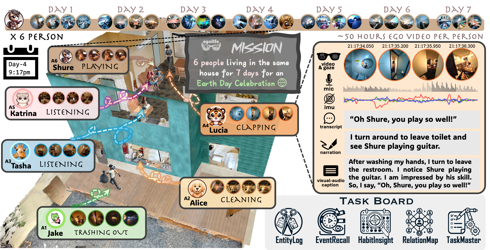
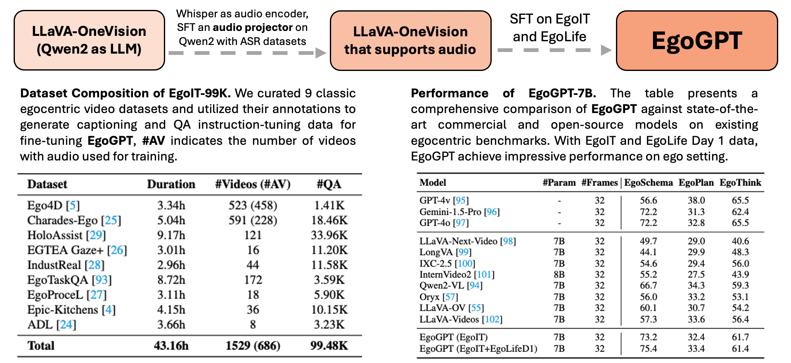
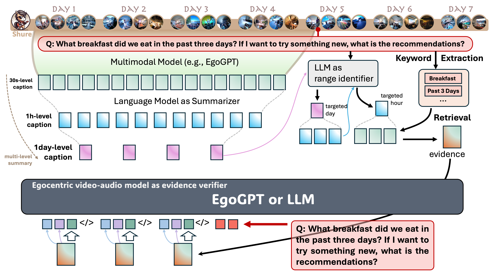

# EgoLife

目标：理解 EgoLife 为什么强调“连续生活记录”和“长期记忆”，能说明它和 Ego4D、Ego-Exo4D 的区别，也能判断它适合哪些具身 AI 助手和长上下文视频理解任务。

> 先修：[Ego4D](01-ego4d.md) → [Ego-Exo4D](02-ego-exo4d.md)
> 建议：重点看“连续一周生活流”和“长上下文问答”，不要把它当成普通动作识别数据集
> 数据集规模：EgoLife 构建了约 300 小时的第一视角、人际交互、多视角、多模态日常生活数据集。

EgoLife 是一个很有代表性的 2025 年第一人称生活记录数据集。前面讲 Ego4D 时，我们关注的是大规模第一人称视频；讲 Ego-Exo4D 时，我们关注的是 ego/exo 同步多视角技能活动。到了 EgoLife，重点又变了：它关心的是一个人类助手如果长期陪伴用户，应该如何理解用户连续几天的生活。

这就不是“这一帧里有什么物体”或者“这一段视频是什么动作”那么简单了。EgoLife 更接近下面这种问题：

```text
我昨天把某个东西放在哪里了？
这几天我有没有按时吃饭、休息或运动？
我和谁讨论过派对安排？
现在给我一个建议，应该参考过去哪些事件？
```

这类问题的难点在于答案往往不在一个短 clip 里，而是散落在几小时甚至几天的记录中。



## 它到底想解决什么问题

EgoLife 的完整题目是 **Towards Egocentric Life Assistant**。这个名字里最关键的是 `Life Assistant`，也就是生活助手。

很多 egocentric 数据集关注“看懂一个动作”。EgoLife 更关心“陪伴一个人生活一段时间之后，能不能帮他回忆、总结和建议”。这会把问题从短视频理解推到长期记忆和个人上下文理解。

可以这样理解：

| 数据集 | 更像在问什么 |
|---|---|
| Ego4D | 人在第一人称视角下做了什么、看到什么、接下来会发生什么 |
| Ego-Exo4D | 同一个技能动作，从自己视角和外部视角看起来如何对应 |
| EgoLife | 一个人连续几天的生活里，哪些事件彼此有关，助手如何长期记住并回答问题 |

所以 EgoLife 和具身 AI 的关系，不是直接训练机械臂，而是训练一个“长期在场”的感知和记忆系统。家庭机器人、可穿戴 AI 助手、移动服务机器人，都可能需要这种能力。

## 数据是怎么采的

EgoLife 记录了 **6 名志愿者共同生活一周**的过程。数据采集围绕一个具体生活场景展开：这些志愿者一起计划和准备一个 party。在这一周里，他们会讨论、购物、做饭、社交、娱乐，也会处理日常生活中的各种小事。

每位参与者大约有 **50 小时**第一人称记录，也就是大约 `7 days x 8 hours`。6 个人合起来形成约 **300 小时**的 egocentric、interpersonal、multi-view、multi-modal daily life dataset。

这几个词需要拆开看：

| 关键词 | 含义 |
|---|---|
| Egocentric | 每个人戴着第一人称视角设备，记录自己看到的生活过程 |
| Interpersonal | 不是一个人独自活动，而是多人共居、交流、协作和社交 |
| Multi-view | 除了第一人称视角，还有屋内第三人称相机提供环境参考 |
| Multi-modal | 不只有视频，还包括 gaze、IMU、音频、转录和密集描述等信息 |
| Daily life | 场景不是实验室动作片段，而是连续一周的真实生活流 |

项目的交互演示把这个采集环境称为 **EgoHouse**。下面这段视频来自该演示，展示的是第一人称视角样例。

<video src="../../assets/egolife-egocentric-demo.mp4" controls muted loop playsinline style="max-width:100%;height:auto;display:block;margin:0.75em 0"></video>

## 为什么“连续一周”很重要

普通视频数据集通常把任务切成短片段。这样做方便标注和训练，但会丢掉长期上下文。比如，一个人上午说“晚上要买饮料”，下午去超市，晚上把饮料放进冰箱。短 clip 只能看到其中一小段；真正的生活助手需要把这些事件连起来。

EgoLife 的连续记录至少带来三类问题。

第一，跨小时的事件关联。模型要知道几个小时前发生的事情和当前问题有关。

第二，跨天的习惯理解。比如饮食、睡眠、运动、社交频率这些信息，不可能只靠一分钟视频判断。

第三，个人化记忆。同样的问题对不同人答案不同。生活助手不能只学通用知识，还要结合这个人的历史记录。

这也是 EgoLife 和机器人长期部署的联系。一个家庭机器人如果每天都在家里工作，它也不能只处理当前画面。它需要知道过去发生过什么，哪些物体被移动过，用户习惯是什么，某个任务之前做到哪一步。

## 多视角和多模态怎么理解

EgoLife 不是只有每个人的第一人称视频。参与者佩戴第一人称眼镜，记录视频、gaze 和 IMU；屋内还布置了 **15 台 GoPro**，用于同步记录第三人称参考视角。项目还配合多视角相机提供房屋和参与者的 3D scans，用于潜在的 3D 应用。

可以把采集系统粗略理解成：

```text
6 名参与者共同生活一周
  ├─ 每个人佩戴第一人称眼镜
  │   ├─ video：记录自己看到的画面
  │   ├─ gaze：记录大致关注位置
  │   └─ IMU：记录头部和身体运动线索
  ├─ 房屋内 15 台 GoPro
  │   ├─ 从外部视角记录多人互动
  │   └─ 与第一人称视频同步
  ├─ audio / transcription
  │   └─ 记录对话和语音内容
  ├─ dense captions
  │   └─ 把长视频拆成更容易检索的事件描述
  └─ 3D scans
      └─ 支持房屋、人物和场景的空间理解
```

下面这段视频展示的是屋内一层第三人称视角。它的意义不是替代第一人称视频，而是给模型补充环境全局信息：谁在什么位置，谁和谁互动，房间里发生了什么。

<video src="../../assets/egolife-level1-demo.mp4" controls muted loop playsinline style="max-width:100%;height:auto;display:block;margin:0.75em 0"></video>

再看一段二层第三人称视角。注意它和第一人称视频不是两个独立数据源，而是同一个生活片段的不同观察角度。

<video src="../../assets/egolife-level2-demo.mp4" controls muted loop playsinline style="max-width:100%;height:auto;display:block;margin:0.75em 0"></video>

这种同步多视角对具身 AI 很有用。机器人自己的视角可能只看到局部，但屋内固定相机能看到全局。如果未来把类似系统放进家庭机器人场景，多视角信息就可以帮助机器人理解整个家庭环境，而不是只依赖一个窄视角相机。

## 标注不是只给动作类别

EgoLife 的标注重点不是“这段视频属于哪个动作类别”。它更关注长视频能不能被检索、总结和问答。

数据里提供的核心标注包括：

| 标注 | 作用 |
|---|---|
| Transcriptions | 把对话和语音内容转成文本，方便检索和语言理解 |
| Dense captions | 对视频事件做密集描述，帮助把长视频切成可索引的语义片段 |
| EgoLifeQA | 面向长上下文生活场景的问答任务 |

这里的 EgoLifeQA 很重要。它不是问“图里有什么”，而是问一些更像真实助手的问题。例如回忆过去事件、监控健康习惯、根据长期记录给个性化建议。这些问题需要模型从很长的时间跨度里找证据，而不是只看当前帧。

因此，EgoLife 的标注粒度和机器人 imitation learning 完全不同。它没有机器人 action，也不是 reward 标注。它提供的是生活事件、语言、记忆和问答监督。

## EgoGPT、EgoRAG 和 EgoButler 是什么关系

EgoLife 项目不只发布数据，还提出了一个面向生活助手的系统思路。可以这样理解：

```text
EgoLife Dataset
  -> 提供连续生活、多视角、多模态数据

EgoGPT
  -> 做 clip-level 多模态理解和密集 caption

EgoRAG
  -> 做长期记忆检索和长上下文问答

EgoButler
  -> 把 EgoGPT 和 EgoRAG 组合成生活助手系统
```



EgoGPT 更像“看懂一段视频”的模块。它处理视觉、音频和语言，输出关键事件、动作和上下文描述。



EgoRAG 更像“长期记忆检索”的模块。它把过去的视频内容组织成可检索的记忆，然后在回答问题时找回相关事件。比如用户问“我上次把某个东西放在哪里”，系统不能只看当前视频，而要先检索过去记录。

这套设计对具身 AI 很有启发。真实机器人也可能需要类似结构：一个模块负责当前感知，一个模块负责长期记忆，一个模块负责把用户问题和历史事件连接起来。

## 和具身 AI 的关系

EgoLife 离机器人控制还有一段距离。它没有机械臂动作、底盘控制、夹爪状态，也没有机器人成功率。不能把它直接当成 DROID 或 BridgeData V2 那样的轨迹数据。

但它对具身 AI 的价值很明确，主要在“长期陪伴”和“生活场景理解”上。

第一，长期记忆。机器人如果长期在家中服务，需要记住过去发生的事情。EgoLife 提供了跨小时、跨天的视频问答场景。

第二，多人交互。很多家庭任务不是单人场景，而是多人交谈、协作、计划和安排。EgoLife 提供了 interpersonal 数据。

第三，用户习惯建模。健康习惯、日程、社交和偏好都需要长期观察，不能只靠单次任务判断。

第四，多视角环境理解。第一人称视角和屋内 GoPro 视角结合，可以启发家庭机器人如何利用自带相机和环境相机。

第五，语言助手能力。EgoLifeQA 的目标不是动作分类，而是让模型回答生活问题。这和未来“机器人作为生活助手”的方向更接近。

## 和 Ego4D、Ego-Exo4D 的区别

可以用下面这张表把三者区分开。

| 数据集 | 重点 | 更适合研究 |
|---|---|---|
| Ego4D | 大规模第一人称日常活动视频 | 视觉预训练、事件记忆、手-物交互、预测 |
| Ego-Exo4D | 技能活动的 ego/exo 同步多视角 | 跨视角对齐、姿态、关键步骤、熟练度 |
| EgoLife | 连续一周共居生活记录 | 长期记忆、生活问答、个人化助手、多日上下文 |

简单说，Ego4D 帮你学“人看到什么和做什么”，Ego-Exo4D 帮你学“同一个技能从不同视角看如何对齐”，EgoLife 帮你学“长期陪伴中，过去的生活事件如何被记住和使用”。

## 使用前要特别小心什么

EgoLife 这种数据比普通动作数据更敏感。因为它记录的是多人连续生活，里面可能包含对话、个人习惯、社交关系、室内环境和身份信息。

使用前至少要注意以下几点。

第一，隐私和许可。不要把它当作随便展示的公开视频。涉及人物、语音、居住环境和长期生活记录时，展示样例和再分发都要格外谨慎。

第二，长视频切片。训练模型时不能随便切几秒钟就当成完整样本。很多问答依赖跨小时或跨天的上下文。

第三，身份信息。EgoLife 的一个技术挑战就是 identity recognition。身份识别对生活助手有用，但也带来隐私风险。

第四，多视角同步。第一人称眼镜和 GoPro 视角如果时间错位，问答和事件检索都会出问题。

第五，标注语义。transcription、dense caption、EgoLifeQA 不是同一种标注，不能混在一起当普通 caption 用。

第六，和机器人动作的边界。它能训练长期理解和助手能力，但不能直接教机器人移动机械臂或控制底盘。

## 适合研究什么

EgoLife 适合下面几类问题。

第一，long-context video understanding。模型需要在几小时甚至几天的视频中找证据。

第二，egocentric life assistant。让可穿戴设备或家庭机器人回答和生活有关的问题。

第三，personalized memory。根据个人历史记录回答问题，而不是只靠通用知识。

第四，multimodal RAG。把视频、音频、文本转录和 dense captions 组织成可检索记忆。

第五，interpersonal understanding。理解多人共居环境中的对话、协作和社交关系。

## 不适合直接做什么

EgoLife 不适合直接训练机器人控制策略。它没有机器人 action。

它也不适合只做普通短视频动作分类。把 EgoLife 切成几秒钟动作片段，会浪费它最重要的价值：长期连续生活上下文。

它还不适合在没有隐私审查的情况下公开展示样例。长期生活记录的敏感性比普通物体操作视频高得多。

## 最小阅读流程

如果你后续要实际使用 EgoLife，可以按下面流程先读懂一小部分：

```text
1. 先选问题
   是做生活问答、长期记忆、dense caption，还是多视角理解？

2. 看一段连续时间
   不要只抽单帧，要看一个较长时间窗口内事件如何连接。

3. 对齐多模态
   检查 ego video、GoPro、audio、transcription 和 caption 的时间关系。

4. 读 EgoLifeQA
   看问题是否依赖小时级或天级上下文。

5. 区分视觉理解和记忆检索
   当前画面能回答的问题交给视觉模型；过去事件问题需要检索。

6. 记录隐私和许可边界
   明确哪些样例可以展示，哪些只能内部使用。
```

## 常见误解

**误解一：EgoLife 是更长版本的 Ego4D。**
不准确。EgoLife 的重点不是单纯更长，而是连续共居生活、个人记忆和长上下文问答。

**误解二：300 小时不算特别大，所以价值有限。**
不准确。它的价值不只在小时数，而在连续一周、多参与者、多视角、多模态和密集标注。

**误解三：EgoLifeQA 就是普通视频问答。**
不准确。它强调生活场景、长期记忆和跨小时/跨天的问题，和只看一个短 clip 的 VQA 不一样。

**误解四：有 GoPro 多视角，就可以直接做机器人导航或控制。**
不准确。GoPro 视角提供环境参考，但没有机器人状态和 action。

**误解五：长期生活记录越完整越好，不需要过滤。**
不准确。长记录里会有大量隐私、无关片段和重复内容，使用前必须做许可、过滤和任务定义。

## 小结

EgoLife 的核心价值，是把 egocentric video 从“看懂一个动作”推进到“理解一个人连续生活中的长期事件关系”。它用六名志愿者一周共居生活、第一人称眼镜、15 台 GoPro、多模态信号、转录、dense captions 和 EgoLifeQA，构造了一个面向生活助手的研究场景。

对具身 AI 来说，EgoLife 最适合启发长期记忆、多模态检索、个人化助手和家庭场景理解。它不能替代机器人轨迹数据，但可以补上机器人长期陪伴中非常缺的一块能力：记住过去、理解生活、在合适的时候把历史事件重新找出来。

进一步阅读可以看：

- [EgoLife 主页](https://egolife-ai.github.io/)
- [EgoLife GitHub 仓库](https://github.com/EvolvingLMMs-Lab/EgoLife)
- [EgoLife paper](https://arxiv.org/abs/2503.03803)
- [Hugging Face paper page](https://huggingface.co/papers/2503.03803)
