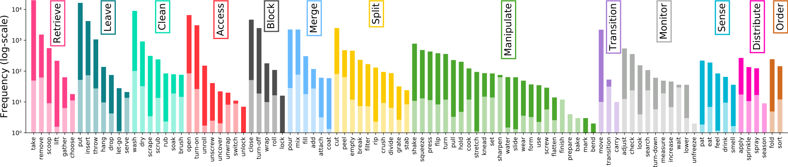
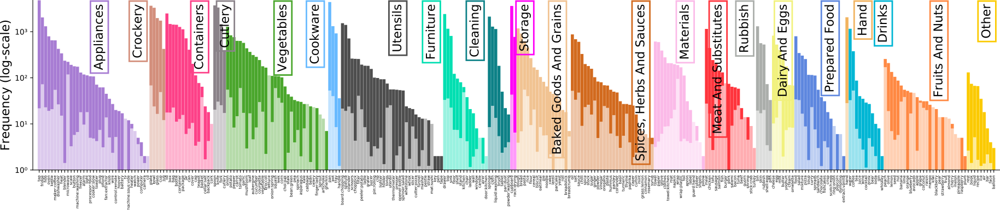
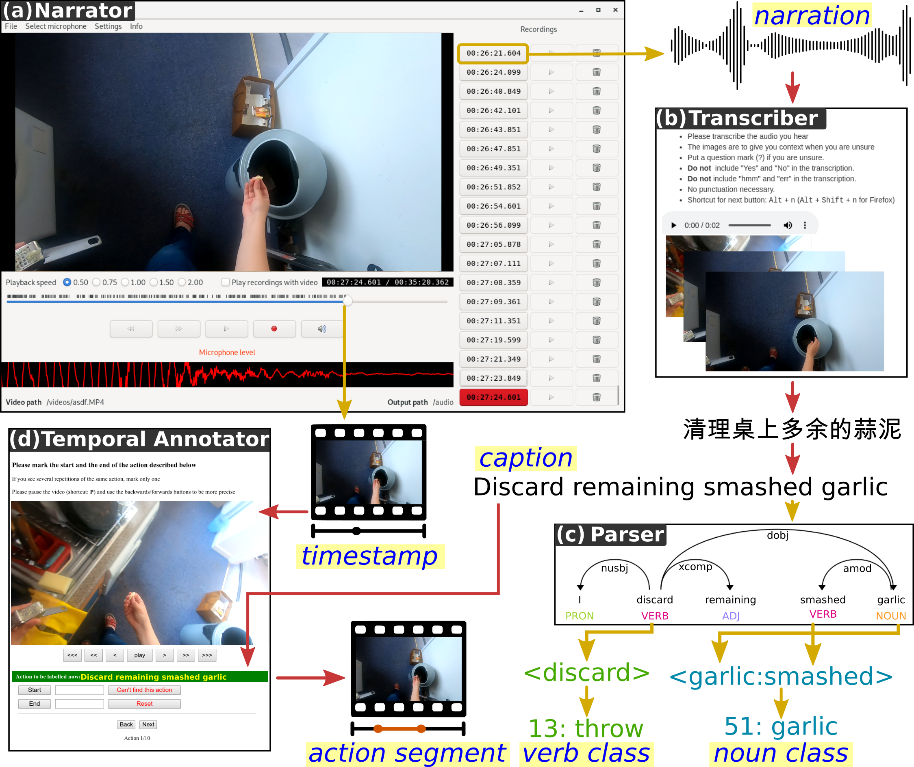

# EPIC-KITCHENS-100

目标：理解 EPIC-KITCHENS-100 为什么是厨房第一视角动作理解的经典数据集，能看懂它的 action segment、verb/noun 标注和常见 benchmark，也能判断它和机器人遥操作数据之间的差别。

> 先修：[Ego4D](01-ego4d.md) → [Ego-Exo4D](02-ego-exo4d.md)
> 建议：重点看“动作段”和“verb/noun 标注”，不要把这里的 action 理解成机器人控制量
> 数据集规模：EPIC-KITCHENS-100 数据集包含约 100 小时第一视角视频数据，原始视频数据规模约 1.1 TB，同时提供动作、语言以及手-物交互相关标注。

EPIC-KITCHENS-100 是第一人称视频里非常经典的厨房数据集。它记录的不是实验室里摆好的固定任务，而是参与者在自己家厨房里做饭、拿东西、开关柜门、清洗餐具、整理食材这些真实活动。

这类数据对具身 AI 很有参考价值，因为厨房是一个很典型的具身场景：物体多、遮挡多、手和工具频繁接触，动作之间还有明显的先后关系。一个人“打开冰箱、拿出牛奶、倒入杯子、把牛奶放回去”，这不是几张孤立图片能讲清楚的，它需要模型理解物体、手、动作和时间顺序。

先看一段数据直观感受。下面这个视频墙展示的是不同厨房中的第一视角片段，可以注意一下画面里频繁出现的手、容器、厨具和柜门。

<video src="../../assets/epic-kitchens-video-wall.mp4" controls muted loop playsinline style="max-width:100%;height:auto;display:block;margin:0.75em 0"></video>

## 它到底收集了什么

EPIC-KITCHENS-100 的核心可以概括成一句话：

```text
让参与者佩戴头戴式相机，在自己的厨房里记录日常活动，
再把视频切成带有自然语言描述、动词类别和名词类别的动作片段。
```

这套数据的规模口径如下：

| 项目 | 数量 | 怎么理解 |
|---|---:|---|
| 视频时长 | 100 小时 | 厨房第一视角视频，不是机器人轨迹 |
| 视频帧 | 约 20M frames | 用于训练视觉模型或抽取片段特征 |
| 视频数量 | 700 个 videos | 每个 participant 会有多个厨房视频 |
| 厨房数量 | 45 个 kitchens | 覆盖不同家庭厨房环境，分布在 4 个城市 |
| 动作片段 | 约 89.9K action segments | 每个片段对应一个被标注的厨房动作 |
| 旁白表达 | 约 20K unique narrations | 同类动作会有多种自然语言说法 |
| 动词类别 | 97 个 verbs | 例如 open、take、put、wash |
| 名词类别 | 300 个 nouns | 例如 door、plate、knife、onion |
| 动作类别 | 约 4.0K action classes | action 通常由 verb + noun 组合而来 |

这里最容易误解的是 `action`。在 EPIC-KITCHENS-100 里，action 不是机器人底层动作，也不是关节角、末端位姿或者夹爪开合命令。它更接近“人在视频中做了什么事情”的语义标签。

比如一条真实标注长这样：

```text
narration_id: P01_01_0
participant_id: P01
video_id: P01_01
start_timestamp: 00:00:00.14
stop_timestamp: 00:00:03.37
narration: open door
verb: open
noun: door
```

这条记录的意思是：在 `P01_01` 这个视频里，从 `00:00:00.14` 到 `00:00:03.37` 这一段，参与者做了一个 `open door` 的动作。`open` 是动词类别，`door` 是名词类别，二者组合起来才是这一段动作的语义。

## action segment 是什么

EPIC-KITCHENS-100 不是把整段视频只标一个类别，而是把长视频切成很多有起止时间的动作段。读它的标注时，建议先把一行 CSV 理解成下面这个单元：

```text
一个 action segment =
  哪个参与者：participant_id
  哪个视频：video_id
  从哪里开始：start_timestamp / start_frame
  到哪里结束：stop_timestamp / stop_frame
  人怎么描述它：narration
  归到哪个动词：verb / verb_class
  归到哪个名词：noun / noun_class
```

训练动作识别模型时，常见输入就是这一小段视频，输出是 `verb`、`noun` 或者 `verb + noun`。例如：

| narration | verb | noun | 更接近什么任务 |
|---|---|---|---|
| open door | open | door | 识别“打开某个东西” |
| turn on light | turn-on | light | 识别“启动某个设备” |
| take cup | take | cup | 识别“拿起某个物体” |
| wash plate | wash | plate | 识别“清洗某个物体” |

这和机器人模仿学习里的 `(observation, action)` 不一样。机器人数据里的 action 往往能直接喂给控制器，而 EPIC-KITCHENS-100 的 action 是人类活动的语义标注。它能帮助模型学会“看懂人正在厨房里做什么”，但不能直接告诉机器人下一步电机该怎么转。

## 为什么要拆成 verb 和 noun

厨房动作有一个特点：同一个动词会作用在很多物体上，同一个物体也会出现在很多动作里。只给整类 action label 会让数据非常稀疏，而拆成 `verb` 和 `noun` 之后，模型可以更好地复用知识。

举几个例子：

```text
open door
open drawer
open fridge

take cup
take knife
take onion

wash plate
wash knife
wash hand
```

如果模型只把每一组都当成完全独立的类别，就很难泛化。拆成动词和名词后，模型至少可以分别学习“open 这类动作的视觉模式”和“door / drawer / fridge 这些物体的外观差异”。

下面两张图展示了数据中动词和名词类别的分布。可以看到，厨房动作并不是均匀分布的，常见动作很多，长尾动作也不少。这一点在训练和评估时很重要。





## 标注流程怎么理解

EPIC-KITCHENS-100 的一个重要设计是让参与者在真实厨房中记录日常活动，并通过 narrations 描述自己正在做的事情。后续再根据这些描述和视频内容整理动作片段、动词类别、名词类别以及训练和测试划分。

可以把流程理解成四步：

```text
录制厨房第一视角视频
  -> 收集参与者对动作的自然语言描述
  -> 根据时间对齐得到 action segments
  -> 整理成 verb / noun / action benchmark
```

下面这张图概括了从原始视频到标注和任务构建的大致流程。



这里有一个细节需要记住：`narration` 和 `verb/noun` 不是一回事。

`narration` 是人说出来的自然语言描述，比如 `open door`。`verb` 和 `noun` 是规范化后的类别，比如 `open` 和 `door`。自然语言里可能有同义表达、复数形式或者更口语化的说法，所以训练分类模型时通常用规范化后的类别；研究语言和视频对齐时，才会更关心原始 narration。

## 常见 benchmark 看什么

EPIC-KITCHENS-100 常被用来做动作理解 benchmark。读论文或跑基线时，最常见的是下面几类任务。

| 任务 | 输入 | 模型要输出什么 | 适合研究什么 |
|---|---|---|---|
| Action Recognition | 已切好的动作片段 | verb、noun 或 action 类别 | 短片段动作分类 |
| Weakly Supervised Action Recognition | 较弱标注的视频片段 | 动作类别 | 少用精确时间边界的学习 |
| Action Detection | 一段较长视频 | 动作开始、结束时间和类别 | 在长视频里定位动作 |
| Action Anticipation | 动作发生前的视频 | 接下来会发生的动作 | 预测人的下一步行为 |
| Unsupervised Domain Adaptation | source/target 两部分数据 | 适应新厨房或新采集域 | 跨域泛化 |
| Multi-Instance Retrieval | 文本或视频查询 | 找到匹配的视频片段 | 视频和语言检索 |

其中 Action Anticipation 对具身 AI 特别有意思。它不是问“这个动作已经是什么”，而是问“接下来可能会发生什么”。如果一个家庭机器人看到人把杯子拿到水龙头旁边，它可能需要提前判断人是不是要接水、清洗杯子，或者准备倒水。这类能力和协作机器人、家务机器人都有关系。

不过要注意，benchmark 的指标不是机器人任务成功率。比如动作识别里常见的是 top-1、top-5 accuracy；动作检测里常见的是不同 IoU 阈值下的 mAP。这些指标衡量的是视频理解模型，不是机器人是否真的完成了操作。

## 和具身 AI 的关系

EPIC-KITCHENS-100 不能直接替代机器人数据，但它能补上机器人数据很难大规模收集的一部分能力。

第一，厨房物体和动作先验。机器人数据里可能只有几百到几千条厨房演示，而 EPIC-KITCHENS-100 有大量真实厨房片段。模型可以从中学习碗、盘子、柜门、冰箱、刀具、食材这些物体在真实家庭环境里的外观和使用方式。

第二，手和物体交互。很多片段都包含手接近、抓取、移动、放下物体的过程。即使没有机器人关节状态，这些视觉模式也有助于学习 affordance，也就是“这个物体能被怎样操作”。

第三，长尾动作。真实厨房里不是只有 pick-and-place。人会倒、洗、切、擦、开、关、搅拌、取出、放回、整理。对于想让机器人进入家庭场景的研究来说，这种长尾分布比干净的单任务演示更接近现实。

第四，动作预测。机器人和人协作时，很多时候要提前理解人的意图。EPIC-KITCHENS-100 的 anticipation 任务可以作为一个视频预测能力的训练和评估入口。

但也要把边界说清楚：

```text
它有人的第一视角视频和语义动作标注，
但没有机器人本体状态、末端位姿、夹爪命令、力控数据和真实执行成功标记。
```

所以它更适合做视觉表征、动作理解、语言视频对齐和人类活动先验，而不是直接做低层控制。

## 和前面几个数据集有什么不同

| 数据集 | 重点 | EPIC-KITCHENS-100 的区别 |
|---|---|---|
| Ego4D | 大规模日常第一视角视频 | EPIC-KITCHENS-100 更集中在厨房动作和 verb/noun benchmark |
| Ego-Exo4D | ego/exo 多视角技能活动 | EPIC-KITCHENS-100 主要是头戴式第一视角厨房视频 |
| EgoLife | 连续生活记录和长期记忆 | EPIC-KITCHENS-100 更关注动作片段、动作分类和检测 |
| 机器人遥操作数据 | 机器人观测和控制动作 | EPIC-KITCHENS-100 是人类视频理解数据，不含机器人控制量 |

如果你的目标是训练机器人策略，EPIC-KITCHENS-100 不能单独完成这件事。如果你的目标是让模型先学会“厨房里人在做什么”“哪些物体经常一起出现”“下一步动作可能是什么”，它就很有价值。

## 下载和使用前要注意什么

EPIC-KITCHENS-100 数据量不小，完整下载前要先想清楚自己需要哪一部分。常见数据包包括视频、RGB frames、optical flow frames、IMU 相关数据以及自动生成的 object masks、hand/object boxes 等。完整帧数据会非常大，下载前要确认硬盘空间。

如果只想先理解数据结构，可以先看 annotations，不一定一上来就下载全部视频和帧。训练视频模型时，再根据任务决定是否下载 RGB frames、flow frames 或者原始视频。

使用时建议检查下面几件事：

| 检查项 | 为什么重要 |
|---|---|
| 使用的是 train、validation 还是 test split | benchmark 结果必须按规定划分报告 |
| 是否包含 unseen participants | 有些评估专门看新参与者泛化 |
| 用的是 video 还是 pre-extracted frames | 时间戳、帧号和解码方式可能影响对齐 |
| 预测的是 verb、noun 还是 action | 三者是不同评估口径 |
| 是否使用 audio、flow、mask 等额外模态 | 不同模态之间不能直接比较结果 |
| 是否遵守 CC BY-NC 4.0 | 数据用于商业场景前必须单独确认授权 |

另外，EPIC-KITCHENS 后续还有 VISOR、EPIC-SOUNDS、HD-EPIC 等扩展资源。它们和 EPIC-KITCHENS-100 关系很近，但不是本页讨论的同一个核心数据包。写实验记录时要写清楚自己用的是哪一套标注和哪一版数据。

## 常见误解

**误解一：EPIC-KITCHENS-100 是机器人数据集。**

不准确。它是人类第一视角厨房视频数据集，不包含机器人本体和控制指令。

**误解二：action 就是机器人动作。**

不对。这里的 action 是语义动作片段，通常由 `verb + noun` 表示，例如 `open door`、`wash plate`。

**误解三：有 100 小时视频，就可以直接训练家务机器人。**

不够。100 小时视频能帮助模型学视觉和动作理解，但低层控制还需要机器人数据或仿真交互。

**误解四：只看 action label 就够了。**

不够。很多研究要分别看 verb、noun 和 action，因为它们反映的是不同难点：动作方式、被操作物体，以及二者组合。

**误解五：随机切分训练集和测试集也可以。**

不建议。这个数据集很强调 participant、kitchen 和 domain 的泛化问题，随便随机切分可能让同一个人的相似厨房场景同时出现在训练和测试里，评估会偏乐观。

## 小结

EPIC-KITCHENS-100 是“真实厨房第一视角动作理解数据集”。它的价值不在于提供机器人控制轨迹，而在于提供大量真实厨房里的手、物体、动作和语言描述。对于具身 AI 来说，它更像是一个学习厨房视觉常识、动作语义和人类意图预测的入口。

进一步阅读可以看：

- [EPIC-KITCHENS 主页](https://epic-kitchens.github.io/)
- [EPIC-KITCHENS-100 任务与下载页](https://epic-kitchens.github.io/2026)
- [EPIC-KITCHENS-100 annotations](https://github.com/epic-kitchens/epic-kitchens-100-annotations)
- [Rescaling Egocentric Vision: Collection, Pipeline and Challenges for EPIC-KITCHENS-100](https://arxiv.org/abs/2006.13256)
