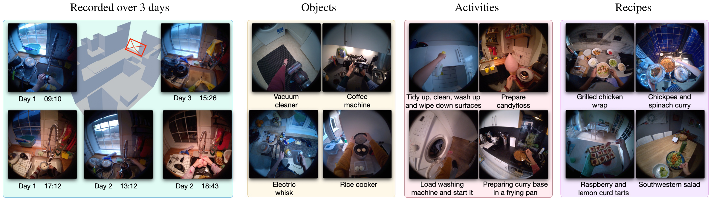
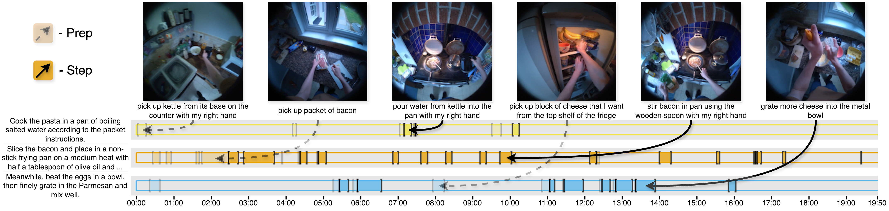
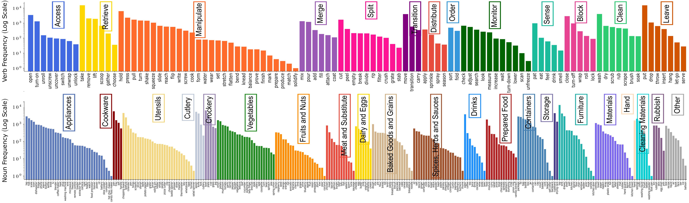
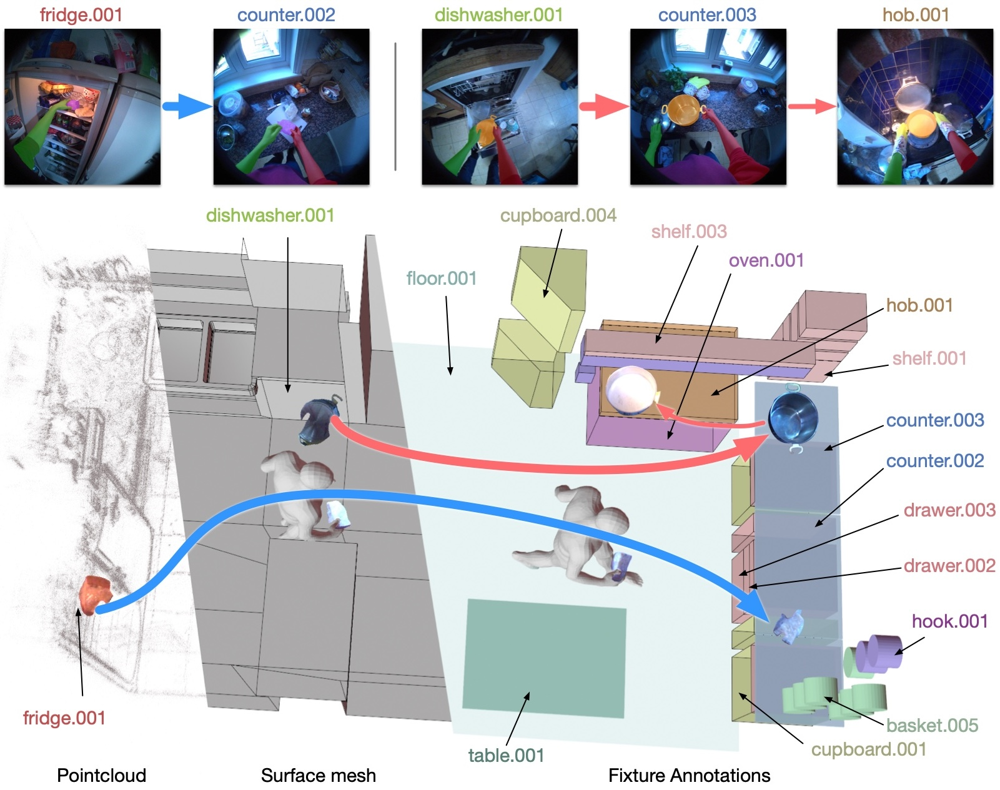
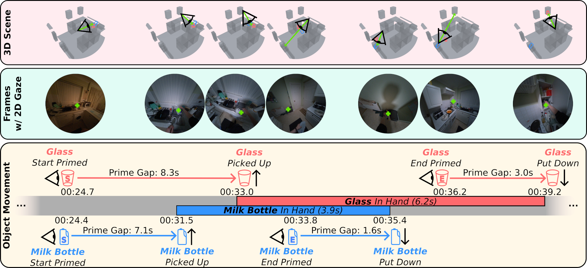
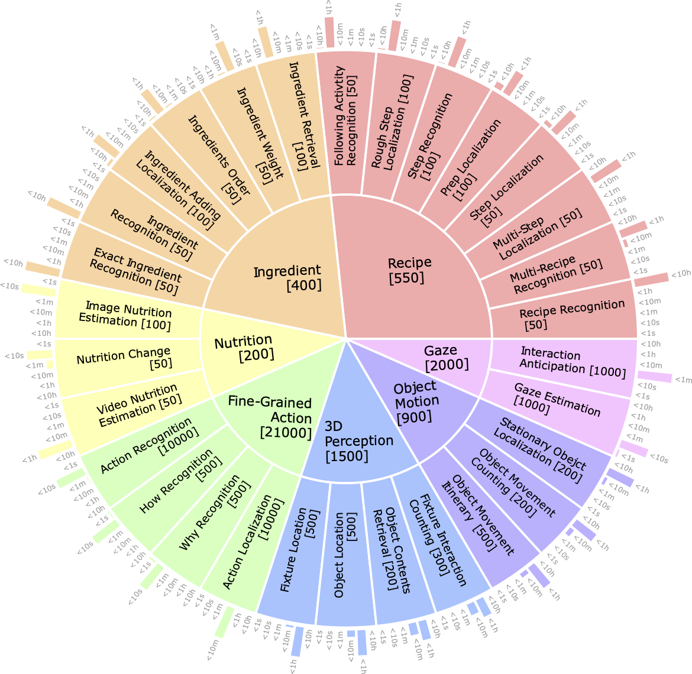

# HD-EPIC

目标：理解 HD-EPIC 和 EPIC-KITCHENS-100 的关系，能说明它为什么强调 Highly-Detailed annotations，能看懂 recipe、action、audio、object motion、digital twin、gaze 和 VQA 这些标注分别在解决什么问题。

> 先修：[EPIC-KITCHENS-100](04-epic-kitchens-100.md)
> 建议：把这一节当成“厨房第一视角视频如何从动作分类走向细粒度场景理解”的例子来看，不要只把 HD-EPIC 理解成分辨率更高的视频
> 数据集规模：HD-EPIC 数据集完整规模约 2.3 TiB，包含 41 小时第一视角视频以及丰富的 2D/3D 多模态标注。

HD-EPIC 是 EPIC-KITCHENS 团队在 2025 年发布的数据集，完整名字是 **HD-EPIC: A Highly-Detailed Egocentric Video Dataset**。这里的 `HD` 更应该理解成 `Highly-Detailed`，也就是“高度细致的标注”，而不是只强调画面清晰。

上一节的 EPIC-KITCHENS-100 已经能回答“这段厨房视频里人在做什么动作”。HD-EPIC 往前推进了一步：它不只标动作，还想把厨房里的 recipe、ingredient、nutrition、audio、object movement、digital twin 和 gaze 这些信息连起来。

也就是说，它关心的不只是：

```text
这个人正在 cut onion。
```

而是进一步追问：

```text
这个动作属于哪道菜的哪一步？
被操作的食材是什么，加入了多少？
这个声音来自什么事件？
物体从哪里被拿起，又被放到了厨房里的哪个 fixture 上？
人在拿起物体前，视线是否已经看向了它？
```

下面这张图能直观看到 HD-EPIC 的特点：同样是厨房第一视角视频，它把动作、食材、物体移动、3D 场景和 gaze 都拉到了一套标注体系里。



## 它到底收集了什么

HD-EPIC 采集的是 9 个真实家庭厨房中的多天非脚本化第一视角视频。参与者不是在实验室里按固定脚本摆拍，而是在自己的厨房里做真实的烹饪和整理活动。

| 项目 | 数量 | 怎么理解 |
|---|---:|---|
| 视频时长 | 41 小时 | 多天厨房第一视角记录 |
| 视频帧 | 4.4M frames | 可用于视频理解和帧级标注 |
| 厨房数量 | 9 个 kitchens | 每个厨房都有对应的场景重建和 fixture 标注 |
| recipes | 69 个 | 记录真实菜谱和烹饪步骤 |
| ingredients | 558 个 | 包含食材和营养相关信息 |
| fine-grained actions | 59.4K | 带起止时间的细粒度动作片段 |
| audio events | 50.9K | 水声、碰撞声、点击声等声音事件 |
| hand masks | 7.7M | 大量手部分割掩码 |
| object tracks | 19.9K | 物体从拿起到放下的运动轨迹 |
| VQA questions | 26.6K | 面向视频问答的多选题 benchmark |

单看时长，HD-EPIC 比 EPIC-KITCHENS-100 小；但它的标注密度高很多，平均每分钟约有 263 条标注。它的价值不在于更大，而在于更细。

## 它和 EPIC-KITCHENS-100 有什么关系

可以把两者的关系理解成这样：

| 数据集 | 更像在回答什么问题 |
|---|---|
| EPIC-KITCHENS-100 | 这段厨房视频里的动作是什么？它的 verb 和 noun 是什么？ |
| HD-EPIC | 这个动作属于哪道菜、哪一步、涉及什么食材、声音、物体移动、3D 位置和 gaze？ |

EPIC-KITCHENS-100 的核心是 action recognition、action detection、anticipation 这类视频动作理解任务。HD-EPIC 仍然保留细粒度动作，但它把动作放进了更完整的厨房上下文里。

举一个简单例子。EPIC-KITCHENS-100 可能会标出：

```text
cut pepper
```

HD-EPIC 更关心的是：

```text
这是不是某道 recipe 的 prep step？
pepper 是哪一种 ingredient？
切之前是否称重，营养值如何变化？
切的声音是不是被 audio event 捕捉到了？
pepper 从哪个 fixture 被拿起，最后放到了哪里？
参与者在拿起 pepper 前有没有先看它？
```

所以 HD-EPIC 更适合研究复杂厨房理解，而不只是短片段动作分类。

## recipe 和 ingredient 标注

很多烹饪视频数据集只截取最终“做菜”的漂亮片段，而 HD-EPIC 记录的是更完整的真实过程：找食材、预处理、称重、加入食材、执行步骤、整理厨房。这些过程并不总是线性的。一个人可能先切一部分食材，再去找调料，中间还会清理台面或打开柜门。

下面这张图展示的是 recipe step 和 prep segment 的关系。



这类标注对具身 AI 有一个直接启发：厨房任务不是简单的单步 pick-and-place，而是长程任务。机器人如果要完成“做一道菜”这种目标，需要理解 recipe step、ingredient 状态、已经完成的步骤和剩余步骤。

HD-EPIC 里的 recipe 和 ingredient 信息可以支持这类问题：

| 问题 | 需要哪些标注 |
|---|---|
| 这段视频正在做哪道菜？ | recipe 标注 |
| 当前属于哪一个步骤？ | step / prep 时间段 |
| 哪些食材已经加入？ | ingredient tracking |
| 食材加入顺序是什么？ | 时间对齐的 ingredient 标注 |
| 营养值如何变化？ | ingredient amount 和 nutrition 信息 |

这和机器人操作里的任务规划很像。模型不能只识别“拿起勺子”，还要知道这个动作是不是当前 recipe 的必要步骤。

## 细粒度 action 不只是 verb + noun

HD-EPIC 仍然有动作片段标注，但它比 EPIC-KITCHENS-100 的动作描述更开放。标注文件里的 `HD_EPIC_Narrations.pkl` 包含 `narration`、`start_timestamp`、`end_timestamp`、`verbs`、`nouns`、`pairs`、`main_actions`、`hands` 等字段。

一个动作描述可以长到这种程度：

```text
Open the upper cupboard by holding the handle of the cupboard with the left hand.
```

这句话里不只有 `open cupboard`，还包含了：

```text
做什么：open
操作什么：upper cupboard
怎么做：by holding the handle
用哪只手：left hand
```

HD-EPIC 还从一部分 narrations 里抽取了 `how` 和 `why` 信息。它们很有用，因为机器人学习时经常不只需要知道动作类别，还需要知道动作是怎么完成的、为什么要这样做。

比如：

| 信息 | 例子 | 对具身 AI 的意义 |
|---|---|---|
| what | open upper cupboard | 当前动作语义 |
| how | holding the handle with left hand | 具体操作方式 |
| why | so that the lid is aligned ... | 动作目的或意图 |
| hands | left hand / right hand / both hands | 手部使用方式 |

下面这张图展示了 HD-EPIC 中 verb 和 noun cluster 的分布。它提醒我们：真实厨房动作里有大量长尾类别，模型不能只靠少数常见动作过关。



## audio 为什么也重要

厨房不是无声环境。很多动作在视觉上可能很像，但声音提供了额外线索。

例如：

```text
水龙头打开：可能有 running water
刀碰到案板：可能有 chopping sound
杯子放到台面：可能有 glass / surface collision
微波炉或电器：可能有 beep 或 click
```

HD-EPIC 标注了约 50.9K 个 audio events，包含事件的起止时间和类别。这对具身 AI 的意义是：家庭机器人不能只看图像。很多时候，声音能提示“某个动作已经发生”“水还在流”“设备发出了提示音”“物体发生了碰撞”。

不过也要注意，audio event 不是 robot reward。它只能说明声音事件发生了，不能直接说明任务是否完成。

## digital twin 和 object movement

HD-EPIC 最有特色的一点，是把真实厨房重建成 digital twin，并给厨房 fixture 做标注。这里的 fixture 可以理解成厨房里相对固定的场景部件，例如 cupboard、drawer、counter、shelf、fridge、microwave、dishwasher 等。

下面这张图展示了从点云到 surface mesh，再到 fixture annotation 的过程。它不是为了做漂亮展示，而是为了把视频里的物体移动和厨房空间位置关联起来。



有了 digital twin，HD-EPIC 就可以表达这种信息：

```text
某个 pan 从 dishwasher 附近被拿起，
经过 counter，
最后被放到 hob 附近。
```

这比普通 2D bounding box 多了一层空间语义。对于机器人来说，这一点很关键。机器人执行家务任务时，真正需要理解的是“物体在哪个可操作区域”“它从哪里来”“应该放回哪里”，而不是只知道图像上有一个框。

object movement 标注大致可以理解成：

```text
object track =
  物体名称
  从拿起到放下的时间段
  起点和终点的 2D bbox
  对应的 object mask
  物体在 3D 场景中的位置
  关联到哪个 fixture
```

HD-EPIC 还把同一个物体在一段视频里的多次移动连成 object itinerary，也就是物体的移动路线。这个概念对机器人很实用：找不到物体时，机器人可以推理“它最近可能被人从哪里移动到了哪里”。

## gaze priming：人在动手前先看哪里

人在操作物体前，通常会先看向目标物体，或者先看向准备放置的位置。HD-EPIC 把这种现象称为 object movement 的 priming，并用 gaze 和 3D object location 来标注。

下面这张图展示了一个例子：参与者真正拿起玻璃杯之前，视线已经提前落到相关位置。



这个标注对具身 AI 很有价值，因为它接近“意图预测”。如果机器人看到人的视线已经转向某个杯子，即使手还没动，也可以提前判断这个杯子可能会被拿起。协作机器人、厨房助手和 AR 辅助系统都需要这种提前量。

可以这样理解：

| 观察到的信息 | 可能说明什么 |
|---|---|
| gaze 先看向一个物体 | 人可能准备拿它 |
| gaze 先看向一个空台面 | 人可能准备把物体放在那里 |
| gaze 没有落在物体上 | 这次移动可能不可见、太快，或不是视觉引导的 |

这不是百分百可靠的因果关系，但它是非常重要的人类操作先验。

## VQA benchmark 问什么

HD-EPIC 还构造了一个视频问答 benchmark，共 26,650 道 5 选 1 的多选题，覆盖 7 类问题：

| 类别 | 问题大概在问什么 |
|---|---|
| Recipe | 正在做哪道菜、哪一步、哪段视频对应某个步骤 |
| Ingredient | 哪些食材被加入、顺序和数量是什么 |
| Nutrition | 食材加入后营养值如何变化 |
| Fine-Grained Action | 具体动作是什么、怎么做、为什么做 |
| 3D Perception | 物体或 fixture 在 3D 场景中的位置关系 |
| Object Motion | 物体从哪里移动到哪里 |
| Gaze | 视线落在哪里，是否预示了后续交互 |

下面这张图展示了 VQA 问题类型的层级结构。它的重点不是“题目多”，而是问题需要模型同时利用视频、时间、动作、物体、3D 场景和语言标注。



这类 benchmark 对当前 VLM 很有挑战，因为答案往往不是看一帧就能得到的。模型可能需要跨几十秒甚至更长时间找证据，还要把 recipe、ingredient、object track 和 gaze 信息连起来。

## 和具身 AI 的关系

HD-EPIC 不是机器人遥操作数据，也没有机器人控制动作。但它对具身 AI 很有价值，原因在于它把“人类在真实厨房中如何完成复杂任务”标得非常细。

第一，它可以帮助模型学习厨房任务的长程结构。做饭不是一个动作，而是一串有目的、有顺序、会被打断和恢复的动作。

第二，它可以帮助模型理解物体在场景中的移动。机器人最终要在真实厨房里找东西、拿东西、放回东西，object movement 和 fixture association 正好提供了这类空间经验。

第三，它提供了 gaze 和 action 的关系。人在动手前会看哪里，这对机器人预测人类意图和安全协作很有帮助。

第四，它把视觉、音频和 3D 场景连起来。真实家庭机器人也会同时接收相机、麦克风、位姿和地图信息，HD-EPIC 的标注形式更接近这种多模态场景理解。

但边界也要讲清楚：

```text
HD-EPIC 可以训练模型更好地看懂厨房活动，
但不能直接训练机器人低层控制策略。
它没有关节状态、末端位姿、夹爪命令和机器人执行成功反馈。
```

所以它更适合做视觉语言理解、长视频问答、动作预测、物体移动推理、场景记忆和人类意图建模。

## 下载和使用前要注意什么

HD-EPIC 的数据包比较大，不建议第一次就全量下载。完整数据约 2.3 TB，其中不同部分差异很大：

| 数据部分 | 大小 | 适合什么时候下载 |
|---|---:|---|
| Videos | 115.5 GB | 只做视频理解或抽帧时先下这个 |
| VRS | 1.9 TB | 需要原始 Aria 记录时再考虑 |
| SLAM and gaze | 349 GB | 需要相机位姿和 gaze 信息 |
| Audio HDF5 | 27 GB | 研究声音事件或音视频融合 |
| Digital twin | 1.35 GB | 研究 3D 场景和 fixture |
| Hands masks | 1.95 GB | 研究手部分割 |

如果只是先看数据结构，建议先看 annotations 仓库，不要一开始就下载视频。下载媒体文件时，可以用 downloader 仓库按数据类型或 participant 下载。

实际做实验时，最好在记录里写清楚：

```text
使用了哪些数据部分：videos / audio / gaze / digital twin / masks
使用了哪些 participants 或 video_ids
使用的是 annotations 里的哪类标注
是否使用 VQA benchmark
是否包含 VRS 或只用 mp4
```

否则不同实验之间很难比较。

## 常见误解

**误解一：HD-EPIC 就是 EPIC-KITCHENS-100 的高清版。**

不准确。它更重要的地方是 highly-detailed annotations，包括 recipe、ingredient、audio、object motion、digital twin、gaze 和 VQA。

**误解二：41 小时比 100 小时少，所以价值更低。**

不对。HD-EPIC 的价值在标注密度和多模态关联，不在总时长。它平均每分钟有大量标注，研究问题也更细。

**误解三：有 object track 就等于有机器人轨迹。**

不对。object track 是物体在视频和 3D 场景中的移动轨迹，不是机器人末端轨迹，也不是控制命令。

**误解四：gaze priming 可以直接当作人的意图标签。**

不完全准确。gaze 能提供强线索，但不是严格因果标签。实际使用时要结合动作、物体和时间窗口一起看。

**误解五：VQA benchmark 只是普通视频问答。**

不准确。HD-EPIC 的 VQA 题目很多需要 recipe、ingredient、nutrition、3D perception、object motion 和 gaze 等多种标注共同支持，比普通短视频问答更接近复杂场景推理。

## 小结

HD-EPIC 的定位不是“更大的 EPIC-KITCHENS”，而是“标得更细的厨房第一视角数据”。它把真实厨房活动拆成 recipe、ingredient、action、audio、object movement、digital twin 和 gaze 等相互关联的层次，让模型不只识别动作，还要理解动作发生在什么任务、什么物体、什么空间位置和什么意图线索中。

进一步阅读可以看：

- [HD-EPIC 主页](https://hd-epic.github.io/site/)
- [HD-EPIC annotations](https://github.com/hd-epic/hd-epic-annotations)
- [HD-EPIC downloader](https://github.com/hd-epic/hd-epic-downloader)
- [HD-EPIC paper](https://arxiv.org/abs/2502.04144)
