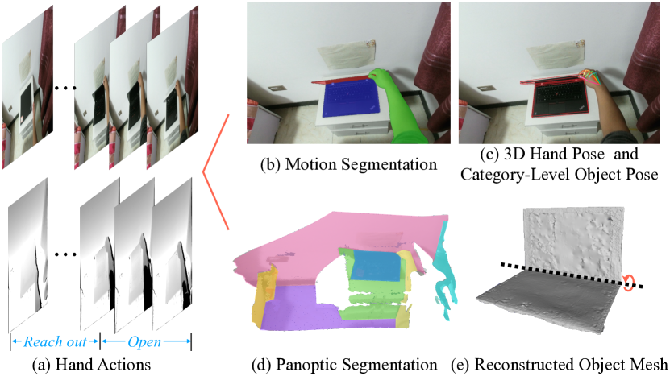
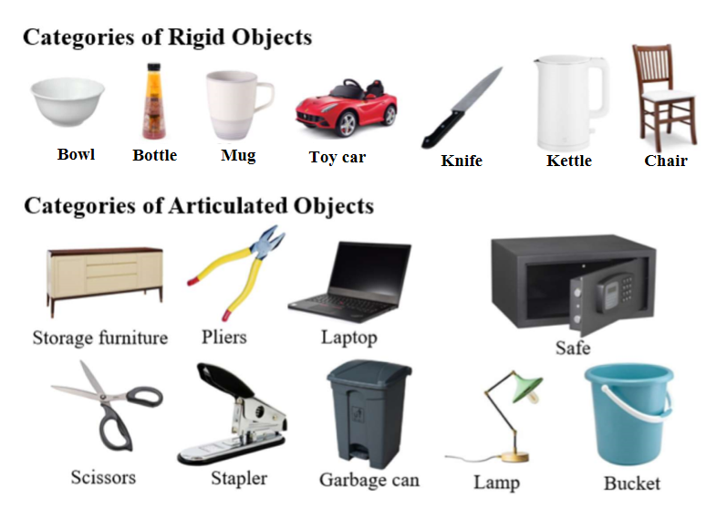
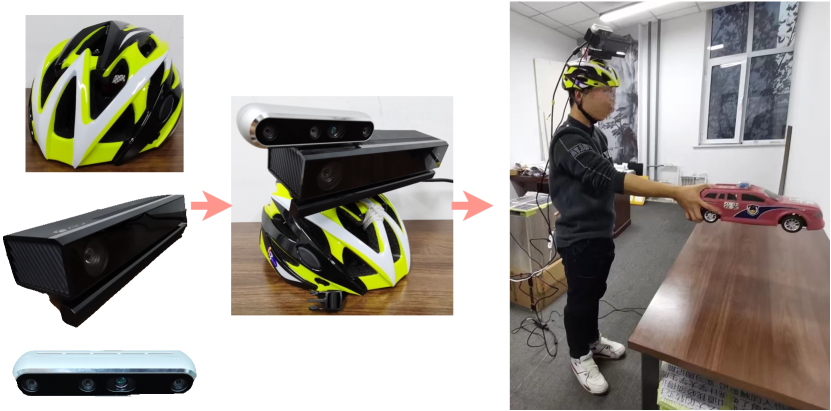
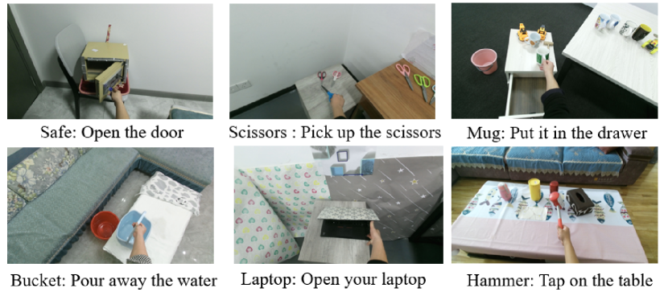
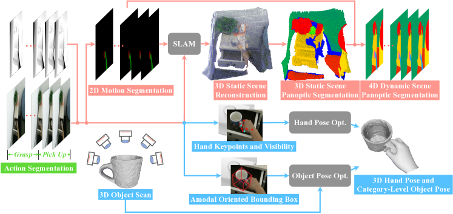

# HOI4D

目标：理解 HOI4D 为什么强调 4D、RGB-D 和 category-level human-object interaction，能看懂它提供的手部姿态、物体姿态、点云分割、action segmentation 和 mesh 标注，也能判断它适合哪些 3D 交互理解任务。

> 先修：[EPIC-KITCHENS-100](04-epic-kitchens-100.md) → [HD-EPIC](05-hd-epic.md)
> 建议：这一节重点看“4D 是什么”和“category-level 是什么”，不要把 HOI4D 当成普通第一视角动作分类数据集
> 数据集规模：HOI4D 包含超过 4,000 条 RGB-D 交互序列和 240 万帧数据，由 9 名参与者在 610 个室内环境中操作 800 个物体实例（16 类）采集得到。

前面几节主要在讲大规模第一视角视频。Ego4D、EPIC-KITCHENS-100、HD-EPIC 都很重视“人在视频里做了什么”。到了 HOI4D，重点变得更偏 3D 交互理解：人在第一视角下用手操作物体时，手在哪里，物体在哪里，物体姿态怎么变，场景点云怎么变化，这些信息能不能被模型同时理解。

HOI4D 的完整名字是 **A 4D Egocentric Dataset for Category-Level Human-Object Interaction**。这几个词都很关键：

```text
4D：3D 空间 + 时间
Egocentric：第一人称视角
Category-Level：不是只记住某一个具体物体，而是理解一类物体
Human-Object Interaction：人手和物体之间的交互
```

先看一张总览图。它展示了 HOI4D 一条序列里可以同时提供哪些标注：action segmentation、motion segmentation、3D hand pose、category-level object pose、panoptic segmentation 和 reconstructed object mesh。



这张图其实已经把 HOI4D 和普通 RGB 视频数据集的区别说清楚了。普通视频数据集更多是在问“这个动作是什么”；HOI4D 还会追问“手和物体在 3D 里怎么运动”“物体属于哪一类”“这个类别下不同实例能不能泛化”“动态点云里哪些点属于手、物体和背景”。

## 它到底收集了什么

HOI4D 由清华大学、北京大学和上海期智研究院等团队发布，论文发表于 CVPR 2022。它采集的是人佩戴头戴式 RGB-D 设备，在真实室内场景中操作日常物体的第一视角序列。

规模可以这样记：

| 项目 | 数量 | 怎么理解 |
|---|---:|---|
| RGB-D frames | 2.4M | 每帧同时有 RGB 和深度信息 |
| sequences | 4,000+ | 每条序列是一段短时间的人-物交互 |
| participants | 9 人 | 论文正文和数据说明采用这一口径 |
| object instances | 800 个 | 真实扫描的不同物体实例 |
| object categories | 16 类 | 7 类刚体，9 类铰接物体 |
| indoor rooms | 610 个 | 不同房间和布局，减少单一实验室偏差 |
| tasks | 54 类 | 包括 pick-and-place 和功能性操作 |
| frame rate / duration | 15 fps / 20 s | 每条视频约 20 秒 |

这里的 `RGB-D` 指每一帧不只有彩色图像，还有深度图。深度图能告诉模型画面里的点离相机有多远，因此可以转成点云。HOI4D 的重点正是利用这种 3D 信息来理解手和物体的空间关系。

## 4D 到底是什么意思

在 HOI4D 里，`4D` 可以直接拆开理解：

```text
3D：每一帧都有空间结构，比如点云、手部 3D 姿态、物体 3D 姿态
时间：这些 3D 信息会随着视频帧连续变化

4D = 一段随时间变化的 3D 场景
```

举个例子。一个人打开笔记本电脑时，普通 RGB 视频只能看到画面变化；RGB-D 数据可以恢复大致的空间深度；HOI4D 进一步标注了手、笔记本的部件姿态、动作阶段和场景点云。

可以把一段序列想象成：

```text
frame_000:
  RGB image
  depth image
  hand pose
  object pose
  segmentation

frame_001:
  RGB image
  depth image
  hand pose
  object pose
  segmentation

...

frame_T:
  RGB image
  depth image
  hand pose
  object pose
  segmentation
```

如果把这些帧连起来，就不只是“看一张图”，而是在看一个动态的 3D 手-物交互过程。

## category-level 是什么

`category-level` 是 HOI4D 里另一个容易误解的词。它不是说只做“物体分类”，而是说模型要理解一类物体，而不是死记一个具体实例。

比如 `mug` 这个类别里有很多不同杯子。它们大小、形状、把手位置、材质都可能不同。一个只记住某个杯子的模型，在换一个杯子后可能就失效了；category-level 的目标是让模型学会“杯子这一类物体”在操作中的共性。

HOI4D 覆盖 16 个物体类别，其中包括刚体和铰接物体。



这里还要区分两类物体：

| 类型 | 例子 | 操作难点 |
|---|---|---|
| 刚体 | bowl、bottle、mug、toy car、knife、kettle、chair | 整个物体作为一个整体运动 |
| 铰接物体 | laptop、scissors、stapler、safe、storage furniture | 物体内部部件会相对运动 |

铰接物体对机器人特别重要。比如打开笔记本、开保险箱门、合上剪刀、拉开抽屉，这些都不是简单的“把物体拿起来”。模型要理解部件、关节轴、旋转或平移范围，才可能进一步迁移到真实操作。

## 数据是怎么采的

HOI4D 使用了一个头戴式采集装置：参与者佩戴头盔，头盔上安装 RGB-D 传感器。论文中提到的采集系统包含 Intel RealSense D455 和 Kinect v2，两种传感器预先标定并同步。



为什么要同时使用两类 RGB-D 传感器？可以粗略理解为它们的深度感知特点不同。RealSense D455 更适合近距离，Kinect v2 更适合较远范围。两者一起使用，可以让数据更适合研究跨传感器泛化，也能覆盖更复杂的室内交互场景。

参与者会在不同房间里执行预定义任务。任务不只是拿起再放下，也包括功能性操作，例如：

```text
打开 safe 的门
拿起 scissors
把 mug 放进 drawer
倒掉 bucket 里的水
打开 laptop
```

下面这张图展示了几类交互任务。注意这些任务都不是简单分类题，而是包含手、物体、场景和功能目的。



HOI4D 还把任务分成 simple 和 complex 两种难度。simple 场景更干净，适合研究物体姿态跟踪和操作轨迹；complex 场景会随机放入更多物体，遮挡和杂乱程度更高，更适合研究动态点云分割和复杂场景理解。

## 它提供了哪些标注

HOI4D 的标注比较丰富，第一次读很容易乱。可以先按“看 2D、看 3D、看时间、看物体模型”四类来理解。

| 标注 | 解决什么问题 | 对具身 AI 的意义 |
|---|---|---|
| RGB-D video | 原始第一视角彩色和深度视频 | 提供接近机器人相机的观测 |
| 2D motion segmentation | 哪些像素属于运动的手或物体 | 找到正在交互的区域 |
| 3D static scene panoptic segmentation | 静态场景点云里的物体和背景类别 | 理解桌面、墙面、家具等环境结构 |
| 4D dynamic scene panoptic segmentation | 随时间变化的点云语义和实例 | 在动态 3D 场景里跟踪手和物体 |
| 3D hand pose | 手的 3D 姿态和关节 | 分析抓取姿势和手部运动 |
| category-level object pose | 物体或部件的 3D 姿态 | 理解物体如何被拿起、旋转、打开 |
| object CAD / mesh | 每个物体实例的 3D 模型 | 支持姿态优化和仿真迁移 |
| action segmentation | 每一帧属于哪个细粒度动作阶段 | 理解操作过程的时间结构 |
| camera parameters | 相机内外参和轨迹 | 做 3D 对齐、点云重建和投影 |

下面这张图展示了 HOI4D 的标注流程。



这一流程说明了一个很重要的事实：HOI4D 的 4D 标注不是直接从传感器里“自动长出来”的。它结合了人工标注、分割传播、SLAM 重建、手部模型优化、物体 mesh 和姿态优化。也正因为这样，它比普通视频动作标签复杂得多。

## 数据目录怎么看

HOI4D 的数据组织层级比较深。

```text
ZY2021080000*/H*/C*/N*/S*/s*/T*/
  align_rgb/
    image.mp4
  align_depth/
    depth_video.avi
  objpose/
    *.json
  action/
    color.json
  3Dseg/
    raw_pc.pcd
    output.log
    label.pcd
  2Dseg/
    mask/
```

这些目录名不是随便起的：

| 字段 | 含义 |
|---|---|
| `ZY2021080000*` | camera ID |
| `H*` | human ID，也就是参与者 |
| `C*` | object class，物体类别 |
| `N*` | object instance ID，具体物体实例 |
| `S*` | room ID，房间 |
| `s*` | room layout ID，房间布局 |
| `T*` | task ID，任务 |

读数据时要特别注意：`C*` 是类别，`N*` 是具体实例。比如同样是 `mug` 类别，可能有 50 个不同杯子实例。做 category-level 泛化实验时，不能把“类别”和“实例”混在一起。

## 三个常见 benchmark

HOI4D 主要围绕 3 类 benchmark 展开。

| 任务 | 输入 | 输出 | 研究重点 |
|---|---|---|---|
| Category-Level Object and Part Pose Tracking | RGB-D 序列 | 物体或部件的 3D 姿态轨迹 | 物体被手遮挡时还能不能跟踪姿态 |
| 4D Point Cloud Semantic Segmentation | 点云视频 | 每个点的语义类别 | 动态室内 3D 场景理解 |
| Egocentric Hand Action Segmentation | 第一视角视频 | 每帧的动作阶段 | 细粒度操作过程理解 |

第一个任务最接近机器人操作中的“知道物体现在是什么姿态”。如果机器人要打开盒子、合上笔记本、使用剪刀，只知道画面里有物体不够，还要知道物体部件当前转到了哪里。

第二个任务关注点云。它不是在 2D 图像上分割像素，而是在随时间变化的 3D 点云里分辨手、物体和背景。这个任务对移动机器人和带深度相机的机械臂都很相关。

第三个任务关注动作阶段。比如一次 `open` 可能包含 reach out、grasp、pull、release 等阶段。机器人如果只知道最终动作名，仍然不知道过程应该如何展开。

## 和具身 AI 的关系

HOI4D 和具身 AI 的关系，比 EPIC-KITCHENS-100 更接近 3D 感知和操作几何。

第一，它能帮助模型学习手-物体的 3D 关系。很多机器人任务失败不是因为不知道物体类别，而是不知道物体真实姿态、可抓区域和运动方向。

第二，它覆盖 category-level 物体变化。真实机器人不可能只操作训练集中那一个杯子、那一把剪刀、那一个保险箱。模型需要从一类物体中学到可泛化的操作结构。

第三，它包含铰接物体。家庭和办公室里大量可操作物体都有关节：门、抽屉、笔记本、剪刀、订书机、垃圾桶盖。HOI4D 对这些物体的姿态和部件标注，可以帮助研究 articulation-aware manipulation。

第四，它提供物体 mesh 和场景点云。论文也提到，HOI4D 的物体模型和手部轨迹可以支持把人类交互轨迹转到仿真环境中，用于机器人模仿学习相关研究。

但边界同样要说清楚：

```text
HOI4D 有人的第一视角 RGB-D、手部姿态、物体姿态和动作阶段，
但它不是机器人遥操作数据。
它没有机器人关节状态、末端控制命令、夹爪开合命令和真实机器人执行结果。
```

所以它更适合做 3D 感知、手-物交互理解、姿态跟踪、动态点云分割、仿真迁移前的数据准备，而不是直接训练机器人策略。

## 和前面数据集的区别

| 数据集 | 主要关注 | HOI4D 的区别 |
|---|---|---|
| EPIC-KITCHENS-100 | 厨房动作片段和 verb/noun | HOI4D 更强调 3D 手-物姿态和 RGB-D 交互 |
| HD-EPIC | 厨房多模态细粒度标注 | HOI4D 更偏点云、mesh、pose 和 4D segmentation |

| ARCTIC | 双手、全身和铰接物体 | HOI4D 更偏第一视角 RGB-D 和 category-level HOI |

如果你的任务是“看懂厨房动作语义”，EPIC-KITCHENS-100 和 HD-EPIC 更直接。如果你的任务是“估计手和物体在 3D 中如何交互”，HOI4D 更合适。

## 下载和使用前要注意什么

HOI4D 的数据不是一个单独文件，而是按 RGB video、depth video、CAD models、annotations、camera parameters、hand pose 等部分分别发布。第一次使用时，建议先读 instructions 仓库，再按任务下载对应部分。

如果只是理解结构，先看说明文档和标注定义即可；如果要跑 benchmark，再下载对应数据：

```text
动作分割：需要 RGB video 和 action 标注
物体姿态跟踪：需要 RGB-D、objpose、CAD models、camera parameters
4D 点云分割：需要 depth、3Dseg / 4Dseg 相关标注
手部姿态：需要 hand pose 标注和 MANO 相关工具
```

实际记录实验时，最好写清楚：

```text
使用了哪些 C* object classes
使用了哪些 N* object instances
使用的是 simple 还是 complex 场景
是否包含 articulated objects
使用 RGB、depth、point cloud 还是 mesh
训练/测试划分是否按 benchmark 规定
```

否则很容易出现“看起来都在用 HOI4D，但其实用的数据部分完全不同”的问题。

## 常见误解

**误解一：4D 就是四维图像。**

不准确。这里的 4D 更自然的理解是“3D 空间随时间变化”，也就是点云、手部姿态和物体姿态形成的动态序列。

**误解二：category-level 就是普通物体分类。**

不对。category-level 更强调同一类别下不同实例之间的泛化，例如模型能不能从一些杯子泛化到新的杯子。

**误解三：有 object pose 就能直接控制机器人。**

不够。object pose 能告诉你物体在哪里、姿态如何，但机器人控制还需要机械臂状态、控制接口、碰撞约束和策略学习。

**误解四：HOI4D 只适合动作识别。**

不准确。动作分割只是其中一个任务。它更核心的价值在 4D 点云语义分割、物体/部件姿态跟踪和手-物 3D 交互理解。

**误解五：RGB-D 数据天然比 RGB 数据容易。**

不一定。深度提供了 3D 线索，但也会带来传感器噪声、缺失、反光物体失效、快速运动模糊和跨设备差异。HOI4D 正是把这些现实问题暴露出来。

## 小结

HOI4D 是“第一视角 4D 手-物交互数据集”。它不追求最长的视频时长，而是把一段 20 秒左右的人-物交互标得很细：RGB-D、点云、分割、手部姿态、物体姿态、mesh、动作阶段都放在一起。对具身 AI 来说，它的价值在于帮助模型从“看见物体”走向“理解物体在 3D 中如何被人操作”。

进一步阅读可以看：

- [HOI4D 主页](https://hoi4d.github.io/)
- [HOI4D instructions](https://github.com/leolyliu/HOI4D-Instructions)
- [HOI4D paper](https://arxiv.org/abs/2203.01577)
