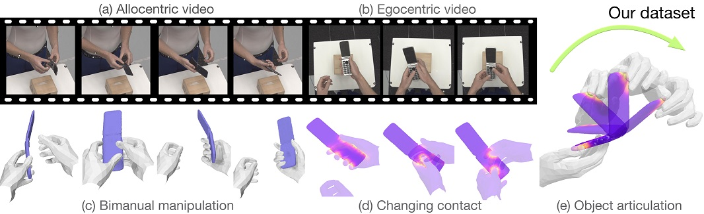
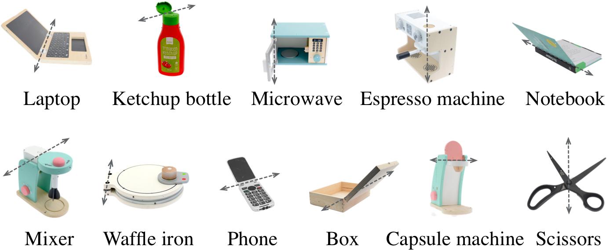
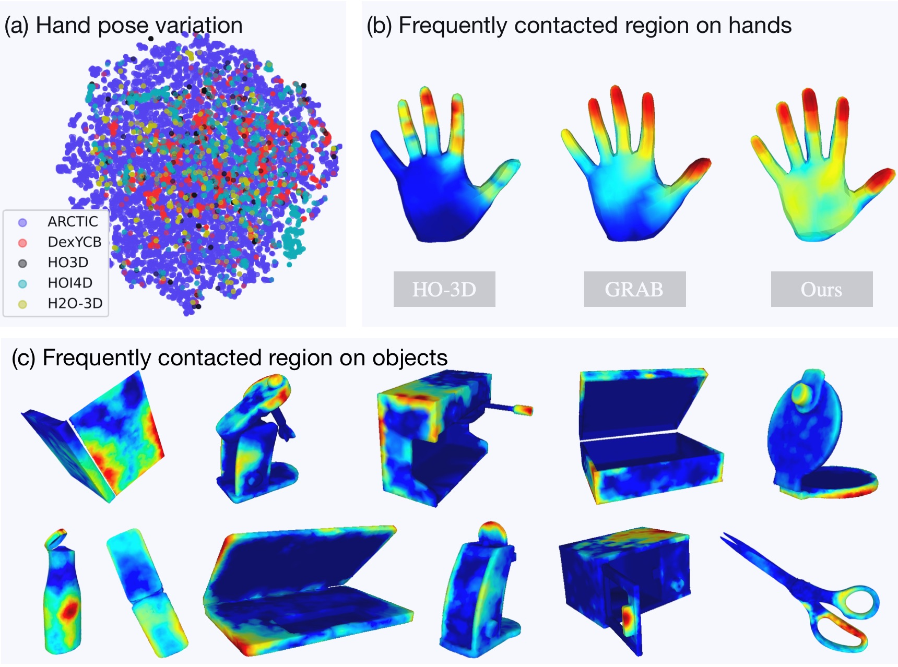

# ARCTIC

目标：理解 ARCTIC 为什么强调双手、全身、铰接物体和动态接触，能看懂 MANO、SMPL-X、object articulation、interaction field 等概念，也能判断它适合哪些灵巧操作和 3D 重建任务。

> 先修：[HOI4D](06-hoi4d.md)
> 建议：这一节重点看“铰接物体”和“双手动态接触”，不要把 ARCTIC 当成普通抓取姿态数据集
> 数据集规模：ARCTIC 包含约 210 万帧高分辨率视频数据，并提供双手和物体的精确 3D 网格、姿态以及接触关系标注。

ARCTIC 是一个面向 **dexterous bimanual hand-object manipulation** 的数据集。直译过来就是：双手灵巧操作物体。它和 HOI4D 都属于手-物交互数据，但关注点不完全一样。

HOI4D 更强调第一视角 RGB-D、4D 点云和 category-level 物体交互；ARCTIC 更强调双手、全身、铰接物体、动态接触和高精度 3D mesh。它不是只看“手抓住了一个物体”，而是关注“左右手如何一起让一个会转动、会开合的物体发生状态变化”。

先看一张总览图。图里同时展示了第三人称视角、第一人称视角、双手操作、接触变化和物体铰接状态。



可以用一句话概括 ARCTIC：

```text
ARCTIC 记录人用两只手操作铰接物体的过程，
并给出左右手、全身、物体部件、接触关系和物体开合状态的 3D 标注。
```

这类数据对具身 AI 很重要，因为真实世界里很多任务都不是“拿起一个刚体”这么简单。打开笔记本、使用剪刀、翻开盒盖、按压胶囊咖啡机、打开电话，这些任务都涉及物体部件运动和双手配合。

<video src="../../assets/arctic-dexterous.mp4" controls muted loop playsinline style="width:500px;max-width:100%;height:auto;display:block;margin:0.75em 0"></video>

## 它到底收集了什么

ARCTIC 由 ETH Zürich、Max Planck Institute for Intelligent Systems 等团队发布，论文发表于 CVPR 2023。

规模可以这样记：

| 项目 | 数量 | 怎么理解 |
|---|---:|---|
| images / frames | 2.1M | 高分辨率多视角图像 |
| views | 9 个 | 8 个第三人称视角 + 1 个第一人称视角 |
| egocentric view | 1 个 | 接近混合现实或穿戴式视角 |
| object categories | 11 类 | 都是有铰接结构的日常物体 |
| subjects | 5 名 | 参与者执行双手操作 |
| annotation | MANO + SMPL-X + articulated object | 左右手、全身和物体状态 |
| capture setup | 54 台 Vicon cameras | 用 MoCap 提供高精度 3D 标注 |
| main tasks | consistent motion reconstruction / interaction field estimation | 重建一致运动和估计手-物距离场 |

这里有一个关键点：ARCTIC 不是靠单个 RGB-D 相机来标注手和物体，而是在 MoCap 环境里采集高精度 3D 运动，同时同步多视角 RGB 图像。这使得它特别适合研究“从图像恢复 3D 手、身体和铰接物体”的问题。

## 铰接物体是什么

`articulated object` 可以翻译成“铰接物体”或“有关节的物体”。它不是一个整体刚体，而是由多个部件组成，部件之间可以围绕某个轴旋转或沿某个方向滑动。

比如下面这些物体都不是简单刚体：



这些物体的难点在于，操作时不仅物体整体会动，物体内部部件也会动。

| 物体 | 铰接变化 |
|---|---|
| laptop | 屏幕相对底座旋转 |
| scissors | 两片剪刀绕轴开合 |
| box | 盖子相对盒体打开 |
| phone | 翻盖或滑动部件变化 |
| microwave / espresso machine | 门、盖或手柄部件变化 |

对机器人来说，这类物体比普通杯子、碗、瓶子更难。机器人不能只估计一个 6DoF pose，还要理解部件之间的关节、当前开合角度、可操作方向和接触位置。

## 双手为什么重要

很多数据集关注的是单手抓取，比如一只手拿起一个物体。ARCTIC 的重点是双手操作。双手操作的难度更高，因为左右手不是独立的，它们会共同约束物体。

例如使用剪刀时：

```text
一只手可能稳定剪刀或控制一个柄，
另一只手控制另一个柄，
两只手的接触点和用力方向共同决定剪刀如何开合。
```

再比如打开盒子或笔记本：

```text
一只手固定底座，
另一只手拉开盖子。
```

这种交互不能只看单个手的姿态。模型需要同时理解：

```text
左手在哪里
右手在哪里
物体底座在哪里
物体活动部件在哪里
哪些手指和物体接触
接触点是否随时间稳定移动
物体关节角度如何变化
```

下面这段视频展示的是 MANO 手部模型标注。可以看到，ARCTIC 不是只给手的 2D 框，而是给左右手的 3D mesh 和姿态。

<video src="../../assets/arctic-mano.mp4" controls muted loop playsinline style="width:500px;max-width:100%;height:auto;display:block;margin:0.75em 0"></video>

## MANO 和 SMPL-X 是什么

读 ARCTIC 时会反复看到两个模型名：`MANO` 和 `SMPL-X`。

`MANO` 是常用的参数化手模型。你可以把它理解成一个可变形的 3D 手模型，参数控制手的整体位置、朝向、手指关节弯曲和手型。ARCTIC 用 MANO 表达左右手的 3D 姿态。

`SMPL-X` 是参数化全身人体模型，包含身体、手和脸等部分。ARCTIC 里提供 SMPL-X，是因为全身姿态能帮助估计更可靠的手腕位置和全局运动。双手不是悬空存在的，它们属于一个人的身体。

可以这样理解二者关系：

| 模型 | 主要表达什么 | 在 ARCTIC 里的作用 |
|---|---|---|
| MANO | 左右手的 3D mesh 和手指姿态 | 精细描述手如何抓、捏、撑、推物体 |
| SMPL-X | 全身人体姿态和形状 | 提供身体和手腕的全局运动关系 |
| object mesh | 铰接物体的 3D 部件 | 描述物体整体姿态和开合状态 |

下面这段视频展示的是 SMPL-X 标注。可以看到：ARCTIC 不是只截手部小图，而是在完整人体运动中理解双手操作。

<video src="../../assets/arctic-smplx.mp4" controls muted loop playsinline style="width:500px;max-width:100%;height:auto;display:block;margin:0.75em 0"></video>

## 多视角和第一视角怎么用

ARCTIC 同时提供 8 个 allocentric views 和 1 个 egocentric view。

`allocentric view` 可以理解成外部固定相机视角，也就是第三人称观察；`egocentric view` 是第一人称视角，更接近穿戴式设备或机器人近身观察。两者的用途不一样：

| 视角 | 作用 |
|---|---|
| allocentric views | 帮助从外部多角度重建手、身体和物体 |
| egocentric view | 研究从第一人称图像恢复双手和物体交互 |


这一点和 Ego-Exo4D 有点像，都有外部视角和第一视角。但 ARCTIC 的任务更集中在双手、铰接物体和 3D mesh，而不是大规模技能活动理解。

## object articulation 怎么表示

ARCTIC 里的物体状态不是只有一个整体 pose。一个铰接物体通常可以拆成两个部分：base part 和 moving part。物体整体有位置和朝向，活动部件还会有一个 `articulation` 参数。

在数据文档里，`object.npy` 里每一帧的 articulated object pose 用 7 维表示：

```text
object pose:
  articulation: 1 维，物体关节状态，比如开合角度
  rotation: 3 维，物体整体旋转
  translation: 3 维，物体整体平移
```

这对机器人非常关键。比如剪刀的整体位置不变，但开合角度变化很大；笔记本底座不动，屏幕角度在变化。如果只看 6DoF pose，就会漏掉物体内部状态。

可以把 ARCTIC 的一帧理解成：

```text
frame_t:
  image from view_0 ... view_8
  left hand MANO parameters
  right hand MANO parameters
  SMPL-X body parameters
  object base pose
  object articulation
  hand-object contact / distance information
```

下面这段 depth 渲染视频展示的是人、手和物体的几何关系。它不是传感器原始深度图，而是从 ARCTIC 的 3D 标注渲染出来的 depth，用来帮助理解几何结构。

<video src="../../assets/arctic-depth.mp4" controls muted loop playsinline style="width:500px;max-width:100%;height:auto;display:block;margin:0.75em 0"></video>

## dynamic contact 是什么

ARCTIC 很强调 `dynamic contact`，也就是动态接触。它不只是判断“手有没有碰到物体”，而是关心接触区域如何随时间变化。

比如打开剪刀时，手指和剪刀柄的接触可能持续存在，但物体部件和手指一起运动；打开笔记本时，一只手和屏幕边缘接触，另一只手固定底座。这样的接触关系如果建模不好，重建出来的手和物体就会出现穿模、漂移或不合理滑动。

下面这张图展示了 ARCTIC 中手部姿态和接触区域的多样性。颜色越明显的区域，代表在数据中越常参与接触。



对具身 AI 来说，dynamic contact 很重要。机器人如果要灵巧操作，不只是把手移动到物体附近，还要维持稳定接触、利用接触施力，并让物体状态按预期变化。

## 两个核心任务

ARCTIC 主要提出了两个任务。

第一个是 `consistent motion reconstruction`。输入一段单目视频，模型要重建左右手和铰接物体在 3D 中的运动，而且要保证时空一致：手和物体不能乱飘，接触点不能明显滑动，物体开合状态要合理。

第二个是 `interaction field estimation`。模型要估计手和物体之间的密集相对距离。简单说，就是每个手部顶点离物体有多近，每个物体顶点离手有多近。

| 任务 | 输入 | 输出 | 重点 |
|---|---|---|---|
| Consistent Motion Reconstruction | 单目视频 | 左右手 + 铰接物体的 3D 运动 | 几何、接触、时间一致性 |
| Interaction Field Estimation | 图像或视频 | 手和物体之间的 dense distance field | 接触和近接关系 |

这里的 `field` 不要理解成普通分类标签。它更像一个连续空间里的距离函数，用来描述“哪里接近接触，哪里远离物体”。这比二分类的 contact label 更细。

## 和具身 AI 的关系

ARCTIC 对具身 AI 的价值主要在三方面。

第一，双手灵巧操作。很多机器人操作数据还停留在单臂、夹爪、pick-and-place。ARCTIC 展示了人类双手如何配合操作铰接物体，这对双臂机器人、灵巧手和人形机器人都有参考价值。

第二，铰接物体理解。家庭和办公室里有大量可开合物体。机器人要理解它们，不能只识别类别，还要估计关节状态和可操作部件。

第三，接触建模。低层控制最终离不开接触。ARCTIC 的 hand-object contact 和 interaction field 提供了研究接触先验的入口。

但它仍然不是机器人遥操作数据：

```text
ARCTIC 有人的双手、身体和物体 3D mesh，
但没有机器人关节状态、机器人 action、控制频率和任务成功标签。
```

所以它更适合做手-物体 3D 重建、铰接物体姿态估计、接触预测、双手操作先验学习和仿真/机器人研究的参考数据，而不是直接训练机器人策略。

## 和 HOI4D、EgoDex 的区别

| 数据集 | 重点 | ARCTIC 的区别 |
|---|---|---|
| HOI4D | 第一视角 RGB-D、4D 点云、类别级交互 | ARCTIC 更强调双手、全身、MoCap、高精度 mesh 和动态接触 |
| EgoDex | Vision Pro 第一视角双手操作轨迹 | ARCTIC 的 3D mesh、接触和铰接物体标注更精细 |
| EPIC-KITCHENS-100 | 厨房动作语义 | ARCTIC 更偏几何重建和接触，不是动作分类 |
| Ego-Exo4D | 多视角技能活动 | ARCTIC 的场景更受控，但 3D 手-物标注更精细 |

如果你关心“人在做什么动作”，EPIC-KITCHENS-100 更直接；如果你关心“双手怎么让物体状态发生变化”，ARCTIC 更合适。

## 下载和使用前要注意什么

ARCTIC 需要注册账号才能下载完整数据，而且还需要 MANO 和 SMPL-X 的账号。数据和软件也不是商用开放，使用前要看 license。

数据包比较大。主要部分包括：

| 数据部分 | 大小 | 用途 |
|---|---:|---|
| full 2K images | 649 GB | 使用原始高分辨率图像 |
| cropped images | 116 GB | 训练模型时更快读取 |
| raw sequences | 215 MB | MANO、SMPL-X、object pose、egocentric camera trajectory |
| splits | 18 GB | 按 benchmark 聚合好的训练/验证/测试数据 |
| meta | 91 MB | 相机参数、物体信息、subject 信息、模板 |
| model weights | 6 GB | 复现实验中的 baseline |

第一次学习不建议直接下 649 GB 的 full images。更稳妥的顺序是：

```text
先读 data documentation
跑 dry run
确认账号和 MANO / SMPL-X 权限
先下载 raw_seqs 和 meta
需要训练图像模型时再下载 cropped_images 或 full images
```

实验记录里最好写清楚：

```text
使用 allocentric protocol 还是 egocentric protocol
使用 full images 还是 cropped images
使用 raw_seqs 还是 processed splits
是否使用 MANO、SMPL-X、object mesh
是否使用 MoCap release
是否按官方 splits 做评估
```

## 常见误解

**误解一：ARCTIC 是普通第一视角视频数据集。**

不准确。它有第一视角，但核心是双手、全身、铰接物体和 3D mesh 标注。

**误解二：铰接物体只是多一个物体类别。**

不对。铰接物体有内部状态，例如开合角度。只估计整体 6DoF pose 不够。

**误解三：MANO 和 SMPL-X 是两个重复标注。**

不是。MANO 更适合精细手部建模，SMPL-X 提供全身和手腕的全局关系。

**误解四：interaction field 就是接触二分类。**

不准确。interaction field 是手和物体之间的密集距离关系，比“接触/不接触”更细。

**误解五：有高精度 MoCap，就可以直接训练机器人控制。**

不够。MoCap 提供人的 3D 运动和物体状态，但机器人控制还需要机器人本体、动作空间、动力学和执行反馈。

## 小结

ARCTIC 是“高精度双手铰接物体操作数据集”。它的价值不在于视频时长，而在于把左右手、全身、铰接物体、动态接触和多视角图像对齐到一起。对具身 AI 来说，它补的是灵巧操作里非常关键的一块：理解双手如何通过接触让物体部件发生状态变化。

进一步阅读可以看：

- [ARCTIC 主页](https://arctic.is.tue.mpg.de/)
- [ARCTIC GitHub 仓库](https://github.com/zc-alexfan/arctic)
- [ARCTIC data documentation](https://github.com/zc-alexfan/arctic/blob/master/docs/data/data_doc.md)
- [ARCTIC paper](https://arxiv.org/abs/2204.13662)
