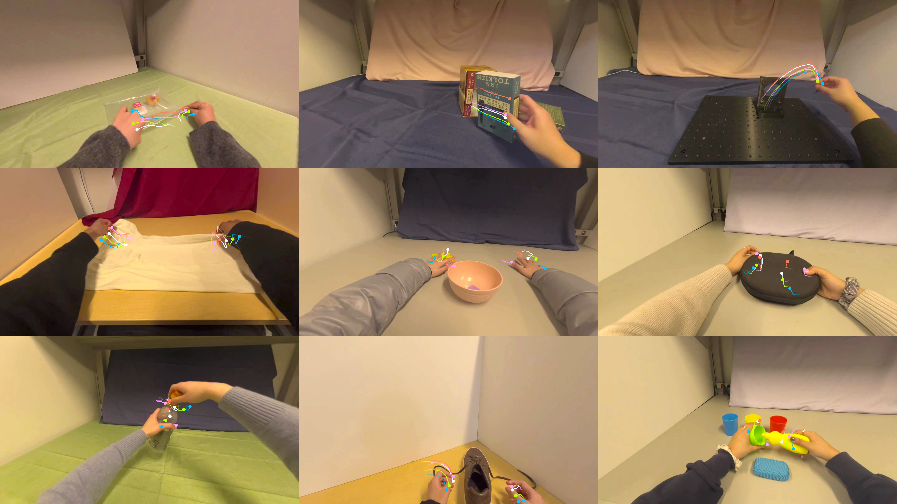
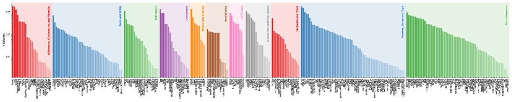
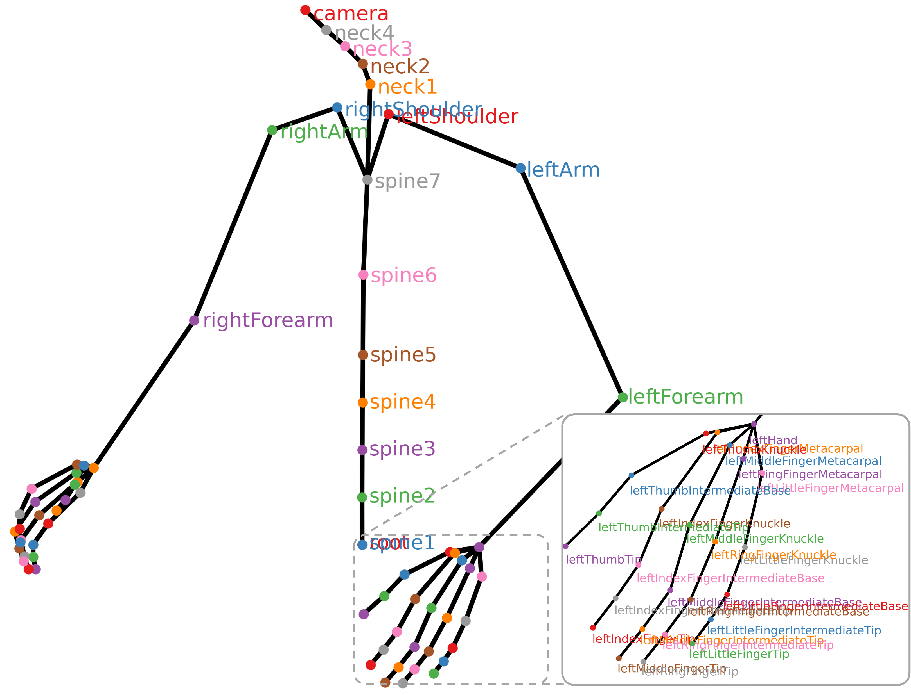

# EgoDex

目标：理解 EgoDex 为什么把 Apple Vision Pro 作为大规模双手操作采集工具，能看懂 MP4 + HDF5 的数据结构、ARKit 手部/上肢追踪、camera transforms、language annotation 和 hand trajectory prediction benchmark，也能判断它和 ARCTIC、EgoHOS 的区别。

> 先修：[ARCTIC](07-arctic.md) → [EgoHOS](09-egohos.md)
> 建议：重点看“原生 3D 手部追踪”和“HDF5 里到底存了什么”，不要把 EgoDex 当成普通第一视角视频合集
> 数据集规模：EgoDex 数据集包含 829 小时 1080p 第一视角视频数据，完整下载规模约 1.6 TB，同时提供同步的 3D 手部和手指姿态标注。

EgoDex 是 Apple 在 2025 年发布的大规模第一视角双手操作数据集，论文题目是 **EgoDex: Learning Dexterous Manipulation from Large-Scale Egocentric Video**。它的出发点很直接：机器人灵巧操作缺少足够大的数据，而人类第一视角视频天然容易规模化采集。如果采集时还能同时得到手部 3D 轨迹，就可以把人类操作视频变成更接近机器人学习所需的数据。

EgoDex 和前面几个数据集的关系可以先这样理解：

```text
EgoHOS：第一视角手-物像素级分割，重点是手和交互物体区域
ARCTIC：MoCap 环境里的双手铰接物体操作，重点是 mesh、接触和重建
EgoDex：Apple Vision Pro 第一视角大规模采集，重点是双手轨迹、任务规模和 VLA 预训练
```

先看一组样例。图里是不同 tabletop manipulation 任务的第一视角画面，彩色骨架是投影到图像上的手部追踪结果。



一句话概括 EgoDex：

```text
EgoDex 用 Apple Vision Pro 采集大量第一视角桌面操作视频，
同时保存头部、上肢和双手关节的 3D SE(3) transforms，
再配上自然语言描述，用于手轨迹预测和具身模型预训练。
```

## 它到底收集了什么

EgoDex 的规模明显大于前面几个手-物交互数据集。

| 项目 | 数量 | 怎么理解 |
|---|---:|---|
| 视频时长 | 829 小时 | 第一视角操作视频 |
| episodes | 338K | 每个 episode 是一段成对的 MP4 + HDF5 |
| frames | 90M | 30 Hz 视频，总样本量很大 |
| tasks | 194 类 | 都是 tabletop manipulation |
| 视频规格 | 1080p / 30 Hz | 与 HDF5 中的 pose annotation 对齐 |
| tracking | 头部、上肢、双手和手指 | 由 ARKit / visionOS 估计 |
| language annotation | 有 | HDF5 attrs 中保存任务描述 |
| license | CC-by-NC-ND | 非商业、禁止演绎使用 |

这些数字里最重要的是 `829 小时` 和 `338K episodes`。EgoDex 的重点不是把一个小任务标得特别精，而是把“人类双手操作”的规模做大。它覆盖的任务从 tying shoelaces 到 folding laundry，明显比只抓一个标准物体更接近日常灵巧操作。

下面这张图展示了 EgoDex 中任务和动词的长尾分布。可以看到，它不是只有 pick-and-place，而是包含大量不同操作动词和物体组合。



## 为什么 Apple Vision Pro 很关键

很多第一视角视频只有 RGB 画面。问题是：如果没有手部 3D 轨迹，模型很难知道每根手指真实在 3D 空间里怎么动。后处理估计手部姿态当然可以做，但遮挡、快速运动、物体遮住手指时，误差会很大。

EgoDex 的做法是：采集时直接使用 Apple Vision Pro 上的 ARKit / visionOS tracking。这样每个视频帧可以配对 3D skeletal pose annotations，包括相机、头部、上肢、双手和手指关节。

下面这张图展示了数据里的 skeleton 结构。注意它不只是手腕位置，而是包含很多手指关节。



这对具身 AI 很重要。普通机器人遥操作数据往往记录的是夹爪或末端执行器，而人类手有五根手指，动作更细。EgoDex 试图把这种人手轨迹提取出来，用于训练模型预测双手未来轨迹，或者作为 VLA 模型的预训练数据。

## 它的数据文件长什么样

EgoDex 的数据组织很直接：每个 episode 有一个 `.mp4` 和一个同编号的 `.hdf5`。

可以把目录理解成：

```text
part1/
  task1/
    0.mp4
    0.hdf5
    1.mp4
    1.hdf5
    ...
  task2/
    0.mp4
    0.hdf5
    ...

test/
  task1/
    0.mp4
    0.hdf5
  task2/
    ...
```

`mp4` 是第一视角视频；`hdf5` 是和视频逐帧对齐的 pose annotation。对应关系很简单：

```text
0.mp4  <->  0.hdf5
1.mp4  <->  1.hdf5
```

HDF5 文件大致结构如下：

```text
camera/
  intrinsic              # 3 x 3 camera intrinsics

transforms/              # 每个 joint 都是 N x 4 x 4
  camera
  leftHand
  rightHand
  leftIndexFingerTip
  leftIndexFingerKnuckle
  ...

confidences/             # 可选，每个 joint 一个置信度，形状是 N
  leftHand
  rightHand
  ...

attrs:
  llm_description
  llm_description2       # reversible tasks 可能有
  which_llm_description
```

这里的 `N` 是帧数。如果视频长度是 `T` 秒，因为采样是 30 Hz，所以通常有：

```text
N = 30 * T
```

也就是说，第 0 帧视频对应 HDF5 中每个 joint 的第 0 个 transform，第 1 帧对应第 1 个 transform。

## transform 是什么

EgoDex 里最核心的字段是 `transforms`。它不是二维关键点，也不是简单的 xyz 坐标，而是 SE(3) 变换矩阵。

一个 `4 x 4` transform 可以理解成：

```text
transform =
  rotation      # 这个关节的朝向
  translation   # 这个关节的位置
```

形式上长这样：

```text
[ R  t ]
[ 0  1 ]
```

其中 `R` 是 `3 x 3` 旋转矩阵，`t` 是 `3 x 1` 平移向量。EgoDex 为很多关节都提供 `N x 4 x 4` 的 transform，所以它记录的不是一帧静态姿态，而是一整段动作轨迹。

举个例子：

```text
transforms/leftIndexFingerTip[t]
```

表示第 `t` 帧时，左手食指指尖在 ARKit 世界坐标系里的位置和朝向。

## ARKit origin frame 要小心

EgoDex 说明文档里特别提醒：所有 transforms，包括 `transforms/camera`，默认都表示在 ARKit origin frame 里。这个 frame 是每次录制开始时由设备初始化出来的地面静止坐标系。

这句话很重要，因为它意味着：

```text
同一个 episode 内，ARKit world frame 是稳定的；
不同 episode 之间，这个 world frame 不一定一致。
```

所以如果你要训练模型，不能随便把所有 episode 的世界坐标直接拼在一起当作统一坐标。很多时候要把手部轨迹转到 camera frame，或者做相对坐标表示，比如相对当前相机、相对手腕、相对某个起始帧。

这也是 `visualize_2d.py` 要做的事情之一：把 3D skeletal annotations 重新投影到 2D 图像里，帮助检查手部轨迹和视频是否对齐。

## confidences 是什么

HDF5 里有些文件还包含 `confidences`。它是每个 joint 的置信度，范围通常是 0 到 1。

可以这样理解：

| confidence | 含义 |
|---|---|
| 接近 1 | ARKit 对这个关节的位置比较有信心 |
| 接近 0 | 关节可能被遮挡、不可见，或追踪失败 |

训练时不能完全忽略它。比如手被物体遮住、手伸出视野、动作太快时，某些手指关节的 tracking 可能不可靠。如果直接把所有关节都当作同等质量标签，模型会学到噪声。

一个更稳妥的做法是：

```text
训练 hand trajectory prediction 时，用 confidence 做 mask 或 loss weighting；
可视化时，低 confidence 的关节要单独检查；
评估时，记录是否过滤过低置信度片段。
```

## language annotation 在哪里

EgoDex 里还有自然语言描述，但它不是单独放一个文本文件，而是写在 HDF5 attributes 里。用 `h5py` 读取时，可以这样访问：

```python
import h5py

with h5py.File("0.hdf5", "r") as f:
    print(f.attrs["llm_description"])
```

对于可逆任务，还可能有第二个描述：

```text
llm_description
llm_description2
which_llm_description
```

比如一个任务可能既可以描述为“把物体放进去”，也可以反向描述为“把物体拿出来”。`which_llm_description` 用来说明这个 episode 应该对应哪个描述。

这里要注意一点：说明文档提到，有些 `llm_description` 和 `which_llm_description` 可能存在错误，因为它们是由 LLM/VLM 自动生成的。写实验时不要把这些语言标签当成完全人工审核的 ground truth。

## hand trajectory prediction 是什么

EgoDex 论文里还提出了面向 imitation learning 的 benchmark，核心是预测未来的手部轨迹。它不是直接输出机器人动作，而是先预测人类双手未来会怎么动。

可以把任务理解成：

```text
输入：过去一段第一视角视频 + 当前手部轨迹
输出：未来一段时间里手部关键关节的 3D 轨迹
```

为什么这对机器人有用？因为很多灵巧操作可以先学“人手要去哪里、怎么接近物体、怎么改变手指形状”。之后再研究如何把人手轨迹迁移到机器人手、夹爪或双臂系统。

不过边界也要清楚：

```text
预测人手轨迹 ≠ 直接生成机器人控制命令
```

机器人手和人手结构不同，动作空间、力控、接触模型和执行器限制都不同。EgoDex 更像是学习人类操作先验的入口，而不是直接可执行的机器人 policy 数据。

## 和具身 AI 的关系

EgoDex 对具身 AI 的价值很明显。

第一，它规模大。829 小时、338K episodes、90M frames，使它比很多手-物交互数据集更适合做预训练。

第二，它有原生 3D 手和手指追踪。很多 egocentric 视频只有图像，EgoDex 在采集时就得到骨架轨迹，能直接训练手轨迹预测模型。

第三，它覆盖的任务很丰富。194 个 tabletop manipulation tasks 包括很多日常操作，不只是在桌上拿起标准物体。

第四，它天然适合 VLA 预训练。视频、手部轨迹和语言描述在同一个 episode 里，模型可以学习“看见什么、任务是什么、手接下来怎么动”之间的关系。

但它仍然不是机器人遥操作数据：

```text
EgoDex 有人类第一视角视频和手部 3D 轨迹，
但没有机器人关节状态、机器人控制命令、力反馈和真实机器人执行成功标记。
```

所以它更适合做人手轨迹预测、VLA 预训练、双手操作先验学习和人类视频到机器人动作的中间表示研究。

## 和 ARCTIC、EgoHOS 的区别

| 数据集 | 重点 | EgoDex 的区别 |
|---|---|---|
| ARCTIC | MoCap、高精度 mesh、铰接物体和接触 | EgoDex 更强调规模、Vision Pro 采集和手轨迹预测 |
| HOI4D | RGB-D、4D 点云和 category-level 交互 | EgoDex 主要是 MP4 + HDF5 skeleton transforms，不是点云分割数据 |
| Ego4D | 大规模日常第一视角视频 | EgoDex 聚焦 tabletop manipulation，并带原生 3D 手部追踪 |

如果你要研究精确手-物 mesh 重建，ARCTIC 更合适；如果你要快速得到第一视角手-物区域，EgoHOS 更直接；如果你要做大规模双手操作预训练，EgoDex 更有优势。

## 下载和使用前要注意什么

EgoDex 数据量很大，完整下载约 2 TB，不适合随手全量拉下来。仓库把数据分成 training set、test set 和 additional data。

常用下载部分如下：

| 数据部分 | 大小 | 用途 |
|---|---:|---|
| Training Set Part 1-5 | 每个约 300 GB | 训练集，总计约 725 小时 |
| Test Set | 16 GB | 初次探索最合适，约 7 小时 |
| Additional Data | 200 GB | 额外数据，约 97 小时 |

实验记录里最好写清楚：

```text
使用的是 train / test / additional
使用哪些 task folders
是否使用 confidences 过滤低质量关节
坐标系是否从 ARKit origin frame 转到 camera frame
语言描述是否经过人工检查
预测的是哪些 joints 和多长 horizon
```

否则不同实验之间很难比较。

## 常见误解

**误解一：EgoDex 是机器人轨迹数据集。**

不准确。它是人类第一视角操作数据，有手部和上肢 3D tracking，但没有机器人 action。

**误解二：ARKit 的手部轨迹就是完美 ground truth。**

不对。ARKit tracking 很有价值，但仍然会受遮挡、视野范围和快速运动影响，所以 HDF5 里才会有 confidence 字段。

**误解三：所有 episode 的世界坐标可以直接拼在一起。**

不建议。ARKit origin frame 在每个录制 session 初始化，不保证跨 episode 一致。训练时通常要转到 camera frame 或使用相对坐标。

**误解四：语言描述完全可靠。**

不一定。说明文档明确提到部分语言描述来自自动生成，可能有错误。用它做监督时要保留噪声意识。

**误解五：预测人手轨迹就等于机器人能执行。**

不够。人手和机器人手结构不同，控制接口也不同。EgoDex 更适合提供人类操作先验，而不是直接输出机器人控制命令。

## 小结

EgoDex 是“大规模第一视角双手操作预训练数据”。它的优势是规模、任务多样性和原生 3D 手部追踪；它的边界是没有机器人 action、没有真实机器人执行反馈，语言标签也可能有自动生成噪声。对具身 AI 来说，它补的是从人类视频中学习双手操作轨迹和任务语义的能力。

进一步阅读可以看：

- [EgoDex GitHub 仓库](https://github.com/apple/ml-egodex)
- [EgoDex paper](https://arxiv.org/abs/2505.11709)
