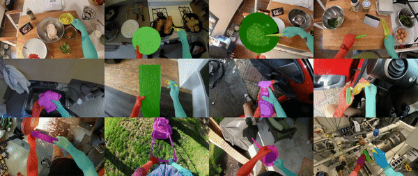
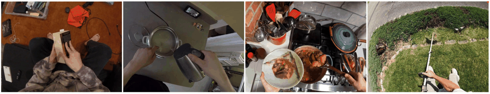

# EgoHOS

目标：理解 EgoHOS 为什么关注第一视角手-物像素级分割，能看懂 left/right hand、1st-order object、2nd-order object、contact boundary 和 train/test_outdomain 划分，也能判断它适合哪些 affordance、交互区域和视频预处理任务。

> 先修：[ARCTIC](07-arctic.md) → [EgoDex](08-egodex.md)
> 建议：这一节重点看“分割标签到底表示什么”，不要把 EgoHOS 当成 3D pose 或机器人控制数据
> 数据集规模：EgoHOS 包含 11,243 张第一视角图像以及对应像素级手-物分割标注，由于数据主要由图像和标注文件组成，整体存储规模较小。

EgoHOS 是 ECCV 2022 的第一视角手-物分割数据集，完整题目是 **Fine-Grained Egocentric Hand-Object Segmentation: Dataset, Model, and Applications**。它和前面几个数据集的关注点很不一样。

ARCTIC 关心双手、全身、铰接物体和 3D mesh，EgoDex 关心大规模第一视角双手轨迹。EgoHOS 则更直接：给一张第一视角图像，把左手、右手、正在交互的物体和接触区域精确分出来。

先看一组效果图。彩色区域不是普通检测框，而是像素级 mask。它告诉模型画面里的哪一块是左手、右手、被手直接操作的物体，以及和手发生接触的区域。



一句话概括 EgoHOS：

```text
EgoHOS 不负责估计 3D 姿态，
它负责在第一视角图像里做细粒度手-物像素分割，
尤其强调“哪只手在和哪个物体交互”以及“接触边界在哪里”。
```

## 它到底收集了什么

EgoHOS 提供了 11,243 张第一视角图像，每张图都有像素级分割标注。它的目标不是覆盖最长视频，也不是提供完整操作轨迹，而是把第一视角画面里的手和交互物体标得足够细。

规模和结构可以这样记：

| 项目 | 数量或形式 | 怎么理解 |
|---|---:|---|
| images | 11,243 | 第一视角手-物交互图像 |
| annotation | per-pixel segmentation | 每个像素都有类别 |
| hands | left hand / right hand | 区分左右手 |
| objects | 1st-order / 2nd-order interacting objects | 区分直接和间接交互物体 |
| contact | dense contact region | 标出手和物体的接触区域 |
| splits | train / val / test_indomain / test_outdomain | 同域和跨域测试分开 |
| code base | MMSegmentation | 模型训练和推理基于 mmsegmentation |

这套数据很适合做“第一视角里手到底在操作哪里”的问题。比如做饭、修理、骑车、打扫时，画面里可能有很多物体，但真正和手发生交互的只有一两个。EgoHOS 的价值就是把这些区域精确标出来。

## segmentation 在这里是什么

在 EgoHOS 里，`segmentation` 指的是像素级分割。它不是给图像画一个 bounding box，而是给每个像素一个类别 ID。

可以这样理解：

```text
原图：
  一只手拿着锅盖，另一只手扶着锅

segmentation 后：
  左手像素 -> left hand
  右手像素 -> right hand
  锅盖像素 -> interacting object
  锅的相关区域 -> 可能是 2nd-order interacting object
  其他区域 -> background
```

这比检测框更适合手-物交互，因为手和物体经常重叠、遮挡、接触。如果只画框，框里会混进大量背景和无关物体；像素级 mask 能更准确地告诉模型“真正可交互的区域在哪里”。

## label 里的 0 到 8 是什么

EgoHOS 的 label image 不是彩色图片，而是一个类别 ID 图。仓库说明里给出了 0 到 8 的含义：

| ID | 含义 |
|---:|---|
| 0 | background |
| 1 | left hand |
| 2 | right hand |
| 3 | 1st-order interacting object by left hand |
| 4 | 1st-order interacting object by right hand |
| 5 | 1st-order interacting object by both hands |
| 6 | 2nd-order interacting object by left hand |
| 7 | 2nd-order interacting object by right hand |
| 8 | 2nd-order interacting object by both hands |

这里最容易混的是 `1st-order` 和 `2nd-order`。

`1st-order interacting object` 是手直接交互的物体。比如手直接拿着杯子，那杯子就是 1st-order object。

`2nd-order interacting object` 是通过 1st-order object 间接发生交互的物体。比如手拿着刀切食材，刀是手直接接触的物体，食材可能就是 2nd-order object；手拿着刷子刷墙，刷子是 1st-order object，墙面区域可能是 2nd-order object。

可以这样记：

```text
hand -> object        1st-order
hand -> tool -> object 2nd-order
```

这对具身 AI 很重要。机器人不仅要知道“手里拿着什么”，还要知道“这个工具正在作用到哪里”。

## contact boundary 是什么

EgoHOS 还提供 `contact` 标注。仓库里说，在 contact labels 里，值为 1 的区域表示 dense contact region。

它回答的问题是：

```text
手和物体到底在哪些像素附近发生接触？
```

下面这组动图展示的是 contact boundary 预测效果。可以看到，接触区域通常只占手和物体的一小部分，而不是整只手或整个物体。



对机器人来说，contact boundary 比普通分割更接近操作信息。比如一只手拿着杯子，杯子整块 mask 很大，但真正接触的位置可能只是杯柄或杯身的一小段。接触区域能提示模型：人是从哪里施力的，物体可能被怎样操作。

## 数据目录怎么看

EgoHOS 下载后，目录结构比较清楚：

```text
egohos_dataset_root/
  train/
    image/
    label/
    contact/
  val/
    image/
    label/
    contact/
  test_indomain/
    image/
    label/
    contact/
  test_outdomain/
    image/
    label/
    contact/
```

可以把三类文件这样理解：

| 目录 | 内容 | 用途 |
|---|---|---|
| `image/` | 原始 RGB 图像 | 模型输入 |
| `label/` | 0-8 类别 ID 的分割图 | 训练 hand/object segmentation |
| `contact/` | 接触区域二值图 | 训练或评估 contact boundary |

其中 `test_indomain` 和 `test_outdomain` 很关键。`test_indomain` 更接近训练数据分布；`test_outdomain` 用来测试模型在新的第一视角视频来源上是否还能泛化。

这类划分对第一视角数据很重要，因为不同数据源差别很大：头戴相机、胸前相机、厨房视频、户外视频、YouTube 视频，视角、光照、运动模糊和物体类型都不同。

## 它能做哪些任务

EgoHOS 配套代码提供了几种推理方式。可以按输出目标分成四类：

| 推理目标 | 对应脚本思路 | 输出 |
|---|---|---|
| two hands | 只预测左手和右手 | hand mask |
| contact boundary | 预测手-物接触区域 | contact mask |
| 1st-order object | 预测直接交互物体 | object1 mask |
| 1st + 2nd-order object | 同时预测直接和间接交互物体 | object1 / object2 mask |

仓库里的命令大致长这样：

```bash
cd mmsegmentation
bash pred_twohands.sh
bash pred_cb.sh
bash pred_obj1.sh
bash pred_obj2.sh
```

如果要一次性预测两只手、接触区域和 1st-order object，可以运行：

```bash
cd mmsegmentation
bash pred_all_obj1.sh
```

如果还要预测 2nd-order object，则用：

```bash
cd mmsegmentation
bash pred_all_obj2.sh
```

这些脚本不是数据文件，而是 EgoHOS 仓库里的推理示例。它们默认会读取仓库提供的测试图片或你指定的图片目录，把预测结果保存出来。

## 和具身 AI 的关系

EgoHOS 和具身 AI 的关系主要在“操作区域理解”。

第一，它能帮助模型找到当前正在交互的区域。很多第一视角画面里物体很多，但只有被手接触或被工具作用的区域和当前任务有关。

第二，它能帮助学习 affordance。这里的 affordance 可以理解成“哪里能被操作”。如果一个区域经常作为 1st-order 或 2nd-order object 出现，它可能就是人类操作中重要的区域。

第三，它适合做视频预处理。对于大规模 egocentric 视频，先用 EgoHOS 这类模型分出手和交互物体，再送给动作识别、VLA 或机器人学习模型，能减少背景干扰。

第四，它能支持下游任务。论文里提到，这类手-物分割可以帮助 hand state classification、video activity recognition、3D hand-object mesh reconstruction 和 video inpainting。

但边界也要说清楚：

```text
EgoHOS 提供的是 2D 像素级分割，
不是 3D hand pose、object pose，也不是机器人 action。
```

所以它更适合作为感知模块或预处理工具，而不是直接训练机器人策略。

## 和 ARCTIC、EgoDex 的区别

| 数据集 | 重点 | EgoHOS 的区别 |
|---|---|---|
| ARCTIC | 双手、全身、铰接物体、3D mesh 和接触 | EgoHOS 更轻量，只做 2D segmentation 和 contact mask |
| EgoDex | 大规模 Vision Pro 手部 3D tracking | EgoHOS 不追踪 3D 手指轨迹，只标图像区域 |
| EPIC-KITCHENS-100 | 厨房动作语义 | EgoHOS 不关心动作类别，关心当前交互区域 |

如果你想知道“手和物体在 3D 中怎么运动”，ARCTIC 更合适；如果你想快速从第一视角视频中提取“哪里是手，哪里是交互物体”，EgoHOS 更直接。

## 下载和使用前要注意什么

实验记录里建议写清楚：

```text
使用 train / val / test_indomain / test_outdomain 哪个 split
训练的是 hand、contact、obj1 还是 obj2
是否使用 pred_all_obj1 / pred_all_obj2 的级联推理
是否只评估 1st-order object
是否在 out-domain 数据上测试泛化
```

否则很容易出现“都说在跑 EgoHOS，但任务定义不同”的问题。

## 常见误解

**误解一：EgoHOS 是 3D 手部姿态数据集。**

不准确。EgoHOS 是 2D 像素级分割数据集，不提供 MANO、SMPL-X 或 object 6D pose。

**误解二：1st-order object 就是画面里最大的物体。**

不对。它指手直接交互的物体，不是按面积大小判断。

**误解三：2nd-order object 可有可无。**

不一定。很多工具使用任务里，真正被改变的目标可能是 2nd-order object，例如刀切食材、刷子刷墙。

**误解四：contact boundary 等于整只手的 mask。**

不对。contact boundary 只关注手和物体发生接触的局部区域。

**误解五：分割做好了，机器人就能执行操作。**

不够。分割告诉机器人“哪里可能和操作有关”，但执行还需要 3D 位姿、动作规划、控制和反馈。

## 小结

EgoHOS 是“第一视角手-物交互区域分割工具”。它的价值不是提供长视频或机器人轨迹，而是把第一视角画面里的左手、右手、直接交互物体、间接交互物体和接触区域精细标出来。对具身 AI 来说，它可以作为感知前端，帮助模型从复杂背景中聚焦到真正和操作有关的像素区域。

进一步阅读可以看：

- [EgoHOS GitHub 仓库](https://github.com/owenzlz/EgoHOS)
- [EgoHOS paper](https://arxiv.org/abs/2208.03826)
