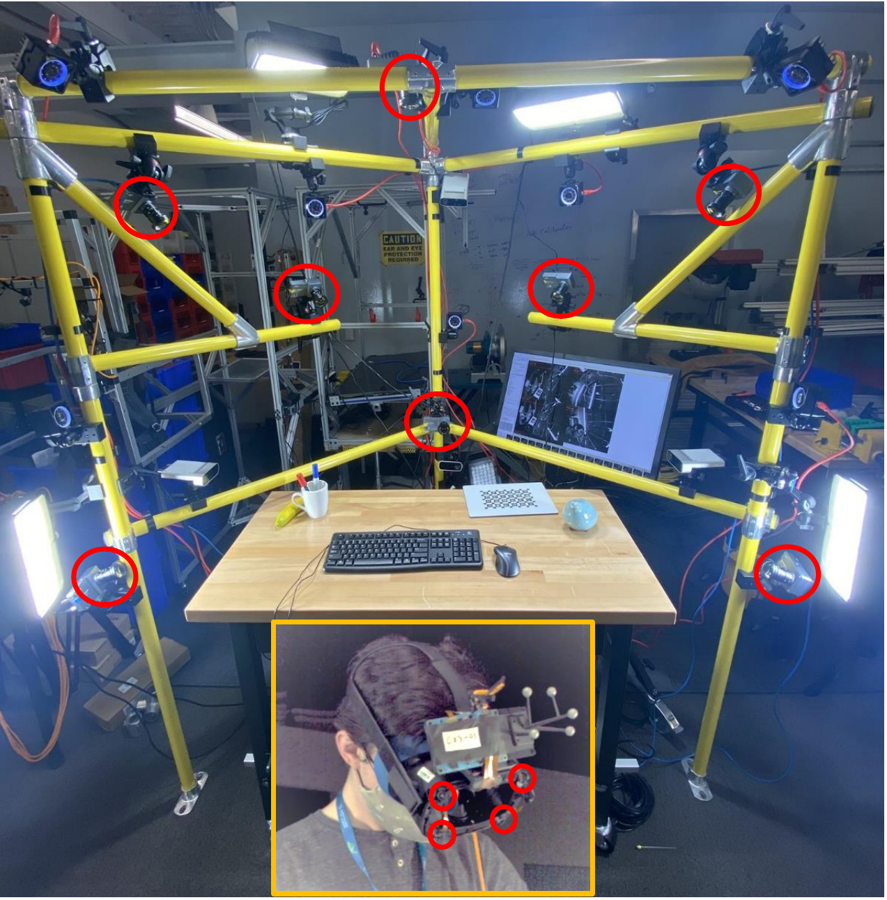

# Assembly101

目标：理解 Assembly101 为什么适合研究程序化任务、动作顺序、错误检测和跨视角动作理解，能看懂 coarse / fine-grained action、static / egocentric views、3D hand pose 和 mistake detection 这些概念，也能判断它和普通手-物交互数据集的区别。

> 先修：[EgoHOS](09-egohos.md)
> 建议：这一节重点看“程序化任务”和“错误/纠正”，不要把 Assembly101 只理解成多视角动作识别数据集
> 数据集规模：Assembly101 包含 513 小时多视角视频数据，完整数据规模约 3.9 TB，同时提供超过 100 万个细粒度动作标注和 1800 万个 3D 手部姿态标注。

Assembly101 是 CVPR 2022 的大规模多视角程序化活动数据集，题目是 **Assembly101: A Large-Scale Multi-View Video Dataset for Understanding Procedural Activities**。它记录的不是随手拿起一个物体，也不是单个抓取动作，而是人从零开始组装或拆解玩具车的完整过程。

这个任务很适合研究具身 AI，因为组装不是一个瞬时动作，而是一串有顺序、有依赖、有错误、有修正的步骤。机器人如果未来要做家具组装、维修、整理零件，光知道“手在哪里”不够，还要知道当前步骤做到了哪里、下一步该做什么、有没有装错。

先看一个 12 视角同步视频。它展示了同一段组装过程从多个固定视角和第一视角同时记录的样子。

<video src="../../assets/assembly101-12-view-assembly.mp4" controls muted loop playsinline style="width:500px;max-width:100%;height:auto;display:block;margin:0.75em 0"></video>

一句话概括 Assembly101：

```text
Assembly101 记录参与者在没有固定说明书的情况下组装和拆解 101 个玩具车，
并用 8 个固定视角和 4 个第一视角同步采集，
同时标注粗粒度动作、细粒度动作、3D 手部姿态和错误事件。
```

## 它到底收集了什么

Assembly101 的核心不是物体类别多，而是同一个程序化任务里有大量不同执行路径。参与者会自由尝试组装或拆解玩具车，中间可能换顺序、暂停、拿错零件、装错、拆掉再装回来。

规模可以这样记：

| 项目 | 数量 | 怎么理解 |
|---|---:|---|
| videos | 4,321 | 多视角视频序列 |
| total duration | 513 小时 | 多视角同步录制后的总视频量 |
| toy vehicles | 101 个 | 可拆装玩具车 |
| views | 12 个 | 8 个 fixed views + 4 个 egocentric views |
| coarse action segments | 100K+ | 较粗的动作阶段 |
| fine-grained action segments | 1M+ | 更细的手部操作片段 |
| 3D hand poses | 18M | 大量手部 3D 姿态标注 |
| task type | assembly / disassembly | 组装和拆解 |

这里最需要先分清的是：Assembly101 不是“一个视频一个标签”的数据集。它把一段长的组装过程切成很多动作片段，而且动作有粗粒度和细粒度两个层级。

## 采集系统是什么样

Assembly101 的采集系统是一个多视角 cage。参与者坐在桌前完成组装或拆解，周围有固定相机，同时参与者头部也佩戴第一视角相机。



可以把 12 个视角分成两类：

| 视角 | 数量 | 作用 |
|---|---:|---|
| static views | 8 | 从外部观察整个桌面、身体和手部动作 |
| egocentric views | 4 | 从参与者附近或头部视角观察正在操作的零件 |

多视角很关键。组装时手经常遮挡零件，一个视角看不清，另一个视角可能能看到。对模型来说，这也提供了跨视角学习的机会：同一个动作，在外部视角和第一视角下看起来很不一样。

## 程序化任务是什么

`procedural activity` 可以翻译成“程序化活动”或“有步骤的活动”。它不是一个孤立动作，而是由多个步骤组成的过程。

比如组装玩具车可能包含：

```text
拿起车底盘
找到轮轴
把轮轴插入底盘
拿起轮子
把轮子压到轮轴上
检查是否装牢
继续安装其他零件
```

这些步骤之间有依赖关系。你不能在没有轮轴的情况下先装轮子，也不能在零件装反后继续假装任务正确完成。

这就是 Assembly101 对具身 AI 的价值：它让模型面对真实的“步骤顺序”和“错误修正”问题，而不是只识别一个短动作。

## coarse 和 fine-grained action 是什么

Assembly101 的动作标注有两个层级。

`coarse action` 是较粗的动作段，更像“当前在做哪类操作”。比如：

```text
attach wheel
detach roof
insert axle
```

`fine-grained action` 更细，通常会拆到手和零件的具体交互。比如同一个 coarse action 下面，可能包含：

```text
pick up wheel
align wheel with axle
push wheel onto axle
release wheel
```

可以这样理解：

| 层级 | 粒度 | 适合研究什么 |
|---|---|---|
| coarse action | 步骤级 | 当前任务进展、长期规划 |
| fine-grained action | 手部操作级 | 细粒度动作识别、动作边界、局部操作 |

这两个层级对机器人都很有用。coarse action 像任务规划里的步骤；fine-grained action 更像执行时的短动作单元。

## 为什么错误检测重要

Assembly101 的一个特色是参与者没有固定说明书，任务中自然会出现错误和纠正。比如：

```text
拿错零件
把零件装反
发现装不上
拆下来重新装
跳过某个步骤后又回来补
```

这和很多干净数据集不一样。很多动作数据只记录“成功演示”，但真实机器人执行任务时经常会失败、卡住、走错步骤。一个有用的具身系统不应该只识别正确动作，还要能发现“现在好像做错了”。

Assembly101 后续也提供了 mistake detection 相关标注和代码。这个任务更接近机器人操作中的异常检测：

```text
当前步骤是否偏离了合理组装流程？
这个动作是不是错误操作？
错误发生后，人是怎么纠正的？
```

对机器人来说，这类能力很重要。比如机器人装配家具时，如果发现螺丝装错孔，应该停止并修正，而不是继续执行后面的步骤。

## 3D hand pose 在这里有什么用

Assembly101 还提供 18M 级别的 3D hand pose。它不像 EgoHOS 那样只做像素分割，也不像 ARCTIC 那样主要围绕铰接物体和接触建模。它更关心一段程序化任务中，手在多个视角下如何移动和操作零件。

可以把一段数据理解成：

```text
sequence:
  videos from 12 views
  coarse action segments
  fine-grained action segments
  3D hand poses
  camera calibration / extrinsics
  mistake labels
```

3D hand pose 可以帮助模型理解：

```text
手什么时候接近零件
手在哪里拿起零件
手如何把零件移动到装配位置
两只手是否协作
动作边界发生在哪里
```

它也让 Assembly101 不只是视频动作识别数据，而是可以研究手部运动、视角迁移和动作阶段推断。

## 常见 benchmark 看什么

Assembly101 围绕程序化活动提出了几个任务。

| 任务 | 输入 | 输出 | 重点 |
|---|---|---|---|
| Action Recognition | 已切好的片段 | 动作类别 | 识别当前动作是什么 |
| Action Anticipation | 动作发生前的视频 | 接下来动作 | 预测下一步操作 |
| Temporal Action Segmentation | 长视频 | 每一帧/片段的动作标签 | 把完整过程切成动作阶段 |
| Mistake Detection | 组装过程视频 | 是否发生错误 | 发现错误和纠正 |

这几个任务里，Temporal Action Segmentation 和 Mistake Detection 对具身 AI 特别有用。因为机器人不是只看一个已经裁好的 clip，而是要在执行过程中持续判断：

```text
当前处于哪一步？
下一步应该是什么？
是不是装错了？
需要不需要回退或修正？
```

## 和具身 AI 的关系

Assembly101 对具身 AI 的价值主要在“长程程序化操作”。

第一，它训练模型理解步骤顺序。组装任务天然有先后依赖，比单步抓取更接近真实任务规划。

第二，它包含错误和纠正。机器人实际执行任务时很少一路顺利，错误检测和恢复能力非常关键。

第三，它提供跨视角监督。同一个动作有固定视角和第一视角，适合研究人类视频到机器人视角的迁移。

第四，它有大量手部姿态。手部轨迹可以作为理解操作阶段和零件交互的线索。

但边界也要讲清楚：

```text
Assembly101 有人类组装视频、动作阶段和 3D 手部姿态，
但没有机器人关节状态、机器人 action、力反馈和机器人执行成功标签。
```

所以它更适合做任务规划、动作分割、动作预测、错误检测、跨视角表征学习，而不是直接训练机器人控制策略。

## 和前面数据集的区别

| 数据集 | 重点 | Assembly101 的区别 |
|---|---|---|
| EgoHOS | 手-物像素级分割 | Assembly101 更关心长程步骤和多视角动作理解 |
| ARCTIC | 双手铰接物体和动态接触 | Assembly101 更强调程序化活动、错误和动作顺序 |
| EgoDex | 大规模双手操作预训练 | Assembly101 更受控，有 12 视角和更清晰的组装任务结构 |

如果你想做“手和物体哪里接触”，EgoHOS / ARCTIC 更直接；如果你想研究“一个复杂任务如何分步骤完成、哪里出错”，Assembly101 更合适。

## 下载和使用前要注意什么


常用资源包括：

```text
videos
annotations
camera intrinsics / extrinsics
3D hand poses
action recognition code
action anticipation code
temporal action segmentation code
mistake detection code
```

如果只是先理解数据，建议先看 annotations 仓库和样例视频，不要一上来下载全部 513 小时数据。真正跑实验时，再按任务下载对应部分：

| 目标 | 需要的数据 |
|---|---|
| Action Recognition | 视频片段 + coarse/fine action annotations |
| Action Anticipation | 动作发生前的视频窗口 + action labels |
| Temporal Action Segmentation | 长视频 + dense temporal labels |
| Mistake Detection | 视频 + mistake annotations |
| 3D hand pose 研究 | AssemblyPoses / camera parameters / hand pose data |

实验记录里最好写清楚：

```text
使用哪些 views：static / egocentric / all 12 views
使用 coarse 还是 fine-grained labels
是否使用 3D hand poses
是否包含 mistake detection annotations
训练/验证/测试划分来自哪个仓库版本
数据下载自 Hugging Face 还是旧版 Google Drive
```

否则不同实验之间很难比较。

## 常见误解

**误解一：Assembly101 是普通动作识别数据集。**

不准确。它确实能做 action recognition，但核心特色是程序化活动、多视角、动作顺序和错误检测。

**误解二：12 个视角只是为了拍得更清楚。**

不只是这样。多视角还支持跨视角迁移、遮挡补偿、3D 手部姿态估计和视角泛化研究。

**误解三：coarse 和 fine-grained labels 可以随便混用。**

不建议。coarse 是步骤级语义，fine-grained 是更细的操作单元，训练和评估口径不同。

**误解四：错误动作就是失败任务。**

不一定。真实组装里可能先出错再纠正，最终仍然完成任务。mistake detection 关注的是过程中的错误事件。

**误解五：有 3D hand pose 就可以直接训练机器人装配。**

不够。手部姿态能提供人类操作线索，但机器人执行还需要动作空间、夹具、力控、零件状态和成功反馈。

## 小结

Assembly101 是“程序化装配任务的视频理解数据集”。它的价值不只是 513 小时、多视角和手部姿态，而是把完整装配过程中的步骤顺序、变化路径、错误和纠正记录下来。对具身 AI 来说，它补的是长程任务理解和错误检测能力，而不是低层控制动作。

进一步阅读可以看：

- [Assembly101 主页](https://assembly-101.github.io/)
- [Assembly101 Hugging Face 数据集](https://huggingface.co/datasets/cvml-nus/assembly101)
- [Assembly101 annotations](https://github.com/assembly-101/assembly101-annotations)
- [Assembly101 download scripts](https://github.com/assembly-101/assembly101-download-scripts)
- [Assembly101 paper](https://arxiv.org/abs/2203.14712)
