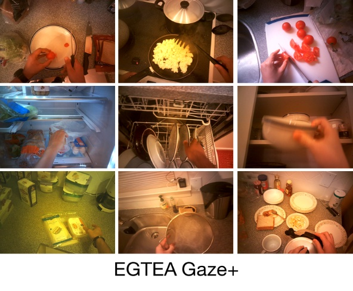
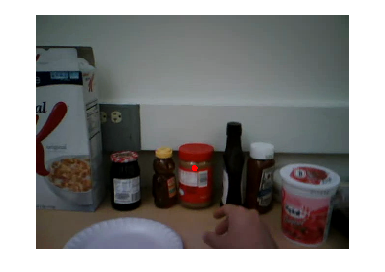

# EGTEA Gaze+

目标：理解 EGTEA Gaze+ 为什么强调第一视角烹饪视频中的 gaze 与 action 对齐，能看懂 gaze tracking、frame-level action annotation、hand mask 和 trimmed action clips 这些数据内容，也能判断它适合哪些注意力引导和操作意图理解任务。

> 先修：[EgoHOS](09-egohos.md)
> 建议：这一节重点看“人操作时看哪里”，不要把 gaze 当成万能的意图标签
> 数据集规模：EGTEA Gaze+ 包含约 28 小时第一视角视频数据，原始视频规模约 28 GB，同时提供眼动轨迹、动作标签以及手部像素级标注。

EGTEA Gaze+ 是 Georgia Tech 发布的第一视角烹饪活动数据集。它的核心特色不是视频时长最大，也不是 3D 姿态最精，而是把 **第一视角视频、动作标注和 gaze tracking** 放到了一起。

前面几节里，ARCTIC、EgoDex 更关心手和物体在 3D 里怎么动；EgoHOS 更关心手和交互物体在图像里占哪些像素。EGTEA Gaze+ 关心的是另一个问题：

```text
人在执行操作时，眼睛到底看哪里？
这个注视位置和下一步动作、当前物体、手部操作有什么关系？
```

先看一组样例。它们都是第一视角烹饪场景，画面里有切菜、拿取、倒入、清洗、打开柜门等常见厨房动作。



一句话概括 EGTEA Gaze+：

```text
EGTEA Gaze+ 记录人在厨房中做菜的第一视角视频，
同时提供 30Hz gaze、frame-level action annotations、
fine-grained action instances 和 sampled frames 上的 hand masks。
```

## 它到底收集了什么

EGTEA Gaze+ 是 GTEA 系列数据集的扩展版本。它覆盖真实烹饪活动，参与者佩戴第一视角设备完成多种菜谱相关任务。

规模可以这样记：

| 项目 | 数量或形式 | 怎么理解 |
|---|---:|---|
| 视频时长 | 28 小时 | 去标识化后的烹饪活动视频 |
| sessions | 86 | 不同录制 session |
| subjects | 32 人 | 不同参与者 |
| 视频规格 | 1280 x 960 HD | 原始视频分辨率较高 |
| gaze | 30Hz | 与视频同步的眼动追踪数据 |
| fine-grained action instances | 10,325 | 细粒度人-物交互动作片段 |
| hand masks | 15,176 | 来自 13,847 帧的手部分割标注 |
| audio | 有 | 与视频同步记录 |
| trimmed action clips | 640 x 480 @ 24 fps | 便于动作识别训练的裁剪片段 |

这些数字里最重要的是 `gaze` 和 `action` 的配对。普通烹饪视频只能告诉你人做了什么；EGTEA Gaze+ 还能告诉你人在做这些动作时看向哪里。

## gaze 是什么

`gaze` 可以理解成“注视点”。在第一视角视频里，它通常表示人在某一帧大致看向画面的哪个位置。

下面这张图里，红点就是 gaze point。它表示当前时刻参与者的视线落在画面中的位置。



在厨房操作里，gaze 很有意义。人通常会先看向目标物体，再伸手去拿；或者在切菜时注视刀和食材的接触位置；倒水时注视杯口或容器边缘。

可以这样理解：

| 观察到的 gaze | 可能说明什么 |
|---|---|
| 看向刀和食材 | 当前注意力在切割位置 |
| 看向调料瓶 | 可能准备拿调料 |
| 看向锅或盘子 | 可能准备倒入或放置 |
| 看向冰箱内部 | 可能在寻找食材 |

但要注意，gaze 不是严格的动作标签。人可能扫视多个物体，也可能看向目标前先看环境。gaze 是注意力线索，不是百分百可靠的意图答案。

## action annotation 是什么

EGTEA Gaze+ 里的动作标注是 frame-level action annotations。也就是说，数据会标出视频中哪些时间段对应哪些人-物交互动作。

比如：

```text
Cut bell pepper
Pour condiment (from) condiment container into salad
```

这些动作通常不是单个动词，而是包含动词和物体，有时还包含来源和目标。比如第二个例子里，不只是 `pour condiment`，还说明 condiment 来自 container，目标是 salad。

可以把一个动作片段理解成：

```text
action segment:
  start frame / time
  end frame / time
  verb
  object
  optional source / target
  aligned gaze samples
```

这和机器人数据里的 action 不一样。这里的 action 是视频语义标签，不是机器人控制命令。

## hand masks 有什么用

EGTEA Gaze+ 还提供 sampled frames 上的 pixel-level hand masks。它和 EgoHOS 类似，都可以告诉模型画面中哪些像素属于手。

手部 mask 能帮助模型回答：

```text
手在哪里？
手是否正在靠近某个物体？
手和 gaze 是否落在同一区域？
动作发生时，手和物体之间的关系是什么？
```

如果只有 gaze，没有 hand mask，模型可能知道人看哪里，但不知道手在哪里；如果只有 hand mask，没有 gaze，模型知道手在操作哪里，却不知道人的注意力是否提前落到了目标上。EGTEA Gaze+ 的价值就在于把这两类信号放到同一个 cooking 视频里。

## 为什么烹饪场景适合研究 gaze

烹饪是一个很好的 gaze 研究场景，因为它同时包含物体搜索、工具使用、状态变化和安全约束。

比如：

```text
切菜时要看刀和食材
倒液体时要看容器口
开冰箱时要扫视内部物体
拿调料时要确认标签或位置
放锅时要看炉灶或台面
```

这些操作都不是“随便看哪里都行”。gaze 往往和下一步动作、目标物体、手部轨迹有关。

对具身 AI 来说，这类数据可以帮助模型学习：

| 能力 | 为什么需要 gaze |
|---|---|
| 操作目标预测 | 人常常先看目标，再伸手 |
| 关键区域定位 | gaze 可以提示模型哪里重要 |
| 动作 anticipation | 视线变化可能早于手部动作 |
| 人机协作 | 机器人可以根据人的视线预测意图 |

## trimmed clips 和 raw videos 怎么区分

EGTEA Gaze+ 里既有 raw videos，也有 trimmed action clips。

`raw videos` 是完整录制视频，适合研究长时间上下文、gaze 随时间变化和动作切分。

`trimmed action clips` 是已经按动作片段裁剪好的短视频，适合做动作识别模型训练。

两者区别可以这样记：

| 数据形式 | 适合做什么 |
|---|---|
| raw videos | 长视频理解、gaze 分析、动作边界研究 |
| trimmed action clips | 动作分类、短片段特征学习 |
| gaze data | 注意力建模、动作预测 |
| hand masks | 手部定位、操作区域分割 |
| action annotations | 动作识别、动作分割和评估 |

第一次使用时，建议先从 trimmed clips 和 action annotations 入手；如果要研究 gaze 和动作边界，再回到 raw videos。

## 和具身 AI 的关系

EGTEA Gaze+ 对具身 AI 的价值主要在注意力和意图理解。

第一，它可以帮助模型学会看哪里。机器人或 VLA 模型处理厨房画面时，背景里会有很多无关物体。gaze 可以作为一种人类注意力监督，告诉模型哪些区域更可能和当前任务有关。

第二，它可以帮助预测下一步动作。人动手之前经常先看目标物体，gaze 可能比手部动作更早暴露意图。

第三，它适合研究人机协作。如果机器人看到人正在注视某个调料瓶，可能应该提前判断对方要拿它，或者帮忙递过去。

第四，它可以和 hand mask 结合。手的位置告诉模型“现在操作在哪里”，gaze 告诉模型“注意力在哪里”，两者一起更接近人类操作过程。

但边界也要讲清楚：

```text
EGTEA Gaze+ 有第一视角视频、gaze、动作标注和手部 mask，
但没有机器人状态、机器人 action、3D 手部姿态和真实控制反馈。
```

所以它更适合做视觉注意力、动作识别、动作预测、操作目标定位和人类意图建模，而不是直接训练机器人控制策略。

## 和前面数据集的区别

| 数据集 | 重点 | EGTEA Gaze+ 的区别 |
|---|---|---|
| EgoHOS | 手和交互物体的像素级分割 | EGTEA Gaze+ 额外关注 gaze 和动作的时间对齐 |
| EgoDex | 大规模 3D 手部 tracking | EGTEA Gaze+ 规模小很多，但有同步 gaze |
| EPIC-KITCHENS-100 | 厨房动作识别 | EGTEA Gaze+ 更强调 gaze 与 action 的联合学习 |

如果你关心“动作语义规模”，EPIC-KITCHENS-100 更大；如果你关心“人操作时看哪里”，EGTEA Gaze+ 更直接。

## 下载和使用前要注意什么

EGTEA Gaze+ 的数据分成多部分，下载时不要只看一个 zip。

常见部分包括：

```text
raw videos
trimmed action clips
gaze data
action annotations
hand masks
recipes
```

raw videos 大约 28G，trimmed action clips 大约 20G。使用前要确认自己需要哪部分。

实验记录里建议写清楚：

```text
使用 raw videos 还是 trimmed clips
是否使用 gaze
gaze 是 30Hz 原始点，还是处理后的 heatmap / feature
是否使用 hand masks
使用哪个 train/test split
动作评估用 fine-grained action 还是其他处理后的类别
```

否则不同论文里“用 EGTEA Gaze+”可能不是同一个设置。

## 常见误解

**误解一：gaze 就等于人下一步一定要操作的物体。**

不准确。gaze 是注意力线索，不是严格因果标签。人可能观察、搜索、确认，也可能短暂扫视无关区域。

**误解二：EGTEA Gaze+ 是 3D 手部姿态数据集。**

不对。它提供 hand masks，但不是 MANO、SMPL-X 或 3D hand pose 数据。

**误解三：trimmed clips 可以替代 raw videos。**

不完全。trimmed clips 适合动作分类，但会丢掉动作前后的 gaze 变化和长上下文。

**误解四：所有第一视角厨房数据都差不多。**

不对。EGTEA Gaze+ 的特色是 gaze；EPIC-KITCHENS-100 的特色是大规模动作片段；HD-EPIC 的特色是高度细致的多模态标注。

**误解五：有 gaze 就可以直接训练机器人注意力。**

不够。机器人视角、相机位置和人眼视角不同，迁移时还要处理视角差异、任务差异和动作空间差异。

## 小结

EGTEA Gaze+ 是“带眼动追踪的第一视角烹饪动作数据集”。它的价值不是数据量最大，而是把 gaze、action 和 hand masks 放在一起，让模型能研究人类在操作时如何分配注意力。对具身 AI 来说，它补的是视觉注意力、操作目标预测和人类意图理解能力。

进一步阅读可以看：

- [GTEA / EGTEA 数据集主页](https://cbs.ic.gatech.edu/fpv/)
- [EGTEA Gaze+ paper](https://eccv2018.org/openaccess/content_ECCV_2018/papers/Yin_Li_In_the_Eye_ECCV_2018_paper.pdf)
