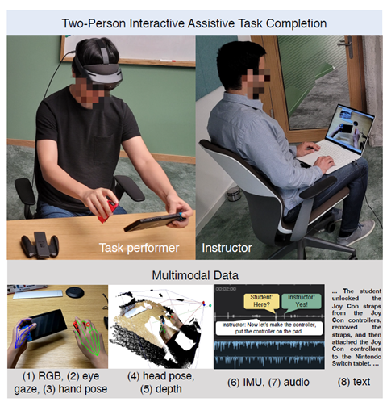
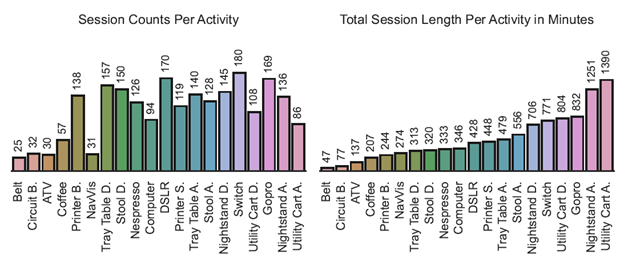
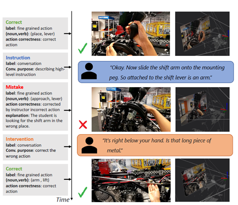

# HoloAssist

目标：理解 HoloAssist 为什么强调交互式任务辅助，能看懂 performer / instructor、七路同步数据流、instruction / intervention / mistake 标注，以及它为什么适合研究具身 AI 中的人机协作、错误检测和指导生成。

> 先修：[Assembly101](10-assembly101.md) → [EGTEA Gaze+](11-egtea-gaze-plus.md)
> 建议：这一节重点看“两个人如何协作完成任务”，不要把 HoloAssist 只理解成 HoloLens 录制的视频数据集
> 数据集规模：HoloAssist 数据集包含约 166 小时第一视角协作交互数据，完整数据规模约 1 TB 左右，包括 RGB 视频、深度信息、手部姿态、眼动、头部姿态、IMU、音频以及语言标注。

HoloAssist 是 Microsoft Research 在 2023 年发布的第一视角交互式任务辅助数据集。它和前面几个数据集的差别很明显：很多数据集只记录一个人独立完成任务，而 HoloAssist 记录的是 **一个执行者和一个指导者协作完成真实物理任务**。

这个设定很接近未来具身 AI 助手的使用方式。一个人戴着混合现实设备执行任务，另一个人远程看着第一视角画面，通过语音、手势或 AR 标注来指导他。未来把远程人类指导者换成 AI 助手，就是 HoloAssist 想支持的研究方向。

先看整体设置。左边是 task performer，负责实际动手；右边是 instructor，远程观察并给出指导。下面展示了采集到的 RGB、eye gaze、hand pose、head pose、depth、IMU、audio 和 text 等多模态数据。



一句话概括 HoloAssist：

```text
HoloAssist 记录执行者戴着混合现实设备完成任务，
指导者远程观察第一视角画面并通过语音和标注提供帮助，
同时保存多路传感器数据、对话、动作、错误和干预标注。
```

## 它到底收集了什么

HoloAssist 的规模不是最大，但它的交互结构很特别。

规模和数据内容可以这样记：

| 项目 | 数量或形式 | 怎么理解 |
|---|---:|---|
| 总时长 | 166 小时 | 交互式物理任务完成过程 |
| instructor-performer pairs | 350 对 | 一人执行任务，一人远程指导 |
| 采集设备 | mixed-reality headset | 执行者佩戴设备完成任务 |
| 同步数据流 | 7 路 | video、depth、eye gaze、hand pose、head pose、IMU、audio/text 等 |
| 标注 | action + conversation | 动作和对话一起标 |
| benchmark | mistake detection / intervention type prediction / hand forecasting | 错误、干预和手部未来预测 |

这里的关键不是“有 HoloLens 视频”，而是“有实时指导过程”。HoloAssist 想研究的问题更像：

```text
执行者什么时候做错了？
指导者什么时候介入？
指导者说的话对应画面里的哪个物体或动作？
AI 助手应该在什么时机提醒、纠正或解释？
```

## performer 和 instructor 是什么

HoloAssist 里有两个角色。

`performer` 是执行者。他佩戴混合现实设备，亲手完成任务。设备会记录他的第一视角视频、深度、眼动、手部姿态、头部姿态、IMU 和音频。

`instructor` 是指导者。他远程观看 performer 的第一视角画面，并通过语音、AR 标注或其他方式进行指导。

可以把一段 session 理解成：

```text
performer:
  看见任务场景
  动手操作
  可能犯错
  听取指导并修正

instructor:
  观看 performer 的第一视角画面
  判断任务进展
  给出指令、提醒或纠正
  在必要时进行干预
```

这和普通第一视角视频数据集不一样。普通数据集大多只记录“人做了什么”；HoloAssist 还记录“另一个人如何帮助他做对”。

## 任务是什么类型

HoloAssist 覆盖的是现实中的物理操作任务，包含组装、设备操作、工具使用、家用物品操作等。下面这张图展示了不同活动类别的 session 数量和总时长分布。



从图里可以看出，HoloAssist 不是只做一个固定装配任务。它覆盖了多种实体物品和设备，比如玩具、打印机、咖啡机、GoPro、Nintendo Switch、台灯、夜灯、工具类任务等。

这对具身 AI 很重要，因为真实助手不能只会一个领域。它需要在不同任务之间迁移：

```text
有时要指导用户装配物体
有时要指导用户操作设备
有时要发现用户拿错零件
有时要解释下一步应该按哪里
```

## 七路同步数据流怎么理解

HoloAssist 采集的不是单一视频，而是多模态同步数据。可以粗略理解为：

```text
RGB video:
  执行者第一视角看到的画面

depth:
  场景深度，用于理解空间关系

eye gaze:
  执行者正在看哪里

hand pose:
  执行者手部位置和姿态

head pose:
  执行者头部运动和视角变化

IMU:
  设备运动信息

audio / text:
  执行者和指导者的对话，以及转写文本
```

这类同步数据让研究者可以同时看见：

```text
人看到了什么
人看向哪里
手准备动向哪里
指导者说了什么
动作是否正确
如果出错，指导者怎么纠正
```

这比只看 RGB 视频更接近真实 AI 助手的输入输出环境。

## 标注里有哪些类型

HoloAssist 的标注不只是动作类别。它把动作、对话、正确性、错误和干预都放在时间轴上。

下面这张图展示了几种典型标注：正确动作、instruction、mistake 和 intervention。注意它们不是孤立标签，而是和视频、对话、3D 场景一起对齐。



可以这样理解这些标注：

| 标注类型 | 含义 | 例子 |
|---|---|---|
| Correct | 执行者动作正确 | 放置、拿起、连接某个部件 |
| Instruction | 指导者给出高层或下一步指令 | “现在把这个部件接到右边” |
| Mistake | 执行者做错了某个动作 | 拿错零件、装错方向 |
| Intervention | 指导者介入纠正 | “不对，应该放到下面那个位置” |

这几类标注对具身 AI 很有价值。机器人或 AI 助手不仅要能识别动作，还要判断动作是否正确，并在合适的时机给出帮助。

## mistake detection 是什么

`mistake detection` 是 HoloAssist 的一个重要 benchmark。它不是简单问“这个动作是什么”，而是问：

```text
当前执行者是不是做错了？
错误发生在什么时候？
能不能根据视频和对话判断出错误？
```

比如执行者把零件放到错误位置，或者用错工具。普通动作识别模型可能只会说“放置部件”；mistake detection 还要判断这个“放置”是否符合当前任务。

这对具身 AI 很关键。一个好的助手不应该只在用户问问题时回答，还应该在用户明显做错时及时提醒。

## intervention type prediction 是什么

`intervention type prediction` 关注的是指导者为什么介入、怎么介入。

可以把 intervention 分成几类：

```text
提醒下一步
纠正错误
解释原因
指出物体位置
确认用户动作正确
```

模型要学习的不只是“说一句话”，而是学会在正确时机选择合适的帮助方式。比如用户只是慢了一点，不一定需要打断；用户拿错零件时，就需要立刻纠正。

这和真实人机协作非常接近。AI 助手过早介入会打扰用户，过晚介入又可能让错误扩大。

## hand forecasting 是什么

`hand forecasting` 是预测执行者的手接下来会怎么动。

可以理解成：

```text
输入：当前和过去一段第一视角视频、多模态信号
输出：未来短时间内手的位置或轨迹
```

这个任务和具身 AI 的关系也很直接。助手如果能预测人的手会伸向哪里，就可以更早判断：

```text
用户是不是要拿错东西
用户下一步是不是要接触危险区域
用户是不是准备执行指导者刚说的动作
```

这类预测能力对 AR 指导、远程协作和机器人辅助都很重要。

## 和具身 AI 的关系

HoloAssist 对具身 AI 的价值主要在“协作和指导”。

第一，它提供了真实的人类指导过程。很多数据集只有执行动作，没有指导者如何说、何时说、说错时如何纠正。

第二，它能研究错误检测。机器人或 AI 助手需要知道用户什么时候偏离正确流程。

第三，它能研究语言如何落到环境里。指导者说“把这个接到右边那个位置”，模型要把“这个”和“那个位置”对应到画面和空间。

第四，它提供多模态输入。真实助手通常不只看 RGB，还会用 gaze、hand pose、head pose、depth、audio 和 IMU 等信号。

但边界也要讲清楚：

```text
HoloAssist 记录的是人类执行者和人类指导者的协作，
不是机器人执行数据。
它没有机器人关节状态、机器人 action 和机器人控制成功率。
```

所以它更适合做 AI 助手、AR 指导、人机协作、错误检测、语言 grounding 和手部预测，而不是直接训练机器人控制策略。

## 和前面数据集的区别

| 数据集 | 重点 | HoloAssist 的区别 |
|---|---|---|
| Assembly101 | 程序化装配、多视角、错误检测 | HoloAssist 额外记录远程指导者和对话干预 |
| EGTEA Gaze+ | 烹饪动作和 gaze | HoloAssist 不限于烹饪，更强调协作指导 |
| EgoDex | 大规模双手操作轨迹 | HoloAssist 更重视指导语言、错误和多模态交互 |
| Ego-Exo4D | 多视角技能活动 | HoloAssist 更像“实时助教”，有 instructor 的介入行为 |

如果你关心“人独立怎么完成任务”，Assembly101 更直接；如果你关心“AI 助手应该怎么指导人完成任务”，HoloAssist 更合适。

## 下载和使用前要注意什么

HoloAssist 的数据需要申请下载。数据包不是只有视频，还包括多种同步模态。常见下载项包括：

```text
video
depth
eye gaze
hand pose
head pose
IMU
labels
calibration
```

第一次使用不建议全量下载。更稳妥的顺序是：

```text
先看 labels 和 calibration
再下载少量 video / depth / gaze 样例
确认时间戳和 session 对齐方式
最后按任务下载 hand pose、IMU 或完整视频
```

实验记录里建议写清楚：

```text
使用哪些数据流：video / depth / gaze / hand pose / audio / labels
是否使用 instructor 对话
是否使用 mistake / intervention 标注
任务是 mistake detection、intervention prediction 还是 hand forecasting
使用的是哪个 split
是否过滤隐私或失败片段
```

否则不同实验即使都写“使用 HoloAssist”，也可能使用了完全不同的模态组合和任务定义。

## 常见误解

**误解一：HoloAssist 是普通 HoloLens 视频数据集。**

不准确。它的关键是交互式辅助：执行者和指导者协作完成任务，并且有对话、错误和干预标注。

**误解二：instruction 就是普通 caption。**

不对。instruction 是指导者在任务过程中给出的帮助，具有时机、上下文和目标，不等同于事后给视频写描述。

**误解三：mistake detection 只是动作分类。**

不准确。它不仅要识别动作，还要判断动作在当前任务流程里是否正确。

**误解四：有 hand pose 就可以直接训练机器人手。**

不够。hand pose 是人手数据，不是机器人动作空间，也没有机器人控制反馈。

**误解五：intervention 越多越好。**

不一定。真实助手要把握时机。过度干预会打断用户，太少干预又可能无法纠正错误。

## 小结

HoloAssist 是“交互式具身 AI 助手数据集”。它的价值不在于单纯记录更多第一视角视频，而在于记录了执行者、指导者、对话、动作、错误、干预和多模态传感器之间的关系。对具身 AI 来说，它补的是协作指导、错误检测和语言 grounding 能力。

进一步阅读可以看：

- [HoloAssist 主页](https://holoassist.github.io/)
- [HoloAssist paper](https://arxiv.org/abs/2309.17024)
- [Microsoft Research 介绍文章](https://www.microsoft.com/en-us/research/blog/holoassist-a-multimodal-dataset-for-next-gen-ai-copilots-for-the-physical-world/)
