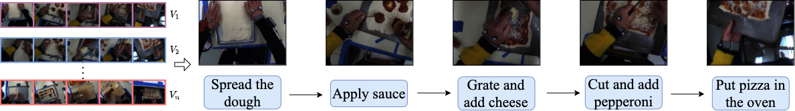
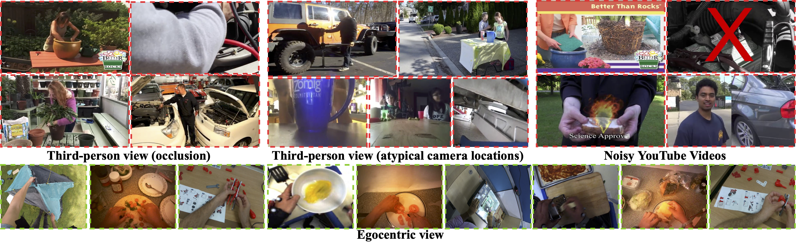
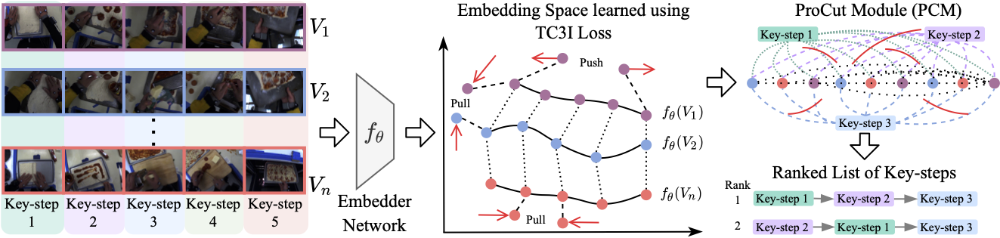

# EgoProceL

目标：理解 EgoProceL 为什么适合研究第一视角程序化学习，能看懂 procedure learning、key-step、logical order、temporal correspondence 和 CnC 这些概念，也能判断它和 Assembly101、HoloAssist 的区别。

> 先修：[Assembly101](10-assembly101.md) → [HoloAssist](12-holoassist.md)
> 建议：这一节重点看“从多段视频里学出关键步骤顺序”，不要把 EgoProceL 当成普通动作分类数据集
> 数据集规模：EgoProceL 包含 62 小时第一视角程序性任务视频数据，覆盖 130 名参与者和 16 类任务，并提供关键步骤标注。

EgoProceL 来自 ECCV 2022 论文 **My View is the Best View: Procedure Learning from Egocentric Videos**。它研究的不是“这一小段视频是什么动作”，而是更高一层的问题：给定很多人完成同一个任务的视频，模型能不能自动找出这个任务有哪些关键步骤，以及这些步骤通常应该按什么顺序发生。

这类问题叫 `procedure learning`，可以翻译成程序化学习或流程学习。它和具身 AI 很相关，因为机器人完成复杂任务时，不能只会一个局部动作，还要知道任务流程。

比如做披萨时，模型不应该只识别某一帧里有手和面团，而是应该学出类似下面的步骤：

```text
Spread the dough
Apply sauce
Grate and add cheese
Cut and add pepperoni
Put pizza in the oven
```

下面这张图展示了 procedure learning 的基本目标：从多段第一视角视频中，找出共同的 key-steps，并推断它们的顺序。



一句话概括 EgoProceL：

```text
EgoProceL 用 130 名参与者完成 16 个任务的 62 小时第一视角视频，
研究如何从多个 noisy egocentric videos 中找出关键步骤和合理顺序。
```

## 它到底收集了什么

EgoProceL 是为了研究第一视角 procedure learning 提出的数据集。论文摘要给出的统计是：62 小时视频，130 名参与者，16 个任务。

规模可以这样记：

| 项目 | 数量 | 怎么理解 |
|---|---:|---|
| 视频时长 | 62 小时 | 第一视角任务视频 |
| subjects | 130 人 | 不同执行者 |
| tasks | 16 个 | 每个任务由多个关键步骤组成 |
| 视角 | egocentric | 执行者自己的视角 |
| 任务类型 | procedural tasks | 有步骤、有顺序、有目标的任务 |
| 研究目标 | key-step discovery + ordering | 找关键步骤并确定顺序 |

这里的重点不是视频总量，而是数据的任务结构。每个任务都不是孤立动作，而是由多个 key-steps 组成。不同人完成同一任务时，速度、顺序、停顿和无关片段都可能不同。

## procedure learning 是什么

`procedure learning` 的目标是从视频中学出一个任务的流程。它通常包含两件事：

```text
第一，找出关键步骤 key-steps；
第二，判断这些关键步骤之间的逻辑顺序 logical order。
```

举一个更直观的例子。假设有很多人录制了“搭帐篷”的第一视角视频，每个人动作速度不同，有的人中间停顿，有的人先整理地布，有的人先拿支架。procedure learning 不要求模型逐帧标出所有细小动作，而是希望模型学出：

```text
先展开帐篷布
再插入支架
再固定角点
最后拉紧并检查
```

这和动作识别不同。

| 任务 | 关注的问题 |
|---|---|
| Action Recognition | 这一段视频是什么动作？ |
| Temporal Action Segmentation | 长视频里每一帧属于哪个动作？ |
| Procedure Learning | 完成这个任务需要哪些关键步骤？它们通常怎么排序？ |

所以 EgoProceL 更接近任务规划层，而不是低层动作层。

## key-step 是什么

`key-step` 可以理解成完成任务时不可忽略的关键步骤。它不是每一个手部微动作，而是任务流程中的重要节点。

比如做披萨：

```text
拿起勺子        不是关键步骤，通常只是局部动作
Spread dough    是关键步骤
Apply sauce     是关键步骤
Add cheese      是关键步骤
Put in oven     是关键步骤
```

如果换成机器人任务，key-step 更像高层计划里的子目标：

```text
打开容器
放入物体
关闭容器
检查是否完成
```

这也是为什么 EgoProceL 对具身 AI 有价值。机器人策略可以分成两层：上层决定当前应该做哪个 key-step，下层负责把这个 key-step 执行出来。

## 为什么第一视角更适合

EgoProceL 论文题目里有一句很直接的话：**My View is the Best View**。它想表达的是，在很多程序化任务里，第一视角比第三人称视角更容易看清关键操作。

下面这张图对比了第三人称视频和第一视角视频。第三人称视频里，操作物体可能很小、被身体遮挡，或者相机位置不稳定；第一视角通常更接近操作者真正关注的物体和手部动作。



但第一视角也有自己的问题：

| 优势 | 问题 |
|---|---|
| 操作物体更近、更清楚 | 头部运动导致画面抖动 |
| 手和物体通常在画面中心 | 视频里会夹杂大量无关片段 |
| 更接近机器人腕部或头部视角 | 不同人完成同一步的时间差异很大 |
| 适合学习操作步骤 | 同一任务可能有多种合理顺序 |

所以 EgoProceL 不是简单说“第一视角一定更好”，而是说第一视角提供了更好的操作观察视角，但需要专门方法处理抖动、无关帧和时间错位。

## temporal correspondence 是什么

EgoProceL 的一个核心想法是利用不同视频之间的 `temporal correspondences`。可以理解成：不同人虽然速度不同，但在完成同一个任务时，关键步骤之间会有对应关系。

比如三个人都在做披萨：

```text
视频 A：第 10 秒抹酱，第 25 秒加奶酪
视频 B：第 30 秒抹酱，第 70 秒加奶酪
视频 C：第 5 秒抹酱，第 20 秒加奶酪
```

时间点完全不同，但“抹酱”和“加奶酪”是跨视频对应的步骤。procedure learning 要利用的正是这种对应关系，而不是假设所有视频在同一时间发生同一步。

这对真实第一视角数据很重要。人类执行任务不会像实验室脚本那样整齐同步。有人快，有人慢，有人中间停下来找东西，有人返工。

## CnC 是什么

论文提出的方法叫 `Correspond and Cut`，简称 `CnC`。名字可以拆成两部分：

```text
Correspond：在多段视频之间找到相互对应的关键步骤
Cut：根据这些对应关系，把视频切成 key-step 片段
```

下面这张图展示了 CnC 的大致思路：先用视频嵌入找到不同视频之间的 temporal correspondence，再通过 ProCut module 输出排序后的 key-steps。



这张图不需要记住所有模型细节，只要抓住一个重点：CnC 不是依赖人工逐帧标注来切步骤，而是利用多段视频之间的对应关系来自监督地学习流程。

这也是 EgoProceL 和普通监督动作数据集的区别。它更像在问：

```text
如果我只有很多人完成同一任务的视频，
能不能自动学出这个任务的步骤模板？
```

## logical order 不是唯一固定顺序

`logical order` 容易被误解成“所有人都必须一模一样地按这个顺序做”。实际不是这样。

很多任务有相对固定的依赖，但也有可交换步骤。比如做披萨时：

```text
Spread dough 通常要在 Apply sauce 之前
Apply sauce 通常要在 Add cheese 之前
但准备某些 topping 的顺序可能可以交换
```

所以 procedure learning 学到的是“合理顺序”或“任务结构”，不是强行要求所有视频一帧不差地对齐。

这点对具身 AI 很关键。真实机器人任务也经常有多种可行路径。比如收拾桌面时，可以先拿杯子，也可以先拿盘子，只要最终满足任务目标就行。

## 和具身 AI 的关系

EgoProceL 对具身 AI 的价值主要在高层任务规划。

第一，它帮助模型从人类第一视角视频中学习任务步骤。机器人不一定能直接复制人手动作，但可以学习“完成这个任务通常有哪些子目标”。

第二，它适合构建 task graph。key-steps 和 logical order 可以进一步转成任务图，用于规划和错误检查。

第三，它处理了真实视频里的时间错位和无关帧。机器人从互联网视频或可穿戴视频中学习任务时，也会遇到这些问题。

第四，它强调第一视角。第一视角更接近机器人头部相机、胸前相机或腕部相机，因此比很多第三人称教程视频更容易迁移到具身系统的感知输入。

但边界同样要说清楚：

```text
EgoProceL 有第一视角任务视频和流程学习目标，
但没有机器人状态、机器人 action、力反馈和真实执行成功标记。
```

所以它更适合学习高层步骤、任务结构、关键步骤检索和视频到任务图的转换，而不是直接训练机器人低层控制。

## 和 Assembly101、HoloAssist 的区别

| 数据集 | 重点 | EgoProceL 的区别 |
|---|---|---|
| Assembly101 | 玩具车装配，多视角，动作分割和错误检测 | EgoProceL 覆盖 16 个任务，更强调从第一视角视频中学习 key-step 顺序 |
| HoloAssist | 执行者和指导者交互，错误和干预 | EgoProceL 没有远程指导者，关注从多段演示中自动学习流程 |
| EGTEA Gaze+ | 烹饪动作和 gaze | EgoProceL 更关注任务步骤结构，不以眼动为核心 |
| EgoDex | 大规模双手轨迹 | EgoProceL 更偏高层 procedure，而不是 3D hand trajectory |

如果你研究“用户做错了，助手怎么提醒”，HoloAssist 更合适；如果你研究“一个任务有哪些关键步骤”，EgoProceL 更直接。

## 下载和使用前要注意什么

EgoProceL 的数据和代码可以从主页入口进入。第一次使用时，建议先区分清楚自己要做的是数据阅读，还是复现 CnC 方法。

如果只是理解数据：

```text
先看任务列表和视频样例
确认每个任务有哪些视频
理解 key-step 的定义
检查数据是否包含训练/验证/测试划分
```

如果要复现方法：

```text
阅读 CnC 代码
确认视频特征提取方式
确认 ProCut module 的输入输出
记录使用的随机种子和评估指标
```

实验记录里建议写清楚：

```text
使用的是 EgoProceL、ProceL 还是 CrossTask
是否使用第一视角视频
key-step 数量如何设定
是否使用人工标注辅助
评价的是 key-step localization、ordering 还是 procedure prediction
```

否则不同论文里“做 procedure learning”可能不是同一个任务设置。

## 常见误解

**误解一：EgoProceL 是动作识别数据集。**

不准确。它可以包含动作相关信息，但核心目标是 procedure learning，也就是找 key-steps 和顺序。

**误解二：key-step 等于每一个动作片段。**

不对。key-step 是任务流程中的关键步骤，不是所有微小手部动作。

**误解三：logical order 就是唯一固定流程。**

不完全。很多任务有必要依赖，也有可交换步骤。logical order 更像合理的步骤结构，而不是死板脚本。

**误解四：第一视角视频天然容易做流程学习。**

不一定。第一视角更接近操作物体，但也有头部抖动、无关片段和时间错位问题。

**误解五：学到 procedure 就等于机器人能执行。**

不够。procedure 提供高层步骤，机器人执行还需要动作技能、控制接口、状态估计和失败恢复。

## 小结

EgoProceL 是“第一视角程序化学习数据集”。它的价值不在于提供 3D 姿态或机器人动作，而在于从多段人类第一视角视频中学习任务的关键步骤和逻辑顺序。对具身 AI 来说，它补的是高层任务结构：知道任务应该分成哪些步骤，以及这些步骤大致如何组织。

进一步阅读可以看：

- [EgoProceL 主页](https://sid2697.github.io/egoprocel/)
- [EgoProceL paper](https://arxiv.org/abs/2207.10883)
