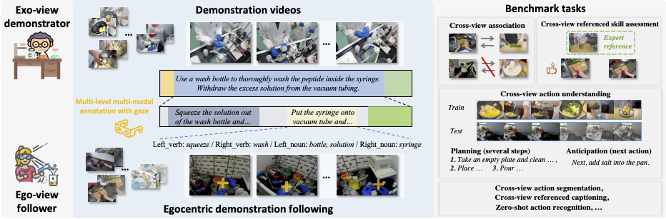
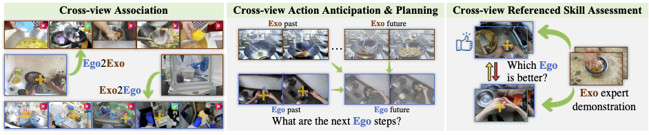

# EgoExoLearn

目标：理解 EgoExoLearn 为什么强调 asynchronous ego/exo 学习，能看懂示教视频、第一视角执行视频、gaze、跨视角关联和技能评估这些概念，也能判断它和 Ego-Exo4D、HoloAssist、EgoProceL 的区别。

> 先修：[Ego-Exo4D](02-ego-exo4d.md) → [HoloAssist](12-holoassist.md) → [EgoProceL](13-egoprocel.md)
> 建议：这一节重点看“看别人怎么做”和“自己动手做”之间如何建立联系，不要把 EgoExoLearn 当成普通同步多视角数据集
> 数据集规模：EgoExoLearn 包含约 120 小时第一视角和第三视角程序性任务视频数据，公开版本约 142 GB，同时提供高质量眼动数据和多模态任务标注。

EgoExoLearn 是 CVPR 2024 的数据集，完整题目是 **EgoExoLearn: A Dataset for Bridging Asynchronous Ego- and Exo-centric View of Procedural Activities in Real World**。它来自 OpenGVLab / Shanghai AI Laboratory 等机构，研究的问题很直接：人类可以先看别人从外部视角做一遍任务，然后自己从第一人称视角复现这个任务；模型能不能也学会这种“从观察到执行”的转换？

这和前面的 Ego-Exo4D 不太一样。Ego-Exo4D 强调同一段活动的 ego 和 exo 视角同步采集；EgoExoLearn 更强调 **异步的示教跟随**：先有第三人称或外部视角的 demonstration video，再有参与者看完示教后录制的 egocentric execution video。两个视频不是同一时刻拍摄同一个动作，而是在任务流程上相互对应。

先看这张整体图。上方是 exo-view demonstrator 的示教视频，下方是 ego-view follower 看完示教后自己执行任务的视频。中间有动作、语言、物体和 gaze 等多层标注；右侧是围绕这些配对关系设计的 benchmark。



一句话概括 EgoExoLearn：

```text
EgoExoLearn 用 120 小时真实任务视频，
把外部视角示教、第一视角跟随执行、gaze 和多模态标注放在一起，
研究模型如何把“看别人做”映射到“从自己的视角做”。
```

## 它到底收集了什么

EgoExoLearn 的数据来自日常生活场景和专业实验室场景。数据的核心规模是 **120 小时**，包含 demonstration videos 和 egocentric videos，并提供 gaze 数据和多模态标注。

可以先这样记：

| 项目 | 内容 | 怎么理解 |
|---|---|---|
| 视频规模 | 120 小时 | 真实世界 procedural activities |
| demonstration video | exo-centric view | 从外部视角看到的示教过程 |
| execution video | ego-centric view | 参与者看完示教后从自己视角执行任务 |
| gaze | processed gaze data | 记录执行者关注画面中哪些区域 |
| 标注 | multi-level multimodal annotations | 支持动作、物体、语言和跨视角任务分析 |
| 使用目标 | bridge asynchronous ego/exo views | 把不同视角、不同时间发生的同类流程对齐起来 |

这里的重点不是“有没有第一视角视频”，而是数据的配对逻辑。EgoExoLearn 想模拟的是下面这种学习过程：

```text
先看一段外部视角示教：
  专家把任务完整做一遍
  画面能看到手、工具、物体和操作流程

再录一段第一视角执行：
  follower 看完示教后自己动手完成同类任务
  摄像机看到的是自己的手、物体和局部操作区域

最后用标注把两者联系起来：
  哪些步骤在示教和执行中是对应的
  下一步应该做什么
  哪段执行更接近示教中的专家操作
```

如果把它放到具身 AI 语境里，exo 示教更像互联网上大量人类教程视频，ego 执行更像机器人腕部相机、头部相机或胸前相机看到的画面。EgoExoLearn 要解决的正是这两者之间的视角差异和时间差异。

## asynchronous ego/exo 是什么意思

`ego` 是 egocentric，也就是第一人称视角。画面接近执行者自己看到的内容。

`exo` 是 exocentric，也就是外部视角或第三人称视角。画面接近旁观者、示教相机或教程视频看到的内容。

`asynchronous` 是这一节最容易忽略的词。它不是说相机没有同步好，而是说示教视频和执行视频本来就不是同一时刻发生的。一个人先看示教，再自己执行；两段视频之间有任务流程上的关系，但不能简单按时间戳逐帧对齐。

可以这样对比：

| 数据集 | ego/exo 关系 | 重点 |
|---|---|---|
| Ego-Exo4D | 同一活动同步采集 ego 和多个 exo 视角 | 同一时刻、同一动作、跨视角对齐 |
| EgoExoLearn | 先看 exo 示教，再录 ego 执行 | 异步示教跟随、观察到执行 |
| EgoProceL | 多段第一视角任务视频 | 从 ego 视频里学 key-step 和顺序 |

所以读 EgoExoLearn 时，不要默认“第 10 秒的 exo 画面应该对应第 10 秒的 ego 画面”。更合理的理解是：

```text
exo video:
  专家示范了完整流程

ego video:
  学习者根据示教执行同类流程

alignment:
  对齐的是步骤、动作语义和任务进度，
  不是天然对齐的帧编号。
```

这点对机器人学习很关键。机器人从人类视频中学习时，经常遇到的不是同步多相机数据，而是“网上教程是第三人称拍的，机器人执行时是第一人称看的”。EgoExoLearn 提供了一个专门研究这种落差的数据环境。

## gaze 在这里有什么用

EgoExoLearn 里包含高质量 gaze 数据。`gaze` 可以理解成视线落点，也就是人在观看或执行任务时关注画面中的哪里。

在操作任务里，gaze 很有价值。人做任务时通常会先看目标物体、工具接触点或下一步要操作的位置，再伸手动作。比如：

```text
先看注射器里的液体位置
再挤压洗瓶
再看针管或接口
最后把部件放到目标位置
```

对模型来说，gaze 可以提供一种弱提示：画面里不是所有像素都一样重要，人的注意力往往落在下一步操作相关区域。EgoExoLearn 的 README 中也明确提到，它们探索了 gaze 在跨视角任务中的作用。

但这里要小心，gaze 不是机器人控制指令，也不能直接等同于人的意图。它更像一条辅助线索：

| gaze 能提供什么 | gaze 不能直接说明什么 |
|---|---|
| 人当时关注画面哪个区域 | 机器人应该输出哪个 action |
| 哪些物体或接触点可能重要 | 任务一定成功还是失败 |
| 观察和执行时注意力如何变化 | 手部轨迹、力控和夹爪状态 |

所以在具身 AI 里，gaze 更适合用于注意力建模、关键区域定位、跨视角步骤对齐和视频理解，而不是直接训练底层控制策略。

## benchmark 在评什么

EgoExoLearn 不只是把视频放出来，还围绕“示教到执行”设计了多个 benchmark。下面这张图展示了三个最直观的设置：跨视角关联、跨视角动作预测与规划、参照示教的技能评估。



可以按任务目标来理解：

| benchmark | 问的问题 | 为什么重要 |
|---|---|---|
| Cross-view association | 给一段 ego 执行片段，能不能找到对应的 exo 示教片段，反过来也一样 | 建立第一人称执行和外部示教之间的语义对应 |
| Cross-view action understanding | 看过 exo 的过去和未来，结合 ego 的过去，预测 ego 接下来会怎么做 | 支持从示教中推断下一步动作 |
| Action segmentation | 把长视频按动作或步骤切开 | 让模型知道当前处在任务流程的哪一段 |
| Action anticipation | 预测下一步动作 | 对实时辅助和机器人预判有用 |
| Action planning | 规划后续多个步骤 | 更接近高层任务执行 |
| Cross-view referenced skill assessment | 参照专家示教，判断 ego 执行里哪一个更好 | 用外部示教作为评价标准 |
| Cross-view referenced video captioning | 结合示教和执行视频生成描述 | 让模型解释跨视角任务过程 |

这些 benchmark 的共同点是：它们都不是单纯问“这段视频是什么动作”，而是在问“这个第一视角执行和那个外部视角示教之间有什么关系”。这也是 EgoExoLearn 和普通动作识别数据集的区别。

举一个跨视角关联的例子。外部示教视频里可能看到专家从远处把工具拿起来，第一视角执行视频里只看到自己的手伸向工具。画面差别很大，但语义上它们可能对应同一个步骤。模型需要学会跨过视角差异，找到这种步骤对应。

再看技能评估。普通 action recognition 只判断动作类别；EgoExoLearn 的 skill assessment 更像问：

```text
给定一个专家示教作为 reference，
两个第一视角执行片段里，哪一个更接近专家做法？
哪一个步骤更合理？
哪一个执行质量更好？
```

这对具身 AI 很有意义。机器人不只需要知道“做了什么”，还需要判断“做得好不好”，以及和示教相比差在哪里。

## 数据下载时会看到哪些文件

EgoExoLearn 的 GitHub README 给了几类下载入口。第一次看数据时，不建议一上来就下载所有内容，可以先根据实验目标选择。

| 数据 | 形式 | 适合做什么 |
|---|---|---|
| Videos 320p mp4 | 压缩后视频 | 快速浏览数据、验证标注、跑轻量实验 |
| Gaze processed npy | 处理后的 gaze 数据 | 分析视线落点和注意区域 |
| CLIP features 5fps | 预提取视觉特征 | 不想重新抽视频特征时使用 |
| I3D RGB features | 动作理解常用特征 | 做 temporal action segmentation / anticipation 等任务 |
| Gaze cropped video features | gaze 裁剪区域的特征 | 研究 gaze 是否帮助跨视角理解 |
| Hugging Face fullsize videos | 原尺寸视频 | 需要更高画质或重新处理视频时使用 |

如果只是学习数据集结构，建议先从 320p 视频和 processed gaze 开始。等确认任务设置之后，再决定是否下载原尺寸视频或预提取特征。

实验记录里最好写清楚：

```text
使用的是 320p videos 还是 fullsize videos
是否使用 gaze
是否使用预提取 CLIP / I3D features
使用的是哪个 benchmark 的 annotation
训练集和测试集是否严格区分
```

README 中特别提到测试集标注已经发布，并提醒不要把 test annotations 用于训练。写实验或复现实验时，这一点要单独检查。

## 和具身 AI 的关系

EgoExoLearn 对具身 AI 的价值主要在“观察学习”这条线上。

第一，它让模型练习从外部视角示教迁移到第一视角执行。很多机器人数据集直接提供状态和动作，但现实里更丰富的资源是人类视频。EgoExoLearn 正好把人类示教视频和第一视角执行视频配在一起，适合研究跨视角迁移。

第二，它强调 procedural activities。这里的任务不是孤立的一帧动作，而是有先后步骤的流程。机器人做真实任务时，也往往需要知道当前处在流程的哪一步，以及下一步应该做什么。

第三，它提供 gaze。gaze 可以帮助模型关注任务相关区域，尤其适合研究“人在观察示教和自己执行时，会看哪里”。

第四，它有技能评估任务。对机器人来说，学习示教只是第一步；能不能判断自己做得好不好，同样重要。EgoExoLearn 的 cross-view referenced skill assessment 提供了一个视频层面的评估思路。

但边界也要说清楚：

```text
EgoExoLearn 是人类视频数据集，
不是机器人遥操作数据集。

它没有标准机器人 joint action、末端位姿 action、
力控数据、夹爪命令或真实机器人成功反馈。
```

因此它更适合用于视觉理解、跨视角对齐、任务步骤预测、观察学习和技能评价。要把它用于真实机器人控制，还需要再接机器人数据、动作标注、仿真环境或策略学习框架。

## 和前面几个数据集的区别

| 数据集 | 主要关注点 | EgoExoLearn 的区别 |
|---|---|---|
| Ego-Exo4D | 同一活动的同步 ego/exo 多视角技能采集 | EgoExoLearn 是异步示教跟随，更强调看完示教后的执行 |
| HoloAssist | 执行者和指导者实时协作 | EgoExoLearn 不是实时远程指导，而是示教视频到执行视频 |
| EgoProceL | 从第一视角视频中学习任务关键步骤和顺序 | EgoExoLearn 进一步加入 exo 示教、ego 执行和跨视角 benchmark |
| Assembly101 | 多视角装配动作、错误和步骤分析 | EgoExoLearn 更强调跨视角示教跟随，不局限于玩具装配 |
| EGTEA Gaze+ | 烹饪场景中的 gaze 和动作 | EgoExoLearn 的 gaze 服务于更广义的跨视角示教学习 |

如果研究“同一动作在多台相机里怎么对齐”，优先看 Ego-Exo4D；如果研究“人和助手如何实时协作”，优先看 HoloAssist；如果研究“从示教视频迁移到自己的第一视角执行”，EgoExoLearn 更直接。

## 常见误解

**误解一：EgoExoLearn 和 Ego-Exo4D 是一类同步多视角数据。**

不准确。EgoExoLearn 的核心是 asynchronous demonstration following。示教视频和执行视频有流程对应关系，但不是同一时刻的多相机同步采集。

**误解二：exo 示教可以直接变成机器人 action。**

不可以。exo 视频只提供视觉示教和流程信息，不能直接给出机器人关节角、末端位姿或夹爪命令。要迁移到机器人，还需要动作表示和控制接口。

**误解三：gaze 就是人的真实意图标签。**

不完全是。gaze 说明人看向哪里，常常和任务相关，但它不是完整意图、不是 action，也不是 reward。

**误解四：跨视角关联就是按时间戳找同一帧。**

不对。EgoExoLearn 研究的是异步视角之间的步骤和语义对应。不同视频的动作速度、开始时间和执行细节都可能不同。

**误解五：skill assessment 等于判断任务是否成功。**

不完全是。参照示教的技能评估更关注“执行质量和专家示教相比如何”，它比单纯 success / failure 更细，也更接近“做得好不好”的判断。

## 小结

EgoExoLearn 是“从示教观察到第一视角执行”的数据集。它的关键价值不在于机器人动作数据，而在于把 exo 示教、ego 执行、gaze 和跨视角 benchmark 放到同一个框架里。对具身 AI 来说，它补的是观察学习和跨视角迁移这一环：模型能不能看懂别人怎么做，再把这种流程知识映射到自己的视角中。

进一步阅读可以看：
- [EgoExoLearn 网站](https://egoexolearn.github.io/)
- [EgoExoLearn GitHub 仓库](https://github.com/OpenGVLab/EgoExoLearn)
- [EgoExoLearn paper](https://arxiv.org/abs/2403.16182)
- [EgoExoLearn Hugging Face 数据](https://huggingface.co/datasets/hyf015/EgoExoLearn)
